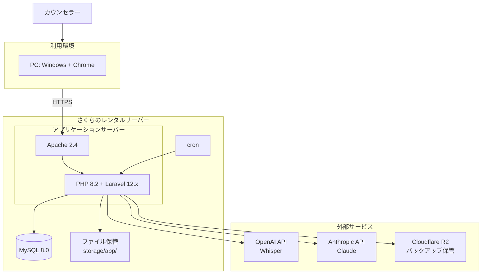

**位置づけ**: 仕様文書（アーキテクチャ設計書）
**対象読者**: 開発者
**上位文書**: requirements.md（全体）
**詳細**: 詳細は doc-index.md を参照

---

# アーキテクチャ設計書: カウンセリング記録管理システム

## 1. システム全体像

### 1-1. 構成図

### 1-2. 構成の説明

本システムは、Webブラウザから利用するシステムである。
サーバー側の処理はさくらのレンタルサーバーで動作し、必要に応じて外部サービスと連携する。

**利用者**

- **カウンセラー（一般）**：クライアント情報・相談記録などの登録・閲覧を利用する
- **カウンセラー（管理者）**：上記に加えて、利用者管理・マスタ管理等の機能を利用する
- **システム管理者**：システム開発事業者が保守・緊急対応を行う

**利用環境**

- **PC**：Windows + Google Chrome
- **タブレット**：iPad + Google Chrome
- ※ 上記以外の環境（macOS、Linux、Chrome 以外のブラウザ、iPad 以外のタブレット、スマートフォン等）は動作保証対象外

**通信**

- HTTPS による暗号化通信（Let's Encrypt の無料SSL証明書を使用）

**アプリケーションサーバー（さくらのレンタルサーバー）**

- **Webサーバー**：Apache 2.4
- **アプリケーション**：PHP 8.2 + Laravel 12.x

**データベース（さくらのレンタルサーバー）**

- MySQL 8.0

**ファイル保管**

- **音声ファイル**：サーバーローカルの storage/app/ 配下
- **バックアップファイル**：Cloudflare R2（league/flysystem-aws-s3-v3 経由）

**外部サービス**

- **OpenAI API**：音声ファイルの文字起こしに使用（Whisper）
- **Anthropic API**：文字起こしの要約に使用（Claude）

**運用**

- **バックアップ**：cron による自動実行
- **メンテナンス**：SSH 接続によるコマンド実行（バックアップ手動実行・リストア等）

---

## 2. 技術スタック

### 2-1. フロントエンド

| 項目 | 技術 | 説明（選定理由など） |
|------|------|---------|
| テンプレートエンジン | Blade（Laravel標準） | Laravelと統合されており、追加設定なしで使える。サーバーサイドで画面を生成するため、SEOや初期表示速度の心配がない |
| CSSフレームワーク | Bootstrap 5.3.8（npm経由） | 業務アプリケーションに適したUIコンポーネントが豊富。レスポンシブ対応済み |
| CSSプリプロセッサ | sass 1.98.0 | Bootstrap の SCSS ソースをコンパイルするために使用 |
| CSS依存ライブラリ | @popperjs/core 2.11.8 | Bootstrapのドロップダウン等で必要 |
| JavaScript（npm） | axios 1.11.0 | HTTP通信用。resources/js/bootstrap.js でグローバル登録 |
| JavaScript（CDN） | jQuery 3.7.1 | Select2の依存として必須。それ以外の用途では使用しない |
| アイコン・UIライブラリ | 該当なし（Bootstrap標準のみ） | 専用アイコンライブラリは未導入。必要に応じて将来導入を検討 |
| オートコンプリート | Select2 4.1.0-rc.0 + select2-bootstrap-5-theme 1.3.0（CDN） | クライアント選択時の検索・候補表示に使用。Bootstrap 5テーマで見た目を統一 |
| ビルドツール | Vite 7.0.7 + laravel-vite-plugin 2.0.0 | Laravel標準のビルドツール。高速な開発サーバーとビルドを提供 |

### 2-2. バックエンド

#### 2-2-1. 基盤

| 項目 | 技術 | 説明（選定理由など） |
|------|------|---------|
| フレームワーク | Laravel 12.x | PHPの主要フレームワーク。認証、バリデーション、ORM、マイグレーションなど必要な機能がすべて組み込まれている |
| 言語 | PHP 8.2以上 | Laravel 12.x の対応バージョン。さくらのレンタルサーバーで利用可能 |
| ORM | Eloquent（Laravel標準） | テーブルとモデルの対応が直感的で、リレーション定義やクエリビルダーが強力 |

#### 2-2-2. ローカルファイルストレージ

| 項目 | 技術 | 説明（選定理由など） |
|------|------|---------|
| 音声ファイル | local（サーバーローカル） | storage/app/ 配下に保存。音声録音はブラウザMediaRecorder API でクライアント側で録音後、サーバーへ送信。外部APIを経由せず、サーバーローカルで完結 |

#### 2-2-3. 外部API実行

| 項目 | 技術 | 説明（選定理由など） |
|------|------|---------|
| 文字起こし | openai-php/client 0.19.0 + openai-php/laravel 0.19.0（Whisper API） | OpenAI APIクライアントとLaravel統合パッケージ |
| 要約 | anthropic-ai/sdk 0.6.0（Claude API） | Claude APIクライアント |
| 実行方式 | 同期実行（QUEUE_CONNECTION=sync） | 文字起こし・要約はブラウザで待機する同期実行方式。さくらのレンタルサーバーの制約（デーモン常駐困難）と、ブラウザで待機できる処理時間内に収まることから採用。Jobクラス（SummarizeJob、TranscribeAudioJob）は将来サーバー移行時に非同期化できるよう構造として残している |

### 2-3. データベース

| 項目 | 技術 | 説明（選定理由など） |
|------|------|---------|
| データベース | MySQL 8.0（InnoDB / utf8mb4） | さくらのレンタルサーバーで利用可能 |
| セッションストア | database（DBドライバ） | セッション有効期限120分。Redis等の外部ストアが使えない環境制約に対応 |
| キャッシュストア | database（DBストア） | レンタルサーバーで外部キャッシュサーバーが使えないため、DBストアを採用 |

### 2-4. インフラ・ミドルウェア

| 項目 | 技術 | 説明（選定理由など） |
|------|------|---------|
| ホスティング | さくらのレンタルサーバー | 国内データセンター、独自ドメイン・無料SSL対応、PHP/MySQL対応 |
| OS | FreeBSD（ホスティング側で管理） | 利用者が選択するものではないが、開発時の互換性確認のため記載。直接操作は不可 |
| Webサーバー | Apache 2.4 | さくらのレンタルサーバー標準。Laravelは `.htaccess` で動作 |
| SSL | Let's Encrypt（無料SSL） | HTTPS通信を必須化し、通信経路を暗号化 |

### 2-5. 開発ツール

| 項目 | 技術 | 用途 |
|------|------|------|
| パッケージ管理（PHP） | Composer | PHPの依存関係管理 |
| パッケージ管理（JS） | npm | JavaScriptの依存関係管理 |
| バージョン管理 | Git | ソースコード管理 |
| リンター（PHP） | Laravel Pint 1.24 | コードスタイルの統一 |
| REPL | laravel/tinker 2.10.1 | 対話型シェル（Laravel標準同梱） |
| 並列実行 | concurrently 9.0.1 | 複数プロセスの並列起動（npm script用） |
