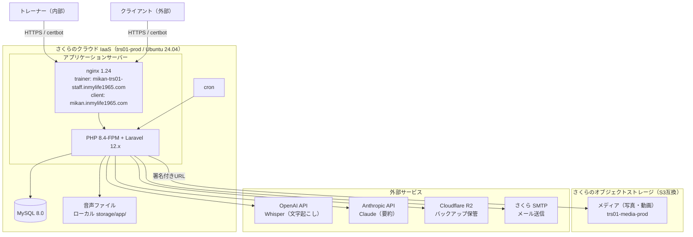

**位置づけ**: 仕様文書（アーキテクチャ設計書）
**対象読者**: 開発者
**上位文書**: requirements.md（全体）
**詳細**: 詳細は doc-index.md を参照

---

# アーキテクチャ設計書: トレーニング記録管理システム

## 1. システム全体像

### 1-1. 構成図

※ トレーナー（内部）とクライアント（外部）は別々のサブドメインから同一の Laravel アプリケーションに接続する。nginx が 2 つのサーバー名を受け、アプリ側でサブドメイン（本番）またはパス（ローカル）により経路を分ける。詳細は「2-4. インフラ・ミドルウェア」のサブドメイン構成を参照。

### 1-2. 構成の説明

本システムは、Webブラウザから利用するシステムである。
サーバー側の処理はさくらのクラウド IaaS 上で動作し、メディア保管にさくらのオブジェクトストレージを、その他の連携に外部サービスを利用する。

**利用者**

- **トレーナー（一般）**：クライアント情報・トレーニング記録などの登録・閲覧を利用する（内部利用者）
- **トレーナー（管理者）**：上記に加えて、利用者管理・マスタ管理等の機能を利用する（内部利用者）
- **システム管理者**：システム開発事業者が保守・緊急対応を行う
- **クライアント（飼い主）**：自分に紐づくトレーニング記録・メディアの閲覧のみを行う（外部利用者。閲覧解放されたクライアントのみ）

**利用環境**

- **PC**：Windows + Google Chrome
- **タブレット**：iPad + Google Chrome
- ※ 上記以外の環境（macOS、Linux、Chrome 以外のブラウザ、iPad 以外のタブレット、スマートフォン等）は動作保証対象外
- ※ クライアント（外部利用者）は自宅・スマートフォン等、機関の許可 IP 外からも閲覧する

**通信・サブドメイン**

- HTTPS による暗号化通信（Let's Encrypt を certbot で取得・自動更新）
- トレーナー（内部）とクライアント（外部）は別々のサブドメインから接続する
  - トレーナー用：`mikan-trs01-staff.inmylife1965.com`
  - クライアント用：`mikan.inmylife1965.com`
- 両サブドメインは同一の Laravel アプリケーションに接続し、アプリ側でサブドメイン（本番）またはパス（ローカル）により経路・セッション・IP 制限を分ける（詳細は 2-4 参照）

**アプリケーションサーバー（さくらのクラウド IaaS）**

- **サーバー**：trs01-prod（Ubuntu 24.04）
- **Webサーバー**：nginx 1.24
- **アプリケーション実行**：PHP 8.4-FPM + Laravel 12.x

**データベース（同一サーバー上）**

- MySQL 8.0

**ファイル保管**

- **音声ファイル**：サーバーローカルの storage/app/ 配下（文字起こし・要約のための中間生成物として、外部 API 送信を含めサーバーローカルで完結）
- **メディア（写真・動画）**：さくらのオブジェクトストレージ（S3 互換、`trs01-media-prod`）。クライアントへは署名付き URL で配信する
- **バックアップファイル**：Cloudflare R2（league/flysystem-aws-s3-v3 経由）

**外部サービス**

- **OpenAI API**：音声ファイルの文字起こしに使用（Whisper）
- **Anthropic API**：文字起こしの要約に使用（Claude）
- **メール送信**：さくらのレンタルサーバー SMTP（招待メール等の送信）

**運用**

- **バックアップ**：cron による自動実行
- **メンテナンス**：SSH 接続によるコマンド実行（バックアップ手動実行・リストア等）

---

## 2. 技術スタック

### 2-1. フロントエンド

| 項目 | 技術 | 説明（選定理由など） |
|------|------|---------|
| テンプレートエンジン | Blade（Laravel標準） | Laravelと統合されており、追加設定なしで使える。サーバーサイドで画面を生成するため、SEOや初期表示速度の心配がない |
| CSSフレームワーク | Bootstrap 5.3.8（npm経由） | 業務アプリケーションに適したUIコンポーネントが豊富。レスポンシブ対応済み |
| CSSプリプロセッサ | sass 1.98.0 | Bootstrap の SCSS ソースをコンパイルするために使用 |
| CSS依存ライブラリ | @popperjs/core 2.11.8 | Bootstrapのドロップダウン等で必要 |
| JavaScript（npm） | axios 1.11.0 | HTTP通信用。resources/js/bootstrap.js でグローバル登録 |
| JavaScript（CDN） | jQuery 3.7.1 | Select2の依存として必須。それ以外の用途では使用しない |
| アイコン・UIライブラリ | 該当なし（Bootstrap標準のみ） | 専用アイコンライブラリは未導入。必要に応じて将来導入を検討 |
| オートコンプリート | Select2 4.1.0-rc.0 + select2-bootstrap-5-theme 1.3.0（CDN） | クライアント選択時の検索・候補表示に使用。Bootstrap 5テーマで見た目を統一 |
| ビルドツール | Vite 7.0.7 + laravel-vite-plugin 2.0.0 | Laravel標準のビルドツール。高速な開発サーバーとビルドを提供 |

### 2-2. バックエンド

#### 2-2-1. 基盤

| 項目 | 技術 | 説明（選定理由など） |
|------|------|---------|
| フレームワーク | Laravel 12.x | PHPの主要フレームワーク。認証、バリデーション、ORM、マイグレーションなど必要な機能がすべて組み込まれている |
| 言語 | PHP 8.4（FPM） | Laravel 12.x の対応バージョン。さくらのクラウド IaaS 上で nginx + PHP-FPM 構成で動作 |
| ORM | Eloquent（Laravel標準） | テーブルとモデルの対応が直感的で、リレーション定義やクエリビルダーが強力 |

#### 2-2-2. ファイルストレージ

保管対象の性質に応じて、ローカルとオブジェクトストレージを使い分ける。

| 項目 | 技術 | 説明（選定理由など） |
|------|------|---------|
| 音声ファイル | local（サーバーローカル） | storage/app/ 配下に保存。音声録音はブラウザ MediaRecorder API でクライアント側で録音後、サーバーへ送信。文字起こし・要約のための中間生成物であり、外部 API 送信を含めサーバーローカルで完結する |
| メディア（写真・動画） | S3 互換オブジェクトストレージ（`media` ディスク、現構成はさくらのオブジェクトストレージ） | バケット `trs01-media-prod`（エンドポイント s3.tky01.sakurastorage.jp、jp-east-1、use_path_style_endpoint=true）。league/flysystem-aws-s3-v3 経由。接続情報は `.env` の `MEDIA_STORAGE_*` で管理し、プロバイダ差し替え時は値の書き換えのみで対応可能。クライアントへの配信・トレーナーの直アップロードは署名付き URL で行う（バケット CORS の AllowedOrigins にトレーナー用サブドメインを許可）|

#### 2-2-3. 外部API実行

| 項目 | 技術 | 説明（選定理由など） |
|------|------|---------|
| 文字起こし | openai-php/client 0.19.0 + openai-php/laravel 0.19.0（Whisper API） | OpenAI APIクライアントとLaravel統合パッケージ |
| 要約 | anthropic-ai/sdk 0.6.0（Claude API） | Claude APIクライアント |
| 実行方式 | 同期実行（QUEUE_CONNECTION=sync） | 文字起こし・要約はブラウザで待機する同期実行方式。ブラウザで待機できる処理時間内に収まることから採用。Job クラス（SummarizeJob、TranscribeAudioJob）は非同期化できる構造として実装済み。現在のクラウド IaaS 環境ではワーカー常駐が可能なため、将来 QUEUE_CONNECTION の切替とワーカー常駐により非同期化する余地がある（現状は同期実行のまま）|

### 2-3. データベース

| 項目 | 技術 | 説明（選定理由など） |
|------|------|---------|
| データベース | MySQL 8.0（InnoDB / utf8mb4） | さくらのクラウド IaaS 上の同一サーバーで稼働（本番 DB `training_record_01`）|
| セッションストア | database（DBドライバ） | Redis 等の外部ストアを使わず DB ドライバを採用。セッション有効期限はトレーナー／クライアントで別に設定する（サブドメイン分離により役割別に運用。詳細は 2-4 のサブドメイン構成、および api-design.md の認証方式を参照）|
| キャッシュストア | database（DBストア） | 外部キャッシュサーバーを使わず、DB ストアを採用 |

### 2-4. インフラ・ミドルウェア

| 項目 | 技術 | 説明（選定理由など） |
|------|------|---------|
| ホスティング | さくらのクラウド IaaS（trs01-prod） | 国内データセンター。root 権限でミドルウェアを自由に構成でき、非同期ワーカーやサブドメイン運用に対応可能 |
| OS | Ubuntu 24.04 | クラウド IaaS 上で運用。SSH 接続によるコマンド実行・保守が可能 |
| Webサーバー | nginx 1.24 + PHP 8.4-FPM | nginx がサブドメインごとに server ブロックで受け、PHP-FPM（ソケット経由）へ渡す |
| SSL | Let's Encrypt（certbot、自動更新） | HTTPS 通信を必須化。サブドメインごとに証明書を取得・自動更新 |

**サブドメイン構成（トレーナー／クライアントの境界）**

トレーナー（内部）とクライアント（外部）を、別々のサブドメインで分離する。動機は、セッションタイムアウトを役割別に設定できるようにすることと、IP 制限をトレーナー機能にだけ素直に適用できるようにすること（設計の歪みの解消）。

- **サブドメイン**
  - トレーナー用：`mikan-trs01-staff.inmylife1965.com`
  - クライアント用：`mikan.inmylife1965.com`（据え置き）
  - URL パスプレフィックスは全環境で維持する。本番はサブドメインで、ローカル（`localhost`）はパス（`/client-portal/*` か否か）で経路を分ける。内部／外部の判定は、パス判定を維持したまま本番向けにホスト判定を足す。
  - サブドメインのホスト名は `config/subdomain.php`（`trainer_host` / `client_host`、env 経由）で管理し、環境ごとに切り替える。
- **セッション**
  - トレーナー用とクライアント用でセッションを分離する。`SESSION_DOMAIN` を各サブドメイン限定にし、Cookie 名も役割別に別名化する（トレーナー用 `trs01-staff-session`、クライアント用 `trs01-client-session`）。
  - セッション有効期限（時間経過ログアウト）は役割別の固定値とし、ミドルウェアがリクエストのサブドメイン（またはガード）を見て、Cookie 名と有効期限をセットで動的に切り替える。
- **IP 制限**
  - IP 制限はトレーナー用サブドメインのルートにのみ適用する（クライアント用サブドメインには適用しない）。ログイン・システム管理者・ローカルホストは制限対象外。
- **メディアの CORS**
  - メディアの署名付き URL 直アップロードはトレーナー側機能のため、オブジェクトストレージ（`trs01-media-prod`）のバケット CORS の AllowedOrigins にトレーナー用サブドメインを許可する。

### 2-5. 開発ツール

| 項目 | 技術 | 用途 |
|------|------|------|
| パッケージ管理（PHP） | Composer | PHPの依存関係管理 |
| パッケージ管理（JS） | npm | JavaScriptの依存関係管理 |
| バージョン管理 | Git | ソースコード管理 |
| リンター（PHP） | Laravel Pint 1.24 | コードスタイルの統一 |
| REPL | laravel/tinker 2.10.1 | 対話型シェル（Laravel標準同梱） |
| 並列実行 | concurrently 9.0.1 | 複数プロセスの並列起動（npm script用） |
