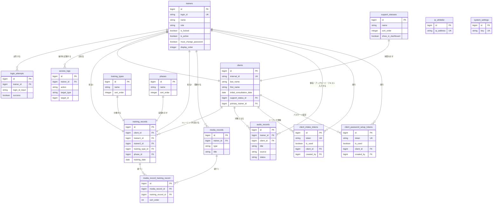

**位置づけ**: 仕様文書（DB設計書）
**対象読者**: 開発者
**上位文書**: requirements.md（6. 機能一覧、9. データ項目一覧）
**詳細**: 詳細は doc-index.md を参照

---

# DB設計書: トレーニング記録管理システム

## 1. データベース概要

- **DBMS**: MySQL 8.0
- **ストレージエンジン**: InnoDB（外部キー制約・トランザクションを活用するため）
- **文字セット**: utf8mb4
- **照合順序**: utf8mb4_unicode_ci。src/config/database.php の DB_COLLATION で指定し、マイグレーションで全テーブル・全カラムに明示的に適用する。日本語の五十音順ソートが必要な箇所では、クエリで COLLATE utf8mb4_ja_0900_as_cs を明示指定する
- **タイムゾーン**: Asia/Tokyo
- **命名規則**: テーブル名・カラム名はスネークケース（小文字＋アンダースコア）
- **ID生成**: BIGINT UNSIGNED AUTO_INCREMENT（Laravelの `$table->id()` を使用）
- **タイムスタンプ**: TIMESTAMP（Laravelの `$table->timestamps()` を使用）

---

## 2. ER図

※ER図はテーブル間の関連と主要カラム（主キー・ユニークキー・外部キー・主な業務識別/区分カラム）のみを示す。`created_at`/`updated_at`/`updated_by` 等の共通カラムおよび非識別カラムは省略しているため、全カラムは4章のテーブル定義を参照。clientsテーブルは7カテゴリー50業務項目＋共通カラムで構成され、ER図には代表カラムのみ掲載している。

---

## 3. 共通ルール

### 3-1. 主キー

主キーは原則として `id`（Laravel の `$table->id()` による BIGINT UNSIGNED の auto_increment）とする。テーブルの性質により異なる型を用いる場合がある。

### 3-2. 履歴情報

レコードの作成・更新を記録するため、必要に応じて以下のカラムを付与する。

- `created_at`（作成日時、TIMESTAMP）
- `updated_at`（更新日時、TIMESTAMP）
- `created_by`（作成者、BIGINT UNSIGNED、ログインID）
- `updated_by`（更新者、BIGINT UNSIGNED、ログインID）

### 3-3. 値の制限

コード値・選択肢・数値範囲などのカラムの値制限は、以下の二層構成で担保する。

- **DB の CHECK 制約（最終防壁）**: すべての値制限は DB の CHECK 制約として定義し、
  アプリを経由しない更新に対しても整合性を保証する。各テーブルの CHECK 制約は 4章に記載する。
- **アプリ側バリデーション（前段）**: ユーザーが直接入力するカラムについては、
  アプリ側のバリデーションを前段に置き、利用者に分かりやすいエラーを返す。

なお CHECK 制約は Laravel の schema builder では表現できないため、マイグレーション内で
`DB::statement` による生SQL（`ALTER TABLE ... ADD CONSTRAINT ... CHECK (...)`）で実装する。

---

## 4. テーブル定義

**記載する項目**: 各テーブルについて、以下の項目を記載する。
- **カラム定義**（必須）: カラム名・型・NULL・デフォルト・説明の5列で記載する。
- **インデックス**（必須）: インデックス名・カラム・種類・目的の4列で記載する。
- **制約**（必須）: 外部キー・CHECK 制約等。制約名・種類・条件・説明等で記載する。
- **注記**（任意）: カラム定義・インデックス・制約だけでは伝わりにくい設計上の補足がある場合に記載する。
- **設計ポリシー**（任意）: テーブル構造に関する設計判断の根拠を示す必要がある場合に記載する。

### 4-1. 業務データ

**記載範囲**:
- 本章では、本システムが提供するテーブル定義のうち、要件定義書（docs/requirements.md）の9章「データ項目一覧」で定義したテーブル定義を列挙する。

**参照ルール**:
- 各テーブルの業務的な意味・データ項目の業務仕様は、要件定義書（docs/requirements.md）の9章「データ項目一覧」で管理している。本書では同じテーブルID（D-0100 等）を使用しているため、テーブルIDで突き合わせて参照すること。
- 業務的な意味は要件定義書9章を正典とするため、本書では「概要」「対応する要件」は記載しない。

#### D-0100 clients（クライアント）

##### カラム定義

| カラム名 | 型 | NULL | デフォルト | 説明 |
|---------|-----|------|----------|------|
| id | BIGINT UNSIGNED | NO | auto_increment | 主キー |
| internal_id | VARCHAR(10) | NO | — | 内部ID（クライアント識別用）。新規登録時にシステムが自動採番。編集画面で手動変更可能。ユニーク制約あり |
| initial_consultation_date | DATE | NO | — | 初回日 |
| last_name | VARCHAR(50) | YES | NULL | 姓 |
| first_name | VARCHAR(50) | YES | NULL | 名 |
| last_name_kana | VARCHAR(50) | YES | NULL | せい。ひらがなのみ |
| first_name_kana | VARCHAR(50) | YES | NULL | めい。ひらがなのみ |
| birth_date | DATE | YES | NULL | 生年月日 |
| gender | VARCHAR(10) | YES | NULL | 性別（5-2.参照） |
| primary_trainer_id | BIGINT UNSIGNED | YES | NULL | 主担当トレーナーのID（外部キー） |
| support_status_id | BIGINT UNSIGNED | YES | NULL | 支援状態マスタのID（外部キー） |
| phone1 | VARCHAR(20) | YES | NULL | 電話番号1。ハイフンあり/なし両対応 |
| phone2 | VARCHAR(20) | YES | NULL | 電話番号2。ハイフンあり/なし両対応 |
| email | VARCHAR(255) | YES | NULL | メールアドレス。クライアント閲覧機能のログインIDを兼ねる。UNIQUE制約あり（未登録=NULLは複数許容） |
| postal_code | VARCHAR(10) | YES | NULL | 郵便番号。ハイフンあり/なし両対応 |
| address1 | VARCHAR(50) | YES | NULL | 住所1（都道府県） |
| address2 | VARCHAR(50) | YES | NULL | 住所2（市区町村） |
| address3 | VARCHAR(100) | YES | NULL | 住所3（町名・番地） |
| address4 | VARCHAR(100) | YES | NULL | 住所4（建物名・部屋番号） |
| password | VARCHAR(255) | YES | NULL | クライアント閲覧機能のパスワードのハッシュ値（bcryptで暗号化）。閲覧解放後、クライアント本人が設定するまでは NULL |
| is_viewable | BOOLEAN | NO | false | クライアント閲覧解放フラグ。true でクライアントが自分のトレーニング記録・メディアを閲覧可能になる。閲覧解放操作でトレーナーが true にする |
| created_at | TIMESTAMP | YES | NULL | 作成日時 |
| updated_at | TIMESTAMP | YES | NULL | 更新日時 |
| updated_by | BIGINT UNSIGNED | YES | NULL | 最終更新者のトレーナーのID（外部キー） |

##### インデックス

| インデックス名 | カラム | 種類 | 目的 |
|---------------|--------|------|------|
| PRIMARY | id | PRIMARY KEY | 主キー |
| clients_internal_id_unique | internal_id | UNIQUE | 内部IDの重複を防ぐ。内部IDによる検索にも使用 |
| clients_initial_date_idx | initial_consultation_date | INDEX | 初回日によるソート・検索 |
| clients_primary_trainer_idx | primary_trainer_id | INDEX | 主担当による検索 |
| clients_support_status_idx | support_status_id | INDEX | 支援状態によるフィルタリング |
| clients_created_at_idx | created_at | INDEX | 登録日時によるソート。一覧画面のデフォルトソートで使用 |
| clients_updated_by_foreign | updated_by | INDEX | 最終更新者による検索。外部キー制約に伴い自動付与 |
| clients_email_unique | email | UNIQUE | メールアドレスの重複を防ぐ。クライアント閲覧機能のログインIDとして使用。未登録（NULL）は複数許容 |

##### 制約

| 制約名 | 種類 | 条件 | ON DELETE | 説明 |
|--------|------|------|-----------|------|
| clients_gender_check | CHECK | gender IS NULL OR gender IN ('男', '女', 'その他') | — | 定義済みの性別のみ許可（5-2.参照） |
| clients_primary_trainer_id_foreign | FOREIGN KEY | primary_trainer_id → trainers(id) | SET NULL | トレーナー削除時は主担当をNULLにする |
| clients_support_status_id_foreign | FOREIGN KEY | support_status_id → support_statuses(id) | SET NULL | 支援状態マスタ削除時はNULLにする |
| clients_updated_by_foreign | FOREIGN KEY | updated_by → trainers(id) | SET NULL | トレーナー削除時は最終更新者をNULLにする |

---

#### D-0200 training_records（トレーニング記録）

##### カラム定義

| カラム名 | 型 | NULL | デフォルト | 説明 |
|---------|-----|------|----------|------|
| id | BIGINT UNSIGNED | NO | auto_increment | 主キー |
| client_id | BIGINT UNSIGNED | NO | — | クライアントのID（外部キー） |
| training_date | DATE | NO | — | 日付（トレーニング記録の実施日） |
| training_time | TIME | YES | NULL | 時刻（トレーニング記録の実施時刻。HH:MM形式） |
| trainer1_id | BIGINT UNSIGNED | NO | — | 担当1のトレーナーのID（外部キー） |
| trainer2_id | BIGINT UNSIGNED | YES | NULL | 担当2のトレーナーのID（外部キー） |
| training_type_id | BIGINT UNSIGNED | YES | NULL | トレーニング内容マスタのID（外部キー） |
| training_detail | VARCHAR(255) | YES | NULL | トレーニング内容の詳細（主旨を1行で要約） |
| phase_id | BIGINT UNSIGNED | YES | NULL | フェーズマスタのID（外部キー） |
| record_content | TEXT | YES | NULL | トレーニング記録（事実を客観的に記録、クライアント開示前提） |
| impression | TEXT | YES | NULL | 所感（トレーナー間共有、クライアント非開示） |
| created_at | TIMESTAMP | YES | NULL | 作成日時 |
| updated_at | TIMESTAMP | YES | NULL | 更新日時 |
| updated_by | BIGINT UNSIGNED | YES | NULL | 最終更新者のトレーナーのid（外部キー） |

##### インデックス

| インデックス名 | カラム | 種類 | 目的 |
|---------------|--------|------|------|
| PRIMARY | id | PRIMARY KEY | 主キー |
| training_records_client_date_idx | client_id, training_date | INDEX（複合） | クライアント別・日付順ソート。トレーニング履歴の時系列表示で使用。※Laravelマイグレーションの制約によりソート方向指定なし |
| training_records_date_idx | training_date | INDEX | 日付による検索・ソート |
| training_records_trainer1_idx | trainer1_id | INDEX | 担当1による検索 |
| training_records_trainer2_idx | trainer2_id | INDEX | 担当2による検索 |
| training_records_type_idx | training_type_id | INDEX | トレーニング内容による絞り込み検索 |
| training_records_phase_idx | phase_id | INDEX | フェーズによる絞り込み検索 |
| training_records_updated_by_foreign | updated_by | INDEX | 最終更新者による検索。外部キー制約に伴い自動付与 |

##### 制約

| 制約名 | 種類 | 条件 | ON DELETE | 説明 |
|--------|------|------|-----------|------|
| training_records_client_id_foreign | FOREIGN KEY | client_id → clients(id) | CASCADE | クライアント削除時にトレーニング記録も削除 |
| training_records_trainer1_id_foreign | FOREIGN KEY | trainer1_id → trainers(id) | RESTRICT | 担当1があるトレーナーは削除不可 |
| training_records_trainer2_id_foreign | FOREIGN KEY | trainer2_id → trainers(id) | SET NULL | 担当2が削除された場合はNULLにする |
| training_records_training_type_id_foreign | FOREIGN KEY | training_type_id → training_types(id) | SET NULL | トレーニング内容マスタ削除時はNULLにする |
| training_records_phase_id_foreign | FOREIGN KEY | phase_id → phases(id) | SET NULL | フェーズマスタ削除時はNULLにする |
| training_records_updated_by_foreign | FOREIGN KEY | updated_by → trainers(id) | SET NULL | トレーナー削除時は最終更新者をNULLにする |

---

#### D-0300 media_records（メディア）

##### カラム定義

| カラム名 | 型 | NULL | デフォルト | 説明 |
|---------|-----|------|----------|------|
| id | BIGINT UNSIGNED | NO | auto_increment | 主キー |
| trainer_id | BIGINT UNSIGNED | YES | NULL | アップロードしたトレーナーのID（外部キー）。登録者削除時はNULLになり、メディアはライブラリに残る |
| type | VARCHAR(20) | NO | — | メディア種別（5-17.参照） |
| title | VARCHAR(255) | YES | NULL | 表示名。未入力時は表示の際に元ファイル名（original_filename）をフォールバック表示する |
| original_filename | VARCHAR(255) | NO | — | アップロード時の元ファイル名 |
| original_path | VARCHAR(500) | NO | — | アップロードされた原本ファイルのオブジェクトストレージ上の保存パス（キー） |
| display_path | VARCHAR(500) | YES | NULL | ブラウザ表示用ファイルのオブジェクトストレージ上の保存パス（キー）。表示・再生にはこのパスを用いる |
| thumbnail_path | VARCHAR(500) | YES | NULL | サムネイルのオブジェクトストレージ上の保存パス（キー）。一覧表示に用いる |
| mime_type | VARCHAR(100) | NO | — | MIMEタイプ（image/jpeg, image/png, image/heic, video/mp4, video/quicktime 等） |
| file_size | BIGINT | YES | NULL | ファイルサイズ（バイト） |
| conversion_status | VARCHAR(20) | NO | 'not_required' | 表示用変換の状態（5-18.参照） |
| thumbnail_status | VARCHAR(20) | NO | 'pending' | サムネイル生成の状態（5-19.参照） |
| created_at | TIMESTAMP | YES | NULL | 登録日時 |
| updated_at | TIMESTAMP | YES | NULL | 最終更新日時 |

##### インデックス

| インデックス名 | カラム | 種類 | 目的 |
|---------------|--------|------|------|
| PRIMARY | id | PRIMARY KEY | 主キー |
| media_records_trainer_id_foreign | trainer_id | INDEX | 登録者別のメディア取得。一覧画面の登録者フィルタで使用（外部キー制約と兼用） |
| media_records_type_idx | type | INDEX | 種別（写真／動画）によるフィルタリング |
| media_records_created_at_idx | created_at | INDEX | 一覧画面で最新を先頭に表示するためのソート用（クエリ側で `ORDER BY created_at DESC`）。Laravelマイグレーションの制約によりインデックス方向指定なし |

##### 制約

| 制約名 | 種類 | 条件 | ON DELETE | 説明 |
|--------|------|------|-----------|------|
| media_records_trainer_id_foreign | FOREIGN KEY | trainer_id → trainers(id) | SET NULL | 登録者トレーナー削除時はNULLにする（メディアはライブラリに残す） |
| media_records_type_check | CHECK | type IN ('photo', 'video') | — | 定義済みのメディア種別のみ許可（5-17.参照） |
| media_records_file_size_check | CHECK | file_size IS NULL OR file_size >= 0 | — | ファイルサイズは0以上 |
| media_records_conversion_status_check | CHECK | conversion_status IN ('not_required', 'pending', 'processing', 'done', 'error') | — | 定義済みの変換状態のみ許可（5-18.参照） |
| media_records_thumbnail_status_check | CHECK | thumbnail_status IN ('pending', 'processing', 'done', 'error') | — | 定義済みのサムネイル状態のみ許可（5-19.参照） |

##### 注記

- **trainer_id の NULL 許容**: メディアはライブラリ型の独立資産であり、登録者トレーナーが削除されても実体（ファイル・レコード）は保持する。このため trainer_id は ON DELETE SET NULL とし、DB上は NULL を許容する。
- **ファイル実体との関係**: original_path / display_path / thumbnail_path はオブジェクトストレージ上のファイルへの参照であり、レコード削除時のファイル実体削除はアプリ側で行う（DBの外部キー制約はレコードのみを対象とし、ストレージ上のファイルには作用しない）。削除時は原本・表示用・サムネイルの全ファイルを対象とする。

##### 設計ポリシー

- **ライブラリ型**: メディアはトレーニング記録にも特定のクライアントにも従属せず、独立した素材ライブラリとして管理する。クライアント所有の概念を持たず（client_id を持たない）、1つのメディアを複数のクライアントのトレーニング記録に紐づけられる。トレーニング記録との紐付けは多対多の中間テーブル（D-0600 media_record_training_record）で表現し、本テーブル単体では記録への参照を持たない。

---

#### D-0600 media_record_training_record（トレーニング記録のメディア）

##### カラム定義

| カラム名 | 型 | NULL | デフォルト | 説明 |
|---------|-----|------|----------|------|
| id | BIGINT UNSIGNED | NO | auto_increment | 主キー |
| media_record_id | BIGINT UNSIGNED | NO | — | メディアのID（外部キー） |
| training_record_id | BIGINT UNSIGNED | NO | — | トレーニング記録のID（外部キー） |
| sort_order | INT UNSIGNED | NO | 0 | 同一トレーニング記録内でのメディアの表示順（0始まりの連番、昇順） |

##### インデックス

| インデックス名 | カラム | 種類 | 目的 |
|---------------|--------|------|------|
| PRIMARY | id | PRIMARY KEY | 主キー |
| mrtr_media_training_unique | media_record_id, training_record_id | UNIQUE（複合） | 同一メディアと同一記録の重複紐づけを防止 |
| mrtr_training_record_id_idx | training_record_id, sort_order | INDEX（複合） | トレーニング記録から紐づくメディアを表示順で取得（詳細・編集画面で使用）。※Laravelマイグレーションの制約によりソート方向指定なし |

##### 制約

| 制約名 | 種類 | 条件 | ON DELETE | 説明 |
|--------|------|------|-----------|------|
| mrtr_media_record_id_foreign | FOREIGN KEY | media_record_id → media_records(id) | CASCADE | メディア削除時に紐づけ行も削除 |
| mrtr_training_record_id_foreign | FOREIGN KEY | training_record_id → training_records(id) | CASCADE | トレーニング記録削除時に紐づけ行も削除 |

##### 注記

- **タイムスタンプを持たない**: 本テーブルは created_at / updated_at を持たない。Laravel の belongsToMany で `withTimestamps()` を付けない。紐づけの追加・解除・並べ替えに伴う日時・更新者は、親であるトレーニング記録（training_records）の updated_at / updated_by に反映する（処理の詳細は api-design.md を参照）。
- **sort_order は記録ごとに独立**: sort_order は中間テーブルの行が持つため、同一メディアが複数のトレーニング記録に紐づく場合でも、記録ごとに異なる表示順を持てる。値は同一 training_record 内で 0 始まりの連番とし、並べ替え時はその記録に紐づく全行を振り直す。新規追加したメディアは末尾に付ける（処理の詳細は api-design.md を参照）。

##### 設計ポリシー

- **関連の有無と表示順を保持**: 紐づけの追加・解除・並べ替えはトレーニング記録の編集（要件定義 6-4-5）の一部であり、紐づけが変わった事実は親トレーニング記録の更新として扱う。本テーブルは独自のタイムスタンプ・更新者を持たず、メディアと記録の関連の有無、および記録内での表示順（sort_order）を保持する。
- **CASCADE の意味**: メディアまたはトレーニング記録の実体が削除されたとき、その関連行も削除する。これは「紐づけ解除」（中間行のみを削除する編集操作）とは別であり、エンティティ実体の削除に伴う関連の消滅を指す。紐づけ解除はメディア・記録の実体に影響しない。

---

#### D-0400 audio_records（音声記録）

##### カラム定義

| カラム名 | 型 | NULL | デフォルト | 説明 |
|---------|-----|------|----------|------|
| id | BIGINT UNSIGNED | NO | auto_increment | 主キー |
| trainer_id | BIGINT UNSIGNED | NO | — | アップロード・録音・テキスト入力したトレーナーのID（外部キー） |
| client_id | BIGINT UNSIGNED | NO | — | 音声記録の対象となるクライアントのID（外部キー）。誤紐付け防止のため登録時必須 |
| title | VARCHAR(255) | NO | — | 表示名 |
| source | VARCHAR(20) | NO | — | 音声ソース種別（5-13.参照） |
| file_name | VARCHAR(255) | YES | NULL | 元のファイル名。テキスト貼り付け時は実体ファイルがないためNULL |
| file_path | VARCHAR(500) | YES | — | サーバー上の保存パス（storage/audio/ 以下の相対パス）。「音声ファイルを削除」実行時にNULLに設定される。テキスト貼り付けでは常にNULL |
| status | VARCHAR(20) | NO | 'unprocessed' | 音声処理状態（5-14.参照） |
| transcription_text | LONGTEXT | YES | NULL | 文字起こし結果。トレーナーが編集可能。テキスト貼り付け時はユーザーが入力したテキストを保存 |
| summary_text | LONGTEXT | YES | NULL | 要約結果。トレーナーが編集可能 |
| duration_seconds | INTEGER | YES | NULL | 音声の長さ（秒）。Whisper API処理時に取得。テキスト貼り付け時はNULL |
| file_size | BIGINT | YES | NULL | ファイルサイズ（バイト）。テキスト貼り付け時はNULL |
| summarized_at | TIMESTAMP | YES | NULL | 要約完了日時。要約処理が正常終了した時点で記録 |
| created_at | TIMESTAMP | YES | NULL | アップロード・録音・テキスト入力日時 |
| updated_at | TIMESTAMP | YES | NULL | 最終更新日時 |

##### インデックス

| インデックス名 | カラム | 種類 | 目的 |
|---------------|--------|------|------|
| PRIMARY | id | PRIMARY KEY | 主キー |
| audio_records_trainer_idx | trainer_id | INDEX | トレーナー別の音声記録取得。一般は自分の音声記録のみ表示（外部キー制約と兼用） |
| audio_records_status_idx | status | INDEX | 音声処理状態によるフィルタリング |
| audio_records_created_at_idx | created_at | INDEX | 一覧画面で最新を先頭に表示するためのソート用（クエリ側で `ORDER BY created_at DESC`）。Laravelマイグレーションの制約によりインデックス方向指定なし |
| audio_records_client_id_foreign | client_id | INDEX | クライアント別の音声記録取得（外部キー制約と兼用） |

##### 制約

| 制約名 | 種類 | 条件 | ON DELETE | 説明 |
|--------|------|------|-----------|------|
| audio_records_trainer_id_foreign | FOREIGN KEY | trainer_id → trainers(id) | CASCADE | トレーナー削除時に音声記録も削除 |
| audio_records_client_id_foreign | FOREIGN KEY | client_id → clients(id) | RESTRICT | クライアントが関連する音声記録を持つ場合は削除制限 |
| audio_records_source_check | CHECK | source IN ('recording', 'upload', 'text_paste') | — | 定義済みの音声ソース種別のみ許可（5-13.参照） |
| audio_records_status_check | CHECK | status IN ('unprocessed', 'transcribing', 'transcribed', 'summarizing', 'completed', 'error') | — | 定義済みのステータスのみ許可（5-14.参照） |
| audio_records_duration_check | CHECK | duration_seconds IS NULL OR duration_seconds >= 0 | — | 音声時間は0以上 |
| audio_records_file_size_check | CHECK | file_size IS NULL OR file_size >= 0 | — | ファイルサイズは0以上 |

---

#### D-0500 trainers（トレーナー）

##### カラム定義

| カラム名 | 型 | NULL | デフォルト | 説明 |
|---------|-----|------|----------|------|
| id | BIGINT UNSIGNED | NO | auto_increment | 主キー |
| display_order | INTEGER | NO | 0 | 表示順。小さい値ほど上位に表示される。トレーナー一覧やプルダウン選択肢の並び順に使用 |
| login_id | VARCHAR(50) | NO | — | ログインID。半角英数字とアンダースコアのみ |
| name | VARCHAR(100) | NO | — | トレーナーの名前 |
| role | VARCHAR(20) | NO | 'staff' | 権限（5-15.参照） |
| last_login_at | TIMESTAMP | YES | NULL | 最終ログイン日時 |
| password | VARCHAR(255) | NO | — | パスワードのハッシュ値（bcryptで暗号化、60文字固定） |
| is_locked | BOOLEAN | NO | false | アカウントロック状態。5回連続ログイン失敗または30日間未ログインで true になる |
| is_active | BOOLEAN | NO | true | アカウント有効フラグ。falseの場合ログイン不可 |
| must_change_password | BOOLEAN | NO | false | 初回ログイン時パスワード変更必須フラグ |
| created_at | TIMESTAMP | YES | NULL | 作成日時 |
| updated_at | TIMESTAMP | YES | NULL | 更新日時 |

##### インデックス

| インデックス名 | カラム | 種類 | 目的 |
|---------------|--------|------|------|
| PRIMARY | id | PRIMARY KEY | 主キー |
| trainers_login_id_unique | login_id | UNIQUE | ログインIDの重複を防ぐ。ログイン時の検索にも使用 |
| trainers_display_order_index | display_order | INDEX | 表示順でのソートを高速化 |

##### 制約

| 制約名 | 種類 | 条件 | 説明 |
|--------|------|------|------|
| trainers_role_check | CHECK | role IN ('system_admin', 'admin', 'staff') | 定義済みの権限のみ許可（5-15.参照） |
| trainers_login_id_check | CHECK | login_id REGEXP '^[a-zA-Z0-9_]+$' | 半角英数字とアンダースコアのみ |

---

#### DM-0100 support_statuses（支援状態）

##### カラム定義

| カラム名 | 型 | NULL | デフォルト | 説明 |
|---------|-----|------|----------|------|
| id | BIGINT UNSIGNED | NO | auto_increment | 主キー |
| name | VARCHAR(50) | NO | — | 支援状態の名称。重複不可 |
| sort_order | INTEGER | NO | 0 | 表示順序。小さい値が先に表示される |
| show_in_dashboard | BOOLEAN | NO | true | ダッシュボードに表示するか。TRUEの場合、この支援状態のクライアントがダッシュボードの主担当クライアント一覧に表示される |
| created_at | TIMESTAMP | YES | NULL | 作成日時 |
| updated_at | TIMESTAMP | YES | NULL | 更新日時 |

##### インデックス

| インデックス名 | カラム | 種類 | 目的 |
|---------------|--------|------|------|
| PRIMARY | id | PRIMARY KEY | 主キー |
| support_statuses_name_unique | name | UNIQUE | 名称の重複を防ぐ |
| support_statuses_order_idx | sort_order | INDEX | 表示順でのソート |

##### 制約

| 制約名 | 種類 | 条件 | 説明 |
|--------|------|------|------|
| support_statuses_sort_check | CHECK | sort_order >= 0 | 表示順序は0以上 |

---

#### DM-0200 training_types（トレーニング内容）

##### カラム定義

| カラム名 | 型 | NULL | デフォルト | 説明 |
|---------|-----|------|----------|------|
| id | BIGINT UNSIGNED | NO | auto_increment | 主キー |
| name | VARCHAR(50) | NO | — | トレーニング内容の名称。重複不可 |
| sort_order | INTEGER | NO | 0 | 表示順序。小さい値が先に表示される |
| created_at | TIMESTAMP | YES | NULL | 作成日時 |
| updated_at | TIMESTAMP | YES | NULL | 更新日時 |

##### インデックス

| インデックス名 | カラム | 種類 | 目的 |
|---------------|--------|------|------|
| PRIMARY | id | PRIMARY KEY | 主キー |
| training_types_name_unique | name | UNIQUE | 名称の重複を防ぐ |
| training_types_order_idx | sort_order | INDEX | 表示順でのソート |

##### 制約

| 制約名 | 種類 | 条件 | 説明 |
|--------|------|------|------|
| training_types_sort_check | CHECK | sort_order >= 0 | 表示順序は0以上 |

---

#### DM-0300 phases（フェーズ）

##### カラム定義

| カラム名 | 型 | NULL | デフォルト | 説明 |
|---------|-----|------|----------|------|
| id | BIGINT UNSIGNED | NO | auto_increment | 主キー |
| name | VARCHAR(100) | NO | — | フェーズの名称。重複不可 |
| sort_order | INTEGER | NO | 0 | 表示順序。小さい値が先に表示される |
| created_at | TIMESTAMP | YES | NULL | 作成日時 |
| updated_at | TIMESTAMP | YES | NULL | 更新日時 |

##### インデックス

| インデックス名 | カラム | 種類 | 目的 |
|---------------|--------|------|------|
| PRIMARY | id | PRIMARY KEY | 主キー |
| phases_name_unique | name | UNIQUE | 名称の重複を防ぐ |
| phases_order_idx | sort_order | INDEX | 表示順でのソート |

##### 制約

| 制約名 | 種類 | 条件 | 説明 |
|--------|------|------|------|
| phases_sort_check | CHECK | sort_order >= 0 | 表示順序は0以上 |

---

### 4-2. システム定義データ

**記載範囲**:
- 本章では、本システムが提供するテーブル定義のうち、要件定義書（docs/requirements.md）の9章「データ項目一覧」で定義されていない、システムが定義するテーブル定義を列挙する。

**記載項目（4-2 固有）**:
- 各テーブルの冒頭に以下を記載する。
  - **概要**: テーブルの役割を1〜2文で示す。
  - **対応する要件**: このテーブルが支える機能・要件を挙げる。
- カラム定義・インデックス・制約・注記・設計ポリシーは 4章冒頭の共通ルールに従う。

#### DS-0100 system_settings（システム設定）

**概要**: システム全体の設定をキー・バリュー形式で管理する

**対応する要件**: 
- IPアドレス制限
- 要約プロンプト設定

##### カラム定義

| カラム名 | 型 | NULL | デフォルト | 説明 |
|---------|-----|------|----------|------|
| id | BIGINT UNSIGNED | NO | auto_increment | 主キー |
| key | VARCHAR(50) | NO | — | 設定キー。小文字スネークケース |
| value | TEXT | YES | NULL | 設定値 |
| created_at | TIMESTAMP | YES | NULL | 作成日時 |
| updated_at | TIMESTAMP | YES | NULL | 最終更新日時 |

##### インデックス

| インデックス名 | カラム | 種類 | 目的 |
|---------------|--------|------|------|
| PRIMARY | id | PRIMARY KEY | 主キー |
| system_settings_key_unique | key | UNIQUE | 設定キーの重複を防ぐ。キーによる検索にも使用 |

##### 制約

| 制約名 | 種類 | 条件 | 説明 |
|--------|------|------|------|
| system_settings_key_check | CHECK | key REGEXP '^[a-z][a-z0-9_]*$' | 設定キーはスネークケースのみ |

---

#### DS-0200 client_intake_tokens（クライアント事前入力トークン）

**概要**: クライアントが事前に自宅で情報を入力できるワンタイムURLのトークンを管理する

**対応する要件**: 
- クライアント登録（URL発行）

##### カラム定義

| カラム名 | 型 | NULL | デフォルト | 説明 |
|---------|-----|------|----------|------|
| id | BIGINT UNSIGNED | NO | auto_increment | 主キー |
| token | VARCHAR(64) | NO | — | `Str::random(32)` で生成された 32 文字のランダム英数字（URLに埋め込む）。カラム型 VARCHAR(64) は将来の長さ拡張に備えた余裕。重複不可 |
| email | VARCHAR(255) | YES | NULL | クライアントのメールアドレス（記録用） |
| memo | TEXT | YES | NULL | 発行時のメモ（例: 山田太郎様 初回トレーニング予定 4/10） |
| initial_consultation_date | DATE | YES | NULL | 初回トレーニング日。URL発行時にトレーナーが指定 |
| expires_at | TIMESTAMP | NO | — | 有効期限。選択された日数後の 23:59:59 に設定される |
| is_used | BOOLEAN | NO | false | 使用状態。false: 未使用 / true: 使用済み。クライアント登録完了時に true に更新 |
| client_id | BIGINT UNSIGNED | YES | NULL | 登録されたクライアントのID（外部キー、追跡用） |
| created_at | TIMESTAMP | YES | NULL | 発行日時 |
| updated_at | TIMESTAMP | YES | NULL | 更新日時 |
| created_by | BIGINT UNSIGNED | YES | NULL | トークンを発行したトレーナーのID（外部キー） |

##### インデックス

| インデックス名 | カラム | 種類 | 目的 |
|---------------|--------|------|------|
| PRIMARY | id | PRIMARY KEY | 主キー |
| client_intake_tokens_token_unique | token | UNIQUE | トークン文字列の重複を防ぐ。URLアクセス時の検索にも使用 |
| client_intake_tokens_expires_at_idx | expires_at | INDEX | 有効期限による検索・期限切れ抽出 |
| client_intake_tokens_is_used_idx | is_used | INDEX | 使用状態による絞り込み |
| client_intake_tokens_client_id_idx | client_id | INDEX | 登録済みクライアントの逆引き |
| client_intake_tokens_created_by_idx | created_by | INDEX | 発行者による検索・絞り込み |

##### 制約

| 制約名 | 種類 | 条件 | ON DELETE | 説明 |
|--------|------|------|-----------|------|
| client_intake_tokens_client_id_foreign | FOREIGN KEY | client_id → clients(id) | SET NULL | クライアント削除時は NULL にする（トークン履歴は残す） |
| client_intake_tokens_created_by_foreign | FOREIGN KEY | created_by → trainers(id) | SET NULL | 発行者トレーナー削除時は NULL にする |

---

#### DS-0300 login_attempts（ログイン試行記録）

**概要**: ログインの試行を記録し、アカウントロック機能を実現する

**対応する要件**:
- ログイン
- アカウントの自動ロック

##### カラム定義

| カラム名 | 型 | NULL | デフォルト | 説明 |
|---------|-----|------|----------|------|
| id | BIGINT UNSIGNED | NO | auto_increment | 主キー |
| trainer_id | BIGINT UNSIGNED | YES | NULL | トレーナーのID（外部キー）。存在しないユーザーIDでの試行はNULL |
| login_id_input | VARCHAR(50) | NO | — | 入力されたログインID。存在しないIDでの試行も記録するため別カラムで保持 |
| ip_address | VARCHAR(45) | YES | NULL | 接続元IPアドレス。セキュリティ監査用 |
| attempted_at | TIMESTAMP | NO | CURRENT_TIMESTAMP | 試行日時 |
| success | BOOLEAN | NO | — | 成功（true）/ 失敗（false） |

##### インデックス

| インデックス名 | カラム | 種類 | 目的 |
|---------------|--------|------|------|
| PRIMARY | id | PRIMARY KEY | 主キー |
| login_attempts_trainer_idx | trainer_id, attempted_at | INDEX（複合） | 直近の連続失敗回数を効率的にカウント。アカウントロック判定で使用（クエリ側で `ORDER BY attempted_at DESC` を指定）。Laravelマイグレーションの制約によりインデックス方向指定なし |

##### 制約

| 制約名 | 種類 | 条件 | ON DELETE | 説明 |
|--------|------|------|-----------|------|
| login_attempts_trainer_id_foreign | FOREIGN KEY | trainer_id → trainers(id) | SET NULL | トレーナー削除時はNULLにする（試行記録は残す） |

---

#### DS-0400 ip_whitelist（IPホワイトリスト）

**概要**: IPアドレス制限で許可するIPアドレスをリスト管理する。各エントリに備考（拠点名等）を付与できる

**対応する要件**: 
- IPアドレス制限

##### カラム定義

| カラム名 | 型 | NULL | デフォルト | 説明 |
|---------|-----|------|----------|------|
| id | BIGINT UNSIGNED | NO | auto_increment | 主キー |
| ip_address | VARCHAR(45) | NO | — | IPアドレス。IPv4単一アドレスまたはCIDR形式（例: 192.168.1.0/24） |
| description | VARCHAR(100) | YES | NULL | 備考（拠点名等。例: ○○オフィス） |
| created_at | TIMESTAMP | YES | NULL | 作成日時 |
| updated_at | TIMESTAMP | YES | NULL | 更新日時 |

##### インデックス

| インデックス名 | カラム | 種類 | 目的 |
|---------------|--------|------|------|
| PRIMARY | id | PRIMARY KEY | 主キー |
| ip_whitelist_ip_address_unique | ip_address | UNIQUE | IPアドレスの重複を防ぐ |

##### 制約

該当なし

---

#### DS-0500 access_logs（アクセスログ）

**概要**: トレーナーの操作履歴を記録する

**対応する要件**: 
- トレーナー操作履歴

##### カラム定義

| カラム名 | 型 | NULL | デフォルト | 説明 |
|---------|-----|------|----------|------|
| id | BIGINT UNSIGNED | NO | auto_increment | 主キー |
| trainer_id | BIGINT UNSIGNED | NO | — | トレーナーのID（外部キー） |
| action | VARCHAR(100) | NO | — | 操作種別（5-16.参照） |
| target_type | VARCHAR(50) | YES | NULL | 対象モデル名（Client, TrainingRecord 等） |
| target_id | BIGINT UNSIGNED | YES | NULL | 対象レコードID |
| ip_address | VARCHAR(45) | YES | NULL | 接続元IPアドレス |
| user_agent | VARCHAR(500) | YES | NULL | ブラウザ情報 |
| created_at | TIMESTAMP | YES | NULL | 作成日時 |
| updated_at | TIMESTAMP | YES | NULL | 更新日時 |

##### インデックス

| インデックス名 | カラム | 種類 | 目的 |
|---------------|--------|------|------|
| PRIMARY | id | PRIMARY KEY | 主キー |
| access_logs_trainer_id_created_at_idx | trainer_id, created_at | INDEX | トレーナー別・日時順の検索 |
| access_logs_action_created_at_idx | action, created_at | INDEX | アクション別・日時順の検索 |

##### 制約

| 制約名 | 種類 | 条件 | ON DELETE | 説明 |
|--------|------|------|-----------|------|
| access_logs_trainer_id_foreign | FOREIGN KEY | trainer_id → trainers(id) | CASCADE | トレーナー削除時にログも削除 |

---

#### DS-0600 client_password_setup_tokens（クライアントパスワード設定トークン）

**概要**: 閲覧を解放されたクライアントが招待メールから初回パスワードを設定するためのワンタイムURLのトークンを管理する

**対応する要件**: 
- クライアント閲覧解放（招待メール送信）

##### カラム定義

| カラム名 | 型 | NULL | デフォルト | 説明 |
|---------|-----|------|----------|------|
| id | BIGINT UNSIGNED | NO | auto_increment | 主キー |
| token | VARCHAR(64) | NO | — | `Str::random(32)` で生成された 32 文字のランダム英数字（URLに埋め込む）。カラム型 VARCHAR(64) は将来の長さ拡張に備えた余裕。重複不可 |
| client_id | BIGINT UNSIGNED | NO | — | パスワードを設定する対象クライアントのID（外部キー）。発行時から特定のクライアントに紐づく |
| expires_at | TIMESTAMP | NO | — | 有効期限。発行から72時間後に設定される |
| is_used | BOOLEAN | NO | false | 使用状態。false: 未使用 / true: 使用済み。パスワード設定完了時に true に更新 |
| created_at | TIMESTAMP | YES | NULL | 発行日時 |
| updated_at | TIMESTAMP | YES | NULL | 更新日時 |
| created_by | BIGINT UNSIGNED | YES | NULL | トークンを発行した（閲覧を解放した）トレーナーのID（外部キー） |

##### インデックス

| インデックス名 | カラム | 種類 | 目的 |
|---------------|--------|------|------|
| PRIMARY | id | PRIMARY KEY | 主キー |
| client_password_setup_tokens_token_unique | token | UNIQUE | トークン文字列の重複を防ぐ。URLアクセス時の検索にも使用 |
| client_password_setup_tokens_expires_at_idx | expires_at | INDEX | 有効期限による検索・期限切れ抽出 |
| client_password_setup_tokens_is_used_idx | is_used | INDEX | 使用状態による絞り込み |
| client_password_setup_tokens_client_id_idx | client_id | INDEX | クライアントによる検索・逆引き |
| client_password_setup_tokens_created_by_idx | created_by | INDEX | 発行者による検索・絞り込み |

##### 制約

| 制約名 | 種類 | 条件 | ON DELETE | 説明 |
|--------|------|------|-----------|------|
| client_password_setup_tokens_client_id_foreign | FOREIGN KEY | client_id → clients(id) | CASCADE | クライアント削除時はトークンも削除する（特定クライアント専用のトークンのため） |
| client_password_setup_tokens_created_by_foreign | FOREIGN KEY | created_by → trainers(id) | SET NULL | 発行者トレーナー削除時は NULL にする |

---

## 5. ENUMおよび定数

### 5-2. 性別

| 値 | 説明 |
|----|------|
| 男 | |
| 女 | |
| その他 | |

### 5-13. 音声ソース種別

| 値 | 説明 |
|----|------|
| recording | 録音。録音機能で音声を録音して作成されたレコード |
| upload | アップロード。音声ファイルのアップロード機能で作成されたレコード |
| text_paste | テキスト貼り付け。文字起こしテキストを直接入力して作成されたレコード |

### 5-14. 音声処理状態

| 値 | 説明 |
|----|------|
| unprocessed | 文字起こし待ち。録音・アップロード直後の状態 |
| transcribing | 文字起こし中。Whisper APIで処理を同期実行している状態 |
| transcribed | 要約待ち。文字起こし完了済み、要約の実行が可能な状態 |
| summarizing | 要約中。Claude APIで処理を同期実行している状態 |
| completed | 要約完了。文字起こし・要約がすべて完了した状態 |
| error | エラー。文字起こしまたは要約の処理中にエラーが発生した状態 |

### 5-15. トレーナー権限

| 値 | 説明 |
|----|------|
| staff | 一般。業務機能のみ可能 |
| admin | 管理者。業務機能と業務管理機能が可能。システム管理機能は不可 |
| system_admin | システム管理者。システム管理機能のみ可能。クライアント・トレーニング記録へのアクセス不可。無効化・削除不可、ロック対象外 |

### 5-16. 操作種別

| 値 | 説明 |
|----|------|
| login | ログイン |
| logout | ログアウト |
| view_client | クライアント詳細（参照） |
| create_client | クライアント登録 |
| edit_client | クライアント編集 |
| delete_client | クライアント削除 |
| view_training_record | トレーニング記録詳細（参照） |
| create_training_record | トレーニング記録登録 |
| edit_training_record | トレーニング記録編集 |
| delete_training_record | トレーニング記録削除 |

### 5-17. メディア種別

| 値 | 説明 |
|----|------|
| photo | 写真。jpeg / png / heic 形式の画像 |
| video | 動画。mp4 / mov 形式の動画 |

### 5-18. メディア変換状態

| 値 | 説明 |
|----|------|
| not_required | 変換不要。jpeg / png / mp4 形式で、原本がそのままブラウザ表示・再生可能な状態 |
| pending | 変換待ち。heic / mov 形式で、表示用ファイルへの変換が必要だが未実行の状態 |
| processing | 変換中。表示用ファイルへの変換処理を実行している状態 |
| done | 変換完了。表示用ファイルが生成され、display_path に保存された状態 |
| error | エラー。変換処理中にエラーが発生した状態 |

### 5-19. メディアサムネイル状態

| 値 | 説明 |
|----|------|
| pending | 生成待ち。サムネイルの生成が未実行の状態 |
| processing | 生成中。サムネイルの生成処理を実行している状態 |
| done | 生成完了。サムネイルが生成され、thumbnail_path に保存された状態 |
| error | エラー。サムネイル生成処理中にエラーが発生した状態 |

---

## 6. マイグレーション

### 6-1. 基本ルール

- **マイグレーションツール**: Laravel Artisan migrate（Laravel標準）
- **マイグレーションファイルの保管場所**: `src/database/migrations/`
- **命名規則**: Laravelのデフォルト（`YYYY_MM_DD_HHMMSS_description.php`）
- **ロールバック**: すべてのマイグレーションに `down()` メソッドを定義し、ロールバック可能にする

### 6-2. テーブルの依存順序

本システムが定義する業務テーブルを、依存関係を考慮した論理順序（設計上の整理順）で示す。
依存を持たないテーブルを先に、依存するテーブルを後に並べている。

> **正典について**: 実際のマイグレーションファイルは `src/database/migrations/` を正典とする。
> 本表はテーブルの依存構造を俯瞰するためのものであり、個別ファイル名やカラム追加・変更の履歴は
> 列挙しない（それらは git の履歴を参照する）。
>
> **実行順について**: `php artisan migrate` は **ファイル名の辞書順** で実行される。
> そのため論理順（本表）と実行順は乖離するが、依存先テーブルを必要とするマイグレーションは
> すべて依存先より後のタイムスタンプを持つため、実行順でも依存解決上の問題は発生しない。
>
> **Laravel標準テーブルについて**: sessions / jobs / cache / failed_jobs などの
> Laravel標準テーブルは本表に含めない。

| 順序 | テーブル | 依存先 |
|:----:|----------|--------|
| 1 | trainers | なし |
| 2 | login_attempts | trainers |
| 3 | clients | trainers, support_statuses |
| 4 | training_types | なし |
| 5 | phases | なし |
| 6 | support_statuses | なし |
| 7 | training_records | clients, trainers, training_types, phases |
| 8 | media_records | trainers |
| 9 | media_record_training_record | media_records, training_records |
| 10 | audio_records | clients, trainers |
| 11 | access_logs | trainers |
| 12 | system_settings | なし |
| 13 | ip_whitelist | なし |
| 14 | client_intake_tokens | clients |
| 15 | client_password_setup_tokens | clients |

---

## 7. シードデータ（初期データ）

### 7-1. シーダーファイル一覧

| ファイル名 | 内容 | 実行タイミング |
|-----------|------|---------------|
| `DatabaseSeeder.php` | 全シーダーの呼び出し元 | `php artisan db:seed` |
| `TrainerSeeder.php` | 管理者アカウントの初期データ（7.2.1参照） | 初回セットアップ時 |
| `SupportStatusSeeder.php` | 支援状態マスタの初期データ（7.2.2参照） | 初回セットアップ時 |
| `TrainingTypeSeeder.php` | トレーニング内容マスタの初期データ（7.2.3参照） | 初回セットアップ時 |
| `PhaseSeeder.php` | フェーズマスタの初期データ（7.2.4参照） | 初回セットアップ時 |
| `SystemSettingSeeder.php` | システム設定の初期データ（7.2.5参照） | 初回セットアップ時 |

### 7-2. シードデータ（初期データ）の詳細

#### D-0500 trainers（トレーナー）

| login_id | display_order | name | role | password | 備考 |
|---------|---------------|------|------|----------|------|
| system_admin | 0 | システム管理者 | system_admin | InMyLife1965! | 開発用サンプル — システム管理者（設定操作のみ） |
| admin | 1 | 管理トレーナー | admin | InMyLife1965! | 開発用サンプル — 管理トレーナー（全操作可能） |
| staff | 2 | 一般トレーナー | staff | InMyLife1965! | 開発用サンプル — 一般トレーナー（閲覧・登録・編集） |

**注意事項（本番運用時）**:
- 上記 3 アカウントは **開発環境専用のサンプル**。本番導入時は `TrainerSeeder` を実行せず、システム管理者アカウントを 1 つだけ手動で作成する想定
- パスワード `InMyLife1965!` は **開発環境専用のハードコード値**。本番環境では絶対に使用しないこと
- 本番では初回ログイン時にパスワード変更を促すため、`must_change_password = true` を設定する運用が望ましい

#### DM-0100 support_statuses（支援状態）

| id | name | sort_order |
|----|------|--------|
| 1 | 支援中 | 1 |
| 2 | 連絡待ち | 2 |
| 3 | 支援終了 | 3 |
| 4 | リファー済 | 4 |
| 5 | 利用中止 | 5 |
| 6 | 利用せず | 6 |

#### DM-0200 training_types（トレーニング内容）

| id | name | sort_order |
|----|------|--------|
| 1 | 事前相談 | 1 |
| 2 | トレーニング | 2 |
| 3 | その他 | 3 |

#### DM-0300 phases（フェーズ）

| id | name | sort_order |
|----|------|--------|
| 1 | トレーナーと関わっていない | 1 |
| 2 | トレーニング中 | 2 |
| 3 | トレーニング終了 | 3 |

#### DS-0100 system_settings（システム設定）

| key | value | 備考 |
|------|-----|------|
| enable_ip_restriction | false | IPアドレス制限（false: 無効、true: 有効）。許可IPアドレスは ip_whitelist テーブルで管理 |
| summary_prompt_current | （初期プロンプト本文） | 音声要約に使用するプロンプト。初期値を投入。設定画面（要約プロンプト）からトレーナーが編集可能。本文の実体はシーダーを参照 |