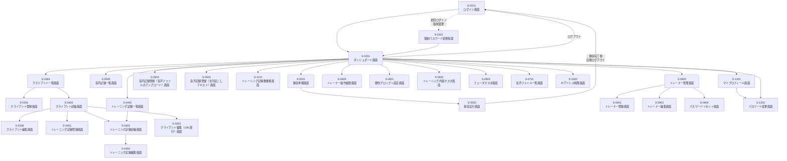

**位置づけ**: 仕様文書（画面設計書）
**対象読者**: 開発者
**上位文書**: requirements.md（7. 画面一覧）
**詳細**: 詳細は doc-index.md を参照

---

# 画面設計書: トレーニング記録管理システム

## 1. 画面遷移図



---

## 2. 全画面共通

### 2-1. ヘッダー

#### 2-1-1. ナビゲーションメニュー

##### 親メニュー

| 表示順 | 項目 | 遷移先 | アクセス権限 | 備考 |
|------|------|------|---------|---------|
| 1 | システム名 | — | 常に表示 | |
| 2 | ダッシュボード | S-0201 | 一般、管理者 | |
| 3 | クライアント | — | 一般、管理者 | |
| 4 | トレーニング記録 | S-0402 | 一般、管理者 | |
| 5 | メディア | — | 一般、管理者 | |
| 6 | 音声記録 | — | 一般、管理者 | |
| 7 | レポート | — | 一般、管理者 | |
| 8 | 【管理者】 | — | 管理者 | |
| 9 | 【システム管理者】 | — | システム管理者 | |
| 10 | ユーザーメニュー | — | 一般、管理者、システム管理者 | トレーナー名・権限バッジを表示 |

##### サブメニュー：クライアント

| 表示順 | 項目 | 遷移先 | アクセス権限 | 備考 |
|------|------|---------|---------|---------|
| 3-1 | クライアント一覧 | S-0304 | 一般、管理者 | |
| 3-2 | クライアント登録 | S-0301 | 一般、管理者 | |

##### サブメニュー：メディア

| 表示順 | 項目 | 遷移先 | アクセス権限 | 備考 |
|------|------|---------|---------|---------|
| 5-1 | メディア一覧 | S-1302 | 一般、管理者 | |

##### サブメニュー：音声記録

| 表示順 | 項目 | 遷移先 | アクセス権限 | 備考 |
|------|------|---------|---------|---------|
| 6-1 | 音声記録一覧 | S-0505 | 一般、管理者 | |
| — | （区切り） | — | — | |
| — | 音声記録登録（ヘッダー） | — | — | |
| 6-2 | 録音 | S-0501 | 一般、管理者 | |
| 6-3 | 音声ファイル | S-0504 | 一般、管理者 | |
| 6-4 | 文字起こしテキスト | S-0503 | 一般、管理者 | |

##### サブメニュー：レポート

| 表示順 | 項目 | 遷移先 | アクセス権限 | 備考 |
|------|------|---------|---------|---------|
| 7-1 | トレーニング記録数推移 | S-1101 | 一般、管理者 | |

##### サブメニュー：【管理者】

| 表示順 | 項目 | 遷移先 | アクセス権限 | 備考 |
|------|------|---------|---------|---------|
| 8-1 | トレーナー管理 | S-0802 | 管理者 | |
| 8-2 | トレーナー操作履歴 | S-0805 | 管理者 | |
| — | （区切り） | — | — | |
| 8-3 | 要約プロンプト | S-0601 | 管理者 | |
| — | （区切り） | — | — | |
| — | マスタ管理（ヘッダー） | — | — | |
| 8-4 | トレーニング内容 | S-0902 | 管理者 | |
| 8-5 | フェーズ | S-0903 | 管理者 | |

##### サブメニュー：【システム管理者】

| 表示順 | 項目 | 遷移先 | アクセス権限 | 備考 |
|------|------|---------|---------|---------|
| 9-1 | 音声ファイル一覧 | S-0701 | システム管理者 | |
| — | （区切り） | — | — | |
| 9-2 | IPアドレス制限 | S-1002 | システム管理者 | |

##### サブメニュー：ユーザーメニュー

| 表示順 | 項目 | 遷移先 | アクセス権限 | 備考 |
|------|------|---------|---------|---------|
| 10-1 | マイプロフィール | S-1201 | 一般、管理者、システム管理者 | |
| 10-2 | パスワード変更 | S-1202 | 一般、管理者、システム管理者 | |
| 10-3 | ログアウト | S-0101 | 一般、管理者、システム管理者 | |

---

### 2-2. フッター

フッターは実装していない。

---

## 3. 画面詳細

**記載範囲**:
- 本章では、本システムが提供する全画面を列挙する。
- 全画面とは、要件定義書（docs/requirements.md）の7章「画面一覧」で挙げられている画面を指す。
- 各画面のデザイン・インターフェイス・遷移の把握を目的とする。

**参照ルール**:
- 各画面の概要・提供機能・アクセス権限は、要件定義書（docs/requirements.md）の7章「画面一覧」で管理している。本書では同じ画面IDを使用しているため、画面IDで突き合わせて参照すること。

**記載する項目**: 各画面について、以下の項目を記載する。
- **ワイヤーフレーム**（必須）: 画面の構成要素と配置を示すテキストベースの図。罫線で囲み、ナビゲーションバー・主要な入力欄・ボタン・テーブルなどを記載する。
- **画面項目**（必須）: 画面上で表示・入力する項目の一覧。「項目名」「種類」「必須」「説明」の4列で記載する。テーブル形式の項目は別途列定義表を「列」「種類」「必須」「説明」の4列で記載する。
- **バリデーション**（必須）: 入力チェックとエラーメッセージ。「項目」「チェック内容」「説明」の3列で記載する。チェック不要な場合は「なし」と記載する。
- **状態一覧**（必須）: 画面の表示モードや状態を切り替える場合の各状態の説明。状態の切り替えがない場合は「なし」と記載する。
- **操作フロー**: ワイヤーフレームと画面項目だけでは伝わりにくい画面内の挙動を、ユーザーの操作順に記述する。業務フローは記載しない（業務フローは要件定義書で扱う）。
- **備考**: 業務的・運用的に重要な特記事項がある場合のみ記載。

**必須欄の記号**: 「画面項目」「バリデーション」表の「必須」列では、以下の記号を用いる。

| 記号 | 意味 |
|---|---|
| ● | 必須 |
| ▲ | 条件付き必須（説明欄で条件を「※」付きで明示する） |
| 空欄 | 任意 |

**画面項目の種類**: 各画面の「画面項目」表で使用する「種類」列の値は、以下のいずれかを用いる。

| 種類 | 説明 |
|---|---|
| 表示のみ | 値を表示する（編集不可） |
| テキスト | 1行のテキストを入力する |
| テキストエリア | 複数行のテキストを入力する |
| 数値 | 数値を入力する |
| 日付 | 日付を入力する |
| 時刻 | 時刻を入力する |
| 電話番号 | 電話番号を入力する（数字とハイフン） |
| メールアドレス | メールアドレスを入力する |
| パスワード | パスワードを入力する（入力値はマスク表示） |
| プルダウン | 選択肢から1つを選択する |
| はい／いいえ | フラグのオン／オフを切り替える |
| ファイル選択 | ファイルを選択する |
| ボタン | 操作を実行する |
| リンク | 別画面へ遷移する（テキスト形式） |
| カード | 情報を1単位にまとめて表示する（クリックで遷移する場合あり） |
| テーブル | 複数行のデータを一覧表示する |
| 動的リスト | 行を追加・削除できる入力リスト |
| 画像 | 画像を表示する |

**パスワードの強度**: 
- 8文字以上
- 大文字・小文字・数字・記号をそれぞれ1文字以上含む
- よくあるパスワード（password 等）を禁止


### 3-1. 認証

#### S-0101 ログイン画面

##### ワイヤーフレーム

```
┌─────────────────────────────────────┐
│                                     │
│    トレーニング記録管理システム        │
│                                     │
│   ┌─────────────────────────────┐   │
│   │  ログインID                  │   │
│   └─────────────────────────────┘   │
│   ┌─────────────────────────────┐   │
│   │  パスワード                  │   │
│   └─────────────────────────────┘   │
│                                     │
│             [ログイン]               │
│                                     │
└─────────────────────────────────────┘
```

##### 画面項目

| 項目名 | 種類 | 必須 | 説明 |
|--------|------|------|------|
| ログインID | テキスト | ● | ログインするためのID |
| パスワード | パスワード | ● | パスワード。入力値はマスク表示 |
| ログイン | ボタン |  | 入力情報でログインを実行する |

##### バリデーションチェック

| 項目 | チェック内容 | 説明 |
|------|-------------|-----------------|
| — | 認証失敗 | 「ログインIDまたはパスワードが正しくありません」 |
| — | アカウントロック | 「アカウントがロックされています。管理者に連絡してください」 |
| — | アカウント無効 | 「アカウントが無効化されています。管理者に連絡してください」 |

##### 状態一覧

なし

---

#### S-0102 強制パスワード変更画面

##### ワイヤーフレーム

```
┌─────────────────────────────────────────┐
│ [ナビゲーションバー]                     │
├─────────────────────────────────────────┤
│                                         │
│  パスワード変更        [更新]  │
│                                         │
│  初回ログインのため、パスワードを          │
│  変更してください。                      │
│                                         │
│  新しいパスワード：                      │
│  [                                    ] │
│  新しいパスワード（確認）：               │
│  [                                    ] │
│                                         │
└─────────────────────────────────────────┘
```

##### 画面項目

| 項目名 | 種類 | 必須 | 説明 |
|--------|------|------|------|
| 更新 | ボタン |  | パスワードを変更 |
| 新しいパスワード | パスワード | ● | |
| 新しいパスワード（確認） | パスワード | ● | 確認用に新しいパスワードを再入力 |

##### バリデーションチェック

| 項目 | チェック内容 | 説明 |
|------|-------------|-----------------|
| 新しいパスワード（確認） | 一致チェック | 「新しいパスワード（確認）が一致しません」 |

##### 状態一覧

なし

---

#### S-0103 セッション期限切れエラーページ

##### ワイヤーフレーム

```
┌──────────────────────────────────────────────┐
│                                              │
│  ┌────────────────────────────────────────┐  │
│  │ セッションの有効期限が切れました          │  |
│  ├────────────────────────────────────────┤  │
│  │ 419 Page Expired                       │  │
│  │                                        │  │
│  │ しばらく操作がなかったため、セッション    │  │
│  │ の有効期限が切れました。                 │  │
│  │ 再度ログインしてください。               │  │
│  │                                        │  │
│  └────────────────────────────────────────┘  │
│                                              │
└──────────────────────────────────────────────┘
```

##### 画面項目

なし

##### バリデーションチェック

なし

##### 状態一覧

なし

##### 備考

- 独立したURLは持たず、419エラー時に Laravel が `resources/views/errors/419.blade.php` を自動表示する（ルーティング設定不要）
- 共通ナビ（トレーナー用/クライアント用ヘッダー）を持たない中立レイアウト（`layouts.error`）を使用する。ログイン中ユーザーに依存する表示を含まないため、トレーナー・クライアントいずれの認証状態でも同一表示となる

---

#### S-0104 アクセス禁止エラーページ

##### ワイヤーフレーム

```
┌──────────────────────────────────────────────┐
│                                              │
│  ┌────────────────────────────────────────┐  │
│  │ アクセス拒否                            │  |
│  ├────────────────────────────────────────┤  │
│  │ 403 Forbidden                          │  │
│  │                                        │  │
│  │ {$exception->getMessage() ?:           │  │
│  │  「このページへのアクセスは許可されて     │  │
│  │   いません。」}                         │  │
│  │                                        │  │
│  └────────────────────────────────────────┘  │
│                                              │
└──────────────────────────────────────────────┘
```

##### 画面項目

なし

##### バリデーションチェック

なし

##### 状態一覧

なし

##### 備考

- 独立したURLは持たず、403ステータス時に Laravel が `resources/views/errors/403.blade.php` を自動表示する
- 主な発生源は IP制限ミドルウェア（`CheckIpRestriction`）、管理者専用ルート（`AdminMiddleware`）、コントローラ内の `abort(403, ...)` 呼び出し
- 共通ナビ（トレーナー用/クライアント用ヘッダー）を持たない中立レイアウト（`layouts.error`）を使用する。ログイン中ユーザーに依存する表示を含まないため、トレーナー・クライアントいずれの認証状態でも同一表示となる

---

### 3-2. ダッシュボード

#### S-0201 ダッシュボード画面

##### ワイヤーフレーム

```
┌────────────────────────────────────────────────────────────────────────────────────────────┐
│ [ナビゲーションバー]                                                                         │
├────────────────────────────────────────────────────────────────────────────────────────────┤
│                                                                                            │
│  ダッシュボード                                                                             │
│                                                                                            │
│  ようこそ、佐藤さん。（権限: 管理者）                                                         │
│                                                                                            │
│  ┌───────────────────────┐ ┌───────────────────────────┐                                    │
│  │クライアント一覧        │ │クライアント登録             │                                    │
│  │クライアントの検索・閲覧 │ │クライアントの登録           │                                    │
│  └──────────────────────┘ └────────────────────────────┘                                    │
│  ┌──────────────────────┐ ┌────────────────────────────┐                                    │
│  │ 録音                 │ │ 音声記録一覧                │                                    │
│  │ トレーニングの録音            │ │ 音声の文字起こし・要約を管理 │                                    │
│  └──────────────────────┘ └────────────────────────────┘                                    │
│                                                                                              │
│  ※ 各カードはクリックで対応する画面へ遷移                                                       │
│                                                                                             │
│  ■ 主担当クライアント一覧                                                            全N件     │
│  ┌───────┬──────────┬──────────────┬──────────┬──────────┐  │
│  │内部ID │ 名前      │ 最終記録日    │ 担当1  │ 担当2  │  │
│  ├───────┼──────────┼──────────────┼──────────┼──────────┤  │
│  │26001  │ 山田太郎  │ 2026年1月15日│ 佐藤     │ 田中    │  │
│  │26007  │ 鈴木花子  │ 2026年2月10日│ 佐藤     │ —       │  │
│  └───────┴──────────┴──────────────┴──────────┴──────────┘  │
│                                                                                              │
└──────────────────────────────────────────────────────────────────────────────────────────────┘
```

##### 画面項目

| 項目名 | 種類 | 必須 | 説明 |
|--------|------|------|------|
| ウェルカムメッセージ | 表示のみ |  | 「ようこそ、○○さん。（権限: [権限名]）」形式 |
| クライアント一覧 | カード |  | クリックでクライアント一覧画面（S-0304）へ遷移 |
| クライアント登録 | カード |  | クリックでクライアント登録画面（S-0301）へ遷移 |
| 録音 | カード |  | クリックで録音準備画面（S-0501）へ遷移 |
| 音声記録一覧 | カード |  | クリックで音声記録一覧画面（S-0505）へ遷移 |
| 主担当クライアント一覧 | テーブル |  | ログインしているトレーナーが主担当のクライアントを表示。最終記録日が新しい順（降順）。最大10件表示。見出し右に「全N件」を表示し、10件超の場合は「すべて表示」リンク（クライアント一覧画面（S-0304）へ遷移）を表示。データなし時は「主担当のクライアントはありません」と表示 |

**主担当クライアント一覧（テーブル）**

| 列 | 種類 | 説明 |
|------|------|------|
| 内部ID | リンク | クライアント詳細画面（S-0305）に遷移 |
| 名前 | テキスト | クライアントの姓名を表示 |
| 最終記録日 | リンク | 最終トレーニングの日付。最終トレーニングのトレーニング記録詳細画面（S-0403）に遷移 |
| 担当1 | テキスト | 最終トレーニングの「担当1」。トレーニング記録がない場合は「—」と表示 |
| 担当2 | テキスト | 最終トレーニングの「担当2」。トレーニング記録がない場合は「—」と表示 |

##### バリデーションチェック

なし

##### 状態一覧

なし

---

### 3-3. クライアント管理

#### S-0301 クライアント登録画面

##### ワイヤーフレーム

```
┌─────────────────────────────────────────────────────────────┐
│ [ナビゲーションバー]                                          │
├─────────────────────────────────────────────────────────────┤
│ クライアント登録                                              │
│                                                              │
│ ┌─ プログレスバー ──────────────────────────────────────┐   │
│ │ [1.基本情報] [2.連絡先]                               │   │
│ │ ████████░░░░░░░░░░░░░░░░░░░░░░░░░░░░░░░░░░░░░░░░░░    │   │
│ └────────────────────────────────────────────────────────┘   │
│                                                              │
│ ┌─ ステップ X/2: ◯◯ ─────────────────────────────────────┐ │
│ │  入力項目（カードボディ）                                │ │
│ │  ...                                                     │ │
│ ├──────────────────────────────────────────────────────── │ │
│ │ [戻る]                                          [次へ]  │ │
│ └──────────────────────────────────────────────────────────┘ │
└─────────────────────────────────────────────────────────────┘
```

##### 画面項目

本画面は2ステップのウィザード形式。各ステップの項目は以下の通り。

| 項目名 | 種類 | 必須 | 説明 |
|--------|------|------|------|
| プログレスバー | 表示のみ |  | 現在のステップ番号に応じて幅を更新 |
| 戻る | ボタン |  | 入力内容を保持したまま、前のステップへ戻る（バリデーションは実行しない）。ステップ2で表示 |
| 次へ | ボタン |  | バリデーションチェックを実行し、エラーがあれば該当項目にエラー表示を行い、ステップは進めない。エラーがなければ次のステップへ進む。ステップ1で表示 |
| 登録 | ボタン |  | 全ステップの入力内容を登録し、クライアント詳細画面（S-0305）へ遷移。ステップ2で表示 |
| キャンセル | ボタン |  | 入力内容を破棄して、クライアント一覧画面（S-0304）へ戻る。ステップ1で表示 |

###### STEP1: 基本情報

| 項目名 | 種類 | 必須 | 説明 |
|--------|------|------|------|
| 初回日 | 日付 | ● | デフォルト値は今日の日付 |
| 姓 | テキスト | ● | |
| 名 | テキスト |  | |
| せい | テキスト |  | |
| めい | テキスト |  | |
| 生年月日 | 日付 |  | |
| 性別 | プルダウン |  | 男／女／その他 |
| メールアドレス | メールアドレス |  | |
| 主担当 | プルダウン |  | 表示順のトレーナー一覧から選択（システム管理者は対象外） |

###### STEP2: 連絡先

| 項目名 | 種類 | 必須 | 説明 |
|--------|------|------|------|
| 電話番号1 | 電話番号 |  | |
| 電話番号2 | 電話番号 |  | |
| 郵便番号 | テキスト |  | |
| 住所検索 | ボタン |  | 郵便番号から都道府県・市区町村・町名を自動入力 |
| 都道府県 | プルダウン |  | 47都道府県 |
| 市区町村 | テキスト |  | |
| 町名・番地 | テキスト |  | |
| 建物名・部屋番号 | テキスト |  | |

##### バリデーションチェック

| 項目 | チェック内容 | 説明 |
|------|-------------|-----------------|
| せい | ひらがなチェック | 「せいはひらがなで入力してください」 |
| めい | ひらがなチェック | 「めいはひらがなで入力してください」 |
| 電話番号1 | 数字とハイフンのみ | 「電話番号1の形式が正しくありません」 |
| 電話番号2 | 数字とハイフンのみ | 「電話番号2の形式が正しくありません」 |
| 郵便番号 | 数字とハイフンのみ | 「郵便番号の形式が正しくありません」 |

##### 状態一覧

なし

---

#### S-0303 クライアント編集（URL発行）画面

##### ワイヤーフレーム

```
┌─────────────────────────────────────────────────────────────┐
│ 情報入力                                              │
│                                                              │
│ ┌─ プログレスバー ──────────────────────────────────────┐   │
│ │ [1.基本情報] [2.連絡先]                                       │   │
│ │ ████████░░░░░░░░░░░░░░░░░░░░░░░░░░░░░░░░░░░░░░░░░░    │   │
│ └────────────────────────────────────────────────────────┘   │
│                                                              │
│ ┌─ ステップ X/5: ◯◯ ─────────────────────────────────────┐ │
│ │  入力項目（カードボディ）                                │ │
│ │  ...                                                     │ │
│ ├──────────────────────────────────────────────────────── │ │
│ │ [戻る]                                          [次へ]  │ │
│ └──────────────────────────────────────────────────────────┘ │
└─────────────────────────────────────────────────────────────┘
```

##### 画面項目

本画面は2ステップのウィザード形式。各ステップの項目は以下の通り。

| 項目名 | 種類 | 必須 | 説明 |
|--------|------|------|------|
| プログレスバー | 表示のみ |  | 現在のステップ番号に応じて幅を更新 |
| 戻る | ボタン |  | 入力内容を保持したまま、前のステップへ戻る（バリデーションは実行しない）。ステップ2で表示 |
| 次へ | ボタン |  | バリデーションチェックを実行し、エラーがあれば該当項目にエラー表示を行い、ステップは進めない。エラーがなければ次のステップへ進む。ステップ1で表示 |
| 更新 | ボタン |  | 全ステップの入力内容で更新し、状態：完了へ遷移。ステップ2で表示 |

###### STEP1: 基本情報

| 項目名 | 種類 | 必須 | 説明 |
|--------|------|------|------|
| 姓 | テキスト | ● |  |
| 名 | テキスト |  |  |
| せい | テキスト |  |  |
| めい | テキスト |  |  |
| 生年月日 | 日付 |  |  |
| 性別 | プルダウン |  | 男／女／その他 |
| メールアドレス | メールアドレス |  |  |

###### STEP2: 連絡先

| 項目名 | 種類 | 必須 | 説明 |
|--------|------|------|------|
| 電話番号1 | 電話番号 |  |  |
| 電話番号2 | 電話番号 |  |  |
| 郵便番号 | テキスト |  |  |
| 住所検索 | ボタン |  | 郵便番号から都道府県・市区町村・町名を自動入力 |
| 都道府県 | プルダウン |  | 47都道府県 |
| 市区町村 | テキスト |  |  |
| 町名・番地 | テキスト |  |  |
| 建物名・部屋番号 | テキスト |  |  |

##### バリデーションチェック

| 項目 | チェック内容 | 説明 |
|------|-------------|-----------------|
| せい | ひらがなチェック | 「せいはひらがなで入力してください」 |
| めい | ひらがなチェック | 「めいはひらがなで入力してください」 |
| 電話番号1 | 数字とハイフンのみ | 「電話番号1の形式が正しくありません」 |
| 電話番号2 | 数字とハイフンのみ | 「電話番号2の形式が正しくありません」 |
| 郵便番号 | 数字とハイフンのみ | 「郵便番号の形式が正しくありません」 |

##### 状態一覧

| 状態 | 説明 | 表示内容 |
|------|------|---------|
| 入力 | 有効なトークンでアクセスした時 | 2ステップの編集フォームを表示（クライアントの現在値を初期表示） |
| 完了 | 更新が完了した時 | 更新完了メッセージを表示。操作要素なし |
| エラー（無効） | 無効なトークンでアクセスした時 | URL無効メッセージを表示。操作要素なし |
| エラー（期限切れ）| 期限切れトークンでアクセスした時 | URL期限切れメッセージを表示。操作要素なし |
| エラー（使用済み）| 使用済みトークンでアクセスした時 | URL使用済みメッセージを表示。操作要素なし |
| エラー（送信時無効化）| 更新送信時にトークンが無効化されていた時 | URL無効もしくは使用済みメッセージを表示。操作要素なし |

##### 備考

- 本画面はクライアント自身が入力する画面で、内部ID・初回日・主担当は変更できない。トレーナーが入力するクライアント編集画面（S-0306）とはこの点が異なる。

---

#### S-0304 クライアント一覧画面

##### ワイヤーフレーム

```
┌─────────────────────────────────────────────────┐
│ [ナビゲーションバー]                             │
├─────────────────────────────────────────────────┤
│                                                 │
│  クライアント一覧                                │
│                                                 │
│  内部ID：[          ]                           │
│  名前：[          ] ※部分一致                  │
│  最終記録日：[    ] ～ [    ]                   │
│  主担当：[すべて ▼]                             │
│                                                 │
│  [検索]  [クリア]                                │
│                                                 │
│  25件のクライアント                   [新規登録]  │
│  ┌──┬────┬────┬──┬──┬────┬──────┬────┐  │
│  │ID│名前│かな│年齢│性別│主担当│最終記録日│フェーズ│  │
│  ├──┼────┼────┼──┼──┼────┼──────┼────┤  │
│  │1│山田太郎│やまだ│45│男│佐藤│2026/3/10│就職支援│  │
│  │2│鈴木花子│すずき│38│女│田中│2026/2/15│個人支援│  │
│  │...│    │    │  │  │    │        │      │  │
│  └──┴────┴────┴──┴──┴────┴──────┴────┘  │
│                                                 │
│  [< 前へ]  1 2 3  [次へ >]                      │
│                                                 │
└─────────────────────────────────────────────────┘
```

##### 画面項目

###### 検索条件部

| 項目名 | 種類 | 必須 | 説明 |
|--------|------|------|------|
| 内部ID | テキスト |  | 内部IDの部分一致で検索 |
| 名前 | テキスト |  | 姓名・かなの部分一致で検索 |
| 最終記録日（開始） | 日付 |  | 期間指定の開始日。最終日が未指定の場合は指定日以降のクライアントを表示 |
| 最終記録日（終了） | 日付 |  | 期間指定の終了日。開始日が未指定の場合は指定日以前のクライアントを表示 |
| 主担当 | プルダウン |  | すべて／トレーナー一覧から選択 |
| 検索 | ボタン |  | 検索条件で検索を実行 |
| クリア | ボタン |  | 検索条件をリセットし、結果もクリア |

###### 検索結果部

| 項目名 | 種類 | 必須 | 説明 |
|--------|------|------|------|
| 新規登録 | ボタン |  | クライアント登録画面（S-0301）へ遷移 |
| 件数表示 | 表示のみ |  | 「N件のクライアント」形式 |
| クライアント一覧 | テーブル |  | 行クリックでクライアント詳細画面（S-0305）へ遷移。1ページ20件表示で、件数が20件を超える場合はページネーション（前へ／ページ番号／次へ）を表示 |

**クライアント一覧（テーブル）**

| 列 | 種類 | 説明 |
|------|------|------|
| 内部ID | 表示のみ | 数値順でソート可能 |
| 名前 | 表示のみ | 「姓・名」を表示。五十音順でソート可能 |
| かな | 表示のみ | 「せい・めい」を表示。五十音順でソート可能 |
| 年齢 | 表示のみ |  |
| 性別 | 表示のみ |  |
| 主担当 | 表示のみ |  |
| 最終記録日 | 表示のみ | 直近のトレーニング記録の日付 |
| フェーズ | 表示のみ | 直近のトレーニング記録のフェーズ |

##### バリデーションチェック

| 項目 | チェック内容 | 説明 |
|------|-------------|-----------------|
| 最終記録日（開始）、最終記録日（終了） | 開始日 ≦ 終了日チェック | 「開始日は終了日以前の日付を指定してください」 |

##### 状態一覧

なし

---

#### S-0305 クライアント詳細画面

##### ワイヤーフレーム

```
┌───────────────────────────────────────────────────┐
│ [ナビゲーションバー]                               │
├───────────────────────────────────────────────────┤
│                                                   │
│  ← クライアント一覧                                │
│                                                   │
│  クライアント詳細              [編集]  [削除]      │
│                                                   │
│  ┌─ 基本情報 ──────────────  [閲覧を解放する]/[閲覧の解放を取り消す] ┐│
│  │ 内部ID：1                初回日：2026/1/20              ││
│  │ 名前：山田太郎（やまだ たろう）  生年月日：1980/5/15         ││
│  │ メールアドレス：yamada@…      性別：男                     ││
│  │ 閲覧状態：[未解放]/[解放中]  主担当：佐藤                    ││
│  └─────────────────────────────────────────────── ┘│
│                                                   │
│  ─────── トレーニング記録（12件）──────── [新規登録] │
│                                                   │
│  ┌─ スクロール領域（max-height: 200px）──────────┐│
│  │日付│担当1│担当2│トレーニング内容│フェーズ│メディア│← ヘッダー固定
│  │3/10 │佐藤  │田中  │就労トレーニング│就職支援│3││
│  │2/15 │田中  │     │生活トレーニング│個人支援│1││
│  │1/20 │佐藤  │     │心理トレーニング│個人支援│—│↕ スクロール
│  │...（5件以上で縦スクロール表示）                 ││
│  └────────────────────────────────────────────── ┘│
│                                                   │
│  ─────── 事前入力URL ──────────── [URL発行] │
│                                                   │
│  ┌─────────────────────────────────────────────┐│
│  │ 発行日時: 2026/04/02 10:30  有効期限: 04/09 23:59 ││
│  │ 発行者: 佐藤          状態: [未使用]              ││
│  │ [URLをコピー] [QRコード] [削除]                   ││
│  └─────────────────────────────────────────────┘│
│                                                   │
│  ┌─ 連絡先 ──────────── 入力なし ── [▶] ┐│
│  └─────────────────────────────────────────────── ┘│
│                                                   │
│                          最終更新: 2026/3/10 14:30 │
│                                                   │
└───────────────────────────────────────────────────┘
```

##### 画面項目

| 項目名 | 種類 | 必須 | 説明 |
|--------|------|------|------|
| ←クライアント一覧 | リンク |  | クライアント一覧画面（S-0304）へ遷移 |
| 編集 | ボタン |  | クライアント編集画面（S-0306）へ遷移 |
| 削除 | ボタン |  | クライアント情報を削除。管理者のみ表示。確認ダイアログ付き |
| 最終更新 | 表示のみ |  | クライアント情報の最終更新日時・最終更新トレーナー |

###### セクション1: 基本情報

| 項目名 | 種類 | 必須 | 説明 |
|--------|------|------|------|
| 内部ID | 表示のみ |  |  |
| 初回日 | 表示のみ |  |  |
| 姓 | 表示のみ |  |  |
| 名 | 表示のみ |  |  |
| せい | 表示のみ |  |  |
| めい | 表示のみ |  |  |
| 生年月日 | 表示のみ |  |  |
| 性別 | 表示のみ |  |  |
| メールアドレス | 表示のみ |  |  |
| 閲覧状態 | 表示のみ |  | バッジ表示。メールアドレス未登録のときは「メールアドレス未登録」。閲覧が未解放のときは「未解放」。閲覧が解放済みでパスワード未設定のときは「解放中（パスワード未設定）」。パスワード設定済みのときは「解放中」。 |
| 主担当 | 表示のみ |  |  |
| 閲覧を解放する | ボタン |  | 基本情報カードのヘッダー右に表示。閲覧が未解放かつメールアドレス登録済みのときのみ表示。押下時、送信先メールアドレスを示した確認ダイアログを表示し、承認すると閲覧を有効化してパスワード設定用の招待メールを送信する |
| 閲覧の解放を取り消す | ボタン |  | 基本情報カードのヘッダー右に表示。閲覧が解放済み（is_viewable=true）のときのみ表示。押下時、確認ダイアログを表示し、承認すると閲覧を無効化し、設定済みパスワードと未使用の招待を破棄して解放前の状態に戻す |

###### セクション2: トレーニング記録

| 項目名 | 種類 | 必須 | 説明 |
|--------|------|------|------|
| 新規登録 | ボタン |  | トレーニング記録登録画面（S-0401）へ遷移。クライアントが自動選択済み |
| トレーニング記録一覧 | テーブル |  | 「日付」「時刻」が新しい順（降順）。すべて表示しきれない場合は縦スクロール表示。行クリックでトレーニング記録詳細画面（S-0403）へ遷移。データなし時は「トレーニング記録はありません」と表示 |

**トレーニング記録一覧（テーブル）**

| 列 | 種類 | 説明 |
|------|------|------|
| 日付 | 表示のみ | 今日より未来の場合は青色で表示し、予約・予定のトレーニングと視覚的に区別 |
| 担当1 | 表示のみ |  |
| 担当2 | 表示のみ |  |
| トレーニング内容 | 表示のみ |  |
| フェーズ | 表示のみ |  |
| メディア | 表示のみ | 紐づくメディア（写真・動画）の件数。数値のみ表示。0件は「—」 |

###### セクション3: 事前入力URL

| 項目名 | 種類 | 必須 | 説明 |
|--------|------|------|------|
| URL発行 | ボタン |  | 事前入力URLセクションのヘッダー右に表示。未使用かつ期限内のURLが存在する場合は非表示。押下時、有効期限を指定するモーダル（S-0305-M01）を開く |
| 事前入力URL一覧 | カード |  | 発行日時の新しい順（降順）。データなし時は「発行済みのURLはありません」と表示 |

**事前入力URL一覧（カード）**

| 項目名 | 種類 | 説明 |
|------|------|------|
| 発行日時 | 表示のみ | 例：「2026/04/02 10:30」 |
| 発行者 | 表示のみ | URLを発行したトレーナー |
| 有効期限 | 表示のみ | 例：「2026/04/09 23:59」 |
| 状態 | 表示のみ | 未使用／使用済み／期限切れ（バッジ表示） |
| URLをコピー | ボタン | クリップボードにURLをコピー |
| QRコード | ボタン | QRコード表示モーダル（S-0305-M02）を開く |
| 削除 | ボタン | 「未使用」のみ表示 |

###### セクション4: 連絡先

| 項目名 | 種類 | 必須 | 説明 |
|--------|------|------|------|
| 電話番号1 | 表示のみ |  |  |
| 電話番号2 | 表示のみ |  |  |
| 郵便番号 | 表示のみ |  |  |
| 都道府県 | 表示のみ |  |  |
| 市区町村 | 表示のみ |  |  |
| 町名・番地 | 表示のみ |  |  |
| 建物名・部屋番号 | 表示のみ |  |  |

##### モーダル

###### S-0305-M01 URL発行モーダル

| 項目名 | 種類 | 必須 | 説明 |
|------|------|------|------|
| 有効期限 | プルダウン | ● | 1日後／7日後／14日後／30日後。デフォルト: 7日後 |
| 発行 | ボタン |  | 入力内容でURLを発行し、クライアント詳細画面（S-0305）へ戻る |
| キャンセル | ボタン |  | モーダルを閉じる |

###### S-0305-M02 QRコード表示モーダル

クライアントがQRコードをスマートフォンでスキャンすると、クライアント編集（URL発行）画面（S-0303）にアクセスできる。

| 項目名 | 種類 | 必須 | 説明 |
|------|------|------|------|
| QRコード画像 | 画像 |  | トークンのURLをQRコードとして表示 |
| URL | テキスト |  | QRコード画像の下にURL文字列を併記 |
| 閉じる | ボタン |  | モーダルを閉じる |

##### バリデーションチェック

なし

##### 状態一覧

なし

---

#### S-0306 クライアント編集画面

##### ワイヤーフレーム

```
┌──────────────────────────────────────────────┐
│ [ナビゲーションバー]                          │
├──────────────────────────────────────────────┤
│                                              │
│  クライアント編集         [キャンセル] [更新]  │
│                                              │
│  ┌─ 基本情報 ──────────────────────────────┐ │
│  │ 内部ID：[1         ]                    │ │
│  │ 初回日：[2026/01/20]                │ │
│  │ 姓/ 名/ せい/ めい       │ │
│  │ 生年月日 / 性別 / メールアドレス          │ │
│  │ 主担当                                   │ │
│  └──────────────────────────────────────── ┘ │
│                                              │
│  ┌─ 連絡先 ────────────────────────────────┐ │
│  │ 電話1～3 / 住所                          │ │
│  │ 郵便番号 [住所検索]                       │ │
│  └──────────────────────────────────────── ┘ │
│                                              │
│  [キャンセル]  [更新]                        │
│                                              │
└──────────────────────────────────────────────┘
```

##### 画面項目

| 項目名 | 種類 | 必須 | 説明 |
|--------|------|------|------|
| キャンセル | ボタン |  | クライアント詳細画面（S-0305）に戻る |
| 更新 | ボタン |  | クライアント情報を更新し、クライアント詳細画面（S-0305）へ遷移 |

###### セクション1: 基本情報

| 項目名 | 種類 | 必須 | 説明 |
|--------|------|------|------|
| 内部ID | 数値 | ● |  |
| 初回日 | 日付 | ● | デフォルト値は今日の日付 |
| 姓 | テキスト | ● |  |
| 名 | テキスト |  |  |
| せい | テキスト |  |  |
| めい | テキスト |  |  |
| 生年月日 | 日付 |  |  |
| 性別 | プルダウン |  | 男／女／その他 |
| メールアドレス | メールアドレス |  |  |
| 主担当 | プルダウン |  | 表示順のトレーナー一覧から選択（システム管理者は対象外） |

###### セクション2: 連絡先

| 項目名 | 種類 | 必須 | 説明 |
|--------|------|------|------|
| 電話番号1 | 電話番号 |  |  |
| 電話番号2 | 電話番号 |  |  |
| 郵便番号 | テキスト |  |  |
| 住所検索 | ボタン |  | 郵便番号から都道府県・市区町村・町名を自動入力 |
| 都道府県 | プルダウン |  | 47都道府県 |
| 市区町村 | テキスト |  |  |
| 町名・番地 | テキスト |  |  |
| 建物名・部屋番号 | テキスト |  |  |

##### バリデーションチェック

| 項目 | チェック内容 | 説明 |
|------|-------------|-----------------|
| 内部ID | 重複チェック | 「この内部IDは既に使用されています」 |
| せい | ひらがなチェック | 「せいはひらがなで入力してください」 |
| めい | ひらがなチェック | 「めいはひらがなで入力してください」 |
| 電話番号1 | 数字とハイフンのみ | 「電話番号1の形式が正しくありません」 |
| 電話番号2 | 数字とハイフンのみ | 「電話番号2の形式が正しくありません」 |
| 郵便番号 | 数字とハイフンのみ | 「郵便番号の形式が正しくありません」 |

##### 状態一覧

なし

---

### 3-4. トレーニング記録管理

#### S-0401 トレーニング記録登録画面

##### ワイヤーフレーム

```
┌──────────────────────────────────────────────┐
│ [ナビゲーションバー]                          │
├──────────────────────────────────────────────┤
│                                              │
│  トレーニング記録登録             [キャンセル] [登録]  │
│                                              │
│  ┌─ 基本情報 ──────────────────────────────┐ │
│  │ クライアント：[山田太郎]                 │ │
│  │ 日付：[2026/03/12]                    │ │
│  │ 時刻：[14:00]                       │ │
│  │                                        │ │
│  │ 担当1：[佐藤 ▼]                        │ │
│  │ 担当2：[なし ▼]                         │ │
│  └──────────────────────────────────────── ┘ │
│                                              │
│  ┌─ メディア ──────────────────────────────┐ │
│  │            [新規登録して追加]  [追加]  │ │
│  │  ┌───────┐ ┌───────┐ ┌───────┐         │ │
│  │  │     ×│ │     ×│ │     ×│         │ │
│  │  │       │ │       │ │       │         │ │
│  │  └───────┘ └───────┘ └───────┘         │ │
│  │  ← ドラッグで並べ替え                   │ │
│  └──────────────────────────────────────── ┘ │
│                                              │
│  ┌─ トレーニング内容 ──────────────────────────────┐ │
│  │ トレーニング内容：[就労トレーニング ▼]                  │ │
│  │ トレーニング内容（詳細）：[主旨                ]│ │
│  │ フェーズ：[【就職支援】就職活動中 ▼]    │ │
│  └──────────────────────────────────────── ┘ │
│                                              │
│  ┌─ トレーニング記録（事実を客観的に記録）───────────┐ │
│  │                 [音声記録の要約から入力]  │ │
│  │ ┌──────────────────────────────────┐    │ │
│  │ │履歴書の職歴欄の書き方を一緒に...│    │ │
│  │ └──────────────────────────────────┘    │ │
│  └──────────────────────────────────────── ┘ │
│                                              │
│  ┌─ 所感（トレーナー間共有・クライアント非開示） ──┐ │
│  │ ┌──────────────────────────────────┐    │ │
│  │ │就労意欲が高まっている。次回は...│    │ │
│  │ └──────────────────────────────────┘    │ │
│  └──────────────────────────────────────── ┘ │
│                                              │
│                          [キャンセル] [登録]  │
│                                              │
└──────────────────────────────────────────────┘
```

##### 画面項目

| 項目名 | 種類 | 必須 | 説明 |
|--------|------|------|------|
| キャンセル | ボタン |  | 遷移元の画面に戻る |
| 登録 | ボタン |  | トレーニング記録を登録し、トレーニング記録詳細画面（S-0403）へ遷移 |

###### セクション1: 基本情報

| 項目名 | 種類 | 必須 | 説明 |
|--------|------|------|------|
| クライアント | 表示のみ | ● | |
| 日付 | 日付 | ● | デフォルトは本日。過去・未来日付とも入力可（予約や将来のトレーニング予定の登録に対応） |
| 時刻 | 時刻 |  | |
| 担当1 | プルダウン | ● | トレーナー一覧から選択。デフォルトはログイン中のトレーナー |
| 担当2 | プルダウン |  | トレーナー一覧から選択 |

###### セクション2: メディア

| 項目名 | 種類 | 必須 | 説明 |
|--------|------|------|------|
| 新規登録して追加 | ボタン |  | メディア登録モーダル（S-1302-M02）を開く。ファイルをアップロードして登録し、登録されたメディアをこの記録に仮状態で紐づける |
| 追加 | ボタン |  | メディア追加モーダル（S-0401-M02）を開く |
| メディア一覧 | グリッド |  | この記録に紐づくメディアのサムネイルを表示順（昇順）で表示。各サムネイル右上の×で紐づけを解除。ドラッグ＆ドロップで並べ替え可能。動画のサムネイルには中央に再生アイコン（▶）をオーバーレイ表示し、写真と視覚的に区別する（サムネイル未生成時はプレースホルダのテキストで区別し、▶は表示しない）。1枚も紐づいていない場合は空表示 |

メディアの新規登録して追加・追加・解除・並べ替えは画面上の仮状態とし、「登録」で他項目とまとめて保存する（「キャンセル」で破棄）。なお、「新規登録して追加」でアップロードしたメディアはライブラリに登録済みとなるため、「キャンセル」した場合も記録への紐づけのみが未確定となり、メディア自体はライブラリに残る。

###### セクション3: トレーニング内容

| 項目名 | 種類 | 必須 | 説明 |
|--------|------|------|------|
| トレーニング内容 | プルダウン |  | トレーニング内容マスタから選択 |
| トレーニング内容（詳細） | テキスト |  | トレーニングの主旨 |
| フェーズ | プルダウン |  | フェーズマスタから選択 |

###### セクション4: トレーニング記録

| 項目名 | 種類 | 必須 | 説明 |
|--------|------|------|------|
| 音声記録の要約から入力 | ボタン |  | 音声記録の要約から入力モーダル（S-0401-M01）を開く |
| トレーニング記録 | テキストエリア |  | トレーニング内容の事実を客観的に記録 |

###### セクション5: 所感

| 項目名 | 種類 | 必須 | 説明 |
|--------|------|------|------|
| 所感 | テキストエリア |  | トレーナー間で共有する情報（クライアント非開示） |

##### バリデーションチェック

| 項目 | チェック内容 | 説明 |
|------|-------------|-----------------|
| 担当2 | 重複不可チェック | 「担当2は担当1と異なるトレーナーを選択してください。」 |

##### モーダル

###### S-0401-M01 音声記録の要約から入力モーダル

| 項目名 | 種類 | 必須 | 説明 |
|------|------|------|------|
| 表示名で検索 | テキスト |  | 入力された文字列が表示名に含まれる要約に絞り込む |
| 要約一覧 | カード |  |  |

**要約一覧（カード）**

| 項目名 | 種類 | 説明 |
|------|------|------|
| 表示名 | 表示のみ |  |
| 日時 | 表示のみ |  |
| 要約 | 表示のみ |  |
| この要約を追加 | ボタン | 要約全文をトレーニング記録欄に追加 |

###### S-0401-M02 メディア追加モーダル

| 項目名 | 種類 | 必須 | 説明 |
|------|------|------|------|
| 登録者 | プルダウン |  | 選択肢: 全員 + 登録者一覧（システム管理者を除く）。デフォルトはログイン中のトレーナー |
| メディア一覧 | グリッド |  | 登録済みメディアのサムネイルを複数選択（チェック）できる。この記録に紐づけ済みのメディアは表示しない。動画のサムネイルには中央に再生アイコン（▶）をオーバーレイ表示し、写真と視覚的に区別する（サムネイル未生成時はプレースホルダのテキストで区別し、▶は表示しない）。件数が最大表示件数（24件）を超える場合はページネーションを表示。追加できるメディアがない場合は「追加できるメディアがありません」を表示 |
| 追加 | ボタン |  | 選択したメディアを記録に紐づけ（仮状態）、モーダルを閉じる |
| キャンセル | ボタン |  | 選択を破棄してモーダルを閉じる |

##### 状態一覧

なし

---

#### S-0402 トレーニング記録一覧画面

##### ワイヤーフレーム

```
┌───────────────────────────────────────────────────────────┐
│ [ナビゲーションバー]                                       │
├───────────────────────────────────────────────────────────┤
│                                                           │
│  トレーニング記録一覧                                              │
│                                                           │
│  内部ID：[      ]   名前：[            ] ※姓名・かなで部分一致│
│  日付：[    ] ～ [    ]   担当1、担当2：[すべて ▼]         │
│  キーワード：[                    ]                       │
│  ※トレーニング記録・所感内を全文検索                              │
│                                                           │
│  [検索]  [クリア]                                         │
│                                                           │
│  15件のトレーニング記録                                            │
│  ┌──┬──────┬────┬─────┬─────┬──────┬────┬────┐│
│  │内部ID│名前      │日付│担当1│担当2│トレーニング内容│フェーズ│メディア││
│  ├──┼──────┼────┼─────┼─────┼──────┼────┼────┤│
│  │1 │山田太郎│3/10│佐藤  │田中  │就労トレーニング│就職支援│3││
│  │2 │鈴木花子│3/8 │田中  │     │生活トレーニング│個人支援│—││
│  └──┴──────┴────┴─────┴─────┴──────┴────┴────┘│
│                                                           │
│  [< 前へ]  1 2  [次へ >]                                  │
│                                                           │
└───────────────────────────────────────────────────────────┘
```

##### 画面項目

###### 検索条件部

| 項目名 | 種類 | 必須 | 説明 |
|--------|------|------|------|
| 内部ID | テキスト |  | 内部IDの部分一致で検索 |
| 名前 | テキスト |  | 姓名・かなの部分一致で検索 |
| 日付（開始） | 日付 |  | 期間指定の開始日。終了日が未指定の場合は指定日以降のトレーニング記録を表示 |
| 日付（終了） | 日付 |  | 期間指定の終了日。開始日が未指定の場合は指定日以前のトレーニング記録を表示 |
| 担当1、担当2 | プルダウン |  | すべて／トレーナー一覧。「担当1」または「担当2」で絞り込み |
| キーワード | テキスト |  | トレーニング記録・所感内の全文検索（部分一致） |
| 検索 | ボタン |  | 検索条件で検索を実行 |
| クリア | ボタン |  | 検索条件をリセットし、結果もクリア |

###### 検索結果部

| 項目名 | 種類 | 必須 | 説明 |
|--------|------|------|------|
| 件数表示 | テキスト |  | 「N件のトレーニング記録」形式 |
| トレーニング記録一覧 | テーブル |  | デフォルトで「日付」降順。行クリックでトレーニング記録詳細画面（S-0403）へ遷移。1ページ20件表示で、件数が20件を超える場合はページネーション（前へ／ページ番号／次へ）を表示 |

**トレーニング記録一覧（テーブル）**

| 列 | 種類 | 説明 |
|------|------|------|
| 内部ID | 表示のみ | 数値順でソート可能 |
| 名前 | 表示のみ | 「姓・名」を表示。五十音順でソート可能 |
| 日付 | 表示のみ | 日付順でソート可能 |
| 担当1 | 表示のみ |  |
| 担当2 | 表示のみ |  |
| トレーニング内容 | 表示のみ |  |
| フェーズ | 表示のみ |  |
| メディア | 表示のみ | 紐づくメディア（写真・動画）の件数。数値のみ表示。0件は「—」 |

##### バリデーションチェック

| 項目 | チェック内容 | 説明 |
|------|-------------|-----------------|
| 日付（開始）、日付（終了） | 開始日 ≦ 終了日チェック | 「開始日は終了日以前の日付を指定してください」 |

##### 状態一覧

なし

---

#### S-0403 トレーニング記録詳細画面

##### ワイヤーフレーム

```
┌──────────────────────────────────────────────┐
│ [ナビゲーションバー]                          │
├──────────────────────────────────────────────┤
│                                              │
│  ← クライアント詳細                           │
│                                              │
│  トレーニング記録詳細               [編集]  [削除]    │
│                                              │
│  ┌─ 基本情報 ──────────────────────────────┐ │
│  │ クライアント：山田太郎  日付：3/12     │ │
│  │ 時刻：14:00                          │ │
│  │ 担当1：佐藤    担当2：田中           │ │
│  └──────────────────────────────────────── ┘ │
│                                              │
│  ┌─ メディア ──────────────────────────────┐ │
│  │  ┌───────┐ ┌───────┐ ┌───────┐         │ │
│  │  │       │ │       │ │       │         │ │
│  │  │       │ │       │ │       │         │ │
│  │  └───────┘ └───────┘ └───────┘         │ │
│  └──────────────────────────────────────── ┘ │
│                                              │
│  ┌─ トレーニング内容 ──────────────────────────────┐ │
│  │ トレーニング内容：就労トレーニング                        │ │
│  │ トレーニング内容（詳細）：履歴書の書き方について  │ │
│  │ フェーズ：【就職支援】就職活動をしている  │ │
│  └──────────────────────────────────────── ┘ │
│                                              │
│  ┌─ トレーニング記録（事実を客観的に記録） ───────────┐ │
│  │ 履歴書の職歴欄の書き方を一緒に検討。     │ │
│  │                                          │ │
│  └──────────────────────────────────────── ┘ │
│                                              │
│  ┌─ 所感（トレーナー間共有・クライアント非開示） ──┐ │
│  │ 就労意欲が高まっている。                  │ │
│  └──────────────────────────────────────── ┘ │
│                                              │
│                    最終更新: 2026/3/12 14:30  │
│                                              │
└──────────────────────────────────────────────┘
```

##### 画面項目

| 項目名 | 種類 | 必須 | 説明 |
|--------|------|------|------|
| ←クライアント詳細 | リンク |  | クライアント詳細画面（S-0305）へ遷移 |
| 編集 | ボタン |  | トレーニング記録編集画面（S-0404）へ遷移 |
| 削除 | ボタン |  | トレーニング記録を削除。管理者のみ表示。確認ダイアログ付き |
| 最終更新 | 表示のみ |  | トレーニング記録の最終更新日時・最終更新トレーナー |

###### セクション1: 基本情報

| 項目名 | 種類 | 必須 | 説明 |
|--------|------|------|------|
| クライアント | 表示のみ |  |  |
| 日付 | 表示のみ |  |  |
| 時刻 | 表示のみ |  |  |
| 担当1 | 表示のみ |  |  |
| 担当2 | 表示のみ |  |  |

###### セクション2: メディア

| 項目名 | 種類 | 必須 | 説明 |
|--------|------|------|------|
| メディア一覧 | グリッド |  | この記録に紐づくメディアのサムネイルを表示順（昇順）で表示。サムネイルをクリックすると拡大表示・再生できる。動画のサムネイルには中央に再生アイコン（▶）をオーバーレイ表示し、写真と視覚的に区別する（サムネイル未生成時はプレースホルダのテキストで区別し、▶は表示しない）。1枚も紐づいていない場合は空表示 |

###### セクション3: トレーニング内容

| 項目名 | 種類 | 必須 | 説明 |
|--------|------|------|------|
| トレーニング内容 | 表示のみ |  |  |
| トレーニング内容（詳細） | 表示のみ |  |  |
| フェーズ | 表示のみ |  |  |

###### セクション4: トレーニング記録

| 項目名 | 種類 | 必須 | 説明 |
|--------|------|------|------|
| トレーニング記録 | 表示のみ |  |  |

###### セクション5: 所感

| 項目名 | 種類 | 必須 | 説明 |
|--------|------|------|------|
| 所感 | 表示のみ |  |  |

##### バリデーションチェック

なし

##### 状態一覧

なし

---

#### S-0404 トレーニング記録編集画面

##### ワイヤーフレーム

```
┌──────────────────────────────────────────────┐
│ [ナビゲーションバー]                          │
├──────────────────────────────────────────────┤
│                                              │
│  トレーニング記録編集           [キャンセル] [更新]    │
│                                              │
│  ┌─ 基本情報 ──────────────────────────────┐ │
│  │ クライアント：[山田太郎]                 │ │
│  │ 日付：[2026/03/12]                    │ │
│  │ 時刻：[14:00]                       │ │
│  │                                          │ │
│  │ 担当1：[佐藤 ▼]                         │ │
│  │ 担当2：[なし ▼]                         │ │
│  └──────────────────────────────────────── ┘ │
│                                              │
│  ┌─ メディア ──────────────────────────────┐ │
│  │            [新規登録して追加]  [追加]  │ │
│  │  ┌───────┐ ┌───────┐ ┌───────┐         │ │
│  │  │     ×│ │     ×│ │     ×│         │ │
│  │  │       │ │       │ │       │         │ │
│  │  └───────┘ └───────┘ └───────┘         │ │
│  │  ← ドラッグで並べ替え                   │ │
│  └──────────────────────────────────────── ┘ │
│                                              │
│  ┌─ トレーニング内容 ──────────────────────────────┐ │
│  │ トレーニング内容：[就労トレーニング ▼]                  │ │
│  │ トレーニング内容（詳細）：[主旨                ]│ │
│  │ フェーズ：[【就職支援】就職活動中 ▼]    │ │
│  └──────────────────────────────────────── ┘ │
│                                              │
│  ┌─ トレーニング記録（事実を客観的に記録）───────────┐ │
│  │                 [音声記録の要約から入力]  │ │
│  │ ┌──────────────────────────────────┐    │ │
│  │ │履歴書の職歴欄の書き方を一緒に...│    │ │
│  │ └──────────────────────────────────┘    │ │
│  └──────────────────────────────────────── ┘ │
│                                              │
│  ┌─ 所感（トレーナー間共有・クライアント非開示） ──┐ │
│  │ ┌──────────────────────────────────┐    │ │
│  │ │就労意欲が高まっている。次回は...│    │ │
│  │ └──────────────────────────────────┘    │ │
│  └──────────────────────────────────────── ┘ │
│                                              │
│  [キャンセル]  [更新]                        │
│                                              │
└──────────────────────────────────────────────┘
```

##### 画面項目

| 項目名 | 種類 | 必須 | 説明 |
|--------|------|------|------|
| キャンセル | ボタン |  | トレーニング記録詳細画面（S-0403）に戻る |
| 更新 | ボタン |  | トレーニング記録を更新し、トレーニング記録詳細画面（S-0403）へ遷移 |

###### セクション1: 基本情報

| 項目名 | 種類 | 必須 | 説明 |
|--------|------|------|------|
| クライアント | 表示のみ | ● | |
| 日付 | 日付 | ● | デフォルトは本日。過去・未来日付とも入力可（予約や将来のトレーニング予定の登録に対応） |
| 時刻 | 時刻 |  |  |
| 担当1 | プルダウン | ● | トレーナー一覧から選択。デフォルトはログイン中のトレーナー |
| 担当2 | プルダウン |  | トレーナー一覧から選択 |

###### セクション2: メディア

| 項目名 | 種類 | 必須 | 説明 |
|--------|------|------|------|
| 新規登録して追加 | ボタン |  | メディア登録モーダル（S-1302-M02）を開く。ファイルをアップロードして登録し、登録されたメディアをこの記録に仮状態で紐づける |
| 追加 | ボタン |  | メディア追加モーダル（S-0404-M01）を開く |
| メディア一覧 | グリッド |  | この記録に紐づくメディアのサムネイルを表示順（昇順）で表示。各サムネイル右上の×で紐づけを解除。ドラッグ＆ドロップで並べ替え可能。動画のサムネイルには中央に再生アイコン（▶）をオーバーレイ表示し、写真と視覚的に区別する（サムネイル未生成時はプレースホルダのテキストで区別し、▶は表示しない）。1枚も紐づいていない場合は空表示 |

メディアの新規登録して追加・追加・解除・並べ替えは画面上の仮状態とし、「更新」で他項目とまとめて保存する（「キャンセル」で破棄）。なお、「新規登録して追加」でアップロードしたメディアはライブラリに登録済みとなるため、「キャンセル」した場合も記録への紐づけのみが未確定となり、メディア自体はライブラリに残る。

###### セクション3: トレーニング内容

| 項目名 | 種類 | 必須 | 説明 |
|--------|------|------|------|
| トレーニング内容 | プルダウン |  | トレーニング内容マスタから選択 |
| トレーニング内容（詳細） | テキスト |  | トレーニングの主旨 |
| フェーズ | プルダウン |  | フェーズマスタから選択 |

###### セクション4: トレーニング記録

| 項目名 | 種類 | 必須 | 説明 |
|--------|------|------|------|
| 音声記録の要約から入力 | ボタン |  | 音声記録の要約から入力モーダル（S-0401-M01）を開く |
| トレーニング記録 | テキストエリア |  | トレーニング内容の事実を客観的に記録 |

###### セクション5: 所感

| 項目名 | 種類 | 必須 | 説明 |
|--------|------|------|------|
| 所感 | テキストエリア |  | トレーナー間で共有する情報（クライアント非開示） |

##### モーダル

###### S-0404-M01 メディア追加モーダル

| 項目名 | 種類 | 必須 | 説明 |
|------|------|------|------|
| 登録者 | プルダウン |  | 選択肢: 全員 + 登録者一覧（システム管理者を除く）。デフォルトはログイン中のトレーナー |
| メディア一覧 | グリッド |  | 登録済みメディアのサムネイルを複数選択（チェック）できる。この記録に紐づけ済みのメディアは表示しない。動画のサムネイルには中央に再生アイコン（▶）をオーバーレイ表示し、写真と視覚的に区別する（サムネイル未生成時はプレースホルダのテキストで区別し、▶は表示しない）。件数が最大表示件数（24件）を超える場合はページネーションを表示。追加できるメディアがない場合は「追加できるメディアがありません」を表示 |
| 追加 | ボタン |  | 選択したメディアを記録に紐づけ（仮状態）、モーダルを閉じる |
| キャンセル | ボタン |  | 選択を破棄してモーダルを閉じる |

##### バリデーションチェック

| 項目 | チェック内容 | 説明 |
|------|-------------|-----------------|
| 担当2 | 重複不可チェック | 「担当2は担当1と異なるトレーナーを選択してください。」 |

##### 状態一覧

なし

---

### 3-5. 音声記録管理

#### S-0501 録音準備画面

##### ワイヤーフレーム

```
┌──────────────────────────────────────────────┐
│ [ナビゲーションバー]                          │
├──────────────────────────────────────────────┤
│                                              │
│  録音準備                                    │
│                                              │
│  クライアント                                │
│  ┌──────────────────────────────────── ▼ ┐  │
│  │ クライアントを検索                      │  │
│  └──────────────────────────────────────┘  │
│                                              │
│  ┌────────────────────────────────────────┐  │
│  │ 注意: 録音実行へ進むと、録音が完了してログアウトするまで他の画面に移動できなくなります。  │  │
│  └────────────────────────────────────────┘  │
│  ┌──────────────────────────────────────┐  │
│  │             録音実行へ進む             │  │
│  └──────────────────────────────────────┘  │
│                                              │
└──────────────────────────────────────────────┘
```

##### 画面項目

| 項目名 | 種類 | 必須 | 説明 |
|--------|------|------|------|
| クライアント | プルダウン |  | クライアント一覧から選択 |
| 録音実行へ進む | ボタン |  | 録音実行画面（S-0502）へ遷移（録音は開始されない） |

##### バリデーションチェック

なし

##### 状態一覧

なし

---

#### S-0502 録音実行画面

##### ワイヤーフレーム

**録音開始前**:

```
┌──────────────────────────────────────────────┐
│                                              │
│           録音は開始されていません             │
│                                              │
│                00:00:00                      │
│                                              │
│   ░░░░░░░░░░░░░░░░░░░░░░░░░░░░░            │
│       （音声レベルメーター・マイク反応中）    │
│                                              │
│                 [開始]                       │
│                                              │
│ ※ トレーナー以外は操作しないでください     │
│                                              │
└──────────────────────────────────────────────┘
```

**録音中**:

```
┌──────────────────────────────────────────────┐
│                                              │
│                 録音中                        │
│                                              │
│                00:05:23                      │
│                                              │
│   ████████████████░░░░░░░░░░░░░             │
│           （音声レベルメーター）              │
│                                              │
│        [一時停止]    [停止]                  │
│                                              │
│ ※ トレーナー以外は操作しないでください     │
│                                              │
└──────────────────────────────────────────────┘
```

##### 画面項目

| 項目名 | 種類 | 必須 | 説明 |
|--------|------|------|------|
| 録音状態 | 表示のみ |  | 録音開始前:「録音は開始されていません」、録音中:「録音中」、一時停止中:「一時停止中」 |
| 録音経過時間 | 表示のみ |  | HH:MM:SS形式 |
| 音声レベルメーター | 表示のみ |  | 1本の横長バー。録音開始前からマイク入力に反応。音量に応じて伸縮 |
| 開始 | ボタン |  | 録音開始前のみ表示。クリック後、録音中へ遷移 |
| 一時停止 | ボタン |  | 録音中のみ表示。クリック後、一時停止中へ遷移 |
| 再開 | ボタン |  | 一時停止中のみ表示。クリック後、録音中へ遷移 |
| 停止 | ボタン |  | 録音中・一時停止中に表示。クリック後、音声記録を登録し、トレーニング記録を作成するかを確認。トレーニング記録を作成する場合はトレーニング記録作成モーダル（S-0502-M01）を開く |

##### モーダル

###### S-0502-M01 トレーニング記録作成モーダル

| 項目名 | 種類 | 必須 | 説明 |
|------|------|------|------|
| クライアント | 表示のみ |  |  |
| 日付 | 表示のみ |  |  |
| 時刻 | 表示のみ |  |  |
| 担当1 | プルダウン | ● | トレーナー一覧から選択。デフォルトはログイン中のトレーナー |
| 担当2 | プルダウン |  | トレーナー一覧から選択 |
| 作成する | ボタン |  | 入力内容と音声ファイルからトレーニング記録を自動生成 |
| キャンセル | ボタン |  | モーダルを閉じる |

##### バリデーションチェック

なし

##### 状態一覧

| 状態 | 説明 | 表示内容 |
|------|------|---------|
| 録音開始前 | 録音開始前 | 「まだ録音は開始されていません。「開始」ボタンを押してください」 |
| 録音中 | 開始ボタンクリック後、録音中 | 「録音中」 |
| 一時停止中 | 録音が一時停止中 | 「一時停止中」 |

##### 操作フロー

1. 録音開始前: 「開始」をクリックすると、録音中になる
2. 録音中:
   - 「停止」をクリックすると、録音停止処理 → 録音完了の確認ダイアログを表示
   - 「一時停止」／「再開」で録音の一時停止と再開が可能
3. 録音停止処理:
   - 音声記録を登録
4. 録音完了の確認ダイアログ:
   - 「OK」をクリックすると、トレーニング記録作成の確認ダイアログへ
5. トレーニング記録作成の確認ダイアログ:
   - 「はい」: トレーニング記録作成モーダル（S-0502-M01）を表示
   - 「いいえ」: 音声記録のみ保存され、ログアウト
6. トレーニング記録作成モーダル（S-0502-M01）:
   - 必要項目を入力
   - 「作成」: トレーニング記録作成中になる
   - 「キャンセル」: 音声記録のみ保存され、ログアウト
7. トレーニング記録作成:
   - 文字起こしを実行し、音声記録に設定
   - 要約を実行し、音声記録に設定
   - トレーニング記録を登録し、要約をトレーニング記録に設定
   - 処理完了後、ログアウト
8. ログアウト: 処理中表示を出してログアウト処理を実行

##### 備考

**セキュリティ設計**:
- クライアント名を表示しない（画面録画・覗き見による情報漏洩防止）
- 録音中・録音停止後の処理完了までは、他の画面への遷移を完全にブロック
- 録音中に画面を離脱しようとした場合は警告を表示
- 録音完了・トレーニング記録作成完了後は強制ログアウト

> **iPad Safari の制約（保留事項／bugs.md No.101）**: PC 版 Chrome／Edge では戻る操作の防止が動作しているが、iPad Safari では仕様上、JavaScript からの戻る操作の完全な無効化が技術的に困難。録音中に戻られた場合の録音データ消失は現状防げない。将来的には「定期的な中間データ送信」など、戻られても消えにくい仕組みでの対策を検討する。

**録音形式**:
ブラウザの MediaRecorder API を使用して録音する。デバイス（OS/ブラウザ）により記録される音声ファイル形式が異なる場合がある。

---

#### S-0503 音声記録登録（文字起こしテキスト）画面

##### ワイヤーフレーム

```
┌─────────────────────────────────────────────────┐
│ [ナビゲーションバー]                              │
├─────────────────────────────────────────────────┤
│                                                 │
│   音声記録登録（文字起こしテキスト）     [キャンセル]  [登録]  │
│                                                 │
│  クライアント                                    │
│  ┌──────────────────────────────────────── ▼ ┐  │
│  │ クライアントを検索                          │  │
│  └──────────────────────────────────────────┘  │
│                                                 │
│  表示名                                         │
│  ┌─────────────────────────────────────────┐   │
│  │ YYYYMMDD_HHMM（例：「20260411_1430」）   │   │
│  └─────────────────────────────────────────┘   │
│                                                 │
│  文字起こしテキスト                              │
│  ┌─────────────────────────────────────────┐   │
│  │                                         │   │
│  │  （テキストエリア）                      │   │
│  │  外部で文字起こしした内容を              │   │
│  │  貼り付けてください                      │   │
│  │                                         │   │
│  │                                         │   │
│  └─────────────────────────────────────────┘   │
│                                                 │
└─────────────────────────────────────────────────┘
```

##### 画面項目

| 項目名 | 種類 | 必須 | 説明 |
|--------|------|------|------|
| 登録 | ボタン |  | クリック後、音声記録を作成し、音声記録一覧画面（S-0505）に遷移 |
| キャンセル | ボタン |  | 音声記録一覧画面（S-0505）に戻る |
| クライアント | プルダウン |  | クライアント一覧から選択 |
| 表示名 | テキスト | ● | デフォルト値は現在の日時から「YYYYMMDD_HHMM」形式 |
| 文字起こしテキスト | テキストエリア | ● | 外部で文字起こししたテキストを貼り付け |

##### バリデーションチェック

なし

##### 状態一覧

なし

---

#### S-0504 音声記録登録（音声ファイルのアップロード）画面

##### ワイヤーフレーム

```
┌─────────────────────────────────────────────────┐
│ [ナビゲーションバー]                              │
├─────────────────────────────────────────────────┤
│                                                 │
│   音声記録登録（音声ファイルのアップロード）     [キャンセル]  [登録]  │
│                                                 │
│  クライアント                                    │
│  ┌──────────────────────────────────────── ▼ ┐  │
│  │ クライアントを検索                          │  │
│  └──────────────────────────────────────────┘  │
│                                                 │
│  音声ファイル                                    │
│  ┌─────────────────────────────────────────┐   │
│  │ ファイルを選択 |                          │   │
│  └─────────────────────────────────────────┘   │
│  対応形式: MP3, M4A, WAV, MP4, WebM（最大500MB）  │
│                                                 │
└─────────────────────────────────────────────────┘
```

##### 画面項目

| 項目名 | 種類 | 必須 | 説明 |
|--------|------|------|------|
| 登録 | ボタン |  | クリック後、音声記録を作成し、音声記録一覧画面（S-0505）に遷移 |
| キャンセル | ボタン |  | 音声記録一覧画面（S-0505）に戻る |
| クライアント | プルダウン |  | クライアント一覧から選択 |
| 音声ファイル | ファイル選択 | ● | |

##### バリデーションチェック

なし

##### 状態一覧

なし

---

#### S-0505 音声記録一覧画面

##### ワイヤーフレーム

```
┌───────────────────────────────────────────────────────────────┐
│ [ナビゲーションバー]                                           │
├───────────────────────────────────────────────────────────────┤
│                                                               │
│  音声記録一覧                                                  │
│                                                               │
│  登録者: [▼ 全員]                                              │
│                                                               │
│  ┌────────────────────────────────────────────────────────┐  │
│  │ 日時  クライアント  表示名    登録者    再生  再生時間          状態    │  │
│  ├────────────────────────────────────────────────────────┤  │
│  │ 5/16  1 小泉さちよ 20260516_1801_staff1 佐藤  ▶  3:20  [文字起こし]        文字起こし待ち  │  │
│  │ 5/16  100 中森秋絵  20260516_1733_staff2 鈴木  ▶  5:10              [要約] 要約待ち  │  │
│  │ 5/15  23 松田五郎  20260515_1430_staff1 佐藤  ▶  2:45  [文字起こし] [要約] 要約完了  │  │
│  └────────────────────────────────────────────────────────┘  │
│                                            ← 5件/ページ →     │
│                                                               │
│  音声記録編集      [更新] [音声ファイルのみ削除] [音声記録を削除]  │
│  ┌──────────┬──────────┐                                     │
│  │ 文字起こし│   要約   │  ← タブ切り替え                       │
│  └──────────┴──────────┘                                     │
│  表示名                                                      │
│  ┌───────────────────────────────────────────────────────┐  │
│  │ YYYYMMDD_HHMM（例：「20260411_1430」）   │                 │
│  └─────────────────────────────────────────┘             │
│  ┌───────────────────────────────────────────────────────┐   │
│  │                                                       │   │
│  │  （編集可能テキストエリア）                            │   │
│  │                                                       │   │
│  └───────────────────────────────────────────────────────┘   │
│                                                               │
└───────────────────────────────────────────────────────────────┘
```

##### 画面項目

| 項目名 | 種類 | 必須 | 説明 |
|--------|------|------|------|
| 登録者 | プルダウン |  | 選択肢: 全員+ 登録者一覧（システム管理者を除く）。デフォルトは、ログイン中のトレーナー |
| 音声記録一覧 | テーブル |  | 行クリックで音声記録編集を展開。件数が最大表示件数を超える場合はページネーション（前へ／ページ番号／次へ）を表示 |

**音声記録一覧（テーブル）**

| 列 | 種類 | 説明 |
|------|------|------|
| 日時 | 表示のみ |  |
| 表示名 | 表示のみ |  |
| 登録者 | 表示のみ |  |
| 再生 | 音声プレイヤー |  |
| 再生時間 | 表示のみ |  |
| 文字起こし | ボタン | 音声ファイルが存在する場合のみ表示 |
| 要約 | ボタン | 文字起こしテキストが存在する場合のみ表示 |
| 状態 | 表示のみ | 文字起こし待ち／文字起こし中／要約待ち／要約中／要約完了／エラー |

###### 音声記録編集

行クリックで展開する編集エリア。

| 項目名 | 種類 | 必須 | 説明 |
|--------|------|------|------|
| 更新 | ボタン |  | 編集した文字起こし・要約テキストを保存 |
| 音声ファイルのみ削除 | ボタン |  | 音声記録の音声ファイルのみ削除（文字起こし・要約は保持）。音声ファイルが存在する場合のみ表示 |
| 音声記録を削除 | ボタン |  | 音声記録（音声ファイル・文字起こし・要約を含む）を削除 |
| 表示名 | テキスト |  |  |
| 文字起こし | テキストエリア |  | 文字起こしテキストを直接編集可 |
| 要約 | テキストエリア |  | 要約テキストを直接編集可 |

##### バリデーションチェック

なし

##### 状態一覧

なし

---

### 3-6. 要約

#### S-0601 要約プロンプト画面

##### ワイヤーフレーム

```
┌─────────────────────────────────────────────────┐
│ [ナビゲーションバー]                              │
├─────────────────────────────────────────────────┤
│                                                 │
│  要約プロンプト                           [更新]  │
│                                                 │
│  ┌───────────────────────────────────────────┐  │
│  │以下はカウンセリングセッションの文字          │  │
│  │起こしです。                                │  │
│  │以下の項目について要約してください：          │  │
│  │- クライアントの主訴                        │  │
│  │- 話された内容の要点                        │  │
│  │- 心理的な変化や気づき                      │  │
│  │- 次回への引き継ぎ事項                      │  │
│  └──────────────────────────────────────────┘  │
│                                                 │
└─────────────────────────────────────────────────┘
```

##### 画面項目

| 項目名 | 種類 | 必須 | 説明 |
|--------|------|------|------|
| 更新 | ボタン |  | |
| プロンプト本文 | テキストエリア | ● | 要約時に使用するプロンプト |

##### 状態一覧

なし

---

### 3-7. 音声ファイル容量管理

#### S-0701 音声ファイル一覧画面

##### ワイヤーフレーム

```
┌─────────────────────────────────────────────────┐
│ [ナビゲーションバー]                              │
├─────────────────────────────────────────────────┤
│                                                 │
│  音声ファイル一覧                                 │
│                                                 │
│  ┌────────────────┐ ┌────────────────┐          │
│  │ 総ファイル数    │ │ 総容量          │          │
│  │       42        │ │     1.2 GB      │          │
│  └────────────────┘ └────────────────┘          │
│                                                 │
│  ┌───────────────────────────────────────┐     │
│  │ 日時          表示名          登録者    │     │
│  │               ファイル名      使用容量  │     │
│  ├───────────────────────────────────────┤     │
│  │ 2026-04-20 15:30  20260420_1530_25001 │     │
│  │                   山田             │     │
│  │                   20260420_1530.webm  │     │
│  │                   12.3 MB             │     │
│  │ ...                                    │     │
│  └──────────────────────────────────────┘     │
│                              ← 10件/ページ →     │
│                                                 │
└─────────────────────────────────────────────────┘
```

##### 画面項目

| 項目名 | 種類 | 必須 | 説明 |
|--------|------|------|------|
| 総ファイル数 | 表示のみ |  |  |
| 総容量 | 表示のみ |  |  |
| 音声ファイル一覧 | テーブル |  | 日時降順（新しい順）で表示。音声ファイルが存在する音声記録のみ表示。1ページ10件表示で、件数が10件を超える場合はページネーション（前へ／ページ番号／次へ）を表示 |

**音声ファイル一覧（テーブル）**

| 列 | 種類 | 説明 |
|------|------|------|
| 日時 | テキスト |  |
| 表示名 | テキスト |  |
| 登録者 | テキスト |  |
| ファイル名 | テキスト |  |
| 使用容量 | テキスト |  |

##### 状態一覧

なし

---


### 3-8. トレーナー管理

#### S-0801 トレーナー登録画面

##### ワイヤーフレーム

```
┌─────────────────────────────────────────┐
│ [ナビゲーションバー]                    │
├─────────────────────────────────────────┤
│  トレーナー登録     [登録] [キャンセル]  │
│                                         │
│  ログインID：                            │
│  [                                    ] │
│  名前：                                  │
│  [                                    ] │
│  初期パスワード：                        │
│  [                                    ] │
│  初期パスワード（確認）：                 │
│  [                                    ] │
│  権限：                                 |
|  [▼ 一般]                               │
│                                         │
└─────────────────────────────────────────┘
```

##### 画面項目

| 項目名 | 種類 | 必須 | 説明 |
|--------|------|------|------|
| ログインID | テキスト | ● | 半角英数字とアンダースコア（_）のみ |
| 名前 | テキスト | ● |  |
| 初期パスワード | パスワード | ● | |
| 初期パスワード（確認） | パスワード | ● |  |
| 権限 | プルダウン | ● | 一般／管理者 |
| 登録 | ボタン |  |  |
| キャンセル | ボタン |  |  |

##### バリデーションチェック

| 項目 | チェック内容 | 説明 |
|------|-------------|-----------------|
| ログインID | 重複チェック | 「このログインIDは既に使用されています」 |
| パスワード | 一致チェック（パスワード（確認）と同一） | 「パスワード（確認）が一致しません」 |

##### 状態一覧

なし

---

#### S-0802 トレーナー管理画面

##### ワイヤーフレーム

```
┌──────────────────────────────────────────────────────────────────────┐
│ [ナビゲーションバー]                                                  │
├──────────────────────────────────────────────────────────────────────┤
│                                                                      │
│  トレーナー管理                                           [新規登録]  │
│                                                                      │
│ ┌──────────┬────────┬────────────────┬──────┬──────────┬────┬────────────────────────────────────────┐ │
│ │表示順     │ログインID│名前           │権限  │最終ログイン│登録日│操作                                  │ │
│ ├──────────┼────────┼────────────────┼──────┼──────────┼────┼────────────────────────────────────────┤ │
│ │ 1 [↑][↓] │sato    │佐藤一郎[自分]   │[管理者]│3/14 9:00 │3/1 │[編集][PWリセット][無効化][削除]  │ │
│ │ 2 [↑][↓] │tanaka  │田中花子         │[一般] │3/13 15:00│3/1 │[編集][PWリセット][無効化][削除]  │ │
│ │ 3 [↑][↓] │yamamoto│山本次郎[ロック]│[一般] │未ログイン │3/5 │[編集][PWリセット][ロック解除][無効化][削除]│ │
│ └──────────┴────────┴────────────────┴──────┴──────────┴────┴────────────────────────────────────────┘ │
│                                                                      │
└──────────────────────────────────────────────────────────────────────┘
```

##### 画面項目

| 項目名 | 種類 | 必須 | 説明 |
|--------|------|------|------|
| 新規登録 | ボタン |  | トレーナー新規登録画面（S-0801）へ遷移 |
| トレーナー一覧 | テーブル |  | 表示順の昇順で並べ替え。システム管理者は非表示 |

**トレーナー一覧（テーブル）**

| 列 | 種類 | 説明 |
|------|------|------|
| 表示順 | 表示のみ | 1から連番 |
| ↑ | ボタン | 表示順を1つ上に移動。すべての行に常に表示。一番上の行は無効化（disabled） |
| ↓ | ボタン | 表示順を1つ下に移動。すべての行に常に表示。一番下の行は無効化（disabled） |
| ログインID | 表示のみ |  |
| 名前 | 表示のみ | 名前の右にバッジ表示：自分自身の場合は「自分」、ロック状態の場合は「ロック」、無効化されている場合は「無効」 |
| 権限 | 表示のみ | バッジ表示：「一般」「管理者」 |
| 最終ログイン | 表示のみ |  |
| 登録日 | 表示のみ |  |
| 編集 | ボタン | トレーナー編集画面（S-0803）へ遷移。自分自身には非表示 |
| PWリセット | ボタン | パスワードリセット画面（S-0804）へ遷移。自分自身には非表示 |
| ロック解除 | ボタン | アカウントのロックを解除。ロック状態のアカウントにのみ表示 |
| 無効化／有効化 | ボタン | アカウントの有効／無効を切り替え。主担当があるトレーナーでも無効化可能。自分自身には非表示 |
| 削除 | ボタン | 削除確認ダイアログを表示。自分自身には非表示 |

##### バリデーションチェック

| 項目 | チェック内容 | 説明 |
|------|-------------|-----------------|
| 権限 | 唯一の管理者の権限変更チェック | 「管理者は最低1名必要です。権限を変更できません。」 |
| 無効化 | 唯一の管理者無効化チェック | 「管理者は最低1名必要です。無効化できません。」 |
| 削除 | 唯一の管理者削除チェック | 「管理者は最低1名必要です。削除できません。」 |
| 削除 | 主担当クライアント使用中チェック | 「〇〇 は ○○ 件のクライアントの主担当トレーナーです。先に主担当を変更してから削除してください。」 |
| 削除 | トレーニング記録担当者チェック | 「〇〇 はトレーニング記録の担当者です。削除できません。」 |

##### 状態一覧

なし

---

#### S-0803 トレーナー編集画面

##### ワイヤーフレーム

```
┌─────────────────────────────────────────┐
│ [ナビゲーションバー]                    │
├─────────────────────────────────────────┤
│  トレーナー編集     [更新] [キャンセル]  │
│                                         │
│  ログインID：                            │
│  [ sato                               ] │
│  名前：                                  │
│  [ 佐藤一郎                           ] │
│  権限：                                 |
|  [▼ 一般]                               │
│                                         │
└─────────────────────────────────────────┘
```

##### 画面項目

| 項目名 | 種類 | 必須 | 説明 |
|--------|------|------|------|
| 更新 | ボタン |  |  |
| キャンセル | ボタン |  |  |
| ログインID | 表示のみ |  |  |
| 名前 | テキスト | ● |  |
| 権限 | プルダウン | ● | 一般／管理者 |

##### バリデーションチェック

なし

##### 状態一覧

なし

---

#### S-0804 パスワードリセット画面

##### ワイヤーフレーム

```
┌─────────────────────────────────────────┐
│ [ナビゲーションバー]                    │
├─────────────────────────────────────────┤
│  パスワードリセット     [更新] [キャンセル]  │
│                                         │
│  ログインID：                            │
│  [ sato                               ] │
│  名前：                                  │
│  [ 佐藤一郎                           ] │
│  新しいパスワード：                      │
│  [                                    ] │
│  新しいパスワード（確認）：               │
│  [                                    ] │
│                                         │
└─────────────────────────────────────────┘
```

##### 画面項目

| 項目名 | 種類 | 必須 | 説明 |
|--------|------|------|------|
| 更新 | ボタン |  |  |
| キャンセル | ボタン |  |  |
| ログインID | 表示のみ |  |  |
| 名前 | 表示のみ |  |  |
| 新しいパスワード | パスワード | ● | |
| 新しいパスワード（確認） | パスワード | ● | |

##### バリデーションチェック

| 項目 | チェック内容 | 説明 |
|------|-------------|-----------------|
| パスワード | 一致チェック（パスワード（確認）と同一） | 「パスワード（確認）が一致しません」 |

##### 状態一覧

なし

---

#### S-0805 トレーナー操作履歴画面

##### ワイヤーフレーム

```
┌─────────────────────────────────────────┐
│ [ナビゲーションバー]                     │
├─────────────────────────────────────────┤
│ トレーナー操作履歴                      │
│                                         │
│ ┌─────────────────────────────────────┐ │
│ │ トレーナー: [すべて    ▼]          │ │
│ │ 操作:   [すべて    ▼]                │ │
│ │ 開始日: [____]  終了日: [____]       │ │
│ │ [検索] [クリア]                      │ │
│ └─────────────────────────────────────┘ │
│                                         │
│ ┌─────────────────────────────────────┐ │
│ │ 日時 │ トレーナー │ 操作 │ 対象│ IP │ │
│ ├──────┼─────────────┼─────┼─────┼────┤ │
│ │ ...  │ ...         │ ... │ ... │... │ │
│ └─────────────────────────────────────┘ │
│ [ページネーション]                       │
└─────────────────────────────────────────┘
```

##### 表示項目

###### 検索条件部

| 項目名 | 種類 | 必須 | 説明 |
|--------|------|------|------|
| トレーナー | プルダウン |  | すべて／トレーナー一覧 |
| 操作 | プルダウン |  | すべて／ログイン／ログアウト／クライアント詳細／クライアント編集／クライアント登録／クライアント削除／トレーニング記録詳細／トレーニング記録編集／トレーニング記録登録／トレーニング記録削除 |
| 開始日 | 日付 |  |  |
| 終了日 | 日付 |  |  |
| 検索 | ボタン |  | 検索条件で検索を実行 |
| クリア | ボタン |  | 検索条件をリセットし、結果もクリア |

###### 検索結果部

| 項目名 | 種類 | 必須 | 説明 |
|--------|------|------|------|
| 操作履歴一覧 | テーブル |  | 1ページ50件表示で、件数が50件を超える場合はページネーション（前へ／ページ番号／次へ）を表示 |

**操作履歴一覧（テーブル）**

| 列 | 種類 | 説明 |
|------|------|------|
| 日時 | 表示のみ | 操作の日時 |
| トレーナー | 表示のみ | 操作したトレーナー名（削除済みの場合は「—」） |
| 操作 | 表示のみ | 操作の種類 |
| 対象 | 表示のみ | 対象タイプと対象ID（例：「クライアント #1」）。対象がない場合は「—」 |
| IPアドレス | 表示のみ | 操作元のIPアドレス |

##### バリデーションチェック

| 項目 | チェック内容 | 説明 |
|------|-------------|-----------------|
| 最終記録日（開始）、最終記録日（終了） | 開始日 ≦ 終了日チェック | 「開始日は終了日以前の日付を指定してください」 |

##### 状態一覧

なし

---

### 3-9. マスタ管理

#### S-0902 トレーニング内容マスタ画面

##### ワイヤーフレーム

```
┌─────────────────────────────────────────┐
│ [ナビゲーションバー]                     │
├─────────────────────────────────────────┤
│                                         │
│  トレーニング内容マスタ                          │
│                                         │
│  新規追加                               │
│  [                     ] [追加]         │
│                                         │
│  1. [↑] [↓] 就労トレーニング   [編集] [削除]     │
│  2. [↑] [↓] 生活トレーニング   [編集] [削除]     │
│  3. [↑] [↓] 心理トレーニング   [編集] [削除]     │
│                                         │
└─────────────────────────────────────────┘
```

##### 画面項目

| 項目名 | 種類 | 必須 | 説明 |
|--------|------|------|------|
| トレーニング内容名 | テキスト |  | 新規追加するトレーニング内容名 |
| 追加 | ボタン |  |  |
| トレーニング内容一覧 | テーブル |  | 表示順の昇順で並べ替え |

**トレーニング内容一覧（テーブル）**

| 列 | 種類 | 説明 |
|------|------|------|
| 表示順 | 表示のみ | 1から連番 |
| ↑ | ボタン | 表示順を1つ上に移動。すべての行に常に表示。一番上の行は無効化（disabled） |
| ↓ | ボタン | 表示順を1つ下に移動。すべての行に常に表示。一番下の行は無効化（disabled） |
| トレーニング内容名 | 表示のみ |  |
| 編集 | ボタン | トレーニング内容名テキストが入力フィールドに切り替わり、「保存」「取消」ボタンが表示 |
| 削除 | ボタン | 削除確認ダイアログを表示 |

##### バリデーションチェック

| 項目 | チェック内容 | 説明 |
|------|-------------|-----------------|
| 削除 | 使用中チェック | このトレーニング内容はトレーニング記録で使用されているため削除できません。 |

##### 状態一覧

なし

---

#### S-0903 フェーズマスタ画面

##### ワイヤーフレーム

```
┌─────────────────────────────────────────┐
│ [ナビゲーションバー]                     │
├─────────────────────────────────────────┤
│                                         │
│  フェーズマスタ                          │
│                                         │
│  新規追加                               │
│  [                     ] [追加]         │
│                                         │
│  1. [↑] [↓] 【個人支援】本人と関わっていない   [編集] [削除]     │
│  2. [↑] [↓] 【個人支援】トレーナーとの関わりが中心   [編集] [削除]     │
│  3. [↑] [↓] 【集団支援】プログラムに参加している   [編集] [削除]     │
│                                         │
└─────────────────────────────────────────┘
```

##### 画面項目

| 項目名 | 種類 | 必須 | 説明 |
|--------|------|------|------|
| フェーズ名 | テキスト |  | 新規追加するフェーズ名 |
| 追加 | ボタン |  |  |
| フェーズ一覧 | テーブル |  | 表示順の昇順で並べ替え |

**フェーズ一覧（テーブル）**

| 列 | 種類 | 説明 |
|------|------|------|
| 表示順 | 表示のみ | 1から連番 |
| ↑ | ボタン | 表示順を1つ上に移動。すべての行に常に表示。一番上の行は無効化（disabled） |
| ↓ | ボタン | 表示順を1つ下に移動。すべての行に常に表示。一番下の行は無効化（disabled） |
| フェーズ名 | 表示のみ |  |
| 編集 | ボタン | フェーズ名テキストが入力フィールドに切り替わり、「保存」「取消」ボタンが表示 |
| 削除 | ボタン | 削除確認ダイアログを表示 |

##### バリデーションチェック

| 項目 | チェック内容 | 説明 |
|------|-------------|-----------------|
| 削除 | 使用中チェック | このフェーズはトレーニング記録で使用されているため削除できません。 |

##### 状態一覧

なし

---

### 3-10. セキュリティ設定

#### S-1002 IPアドレス制限画面

##### ワイヤーフレーム

```
┌─────────────────────────────────────────┐
│ [ナビゲーションバー]                     │
├─────────────────────────────────────────┤
│                                         │
│  IPアドレス制限                  [更新]  │
│                                         │
│  □ IPアドレス制限を有効にする             │
│                                         │
│  許可するIPアドレス： 現在のIPアドレス：xxx.xxx.xxx.xxx  │
│  [192.168.1.100   ][○○オフィス ][削除]   │
│  [192.168.1.0/24  ][本社      ][削除]   │
│  [IPアドレスを追加]                      │
│                                         │
└─────────────────────────────────────────┘
```

##### 画面項目

| 項目名 | 種類 | 必須 | 説明 |
|------|------|------|------|
| IPアドレス制限を有効にする | はい／いいえ | ● | IPアドレス制限を有効／無効にする。OFFにしてもIPアドレスの動的リストは保持 |
| IPアドレス | 動的リスト | ● |  |
| IPアドレスを追加 | ボタン |  | IPアドレスを追加 |
| 現在のIPアドレス | 表示のみ |  | 例：「150.249.245.183」 |
| 更新 | ボタン |  | IPアドレス制限設定を保存 |

**IPアドレス（動的リスト）**

| 列 | 種類 | 必須 | 説明 |
|------|------|------|------|
| IPアドレス | テキスト | ● |  |
| 備考 | テキスト |  |  |
| 削除 | ボタン |  | この行を削除 |

##### バリデーションチェック

| 項目 | チェック内容 | 説明 |
|------|-------------|-----------------|
| IPアドレス | IPアドレス形式チェック | 「行N: 「xxx」は無効なIPアドレス形式です。」 |
| IPアドレス | IPアドレス重複チェック | 「行N: 「xxx」が重複しています。」 |

##### 状態一覧

なし

---

### 3-11. レポート

#### S-1101 トレーニング記録数推移画面

##### ワイヤーフレーム

```
┌─────────────────────────────────────────────────────────────────┐
│ [ナビゲーションバー]                                              │
├─────────────────────────────────────────────────────────────────┤
│ トレーニング記録数推移                                                   │
│                                                                 │
│ ┌────────────────────────────────────────────────────────┐      │
│ │ トレーナー: [すべて       ▼]    表示: (●) 年度  ( ) 年  │      │
│ └────────────────────────────────────────────────────────┘      │
│                   年齢・性別は初回トレーニング時点の情報で集計しています。  │
│                                                                 │
│ ■ 年度別推移                                                     │
│ ┌──────┬────┬────┬────────────┬──────────────────────────┐      │
│ │      │のべ│ｸﾗ  │   性別     │          年齢            │      |
│ │      │トレーニング│実人│────┬──┬──┬──┼──┬────┬────┬────┬──┬──┬──┤     │
│ │ 年度 │記録数│数  │ 男 │女│他│未│≦19│2029│3039│4049│..│70│？│     │
│ ├──────┼────┼────┼────┼──┼──┼──┼──┼────┼────┼────┼──┼──┼──┤     │
│ │2025  │120 │ 45 │ 20 │18│ 3│ 4│ 5│  12│  10│   8│ 6│ 3│ 1│     │
│ │2024  │ 98 │ 38 │ 15 │16│ 2│ 5│ 3│  10│   9│   7│ 5│ 2│ 2│     │
│ └──────┴────┴────┴────┴──┴──┴──┴──┴────┴────┴────┴──┴──┴──┘     │
│                                        ← 横スクロール可能 →      │
│                                                                 │
│ ■ 月別推移  年度選択: [2025年度 ▼]                                │
│ ┌──────────┬────┬────┬────────────┬──────────────────────────┐  │
│ │          │のべ│ｸﾗ  │   性別      │          年齢            │  │
│ │          │トレーニング│実人│────┬──┬──┬──┼──┬────┬────┬────┬──┬──┬──┤  │
│ │   月     │記録数│数  │ 男 │女│他│未│≦19│2029│3039│4049│..│70│？│  │
│ ├──────────┼────┼────┼────┼──┼──┼──┼──┼────┼────┼────┼──┼──┼──┤  │
│ │2025年4月 │ 12 │  8 │  3 │ 3│ 1│ 1│ 1│   2│   2│   1│ 1│ 1│ 0│  │
│ │2025年5月 │ 10 │  7 │  2 │ 4│ 0│ 1│ 0│   2│   1│   2│ 1│ 0│ 1│  │
│ │...       │... │... │... │..│..│..│..│ ...│ ...│ ...│..│..│..│  │
│ │2026年3月 │  0 │  0 │  0 │ 0│ 0│ 0│ 0│   0│   0│   0│ 0│ 0│ 0│  │
│ └──────────┴────┴────┴────┴──┴──┴──┴──┴────┴────┴────┴──┴──┴──┘  │
│                                            ← 横スクロール可能 →   │
│                                                                 │
└─────────────────────────────────────────────────────────────────┘
```

##### 画面項目

###### フィルター・表示切替

| 項目名 | 種類 | 必須 | 説明 |
|--------|------|------|------|
| トレーナー | プルダウン |  | すべて／トレーナー一覧。権限が「一般」の場合、非表示 |
| 表示 |  |  | 年／年度 |

###### セクション1: 年度別推移／年別推移

| 項目名 | 種類 | 必須 | 説明 |
|--------|------|------|------|
| 年（度）別集計一覧 | テーブル |  | データがある期間のみ表示。降順（最新の年度／年が先頭） |

**年（度）別集計一覧（テーブル）**

| 列 | 種類 | 説明 |
|------|------|------|
| のべトレーニング記録数 | 表示のみ |  |
| クライアント実人数 | 表示のみ |  |
| 男 | 表示のみ |  |
| 女 | 表示のみ |  |
| その他 | 表示のみ |  |
| ～19 | 表示のみ |  |
| 20～29 | 表示のみ |  |
| 30～39 | 表示のみ |  |
| 40～49 | 表示のみ |  |
| 50～59 | 表示のみ |  |
| 60～69 | 表示のみ |  |
| 70～ | 表示のみ |  |
| 不明 | 表示のみ |  |

###### セクション2: 月別推移

| 項目名 | 種類 | 必須 | 説明 |
|--------|------|------|------|
| 年選択 | プルダウン |  |  |
| 月別集計一覧 | テーブル |  | 昇順（年度モード: 4月→3月、年モード: 1月→12月） |

**月別集計一覧（テーブル）**

| 列 | 種類 | 説明 |
|------|------|------|
| のべトレーニング件数 | 表示のみ |  |
| クライアント実人数 | 表示のみ |  |
| 男 | 表示のみ |  |
| 女 | 表示のみ |  |
| その他 | 表示のみ |  |
| ～19 | 表示のみ |  |
| 20～29 | 表示のみ |  |
| 30～39 | 表示のみ |  |
| 40～49 | 表示のみ |  |
| 50～59 | 表示のみ |  |
| 60～69 | 表示のみ |  |
| 70～ | 表示のみ |  |
| 不明 | 表示のみ |  |

##### バリデーションチェック

なし

##### 状態一覧

なし

##### 備考

- 自身の権限が「一般」の場合、自身のトレーニング記録数のみを表示する
- 自身の権限が「管理者」の場合、トレーナー選択プルダウン（「すべて」または個別トレーナー）で表示対象を切り替えられる

---

### 3-12. マイプロフィール

#### S-1201 マイプロフィール画面

##### ワイヤーフレーム

```
┌──────────────────────────────────────────────┐
│ [ナビゲーションバー]                           │
├──────────────────────────────────────────────┤
│                                              │
│  マイプロフィール                      [更新]  │
│                                              │
│  ログインID：                                 |
|  [sato                         ]              │
│  名前：                                       |
|  [佐藤一郎                      ]             │
│  権限：                                       |
|  [管理者     ]                                │
│                                              │
│  [パスワード変更]                             │
│                                              │
└──────────────────────────────────────────────┘
```

##### 画面項目

| 項目名 | 種類 | 必須 | 説明 |
|--------|------|------|------|
| 更新 | ボタン |  | プロフィールを更新 |
| ログインID | 表示のみ |  | 変更不可 |
| 名前 | テキスト | ● | トレーナーの名前 |
| 権限 | 表示のみ |  | 一般／管理者／システム管理者。変更不可 |
| パスワード変更 | リンク |  | パスワード変更画面（S-1202）へ遷移 |

##### バリデーションチェック

なし

##### 状態一覧

なし

#### S-1202 パスワード変更画面

##### ワイヤーフレーム

```
┌─────────────────────────────────────────┐
│ [ナビゲーションバー]                    │
├─────────────────────────────────────────┤
│  パスワード変更      [更新] [キャンセル]  │
│                                         │
│  現在のパスワード：                       │
│  [                                    ] │
│  新しいパスワード：                       │
│  [                                    ] │
│  新しいパスワード（確認）：                │
│  [                                    ] │
│                                         │
└─────────────────────────────────────────┘
```

##### 画面項目

| 項目名 | 種類 | 必須 | 説明 |
|--------|------|------|------|
| 更新 | ボタン |  |  |
| キャンセル | ボタン |  | マイプロフィール画面（S-1201）へ遷移 |
| 現在のパスワード | パスワード | ● | |
| 新しいパスワード | パスワード | ● | |
| 新しいパスワード（確認） | パスワード | ● | |

##### バリデーションチェック

| 項目 | チェック内容 | 説明 |
|------|-------------|-----------------|
| 現在のパスワード | データベース照合 | 「現在のパスワードが正しくありません。」 |
| 新しいパスワード（確認） | 一致チェック（新しいパスワードと同値） | 「新しいパスワードと一致しません。」 |

##### 状態一覧

なし

---

### 3-13. メディア管理

#### S-1302 メディア一覧画面

##### ワイヤーフレーム

```
┌───────────────────────────────────────────────────────────────┐
│ [ナビゲーションバー]                                                 │
├───────────────────────────────────────────────────────────────┤
│                                                               │
│  メディア一覧                                                    │
│                                                               │
│  登録者: [▼ 全員]                                  [新規登録]    │
│  ┌───────┐ ┌───────┐ ┌───────┐ ┌───────┐ ┌───────┐ ┌───────┐  │
│  │       │ │       │ │       │ │       │ │       │ │       │  │
│  │       │ │       │ │       │ │       │ │       │ │       │  │
│  └───────┘ └───────┘ └───────┘ └───────┘ └───────┘ └───────┘  │
│   登録日時    登録日時   登録日時   登録日時    登録日時   登録日時   │
│   表示名1     表示名2    表示名3    表示名4    表示名5    表示名6   │
│                                                               │
│  ┌───────┐ ┌───────┐ ┌───────┐ ┌───────┐ ┌───────┐ ┌───────┐  │
│  │       │ │       │ │       │ │       │ │       │ │       │  │
│  │       │ │       │ │       │ │       │ │       │ │       │  │
│  └───────┘ └───────┘ └───────┘ └───────┘ └───────┘ └───────┘  │
│   登録日時    登録日時   登録日時   登録日時    登録日時   登録日時   │
│   表示名7     表示名8    表示名9    表示名10   表示名11   表示名12  │
│                                                               │
└───────────────────────────────────────────────────────────────┘
```

##### 画面項目

| 項目名 | 種類 | 必須 | 説明 |
|--------|------|------|------|
| 新規登録 | ボタン |  | クリックでメディア登録モーダル（S-1302-M02）を開く |
| 登録者 | プルダウン |  | 選択肢: 全員+ 登録者一覧（システム管理者を除く）。デフォルトは、ログイン中のトレーナー |
| メディア一覧 | グリッド |  | サムネイルクリックでメディア詳細モーダルを表示。動画のサムネイルには中央に再生アイコン（▶）をオーバーレイ表示し、写真と視覚的に区別する（サムネイル未生成時はプレースホルダのテキストで区別し、▶は表示しない）。件数が最大表示件数を超える場合はページネーション（前へ／ページ番号／次へ）を表示 |

**メディア一覧（グリッド）**

| 列 | 種類 | 説明 |
|------|------|------|
| サムネイル | 表示のみ |  |
| 表示名 | 表示のみ |  |

##### モーダル

###### S-1302-M01 メディア詳細モーダル

| 項目名 | 種類 | 必須 | 説明 |
|------|------|------|------|
| 更新 | ボタン |  | 表示名の変更を保存 |
| 削除 | ボタン |  | このメディアを削除。確認の上でレコードとファイルを削除 |
| キャンセル | ボタン |  | モーダルを閉じる |
| 画像 | 表示のみ |  |  |
| 再生 | ボタン |  |  |
| 登録日時 | 表示のみ |  |  |
| 種別 | 表示のみ |  |  |
| 表示名 | テキスト |  |  |
| 元ファイル名 | 表示のみ |  |  |
| 登録者 | 表示のみ |  |  |

###### S-1302-M02 メディア登録モーダル

メディア一覧画面（S-1302）の「新規登録」ボタンから開く、ファイルをアップロードして
メディアを登録するモーダル。再利用可能な部品として実装し、将来は他画面からも利用できるようにする。

####### ワイヤーフレーム

```
┌─ メディア登録 ──────────────────────[×]─┐
│                                         │
│  ── アップロード中の表示 ──────────       │
│  1/3 個目: xxx.jpg をアップロード中…      │
│  画面を閉じないでください                  │
│  ┌─────────────────────────────┐        │
│  │ ████████░░░░░░░░  52%          │        │
│  └─────────────────────────────┘        │
│                                         │
│  ファイル                                │
│  ┌─────────────────────────────┐        │
│  │ ファイルを選択                 │        │
│  └─────────────────────────────┘        │
│  対応形式:                               │
│  写真 jpeg, png, heic（最大20MB）          │
│  動画 mp4, mov（最大1GB）                  │
│                                         │
│                      [閉じる]  [登録]     │
└─────────────────────────────────────────┘
```

####### 画面項目

| 項目名 | 種類 | 必須 | 説明 |
|--------|------|------|------|
| 登録 | ボタン |  | クリック後、選択したファイルをアップロードし、メディアを作成する。アップロード中は無効化 |
| 閉じる | ボタン |  | モーダルを閉じる。アップロード中は無効化（閉じられない） |
| ファイル | ファイル選択 | ● | 複数ファイル選択可能 |
| 進捗バー | プログレスバー |  | アップロード中のみ表示。アップロードの進捗率（%）と「N/M 個目」を表示 |

####### バリデーションチェック

| 項目 | チェック内容 |
|------|------------|
| ファイル形式 | 写真 jpeg / png / heic、動画 mp4 / mov のみ許可。ファイル選択時に確認し、不適合なら登録不可 |
| ファイルサイズ | 写真は最大20MB、動画は最大1GB。ファイル選択時に確認し、超過なら登録不可 |

####### 状態一覧

| 状態 | 説明 |
|------|------|
| 入力中 | ファイルを選択できる。登録ボタン押下可能。この状態ではモーダルを閉じられる |
| アップロード中 | 登録ボタン押下後。フォームを入力不可にし、進捗バーと「画面を閉じないでください」を表示。登録・閉じるボタンを無効化し、背景クリック・Esc でも閉じられない |
| 完了 | アップロードとメディア作成が成功。モーダルを閉じ、メディア一覧を更新（新しいメディアが表示される） |
| エラー | アップロード失敗、または形式・サイズ超過。入力中に戻し、エラーメッセージ（結果サマリ）を表示 |

####### 備考

- 処理中（アップロード中）はモーダルを閉じられないようにする（中途半端なレコード・ファイルの発生を防ぐ）。
- このモーダルは再利用可能な部品として実装する。完了時に登録されたメディアの情報を呼び出し元へ渡し、
  呼び出し元が完了後の挙動（一覧の更新など）を行う。

##### バリデーションチェック

なし

##### 状態一覧

なし

---

### 3-14. クライアント閲覧

#### S-1401 クライアントログイン画面

##### ワイヤーフレーム

```
┌─────────────────────────────────────┐
│                                     │
│           [ロゴ画像]                 │
│    トレーニング記録閲覧               │
│                                     │
│   ┌─────────────────────────────┐   │
│   │  メールアドレス              │   │
│   └─────────────────────────────┘   │
│   ┌─────────────────────────────┐   │
│   │  パスワード                  │   │
│   └─────────────────────────────┘   │
│                                     │
│             [ログイン]               │
│                                     │
└─────────────────────────────────────┘
```

##### 画面項目

| 項目名 | 種類 | 必須 | 説明 |
|--------|------|------|------|
| メールアドレス | メール | ● | ログインするためのメールアドレス |
| パスワード | パスワード | ● | パスワード。入力値はマスク表示 |
| ログイン | ボタン |  | 入力情報でログインを実行する |

##### バリデーションチェック

| 項目 | チェック内容 | 説明 |
|------|-------------|-----------------|
| — | 認証失敗 | 「メールアドレスまたはパスワードが正しくありません」 |

##### 状態一覧

なし

##### 備考

- ログインカード上部にロゴ画像（`public/images/client-portal-logo.png`）を表示する。正式ロゴ未定のため仮画像を使用し、確定後に同名ファイルで差し替える

---

#### S-1402 クライアントダッシュボード画面

##### ワイヤーフレーム

```
┌─────────────────────────────────────────────┐
│ トレーニング記録閲覧        〇〇さん [ログアウト] │
├─────────────────────────────────────────────┤
│                                             │
│  〇〇さん、ようこそ                          │
│                                             │
│  ─────── メディア ───────                    │
│  ┌────┐ ┌────┐ ┌────┐                       │
│  │[画]│ │[画]│ │[動]│  ← サムネイル         │
│  │3/10│ │3/10│ │2/15│  ← 下に日付           │
│  └────┘ └────┘ └────┘                       │
│  （クリックで拡大/再生）                     │
│                                             │
│  ─────── トレーニング記録 ───────            │
│  ┌───────────────────────────────────────┐  │
│  │日付│担当1│担当2│トレーニング内容│メディア│← ヘッダー固定
│  │3/10 │佐藤  │田中  │基本トレーニング  │3││
│  │2/15 │田中  │     │生活トレーニング  │—│↕ スクロール
│  │...（5件以上で縦スクロール表示）          ││
│  └───────────────────────────────────────┘  │
│                                             │
└─────────────────────────────────────────────┘
```

##### 画面項目

| 項目名 | 種類 | 必須 | 説明 |
|--------|------|------|------|
| ログアウト | ボタン |  | ログアウトを実行する |
| メディアギャラリー | グリッド |  | 本人の全トレーニング記録に紐づくメディア（写真・動画）のサムネイルを、記録日付の新しい順で一覧表示。各サムネイルの下に紐づくトレーニング記録の日付を表示（同じメディアが複数記録に紐づく場合は記録ごとに複数回出現）。サムネイルをクリックすると写真は拡大表示、動画は再生。すべて表示しきれない場合は縦スクロール表示。データなし時は「メディアはありません」と表示 |
| トレーニング記録一覧 | テーブル |  | 「日付」が新しい順（降順）。すべて表示しきれない場合は縦スクロール表示。行クリックでクライアントトレーニング記録詳細画面（S-1404）へ遷移。データなし時は「トレーニング記録はありません」と表示 |

**メディアギャラリー（グリッド）**

| 要素 | 種類 | 説明 |
|------|------|------|
| サムネイル | 画像 | クリックで写真は拡大表示、動画は再生。動画のサムネイルには中央に再生アイコン（▶）をオーバーレイ表示し、写真と視覚的に区別する。サムネイル未生成時は「写真」「動画」プレースホルダを表示（プレースホルダは▶を表示しない） |
| 日付 | 表示のみ | サムネイル下に「Y/m/d」形式で表示。そのメディアが紐づくトレーニング記録の日付 |

**トレーニング記録一覧（テーブル）**

| 列 | 種類 | 説明 |
|------|------|------|
| 日付 | 表示のみ |  |
| 担当1 | 表示のみ |  |
| 担当2 | 表示のみ |  |
| トレーニング内容 | 表示のみ |  |
| メディア | 表示のみ | 紐づくメディア（写真・動画）の件数。数値のみ表示。0件は「—」 |

##### バリデーションチェック

なし

##### 状態一覧

なし

---

#### S-1403 クライアントパスワード設定画面

##### ワイヤーフレーム

```
┌─────────────────────────────────────┐
│                                     │
│    トレーニング記録閲覧               │
│    パスワードの設定                   │
│                                     │
│   メールアドレス：yamada@example.com  │
│                                     │
│   ┌─────────────────────────────┐   │
│   │  パスワード                  │   │
│   └─────────────────────────────┘   │
│   ┌─────────────────────────────┐   │
│   │  パスワード（確認）          │   │
│   └─────────────────────────────┘   │
│                                     │
│           [パスワードを設定]          │
│                                     │
└─────────────────────────────────────┘
```

##### 画面項目

| 項目名 | 種類 | 必須 | 説明 |
|--------|------|------|------|
| メールアドレス | 表示のみ |  | 招待されたクライアントのメールアドレスを表示する（入力不可） |
| パスワード | パスワード | ● | 設定するパスワード。入力値はマスク表示 |
| パスワード（確認） | パスワード | ● | 確認のため同じパスワードを再入力する。入力値はマスク表示 |
| パスワードを設定 | ボタン |  | 入力内容でパスワードを設定する。設定完了後はログイン画面へ案内する |

##### バリデーションチェック

| 項目 | チェック内容 | 説明 |
|------|-------------|-----------------|
| パスワード | 必須・強度 | 8文字以上で、大文字・小文字・数字・記号をそれぞれ1文字以上含む |
| パスワード（確認） | 一致 | パスワードと一致すること |

##### 状態一覧

| 状態 | 条件 | 表示 |
|------|------|------|
| フォーム表示 | 有効な招待URL（未使用・有効期限内） | パスワード設定フォームを表示 |
| エラー表示 | 招待URLが無効・期限切れ・使用済み | エラーメッセージを表示し、フォームは表示しない |

---

#### S-1404 クライアントトレーニング記録詳細画面

##### ワイヤーフレーム

```
┌──────────────────────────────────────────────┐
│ トレーニング記録閲覧        〇〇さん [ログアウト] │
├──────────────────────────────────────────────┤
│                                              │
│  トレーニング記録詳細                [« 戻る] │
│                                              │
│  ┌─ 基本情報 ──────────────────────────────┐ │
│  │ クライアント：山田太郎  日付：3/12     │ │
│  │ 時刻：14:00                          │ │
│  │ 担当1：佐藤    担当2：田中           │ │
│  └──────────────────────────────────────── ┘ │
│                                              │
│  ┌─ メディア ──────────────────────────────┐ │
│  │  ┌───────┐ ┌───────┐ ┌───────┐         │ │
│  │  │       │ │       │ │       │         │ │
│  │  │       │ │       │ │       │         │ │
│  │  └───────┘ └───────┘ └───────┘         │ │
│  └──────────────────────────────────────── ┘ │
│                                              │
│  ┌─ トレーニング内容 ──────────────────────────────┐ │
│  │ トレーニング内容：基本トレーニング                        │ │
│  │ トレーニング内容（詳細）：〜                     │ │
│  └──────────────────────────────────────── ┘ │
│                                              │
│  ┌─ トレーニング記録 ──────────────────────────────┐ │
│  │ 〜                                        │ │
│  └──────────────────────────────────────── ┘ │
│                                              │
└──────────────────────────────────────────────┘
```

##### 画面項目

| 項目名 | 種類 | 必須 | 説明 |
|--------|------|------|------|
| « 戻る | リンク |  | タイトル行の右端に配置。クライアントダッシュボード画面（S-1402）へ遷移 |

###### セクション1: 基本情報

| 項目名 | 種類 | 必須 | 説明 |
|--------|------|------|------|
| クライアント | 表示のみ |  |  |
| 日付 | 表示のみ |  |  |
| 時刻 | 表示のみ |  |  |
| 担当1 | 表示のみ |  |  |
| 担当2 | 表示のみ |  |  |

###### セクション2: メディア

| 項目名 | 種類 | 必須 | 説明 |
|--------|------|------|------|
| メディア一覧 | グリッド |  | この記録に紐づくメディアのサムネイルを表示順（昇順）で表示。サムネイルを選ぶと、写真は拡大表示、動画は再生できる。動画のサムネイルには中央に再生アイコン（▶）をオーバーレイ表示し、写真と視覚的に区別する（サムネイル未生成時はプレースホルダのテキストで区別し、▶は表示しない）。1枚も紐づいていない場合は空表示 |

###### セクション3: トレーニング内容

| 項目名 | 種類 | 必須 | 説明 |
|--------|------|------|------|
| トレーニング内容 | 表示のみ |  |  |
| トレーニング内容（詳細） | 表示のみ |  |  |

###### セクション4: トレーニング記録

| 項目名 | 種類 | 必須 | 説明 |
|--------|------|------|------|
| トレーニング記録 | 表示のみ |  |  |

##### バリデーションチェック

なし

##### 状態一覧

なし

---


## 4. 画面実装ガイドライン

### 4-1. カードの使い分け

カードは、画面項目を視覚的に「グループ」として括る場合（検索条件・フィルタ、セクションなど）に使う。「グループ」として意味を持たない場合は使わない。

---

### 4-2. ボタンの配置

画面右上（タイトル右側）に配置する。配置の結果、縦にスクロールが必要になる場合は、画面右上と右下の両方にボタンを配置する。

---

### 4-3. キャンセルボタンの有無

入力フォーム画面でキャンセルボタンを置くかどうかは、**明確な戻り先があるかどうか**で判断する。

| 画面の性質 | 例 | キャンセルボタン |
|---|---|---|
| **一覧画面から遷移し、明確な戻り先がある** | 登録、編集 | 置く |
| **システムの設定を変更する画面で、明確な戻り先がない** | 環境設定、パスワード変更 | 置かない |

---

### 4-4. ボタンの色

ボタンの色は、その操作が「**何をするものか**」によって決める。色そのものではなく、操作の意味で選ぶ。

| 操作の意味 | 例 | クラス（色） |
|---|---|---|
| **データ保存** | 登録、更新 | success（緑） |
| **遷移** | 詳細、次へ、検索 | primary（青） |
| **削除** | 削除 | danger（赤） |
| **副次操作** | キャンセル、戻る、閉じる、クリア | secondary（灰） |

#### 視覚的階層

- **塗りつぶし**: 主要なアクション、業務上頻出する操作
- **白抜き（outline）**: 補助的な操作、頻出しない操作
