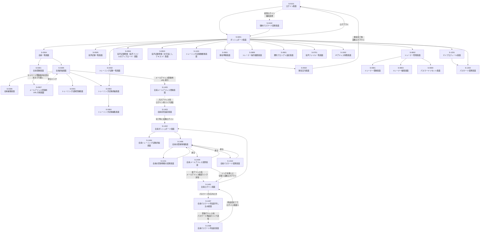

**位置づけ**: 仕様文書（画面設計書）
**対象読者**: 開発者
**上位文書**: requirements.md（7. 画面一覧）
**詳細**: 詳細は doc-index.md を参照

---

# 画面設計書: トレーニング記録管理システム

## 1. 画面遷移図


```mermaid
graph TD
    %% 認証（ログイン）
    S0101[S-0101<br>ログイン画面] --> S0201[S-0201<br>ダッシュボード画面]
    S0101 -.->|初回ログイン<br>強制変更| S0102[S-0102<br>強制パスワード変更画面]
    S0102 --> S0201

    %% 会員登録・一覧・詳細・編集
    S0201 --> S0304[S-0304<br>会員一覧画面]
    S0304 --> S0301[S-0301<br>会員登録画面]
    S0304 --> S0305[S-0305<br>会員詳細画面]
    S0305 --> S0306[S-0306<br>会員編集画面]
    S0305 -->|マイページ登録案内を表示<br>別タブで開く| S0307[S-0307<br>メールアドレス登録用 URL 印刷画面]
    S0307 -.->|戻るリンク| S0305

    %% トレーニング記録登録・詳細・編集
    S0305 --> S0401[S-0401<br>トレーニング記録登録画面]
    S0305 --> S0403[S-0403<br>トレーニング記録詳細画面]
    S0403 --> S0404[S-0404<br>トレーニング記録編集画面]

    %% トレーニング記録一覧
    S0201 --> S0402[S-0402<br>トレーニング記録一覧画面]
    S0402 --> S0403

    %% 音声記録一覧・登録
    S0201 --> S0505[S-0505<br>音声記録一覧画面]
    S0201 --> S0501[S-0501<br>録音準備画面]
    S0501 --> S0502[S-0502<br>録音実行画面]
    S0502 -->|録音完了後<br>自動ログアウト| S0101
    S0201 --> S0504[S-0504<br>音声記録登録（音声ファイルのアップロード）画面]
    S0201 --> S0503[S-0503<br>音声記録登録（文字起こしテキスト）画面]

    %% トレーニング記録数推移画面
    S0201 --> S1101[S-1101<br>トレーニング記録数推移画面]

    %% 【管理者】トレーナー一覧・登録・編集
    S0201 --> S0802[S-0802<br>トレーナー管理画面]
    S0802 --> S0801[S-0801<br>トレーナー登録画面]
    S0802 --> S0803[S-0803<br>トレーナー編集画面]
    S0802 --> S0804[S-0804<br>パスワードリセット画面]
    S0201 --> S0805[S-0805<br>トレーナー操作履歴画面]

    %% 【管理者】要約プロンプト
    S0201 --> S0601[S-0601<br>要約プロンプト設定画面]

    %% 【管理者】マスタ管理（2026-09 廃止）

    %% 【システム管理者】音声ファイル一覧
    S0201 --> S0701[S-0701<br>音声ファイル一覧画面]

    %% 【システム管理者】IPアドレス制限
    S0201 --> S1002[S-1002<br>IPアドレス制限画面]

    %% マイプロフィール
    S0201 --> S1201[S-1201<br>マイプロフィール画面]
    S1201 --> S1202[S-1202<br>パスワード変更画面]
    S0201 --> S1202
    S0201 -->|ログアウト| S0101

    %% 会員向け閲覧機能（会員側）
    S0305 -->|メールアドレス登録用 URL 発行| S1405[S-1405<br>会員メールアドレス登録画面]
    S1405 -.->|入力アドレス宛<br>ログイン用リンク送信| S1403[S-1403<br>会員初回設定画面]
    S1403 -->|完了時に自動ログイン| S1402[S-1402<br>会員ダッシュボード画面]
    S1401[S-1401<br>会員ログイン画面] --> S1402
    S1402 --> S1404[S-1404<br>会員トレーニング記録詳細画面]
    S1402 --> S1406[S-1406<br>会員の登録情報画面]
    S1406 --> S1411[S-1411<br>会員の登録情報の変更画面]
    S1406 --> S1409[S-1409<br>会員メールアドレス変更画面]
    S1406 --> S1410[S-1410<br>会員パスワード変更画面]
    S1411 -->|戻る| S1406
    S1409 -.->|新アドレス宛<br>メールアドレス確認リンク送信| S1401
    S1409 -->|リンクを開くと<br>切替＋自動ログアウト| S1401
    S1409 -->|戻る| S1406
    S1410 -->|戻る| S1406
    S1401 -->|パスワードを忘れた方| S1407[S-1407<br>会員パスワード再設定申し込み画面]
    S1407 -.->|登録アドレス宛<br>パスワード再設定リンク送信| S1408[S-1408<br>会員パスワード再設定画面]
    S1408 -->|再設定完了で<br>ログイン画面へ| S1401
```

---

## 2. 全画面共通

### 2-1. ヘッダー

#### 2-1-1. ナビゲーションメニュー

##### 親メニュー

| 表示順 | 項目 | 遷移先 | アクセス権限 | 備考 |
|------|------|------|---------|---------|
| 1 | システム名 | S-0201 | 一般、管理者、システム管理者 | |
| 2 | 会員 | — | 一般、管理者 | |
| 3 | トレーニング記録 | S-0402 | 一般、管理者 | |
| 4 | メディア | — | 一般、管理者 | |
| 5 | 音声記録 | — | 一般、管理者 | |
| 6 | レポート | — | 一般、管理者 | |
| 7 | 【管理者】 | — | 管理者、システム管理者 | |
| 8 | 【システム管理者】 | — | システム管理者 | |
| 9 | ユーザーメニュー | — | 一般、管理者、システム管理者 | トレーナー名・権限バッジを表示 |

##### サブメニュー：会員

| 表示順 | 項目 | 遷移先 | アクセス権限 | 備考 |
|------|------|---------|---------|---------|
| 2-1 | 会員一覧 | S-0304 | 一般、管理者 | |
| 2-2 | 会員登録 | S-0301 | 一般、管理者 | |

##### サブメニュー：メディア

| 表示順 | 項目 | 遷移先 | アクセス権限 | 備考 |
|------|------|---------|---------|---------|
| 4-1 | メディア一覧 | S-1302 | 一般、管理者 | |

##### サブメニュー：音声記録

| 表示順 | 項目 | 遷移先 | アクセス権限 | 備考 |
|------|------|---------|---------|---------|
| 5-1 | 音声記録一覧 | S-0505 | 一般、管理者 | |
| — | （区切り） | — | — | |
| — | 音声記録登録（ヘッダー） | — | — | |
| 5-2 | 録音 | S-0501 | 一般、管理者 | |
| 5-3 | 音声ファイル | S-0504 | 一般、管理者 | |
| 5-4 | 文字起こしテキスト | S-0503 | 一般、管理者 | |

##### サブメニュー：レポート

| 表示順 | 項目 | 遷移先 | アクセス権限 | 備考 |
|------|------|---------|---------|---------|
| 6-1 | トレーニング記録数推移 | S-1101 | 一般、管理者 | |

##### サブメニュー：【管理者】

| 表示順 | 項目 | 遷移先 | アクセス権限 | 備考 |
|------|------|---------|---------|---------|
| 7-1 | トレーナー管理 | S-0802 | 管理者、システム管理者 | |
| 7-2 | トレーナー操作履歴 | S-0805 | 管理者 | |
| — | （区切り） | — | — | |
| 7-3 | 要約プロンプト | S-0601 | 管理者 | |

##### サブメニュー：【システム管理者】

| 表示順 | 項目 | 遷移先 | アクセス権限 | 備考 |
|------|------|---------|---------|---------|
| 8-1 | 音声ファイル一覧 | S-0701 | システム管理者 | |
| — | （区切り） | — | — | |
| 8-2 | IPアドレス制限 | S-1002 | システム管理者 | |

##### サブメニュー：ユーザーメニュー

| 表示順 | 項目 | 遷移先 | アクセス権限 | 備考 |
|------|------|---------|---------|---------|
| 9-1 | マイプロフィール | S-1201 | 一般、管理者、システム管理者 | |
| 9-2 | パスワード変更 | S-1202 | 一般、管理者、システム管理者 | |
| 9-3 | ログアウト | S-0101 | 一般、管理者、システム管理者 | |

#### 2-1-2. 表示挙動

トレーナー側のナビゲーションバーは、スクロール時も画面上端に留まる（Bootstrap の `sticky-top`）。一覧・詳細画面は縦に長く、他画面へ移動するために毎回先頭まで戻る操作を省くため。

会員側のナビゲーションバーは通常フローのまま（スクロールすると画面外へ流れる）。画面数が少ないため。ナビには**「登録情報」（S-1406 会員の登録情報画面へ）と「ログアウト」**を配置する（回遊要素は最小限。詳細は `docs/client-portal-design-plan.md` §4-0）。スマートフォンでは折りたたみメニューの中に、「登録情報」と「ログアウト」を並べて置く。

---

### 2-2. フッター

フッターは実装していない。

---

### 2-3. ブラウザタイトル

ブラウザタブに表示される `<title>` は「**画面名 - サフィックス**」形式で統一する。

#### 供給元

| 側 | 対象レイアウト | サフィックス |
|---|---|---|
| トレーナー側 | `layouts/app`・`layouts/guest`・`layouts/error` | `config('app.trainer_portal_name')`（既定値「トレーニング記録管理システム」） |
| 会員側 | `layouts/client`・`layouts/client-public` | `config('app.client_portal_name')`（既定値「トレーニング記録」。会員側プロダクト名の詳細は `docs/client-portal-design-plan.md` §9-1 を参照） |

#### 記述規約

- **画面名は各 Blade の `@section('title', ...)` で機能名のみを渡す**（例: `@section('title', '会員一覧')`）。
- **サフィックスはレイアウト側で `<title>` タグ内に後付けする**。`@section('title', ...)` 側でサフィックスを連結してはならない（連結すると規約から外れた画面ごとに手当てが発生する）。
- `@section('title')` が未指定の画面は、レイアウトの `@hasSection('title')` 分岐によりサフィックスのみを表示する（先頭に「 - 」が付かないこと）。

#### 例外

1. **`recording-v2/session.blade.php`** はレイアウトを継承せず `<title>録音実行</title>` を直書きしている。音声記録機能に属する画面のため、本規約の適用対象外。
2. **ダッシュボード**（トレーナー側 `dashboard.blade.php` / 会員側 `client/dashboard.blade.php`）は `@section('title', ...)` を渡さず、サフィックスのみを `<title>` に表示する。各ポータルの入口にあたる画面のため、画面名を重ねない。

#### 命名規約（登録・編集画面）

登録画面の画面名は「**○○登録**」の形式に統一する（例：「会員登録」「トレーニー登録」「トレーニング記録登録」「トレーナー登録」）。編集画面は「**○○編集**」で揃える。

**規約の適用範囲**：画面名（`<title>`／設計書の画面名／`<h2>` 見出し）、機能名（要件定義書 6 章）、アクセスログの操作ラベル。

**「新規登録」の使い分け**：
- **画面名としては使わない**（「会員の新規登録」「トレーナー新規登録」等は採用しない）
- **一覧画面やカード内のボタン文言としては「新規登録」を使う**（例：会員一覧の右上、会員詳細のトレーニング記録カード内）。ボタンは配置される文脈で「何を登録するか」が伝わるため、ラベルは「新規登録」で十分。画面名との重複を避けることで、対応する画面へ移動する動作が明確になる
- **例外：会員詳細のトレーニーカードのボタンは「トレーニーを追加」**（2026-09 変更、詳細は S-0305 セクション3 の設計方針参照）。同じ画面内のトレーニング記録カードにも「新規登録」ボタンがあり、両方が同列に並ぶと**日常的に押すトレーニング記録側と誤ってトレーニー側を押してしまう危険**があったため、位置（ヘッダー右上→カード下部）と文言（新規登録→トレーニーを追加）の両方を変えて識別を明確にした。ボタン文脈で対象が伝わることを崩す例外だが、誤操作回避を優先した

**経緯（2026-09）**：
- 段階①〜③では「**○○の新規登録**」（会員／トレーニー）と「**○○登録**」（トレーニング記録／トレーナー／音声記録／計測値／メディア／メールアドレス）が混在していた。「の新規登録」は会員（S-0301）とトレーニー（S-0308）の 2 系統のみで、他はすべて「○○登録」型
- 実装調査の結果、`src/resources/views/clients/create.blade.php` と `trainees/create.blade.php` の `<title>`／`pageTitle`、ナビメニュー、アクセスログのラベル、PHP コントローラの docblock（「クライアント新規登録画面」「トレーナー新規登録画面」等）で表記が揺れていた
- 揺れの側（少数派）を多数派に寄せる方針で、**「○○登録」に統一**した。画面数の一貫性を優先し、`<title>`・機能名・画面名を同じ語形にした
- 上記のボタン文言（「新規登録」）は例外として残す（文脈で対象が伝わる位置にあり、画面名との重複を避けるため）

---

### 2-4. 未入力値の表示

値が未入力・未設定の項目は、表示形式にかかわらず**空欄にする**方針で統一する（**2026-09 変更**、当初はテーブル形式のみ「—」を表示していた。経緯は下の「経緯」節参照）。

**共通の規則**

- **値は空欄にする**（何も表示しない）
- **行・セル・ラベルは消さない**：詳細画面の「行ごと消さない」方針は維持し、ラベルは残して値だけを空にする（項目位置が揃うため、複数レコードを続けて見るときに目線の当てどころが安定する）
- **数を表す値は空欄にしない**：メディア件数など、未設定という状態がなく常に整数値が定まる値は数値を出す（0 件も「0」で表示。詳細は S-0402 設計方針「メディア件数の 0 件は『0』と表示する」参照）
- **「—」を未設定以外の意味**（区切り、範囲の「〜」の代わり、装飾など）で使う場合は本規約の対象外

**表示形式ごとの実装**

- **セル形式（ラベル上・値下）**：`x-detail-cell` は既に空表示に対応済み（値の div に `min-height: 1.5rem`）。呼び出し側で `?: '—'` を明示的に渡さないこと。同形式で直接記述した箇所も `min-height` で高さを担保する
- **テーブル形式（`<td>`）**：セルの値を空にする。同じ行の他のセル（トレーニング日・名前・件数など）に必ず文字が入るため、1 セルが空でも行高は保たれる。**空欄と 0 件の区別が必要な数値は空欄にしない**（上の共通規則参照）
- **本文・自由記述**：ノート・所感など、値がないと項目自体の意味がなくなるものは**行ごと非表示**（トレーニング記録タイムラインのノートなど）
- **文中に組み込む値**（「最終更新：日時 名前」など）：値が空のとき末尾に余計な空白や区切りが残らないよう、Blade 側で条件付き出力にする

**経緯（2026-09 変更）**

- **当初は「テーブル形式のみ『—』を表示」する規約**だった（理由：「空にすると行高が不安定になるため」）。しかし実運用のテーブルはすべて **同じ行に必ず文字が入る他のセルがある**（一覧なら日付・名前など、履歴なら日時・操作など）ため、1 セルが空になっても行高は他のセルで保たれることが分かった。行高の懸念は実質不要だった
- **「—」は複数の意味で使われて紛らわしい**：他の列で「未設定」の意味に使っている一方、メディア件数の「0 件は『—』」で「件数の 0」の意味にも使っており、読み手にとって「値がないのか、0 件なのか」の区別が付かなかった。**件数**（未設定なく常に整数）は素の数値、**未設定**（値が定まらない）は空欄、と使い分けを明確にする
- 会員側は既に **`client-portal-design-plan.md §6:1337`** で「`—`（テーブル内の空値）→ 記録カード化により大半が消滅」と方針化されており、会員側画面には「—」が残っていない。トレーナー側もこれに近い扱いに揃える形になる

---

### 2-5. バッジ

バッジ（`.badge`）は、サイズで重要度を、配色で意味を表す。

**サイズ**

| 種別 | 指定 | 用途 |
|------|------|------|
| 強調バッジ | `fs-6` を付ける | 対応の要否を示す状態表示。見落とすと業務に支障が出るもの |
| 標準バッジ | 指定なし（Bootstrap 既定） | 分類・種別のラベル。読めればよく、目立つ必要がないもの |

**配色**

| 配色 | 意味 | 例 |
|------|------|-----|
| `bg-success` | 正常・完了 | 利用中、未使用（有効なURL） |
| `bg-warning text-dark` | 要対応・注意 | 初回設定待ち、メールアドレス登録待ち |
| `bg-secondary` | 未着手・無効 | メールアドレスなし、使用済み |
| `bg-danger` | 異常・期限切れ | 期限切れ |
| `bg-light text-dark border` | 分類ラベル（意味を持たない） | 現在該当なし（2026-09 にトレーニング内容分類を廃止） |

**会員状態バッジの 4 状態対応**（S-0304・S-0305 で使用）

| バッジ文言 | 配色 | 添え書き（該当時） |
|------|------|------|
| 利用中 | `bg-success` | — |
| 初回設定待ち | `bg-warning text-dark` | 有効期限切れなら「（期限切れ）」を添え、配色を `bg-danger` に切り替える |
| 登録待ち | `bg-warning text-dark` | 有効期限切れなら「（期限切れ）」を添え、配色を `bg-danger` に切り替える |
| なし | `bg-secondary` | — |

**太さ**

Bootstrap 既定（`font-weight: 700`）を使い、個別に変更しない。

※ 本規約は新設・改修する画面から順次適用する。既存バッジの棚卸しは別途行う。

※ 会員向け画面（S-1401〜S-1405）の配色は `docs/client-portal-design-plan.md` §2 のトークンに従い、本表の適用外とする。

---

### 2-6. 用語の呼び方

#### 2-6-1. トレーニング記録の日付は「トレーニング日」と呼ぶ（**2026-09**）

`training_records.training_date` を画面のラベル・列見出し・検索条件で指すときは **「トレーニング日」** で統一する。会員の最終のトレーニング記録日は **「最終トレーニング日」**（会員一覧 S-0304 の列名・検索条件）。

**理由**：
- 従前は画面ごとに「日付」「最終記録日」とばらついていた（用語集 No.20 は「トレーニング記録は日付・担当・ノート等を含む」としており、日付そのものの呼び方は決まっていなかった）
- トレーニーの計測値（`trainee_measurements`）に **「計測日」** が加わり、同じ会員詳細画面（S-0305）で「日付」（トレーニング記録）と「計測日」（計測値）が同居する場面が出た。同じ画面で「日付」の意味が曖昧になるため、それぞれの対象を語尾で識別する（「トレーニング日」と「計測日」）
- 記録の種別（`training_types`）は **2026-09 に廃止済み**（詳細は `db-schema.md` DM-0200 と `client-portal-design-plan.md` §6 の注記）で、`training_records` に入るのは**すべてトレーニングの記録**という前提に揃った。「トレーニング日」と呼んでも実態とずれない（種別に「事前相談・その他」があった当時の懸念は解消済み）
- DB のカラム名 `training_date` と呼び方が一致するため、コード・設計書・画面で用語が揃う

**適用範囲**：
- **トレーナー側画面のラベル**：登録・編集（S-0401 / S-0404）の入力欄・S-0402 の列見出しと検索条件・S-0201 ダッシュボードの「最近のトレーニング記録」列見出し・S-0304 会員一覧の「最終トレーニング日」列と検索条件
- **バリデーション属性名**（`lang/ja/validation.php` の `training_date`）
- **設計書**（本ファイル・`requirements.md`・`db-schema.md`・`api-design.md`・`glossary.md`）
- **フラッシュメッセージ・確認ダイアログの文言は本方針の対象外**（「トレーニング記録を登録しました」等は日付ではなく記録全体を指す語彙で、変更しない）
- **マイグレーションのカラムコメント**（`->comment('日付')`）は据置（変更するには migration が必要で、実害がないため）

**会員側は対象外**：会員側画面（`resources/views/client/`）では日付ラベル語を出さず、「○月○日（曜）の記録」（詳細画面 h2）や日付ブロック（縦帯・横帯）で日付そのものを見出しとして扱う流儀で徹底されている（詳細は `client-portal-design-plan.md` §6 の書き換え表参照）。**「トレーニング日」への統一はトレーナー側だけの規約**で、会員側画面には影響しない。

---

## 3. 画面詳細

**記載範囲**:
- 本章では、本システムが提供する全画面を列挙する。
- 全画面とは、要件定義書（docs/requirements.md）の7章「画面一覧」で挙げられている画面を指す。
- 各画面のデザイン・インターフェイス・遷移の把握を目的とする。

**参照ルール**:
- 各画面の概要・提供機能・アクセス権限は、要件定義書（docs/requirements.md）の7章「画面一覧」で管理している。本書では同じ画面IDを使用しているため、画面IDで突き合わせて参照すること。

**画面 ID の欠番**:
- **S-0302** — もとから欠番
- **S-0303** — 段階 1 の事前入力 URL 廃止で欠番化（他文書からの参照ずれを防ぐため番号は繰り上げない）
- 画面 ID を新設する場合は既存の欠番を埋めず、末尾に採番する（例：会員側は S-1408 が最後、次の空き番号は S-1409）

**記載する項目**: 各画面について、以下の項目を記載する。
- **ワイヤーフレーム**（必須）: 画面の構成要素と配置を示すテキストベースの図。罫線で囲み、ナビゲーションバー・主要な入力欄・ボタン・テーブルなどを記載する。
- **画面項目**（必須）: 画面上で表示・入力する項目の一覧。「項目名」「種類」「必須」「説明」の4列で記載する。テーブル形式の項目は別途列定義表を「列」「種類」「必須」「説明」の4列で記載する。
- **バリデーション**（必須）: 入力チェックとエラーメッセージ。「項目」「チェック内容」「説明」の3列で記載する。チェック不要な場合は「なし」と記載する。
- **状態一覧**（必須）: 画面の表示モードや状態を切り替える場合の各状態の説明。状態の切り替えがない場合は「なし」と記載する。
- **操作フロー**: ワイヤーフレームと画面項目だけでは伝わりにくい画面内の挙動を、ユーザーの操作順に記述する。業務フローは記載しない（業務フローは要件定義書で扱う）。
- **備考**: 業務的・運用的に重要な特記事項がある場合のみ記載。

**必須欄の記号**: 「画面項目」「バリデーション」表の「必須」列では、以下の記号を用いる。

| 記号 | 意味 |
|---|---|
| ● | 必須 |
| ▲ | 条件付き必須（説明欄で条件を「※」付きで明示する） |
| 空欄 | 任意 |

**画面項目の種類**: 各画面の「画面項目」表で使用する「種類」列の値は、以下のいずれかを用いる。

| 種類 | 説明 |
|---|---|
| 表示のみ | 値を表示する（編集不可） |
| テキスト | 1行のテキストを入力する |
| テキストエリア | 複数行のテキストを入力する |
| 数値 | 数値を入力する |
| 日付 | 日付を入力する |
| 時刻 | 時刻を入力する |
| 電話番号 | 電話番号を入力する（数字とハイフン） |
| メールアドレス | メールアドレスを入力する |
| パスワード | パスワードを入力する（入力値はマスク表示） |
| プルダウン | 選択肢から1つを選択する |
| はい／いいえ | フラグのオン／オフを切り替える |
| ファイル選択 | ファイルを選択する |
| ボタン | 操作を実行する |
| リンク | 別画面へ遷移する（テキスト形式） |
| カード | 情報を1単位にまとめて表示する（クリックで遷移する場合あり） |
| テーブル | 複数行のデータを一覧表示する |
| 動的リスト | 行を追加・削除できる入力リスト |
| 画像 | 画像を表示する |

**パスワードの強度**: 
- 8文字以上
- 大文字・小文字・数字・記号をそれぞれ1文字以上含む
- よくあるパスワード（password 等）を禁止


### 3-1. 認証

#### S-0101 ログイン画面

##### ワイヤーフレーム

```
┌─────────────────────────────────────┐
│                                     │
│    トレーニング記録管理システム        │
│                                     │
│   ┌─────────────────────────────┐   │
│   │  ログインID                  │   │
│   └─────────────────────────────┘   │
│   ┌─────────────────────────────┐   │
│   │  パスワード                  │   │
│   └─────────────────────────────┘   │
│                                     │
│             [ログイン]               │
│                                     │
└─────────────────────────────────────┘
```

##### 画面項目

| 項目名 | 種類 | 必須 | 説明 |
|--------|------|------|------|
| ログインID | テキスト | ● | ログインするためのID |
| パスワード | パスワード | ● | パスワード。入力値はマスク表示 |
| ログイン | ボタン |  | 入力情報でログインを実行する |

##### バリデーションチェック

| 項目 | チェック内容 | 説明 |
|------|-------------|-----------------|
| — | 認証失敗 | 「ログインIDまたはパスワードが正しくありません」 |
| — | アカウントロック | 「アカウントがロックされています。管理者に連絡してください」 |
| — | アカウント無効 | 「アカウントが無効化されています。管理者に連絡してください」 |

##### 状態一覧

なし

---

#### S-0102 強制パスワード変更画面

##### ワイヤーフレーム

```
┌─────────────────────────────────────────┐
│ [ナビゲーションバー]                     │
├─────────────────────────────────────────┤
│                                         │
│  パスワード変更        [更新]  │
│                                         │
│  初回ログインのため、パスワードを          │
│  変更してください。                      │
│                                         │
│  新しいパスワード：                      │
│  [                                    ] │
│  新しいパスワード（確認）：               │
│  [                                    ] │
│                                         │
└─────────────────────────────────────────┘
```

##### 画面項目

| 項目名 | 種類 | 必須 | 説明 |
|--------|------|------|------|
| 更新 | ボタン |  | パスワードを変更 |
| 新しいパスワード | パスワード | ● | |
| 新しいパスワード（確認） | パスワード | ● | 確認用に新しいパスワードを再入力 |

##### バリデーションチェック

| 項目 | チェック内容 | 説明 |
|------|-------------|-----------------|
| 新しいパスワード（確認） | 一致チェック | 「新しいパスワード（確認）が一致しません」 |

##### 状態一覧

なし

---

#### S-0103 セッション期限切れエラーページ

##### ワイヤーフレーム

```
┌──────────────────────────────────────────────┐
│                                              │
│  ┌────────────────────────────────────────┐  │
│  │ セッションの有効期限が切れました          │  |
│  ├────────────────────────────────────────┤  │
│  │ 419 Page Expired                       │  │
│  │                                        │  │
│  │ しばらく操作がなかったため、セッション    │  │
│  │ の有効期限が切れました。                 │  │
│  │ 再度ログインしてください。               │  │
│  │                                        │  │
│  └────────────────────────────────────────┘  │
│                                              │
└──────────────────────────────────────────────┘
```

##### 画面項目

なし

##### バリデーションチェック

なし

##### 状態一覧

なし

##### 備考

- 独立したURLは持たず、419エラー時に Laravel が `resources/views/errors/419.blade.php` を自動表示する（ルーティング設定不要）
- 共通ナビ（トレーナー用/会員向けヘッダー）を持たない中立レイアウト（`layouts.error`）を使用する。ログイン中ユーザーに依存する表示を含まないため、トレーナー・会員いずれの認証状態でも同一表示となる

---

#### S-0104 アクセス禁止エラーページ

##### ワイヤーフレーム

```
┌──────────────────────────────────────────────┐
│                                              │
│  ┌────────────────────────────────────────┐  │
│  │ アクセス拒否                            │  |
│  ├────────────────────────────────────────┤  │
│  │ 403 Forbidden                          │  │
│  │                                        │  │
│  │ {$exception->getMessage() ?:           │  │
│  │  「このページへのアクセスは許可されて     │  │
│  │   いません。」}                         │  │
│  │                                        │  │
│  └────────────────────────────────────────┘  │
│                                              │
└──────────────────────────────────────────────┘
```

##### 画面項目

なし

##### バリデーションチェック

なし

##### 状態一覧

なし

##### 備考

- 独立したURLは持たず、403ステータス時に Laravel が `resources/views/errors/403.blade.php` を自動表示する
- 主な発生源は IP制限ミドルウェア（`CheckIpRestriction`）、管理者専用ルート（`AdminMiddleware`）、コントローラ内の `abort(403, ...)` 呼び出し
- 共通ナビ（トレーナー用/会員向けヘッダー）を持たない中立レイアウト（`layouts.error`）を使用する。ログイン中ユーザーに依存する表示を含まないため、トレーナー・会員いずれの認証状態でも同一表示となる

---

### 3-2. ダッシュボード

#### S-0201 ダッシュボード画面

##### ワイヤーフレーム

```
┌──────────────────────────────────────────────────────────────────────────────────────────┐
│ [ナビゲーションバー]                                                                       │
├──────────────────────────────────────────────────────────────────────────────────────────┤
│                                                                                          │
│  ようこそ、佐藤さん。（権限: 管理者）                                                       │
│                                                                                          │
│  ■ 最近のトレーニング記録  [すべて表示]                             [すべて ▼]              │  ← 2026-09 追加
│  ┌──┬──────┬─────────────────┬──────────────┬─────┬─────┬────┐                  │
│  │内部ID│名前  │トレーニー         │トレーニング日│担当1│担当2│メディア│                  │
│  ├──┼──────┼─────────────────┼──────────────┼─────┼─────┼────┤                  │
│  │1 │山田太郎│アイ（メス）      │3/10          │佐藤 │田中 │3   │                  │
│  │2 │鈴木花子│モモ              │3/8           │田中 │     │0   │                  │
│  └──┴──────┴─────────────────┴──────────────┴─────┴─────┴────┘                  │
│                                                                                          │
└──────────────────────────────────────────────────────────────────────────────────────────┘
```

##### 画面項目

| 項目名 | 種類 | 必須 | 説明 |
|--------|------|------|------|
| ウェルカムメッセージ | 表示のみ |  | 「ようこそ、○○さん。（権限: [権限名]）」形式 |
| 最近のトレーニング記録 | テーブル |  | **2026-09 追加**。過去 1 週間（今日を含む 7 日間、`training_date` が今日の 6 日前から今日まで。未来日は含めない — 詳細は下の設計方針参照）のトレーニング記録を**トレーニング日の新しい順（降順）で固定**表示（列見出しでの並べ替えはしない — 詳細は下の設計方針参照）。**ページングなし**。**列構成は S-0402 と同じ**（内部ID / 名前 / トレーニー / トレーニング日 / 担当1 / 担当2 / メディア）。見出しのすぐ右に「すべて表示」リンク（トレーニング記録一覧画面（S-0402）へ遷移）、行の右端に絞り込みセレクト（「すべて」／「主担当のみ」、既定は「すべて」）を配置する。セレクト変更時は自動で再読み込みされる（ボタンなし。参考にした画面と同じ流儀）。行クリックでトレーニング記録詳細画面（S-0403）へ遷移（S-0402 と同じ動作）。データなし時は「過去1週間のトレーニング記録はありません。」と表示 |
**最近のトレーニング記録（テーブル）**

列は左から順に、**内部ID / 名前 / トレーニー / トレーニング日 / 担当1 / 担当2 / メディア** の 7 列で構成する（**2026-09 変更**、S-0402 と同じ列構成に揃えた。詳細は下の「設計方針」参照）。**列見出しはリンクにしない**（並べ替えなし。並べ替えたいときは「すべて表示」から S-0402 へ）。

| 列 | 種類 | 説明 |
|------|------|------|
| 内部ID | 表示のみ | 会員の `internal_id`（S-0402 と同じ書式） |
| 名前 | 表示のみ | 会員の姓名（`Client::display_name`） |
| トレーニー | 表示のみ | 会員に紐づくトレーニーを「名前（犬種、性別）」の形で表示。表示形式は会員一覧（S-0304）・トレーニング記録一覧（S-0402）と同じで、`Client::trainees_label` アクセサを共用する。0 頭は空欄 |
| トレーニング日 | 表示のみ | `Y/m/d` 形式（S-0402 と同じ書式）。呼び方は「§2-6 用語の呼び方」参照 |
| 担当1 | 表示のみ | 未設定は**空欄**（S-0402 と同じ。§2-4 参照） |
| 担当2 | 表示のみ | 未設定は**空欄**（S-0402 と同じ。§2-4 参照） |
| メディア | 表示のみ | 紐づくメディア（写真・動画）の件数。数値のみ表示。**0 件は「0」**（S-0402 と同じ。理由は S-0402 設計方針「メディア件数の 0 件は『0』と表示する」参照） |

##### 設計方針

- **「最近のトレーニング記録」を追加**（**2026-09 追加**）：ログイン直後にトレーナーが**直近の記録動向を素早く把握できる**ようにするため。従前は「主担当の会員一覧」だけで、記録の実施動向はトレーニング記録一覧（S-0402）まで移動しないと見えなかった。ダッシュボードで直近の記録を一望できると、朝の業務開始時にチームの記録動向を確認する動線が短くなる。**参考にした画面**：別システム（就労支援記録管理システム）のダッシュボードにある「最近の相談記録」の構成（見出し＋すぐ右に「すべて表示」・行の右端に絞り込みセレクト・その下にテーブル）に揃える
- **「主担当の会員一覧」ブロックを削除**（**2026-09**）：段階①から置いていたブロックで、**ログイン中のトレーナーが主担当の会員**を**最終記録日の新しい順に最大 10 件**表示し、10 件超の場合は「すべて表示」リンクで会員一覧（S-0304）の主担当絞り込みへ遷移する作りだった。「最近のトレーニング記録」に**「主担当のみ」の絞り込み**（会員の主担当 = ログイン中のトレーナー）を持たせたことで、**主担当の会員の動きはそちらから追える**ようになり、役割が重なるため撤去した。**当時の内容は本行に短く残す**（将来同じ発想でブロックを復活させたくなったときに、どんな作りだったかがこの一行で参照できるようにするため）。**会員一覧（S-0304）の主担当絞り込み** `?primary_trainer_id={id}` は残す（他画面から「自分が主担当の会員一覧」に飛ぶ導線は今後も要る）
- **期間で区切った理由（件数ではなく「過去1週間」）**：トレーナーさんの判断で、直近の記録を追う目的では「日数で切る」ほうが直感的（「最新10件」だとチームによっては 1 日で埋まってしまい、昨日以前の様子が見えなくなる。「1 週間」だと 1 週間の枠内で全員分がまとまって見える）。**今日を含む 7 日間**（`training_date` が今日の 6 日前から今日まで）とする
- **未来日は含めない**：`training_date` は要件定義書 6-4-2（`docs/requirements.md` の「日付」欄）で未来日入力を許容している（予約・トレーニング予定を先に登録できる）。しかし「**最近のトレーニング記録**」は**実施済みの記録動向を追う位置づけ**の一覧で、予定は「まだ起きていない未来のトレーニング」なので、この一覧に混ぜると「振り返り」と「予定確認」の目的が入り交じって読みにくくなる。**予定の一覧化は別の画面・別のブロックで扱う（今回は範囲外）**。未来日を含めるかどうかは、実運用で「ダッシュボードに翌日以降の予定も出したい」要望が出た時点で、別ブロック（例：「本日以降の予定」）として再検討する
- **既定は「すべて」**：チームで記録を共有する目的の一覧のため、既定でチーム全員分を見せる。パーソナライズしたい場合はセレクトで「主担当のみ」に切り替える。**「主担当のみ」に切り替えたときの姿**が、削除した「主担当の会員一覧」ブロックのパーソナライズ表示の役割を引き継ぐ位置づけになる
- **「主担当のみ」の基準**：**会員の主担当（`clients.primary_trainer_id`）がログイン中のトレーナーである記録**。会員一覧（S-0304）で主担当を絞り込むときと同じ基準（`?primary_trainer_id={id}`）に揃える。**「担当1・担当2 に自分が入っている記録」ではない**：担当1・担当2 は「その回の記録の実施者」で、記録ごとに変わる。主担当は「会員の主治医的な位置づけ」で、記録の実施者が誰であれ主担当の視点で全記録を追える意味がある。ダッシュボードで「自分の関わりを狭めて見る」目的の絞り込みなので、より広く追える主担当を採用する（S-0402 の「担当」フィルタ = 担当1・担当2 とは目的が異なる）
- **ページングしない理由**：想定件数はトレーナー数（数名〜十数名）× 1 週間の記録数（1 トレーナーあたり 1 日 1〜数件）で**多くて 200 件程度**の見積もり。ページングを付けても 1 ページに収まる範囲で、ページングの UI 分だけ画面が重くなり利点が薄い。将来 200 件を大きく超えるようになったら期間短縮または上限追加を検討する
- **絞り込みセレクトの動作**：クエリパラメータ `?recent=all|primary` で受け渡す。既定は `all`（すべて）。**セレクトを変更したら自動で再読み込み**（`onchange="this.form.submit()"` の形。参考画面と同じで検索ボタンを持たない）。**不正な値は `all` として扱う**（`request('recent') === 'primary'` の等価判定で分岐）
- **システム管理者の扱い**：システム管理者は主担当プルダウンの対象外（S-0301 参照）で `clients.primary_trainer_id` には設定されない。「主担当のみ」を選ぶと必ず 0 件になる。既定が「すべて」のため、切り替えなければ全トレーナーの記録が見える → システム管理者にも意味のある画面になる（そもそもシステム管理者はログイン後は音声ファイル一覧に振り分けられる運用のため、ダッシュボードに来ることは稀）
- **列の構成も S-0402 と揃える**（**2026-09 変更**）：**内部ID / 名前 / トレーニー / トレーニング日 / 担当1 / 担当2 / メディア** の順で、S-0402 と同じ 7 列にする。**書式**もそれぞれ S-0402 と同じ（トレーニング日は `Y/m/d`、トレーニーは `Client::trainees_label` アクセサ（S-0304 で導入）を共用、**担当1・担当2 の未設定表示は空欄**（§2-4 参照）、**メディアは件数の数値・0 件は「0」**）。**当初は内部ID・メディアを省き、ダッシュボードは簡潔に**（トレーニング日・名前・トレーニー・担当1・担当2 の 5 列）としていたが、ダッシュボードと一覧で列が違うと**同じ記録を見ているのに見え方が変わり**、ダッシュボードで見た行を一覧で追うときに視線の当てどころが揃わない問題が出た。列を揃えたほうが「ダッシュボード＝一覧の直近 1 週間版」と読める。当時の簡潔化の判断は経緯として本行に残す（将来同じ発想でダッシュボードから列を減らしたくなった場合、この節を先に読めば行き来の摩擦の話が思い出せる）。**メディアの 0 件表示**（当初は「—」、2026-09 に「0」へ変更）の理由は S-0402 設計方針「メディア件数の 0 件は『0』と表示する」を参照。**担当1・担当2 の未設定表示**（当初は「—」、2026-09 に空欄へ変更）の理由は §2-4 参照
- **並べ替えは付けない**：S-0402 は列見出しでソートできるが、**ダッシュボードは「トレーニング日の新しい順」の固定**にする。列見出しはリンクにしない。並べ替えたいときは見出しの「**すべて表示**」から S-0402 へ移り、そこで並べ替える。ダッシュボードにソートを持たせても状態が持続せず（毎回ダッシュボードから入り直す使い方が主）、UI が複雑になる割に利点が薄いため
- **N+1 対策**：`with(['client.trainees', 'trainer1', 'trainer2'])` で eager load し、**さらに `withCount('mediaRecords')` を付ける**（S-0402 の `TrainingRecordController::index()` と同じ構え）。ページングなしで 200 件程度を一気に取るため、追加クエリを行ごとに発生させないよう eager load と件数集計を確実に付ける

##### バリデーションチェック

なし

##### 状態一覧

なし

---

### 3-3. 会員管理

#### S-0301 会員登録画面

##### ワイヤーフレーム

```
┌──────────────────────────────────────────────┐
│ [ナビゲーションバー]                          │
├──────────────────────────────────────────────┤
│                                              │
│  会員登録              [キャンセル] [登録]  　│
│                                              │
│  ┌─ 基本情報 ──────────────────────────────┐ │
│  │ 初回日：[    ] / 主担当                  │ │
│  │ 姓/ 名/ せい/ めい                       │ │
│  └──────────────────────────────────────── ┘ │
│                                              │
│  ┌─ 連絡先 ────────────────────────────────┐ │
│  │ 郵便番号 [住所検索]                       │ │
│  │ 都道府県 / 市区町村 / 町名・番地 / 建物名  │ │
│  │ 電話1～2                                  │ │
│  └──────────────────────────────────────── ┘ │
│                                              │
│  [キャンセル]  [登録]                        │
│                                              │
└──────────────────────────────────────────────┘
```

##### 画面項目

| 項目名 | 種類 | 必須 | 説明 |
|--------|------|------|------|
| キャンセル | ボタン |  | 会員一覧画面（S-0304）に戻る |
| 登録 | ボタン |  | 会員情報を登録し、会員詳細画面（S-0305）へ遷移 |

###### セクション1: 基本情報

| 項目名 | 種類 | 必須 | 説明 |
|--------|------|------|------|
| 初回日 | 日付 | ● | デフォルト値なし（空欄）。過去日を入力することが多く、既定値の修正漏れによる誤登録を防ぐため |
| 主担当 | プルダウン |  | 表示順のトレーナー一覧から選択（システム管理者は対象外） |
| 姓 | テキスト | ● | |
| 名 | テキスト |  | |
| せい | テキスト |  | |
| めい | テキスト |  | |

###### セクション2: 連絡先

| 項目名 | 種類 | 必須 | 説明 |
|--------|------|------|------|
| 郵便番号 | テキスト |  | |
| 住所検索 | ボタン |  | 郵便番号から都道府県・市区町村・町名を自動入力 |
| 都道府県 | プルダウン |  | 47都道府県 |
| 市区町村 | テキスト |  | |
| 町名・番地 | テキスト |  | |
| 建物名・部屋番号 | テキスト |  | |
| 電話番号 | 電話番号 |  | |
| 電話番号（予備） | 電話番号 |  | |

- メールアドレスは会員自身がメールアドレス登録用 URL から登録する。トレーナー登録画面には入力項目として置かない

##### バリデーションチェック

| 項目 | チェック内容 | 説明 |
|------|-------------|-----------------|
| せい | ひらがなチェック | 「せいはひらがなで入力してください」 |
| めい | ひらがなチェック | 「めいはひらがなで入力してください」 |
| 電話番号 | 数字とハイフンのみ | 「電話番号の形式が正しくありません」 |
| 電話番号（予備） | 数字とハイフンのみ | 「電話番号（予備）の形式が正しくありません」 |
| 郵便番号 | 7桁（ハイフンあり/なし両対応） | 「郵便番号の形式が正しくありません」 |

##### 備考

内部IDは登録時に自動採番されるため、入力欄はない。

##### 状態一覧

なし

---

#### S-0304 会員一覧画面

##### ワイヤーフレーム

```
┌─────────────────────────────────────────────────┐
│ [ナビゲーションバー]                             │
├─────────────────────────────────────────────────┤
│                                                 │
│  会員一覧                                　　　　│
│                                                 │
│  内部ID：[          ]                           │
│  名前：[          ] ※部分一致                  │
│  最終トレーニング日：[    ] ～ [    ]           │
│  主担当：[すべて ▼]                             │
│                                                 │
│  [検索]  [クリア]                                │
│                                                 │
│  25件                              [新規登録]  │
│  ┌──┬────┬────────────────────────┬────────┬────┬──────────┬──────────────┐ │
│  │ID│名前│      トレーニー         │初回日  │主担当│メールアドレス│最終トレーニング日│ │
│  ├──┼────┼────────────────────────┼────────┼────┼──────────┼──────────────┤ │
│  │1│山田太郎│アイ（トイプードル、メス）│2026/1/20│佐藤│  [利用中]  │2026/3/10     │ │
│  │2│鈴木花子│モモ（ミックス）／ハナ  │2026/2/1 │田中│[初回設定待ち]│2026/2/15     │ │
│  │3│田村一郎│                        │2026/3/5 │佐藤│   [なし]   │              │ │
│  │...│    │                        │        │    │            │              │ │
│  └──┴────┴────────────────────────┴────────┴────┴──────────┴──────────────┘ │
│                                                 │
│  [< 前へ]  1 2 3  [次へ >]                      │
│                                                 │
└─────────────────────────────────────────────────┘
```

##### 画面項目

###### 検索条件部

| 項目名 | 種類 | 必須 | 説明 |
|--------|------|------|------|
| 内部ID | テキスト |  | 内部IDの部分一致で検索 |
| 名前 | テキスト |  | 姓名・かなの部分一致で検索 |
| 最終トレーニング日（開始） | 日付 |  | 期間指定の開始日。最終日が未指定の場合は指定日以降の会員を表示。呼び方は §2-6 参照 |
| 最終トレーニング日（終了） | 日付 |  | 期間指定の終了日。開始日が未指定の場合は指定日以前の会員を表示 |
| 主担当 | プルダウン |  | すべて／トレーナー一覧から選択 |
| 検索 | ボタン |  | 検索条件で検索を実行 |
| クリア | ボタン |  | 検索条件をリセットし、結果もクリア |

###### 検索結果部

| 項目名 | 種類 | 必須 | 説明 |
|--------|------|------|------|
| 新規登録 | ボタン |  | 会員登録画面（S-0301）へ遷移 |
| 件数表示 | 表示のみ |  | 「N件」形式 |
| 会員一覧 | テーブル |  | 行クリックで会員詳細画面（S-0305）へ遷移。1ページ20件表示で、件数が20件を超える場合はページネーション（前へ／ページ番号／次へ）を表示 |

**会員一覧（テーブル）**

列は左から順に、内部ID / 名前 / トレーニー / 初回日 / 主担当 / メールアドレス / 最終トレーニング日 の 7 列で構成する（**2026-09 変更**、列を並べ替えて「初回日」列を追加。詳細は下の「設計方針」参照。「最終トレーニング日」の呼び方は §2-6 参照）。

| 列 | 種類 | 説明 |
|------|------|------|
| 内部ID | 表示のみ | 数値順でソート可能 |
| 名前 | 表示のみ | 「姓・名」を表示。五十音順でソート可能。**検索欄「名前」の部分一致はかなも対象**（姓名・かな 4 カラムの OR 一致）のため、かな列を廃止しても五十音での探索は名前欄からできる |
| トレーニー | 表示のみ | 会員に紐づくトレーニーを「**名前（犬種、性別）**」の形で表示。複数頭は「／」で区切る（例：「アイ（トイプードル、メス）／エマ（プードル、メス）」）。**括弧の中は「、」で区切り、トレーニーどうしは「／」で区切る**（読点の入れ子を避け、区切りを明確にするため）。**犬種のみ登録のとき**は「アイ（トイプードル）」、**性別のみ登録のとき**は「アイ（メス）」、**犬種も性別もなし**は括弧ごと省略して「アイ」（未登録の空欄で括弧を出さない）。**トレーニー 0 頭**は空欄（主担当の列も空欄になる場合と揃える）。ソート・絞り込みの対象にしない（複合値のため。文字列ソートしても意味を持たない） |
| 初回日 | 表示のみ | 会員の初回来所日（`clients.initial_consultation_date`）を **`Y/m/d`** 形式で表示（会員詳細 S-0305 と同じ書式）。**未設定は空欄**（§2-4 参照。ただし会員登録時に必須項目のため、通常は値が入る）。**列見出しでの並べ替えはしない**（要望が出たら追加検討） |
| 主担当 | 表示のみ |  |
| メールアドレス | 表示のみ | 会員の状態を表す 4 状態バッジ（なし／登録待ち／初回設定待ち／利用中）だけを表示し、**メールアドレスの値そのものは出さない**（列名で対象が分かり、バッジで状態が分かるため）。判定はメールアドレス・パスワード・メールアドレス登録用トークンの有無から導出し、有効期限が切れている場合は「（期限切れ）」を添える。判定の順序は S-0305 の状態一覧を参照。**カラムを持たないため並び替え・絞り込みの対象にしない**（絞り込みの追加は次回のレビュー後に検討） |
| 最終トレーニング日 | 表示のみ | 直近のトレーニング記録の日付。呼び方は §2-6 参照 |

##### 設計方針

- **「かな」列を削除**（**2026-09 変更**）：一覧で「かな」列を単独に持つ必要が薄かった。名前の見た目は名前列で識別でき、五十音での探索は**検索欄「名前」の部分一致がかなも対象**（`last_name` / `first_name` / `last_name_kana` / `first_name_kana` の OR 一致）のため、名前欄でかなを入力すれば絞り込める。ソートについても「姓のかな順に並べる」需要は実運用でほぼなく、削除しても実害がないと判断した。**検索条件は変更しない**（かなでの検索は名前欄に含まれている）
- **「トレーニー」列を追加**（**2026-09 追加**）：会員一覧でどの犬（トレーニー）の飼い主か分かるようにするため。トレーニーは会員に紐づく複数頭で、犬種・性別が登録されているケースがあるため、**「名前（犬種、性別）」の形**で表示する。複数頭は**「／」で区切る**：句読点の「、」を括弧内で使うため、トレーニー間の区切りは別の記号にして入れ子の読みにくさを避ける
- **括弧の省略ルール**：犬種も性別も未登録なら括弧ごと省略して「名前」だけを出す。片方だけ登録されていれば、その値を単独で括弧内に置く（`アイ（トイプードル）` または `アイ（メス）`）。**空の要素で「アイ（—）」のような形にしない**：一覧の視覚的なノイズを増やしたくないため、未登録の要素は非表示にする
- **トレーニー 0 頭は空欄**：主担当が未設定の会員が空欄になるのと揃える（統一感の維持）。会員としては存在するがトレーニーがまだ登録されていない状態を明示的に見せる意味は薄いため
- **N+1 対策**：`ClientController::index()` で `with(['primaryTrainer', 'trainees'])` として eager load する。表示中の 20 件（`paginate(20)`）に対し、トレーニーは `client_id` で 1 クエリまとめて取得され、行ごとの追加クエリは発生しない
- **表示文字列の組み立ては `Client` モデルのアクセサ**（`getTraineesLabelAttribute()`）で行う：括弧の省略ルールが複数分岐あるため Blade に条件式を書き込むと読みにくくなる。既存の `display_name` / `display_name_kana` と同じ流儀にし、Blade 側は `{{ $client->trainees_label }}` の 1 行で済ませる
- **ソートの対象外**：トレーニー列は複合値（複数頭・括弧内の値）を組み立てた文字列で、文字列ソートしても意味を持たない（1 頭目の名前でソートする形は考えられるが、要望が出ていないため今回は対象外）
- **列の並べ替えと「初回日」の追加**（**2026-09 変更**）：列を **内部ID / 名前 / トレーニー / 初回日 / 主担当 / メールアドレス / 最終トレーニング日** の 7 列に再構成した。**会員を特定する情報**（内部ID / 名前 / トレーニー / 初回日）を左に寄せ、**担当・状態・最近の動き**（主担当 / メールアドレス / 最終トレーニング日）を右に置く並びに揃える。「トレーニー」は「名前」の直後に置くことで「この会員はどの犬の飼い主か」がひと目で分かる形にした。「メールアドレス（状態バッジ）」は担当・最近の動きと近い性格のため、右側に移した。**「初回日」を追加した理由**：一覧で「いつからの会員か」が分かるようにするため（従前は会員詳細 S-0305 まで移動しないと見えなかった）。**当初の並び**（内部ID / 名前 / メールアドレス / 主担当 / トレーニー / 最終トレーニング日 の 6 列、`c23838e` で「最終トレーニング日」に改名する前は「最終記録日」）は経緯として本行に残す。初回日は**列見出しでの並べ替えは付けない**（会員一覧の並べ替えの主軸は内部ID・名前で、初回日で並べたい要望が出た時点で追加検討する）

##### バリデーションチェック

| 項目 | チェック内容 | 説明 |
|------|-------------|-----------------|
| 最終トレーニング日（開始）、最終トレーニング日（終了） | 開始日 ≦ 終了日チェック | 「開始日は終了日以前の日付を指定してください」 |

##### 状態一覧

なし

---

#### S-0305 会員詳細画面

##### ワイヤーフレーム

```
┌──────────────────────────────────────────────────────────────────┐
│ [ナビゲーションバー]                                              │
├──────────────────────────────────────────────────────────────────┤
│                                                                  │
│ ┌─ ヘッダーサマリー ─────────────────────────────────────────┐  │
│ │   [« 会員一覧へ戻る]                     [編集] [削除]                        　　　　│
│ │      ↑ 上部は会員自体の操作だけ（メール関連は 3 段目のバッジ隣へ）              　　　　│
│ │                                                              │  │
│ │ 山田 太郎（やまだ たろう）                  内部ID  0001    │  │
│ │ ──────────────────────────────────────────────────────────── │  │
│ │  初回日       │  主担当    │  メールアドレス                                    │  │
│ │  2026/01/20   │  佐藤      │  taro@example.com  [利用中]           [登録を削除] │  │
│ │                              ↑ 値・バッジは左、状態別のメールアドレス操作は右寄せ  │  │
│ │                                （試行。状態でボタンの右端が揃うように — 下記参照） │  │
│ └──────────────────────────────────────────────────────────────┘  │
│                                                                  │
│ ┌──────────────────────────────────┬────────────────────────┐  │
│ │ トレーニング記録（12件）         │ トレーニー（2件）        │  │
│ │                       [新規登録] │                          │  │
│ │ ┌─ スクロール領域 max-height 60vh ┐│                          │  │
│ │ │                                 ││ ┌──────────────────────┐│  │
│ │ │ ● 2026/03/10 14:00  [就労TR]  ││ │ ポチ ← 名前がリンク   ││  │
│ │ │ │   担当: 佐藤・田中             ││ │ 犬種    トイプードル ││  │
│ │ │ │   本日はストレッチ後、就労…    ││ │ 性別    オス         ││  │
│ │ │ │                                ││ │ 誕生日  2023/04/01   ││  │
│ │ │ ● 2026/02/15 10:30  [生活TR]  ││ │         （3歳）      ││  │
│ │ │ │   担当: 田中                    ││ │ 備考    保護犬。人懐 ││  │
│ │ │ │   家事動作の確認を実施…        ││ │         こい         ││  │
│ │ │ │                                ││ │ 最終計測              ││  │
│ │ │ ● 2026/01/20 09:00  [心理TR]  ││ │ 4.20kg [計測を追加]  ││  │
│ │ │     担当: 佐藤                    │├──────────────────────┤│  │
│ │ │     初回面談。生育歴の…            ││ │ たま ← 名前がリンク  ││  │
│ │ │                                    ││ │ 犬種    ミックス     ││  │
│ │ └────────────────────────────────┘│ │ 性別    メス         ││  │
│ │                                     │ │ 誕生日  —            ││  │
│ │                                     │ │ 備考    —            ││  │
│ │                                     │ │ 最終計測              ││  │
│ │                                     │ │ — [計測を追加]        ││  │
│ │                                     │ └──────────────────────┘│  │
│ │                                     │      [トレーニーを追加] │  │
│ └──────────────────────────────────┴────────────────────────┘  │
│                                                                  │
│ ┌─ 連絡先 ────────────────────────────────────────────────┐    │
│ │  郵便番号        │  住所            │                    │    │
│ │  123-4567        │  東京都新宿区…    │                    │    │
│ │                  │                  │                    │    │
│ │  電話番号        │  電話番号（予備）│                    │    │
│ │  090-0000-0000   │  03-0000-0000    │                    │    │
│ └──────────────────────────────────────────────────────────┘    │
│                                                                  │
│                       最終更新: 2026/03/10 14:30 佐藤            │
│                                                                  │
└──────────────────────────────────────────────────────────────────┘
```

**ワイヤーフレームの補足（タイムラインの構成）**：上図では省略しているが、実装ではタイムラインの各ブロックは次の構成で描画される（詳細は「セクション2: トレーニング記録（タイムライン）」の項目表を参照）。

- **見出し行**：トレーニング日・時刻・担当・メディア件数を**1 行に横並び**にする（狭い幅では折り返す）。**トレーニング日と時刻は太字**（`fw-bold`）にして、各ブロックの先頭で「いつの記録か」がひと目で分かるようにする。トレーニング日が今日より未来なら青色（`text-primary`）で予定として区別する（このときも太字は維持。青色はトレーニング日にのみ付け、時刻には色を付けない）。時刻が未登録ならトレーニング日のみ。担当は「**担当：**」＋担当1・担当2 を中黒（`・`）で連結（両方空の場合は「担当：…」を出さない）。メディアは「**メディア：N件**」の形（0 件のときは出さない）。項目名（「担当：」「メディア：」）は薄い灰色（`text-muted`）、値は本文の標準色。項目名・値は太字にしない。呼び方は §2-6 参照。
- **トレーナーからのノート**：小見出し「トレーナーからのノート」の下に `record_content` を表示。改行は保持する（`white-space: pre-wrap`）。空欄なら小見出しごと非表示。
- **所感（会員には非開示）**：小見出し「所感（会員には非開示）」の下に `impression` を表示。改行は保持する。空欄なら小見出しごと非表示。S-0305 はトレーナー専用画面のため所感を表示しても開示範囲の問題はない（会員向け画面 S-14xx には表示しない）。トレーニング記録の登録（S-0401）・編集（S-0404）・詳細（S-0403）と同じ表記にそろえる。「（会員には非開示）」の部分は薄い灰色（`text-muted`）で、太字にはしない（`fw-normal`）。

**上図に見出し行の詳細やノート・所感を書き込むと罫線の右端が崩れるおそれがあるため、図では省略しこの説明文で補う**（残タスクの「ワイヤーフレームの罫線ずれ修正」で罫線と一緒に整えるまでの措置）。

**レイアウト方針**
- ヘッダーサマリー・2カラム本体・連絡先カード・最終更新の 4 ブロックで構成する
- 2カラム本体は Bootstrap グリッドで左 `col-lg-7`（トレーニング記録）／右 `col-lg-5`（トレーニー）に分ける。`lg` 未満では縦積みとする。**当初は 8:4 の比率**（`col-lg-8` / `col-lg-4`）だったが、2026-09 に「計測を追加」ボタンを最終計測の値の横に置いた際、右カラムの幅が足りず値とボタンが折り返すようになったため 7:5 に変更した（左カラムは記録タイムラインで元々余裕があり、1 段階狭くしても窮屈にならない。詳細な経緯は下の「設計方針」参照）
- 最終トレーニング日は表示しない（会員一覧 S-0304 の列。呼び方は §2-6 参照）
- **メールアドレスに関する状態別のボタンは、3 段目のメールアドレス列の中に置く**。**値・バッジは左寄せ、操作ボタンは右寄せ**にして、状態が変わってもボタンの右端が常に同じ位置に揃うようにする（試行中。詳細と経緯は下の「操作ボタンの配置」参照）。狭い幅では折り返す。基本 1 つだが、**「メールアドレス登録待ち（期限内）」のときだけ「登録案内を表示」と「登録案内を取消」の 2 つが並ぶ**（表示と取消は性質の違う操作 — 渡す／やめる — で、どちらも必要なため。**2 つ並ぶときは隣り合ったまま右端に寄せる**）。状態と表示ボタンの対応は本節「3 段目 操作ボタン群」参照。**期限切れは未発行と同じ扱い**にし、期限切れの URL 情報を画面に出さない
- **1 段目の上部ボタン列には会員自体の操作だけを置く**（「会員一覧に戻る」「編集」「削除」）。これらは状態にかかわらず常に表示する
- **バッジの隣に移した理由・上部との切り分けの詳細**は下の「操作ボタンの配置」に集約する
- 「登録案内を発行」ボタンは**押すと発行してこの詳細画面に戻り、完了メッセージを表示する**（モーダルは開かない）。発行後、ボタンは「登録案内を表示」に入れ替わる（状態が「登録待ち（期限内）」になるため）。URL 文字列・QR コード・有効期限などの提示は **S-0307 印刷ページ**に任せ、詳細画面と印刷ページで同じ情報を二重に持たない。渡す紙面や画面は、続けて「登録案内を表示」を押して**別タブで開く**（発行後の自動遷移は行わない — 過去に同タブ遷移・自動別タブの 2 案を試したが不採用の経緯あり。requirements.md 6-3-6 備考を参照）
- 「登録を削除」ボタンは**初回設定待ち（期限内・期限切れの両方）と利用中で表示**する（頻度が低く影響が大きい操作のため、確認モーダルを挟む）。**初回設定待ちで出す理由**：この状態はお客様がメールアドレスを登録したがパスワードを設定していない状態で、間違ったメールアドレスを登録した場合トレーナーには直す手段がなく行き止まりになっていた。削除できれば「メールアドレスなし」に戻り、発行し直せる。**期限内・期限切れの両方で出す理由**：期限切れの方がむしろ削除したい場面が多い
- 状態バッジは**3段目のメールアドレスの値の右**に配置する（値とバッジを横に並べる）。4 状態（メールアドレスなし／メールアドレス登録待ち／初回設定待ち／利用中）を表示し、有効期限が切れている場合は「（期限切れ）」を添える。配色は §2-5 のバッジ規約に従う。**メールアドレスの位置に置く理由**：バッジが示しているのはメールアドレスとパスワードの登録状況であり、氏名とは関係がないため、対象項目の近くに置いて示唆を明確にする。メールアドレスが未登録のときは値がなく、バッジだけが同じ位置に表示される（値の欠落を状態表示で補完する）

##### 画面項目

| 項目名 | 種類 | 必須 | 説明 |
|--------|------|------|------|
| ←会員一覧へ戻る | ボタン |  | 会員一覧画面（S-0304）へ遷移。**1 段目の上部ボタン列に配置**（会員自体の操作） |
| 登録案内を発行 | ボタン |  | **状態が「メールアドレスなし」または「メールアドレス登録待ち（期限切れ）」のときのみ表示**。**3 段目のメールアドレス列で、状態バッジの右隣に配置**。押下でその場で発行し、この詳細画面に戻って完了メッセージを表示する（モーダルは開かない）。発行し直しの用途では表示しない（期限切れは未発行と同じ扱い）。**文言は暫定**（後述「操作ボタンの配置」参照。旧文言「マイページ登録案内を発行」から「マイページ」を落とした） |
| 登録案内を表示 | ボタン |  | **状態が「メールアドレス登録待ち（期限内）」のときのみ表示**。**3 段目のメールアドレス列で、状態バッジの右隣に配置**。押下で S-0307 メールアドレス登録用 URL 印刷画面を**別タブで開く**。URL 文字列・QR コード・有効期限・手順は開いた先で確認する。**このボタン名にした理由**：押す目的が「お客様に渡すものを出す」ことであり、開いた先の見出し「マイページ登録のご案内」と一致させるため（QR コードだけを見せて渡すこともあるので、「印刷」という言葉は実態から外れる）。**文言は暫定**（旧「マイページ登録案内を表示」から「マイページ」を落とした） |
| 登録案内を取消 | ボタン |  | **状態が「メールアドレス登録待ち（期限内）」のときのみ表示**。**3 段目のメールアドレス列で、「登録案内を表示」の右隣に並べて配置**。押下時、確認モーダル（S-0305-M03）を開き「発行済みのマイページ登録案内が使えなくなります。すでにお渡しした案内からは登録できなくなります。」を提示。承諾で対象会員の未使用の `client_email_registration_tokens` を物理削除し、発行前の状態（メールアドレスなし）に戻す。**会員情報とトレーニング記録には触らない**（6-3-7 参照）。**文言は暫定**（旧「マイページ登録案内を取消」から「マイページ」を落とした） |
| 登録を削除 | ボタン |  | 状態が**「初回設定待ち」または「利用中」**のときに表示（期限内・期限切れの両方）。**3 段目のメールアドレス列で、状態バッジの右隣に配置**。押下時、確認画面（「登録されたメールアドレスが削除され、マイページを使えなくなります。会員情報とトレーニング記録は残ります」）を経て、メールアドレス（と利用中の場合はパスワードも）を消し、送信済みのメールアドレス登録用 URL・ログイン用リンクも無効化する（6-3-8 参照）。**文言経緯**：旧「メールアドレスを削除」から「登録を削除」に短縮した（下記「操作ボタンの配置」参照。トレーナー感覚に合わせ、他のボタン「登録案内を発行／表示／取消」と字面が揃うようにするため） |
| 編集 | ボタン |  | 会員編集画面（S-0306）へ遷移。**1 段目の上部ボタン列に配置**（会員自体の操作） |
| 削除 | ボタン |  | 会員情報を削除。管理者のみ表示。確認ダイアログ付き。**1 段目の上部ボタン列に配置**（会員自体の操作）。ここでの「削除」は会員自体の削除であり、3 段目の「登録を削除」（マイページの登録を消す）とは別。**トレーニング記録が登録されている会員またはトレーニーが登録されている会員は削除できない**（両条件のいずれかに該当する場合、確認ダイアログの手前で「この会員には○○が登録されているため削除できません」を提示し、削除処理には進まない。要件定義書 6-3-5 参照） |
| 状態バッジ | 表示のみ |  | 4 状態（なし／登録待ち／初回設定待ち／利用中）を**3段目のメールアドレスの値の右**に表示。有効期限切れは「（期限切れ）」を添える。判定順序は本画面「状態一覧」を参照 |
| 最終更新 | 表示のみ |  | 会員情報の最終更新日時・最終更新トレーナー。画面右下に小さく表示 |

###### セクション1: ヘッダーサマリー

以下の 3 段構成で 1 つのカード内に収める。

- 1段目: 操作ボタン群（右寄せ）
- 2段目: 氏名・内部ID
- 3段目: 属性 3 列（`border-top` で区切る）

**1段目（上部の操作ボタン列）**

`[« 会員一覧へ戻る]                     [編集] [削除]` の順で、カード上部に右寄せで配置する。**ここに置くのは会員自体の操作だけ**（一覧に戻る／編集／会員削除）。メールアドレスに関する操作は 1 段目に置かず、3 段目の状態バッジの右隣に集約する（下記「3 段目 操作ボタン群」参照）。

**3段目（メールアドレス列内の操作ボタン群）**

メールアドレスに関する状態別ボタンは、**3 段目のメールアドレス列の中で、右寄せに配置**する（左から順に 値 → 状態バッジ、右端に 状態別ボタン。狭い幅では折り返す）。基本 1 つだが、**「メールアドレス登録待ち（期限内）」のときだけ「登録案内を表示」と「登録案内を取消」の 2 つが並ぶ**（**2 つ並ぶときは隣り合ったまま右端に寄せる** — 間に空白を入れない）。**右寄せにする狙い**：バッジの幅とボタンの数・幅が状態ごとに違うため、左詰めだとボタンの位置がずれて探す位置が定まらなかった。右寄せなら状態が変わってもボタンの右端が同じ位置になる。**これは試行**（詳細な経緯は下の「操作ボタンの配置」参照）。

**状態と状態別ボタンの対応**

| 状態 | 表示するボタン（バッジの右隣） |
|------|------|
| メールアドレスなし | 登録案内を発行 |
| メールアドレス登録待ち（期限内） | 登録案内を表示 ＋ 登録案内を取消 |
| メールアドレス登録待ち（期限切れ） | 登録案内を発行 |
| 初回設定待ち（期限内） | 登録を削除 |
| 初回設定待ち（期限切れ） | 登録を削除 |
| 利用中 | 登録を削除 |

**期限切れは未発行と同じ扱い**にする（トレーナー側から見て「新規に発行する必要がある」状況で変わらないため）。期限切れの URL 情報は画面に出さない。

**ボタンの説明**

| 項目名 | 種類 | 説明 |
|--------|------|------|
| 登録案内を発行 | ボタン | 状態が「メールアドレスなし」または「メールアドレス登録待ち（期限切れ）」のとき表示。押下でその場で発行し、**この詳細画面に戻って完了メッセージを表示する**（モーダルは開かない）。発行後は状態が「登録待ち（期限内）」に変わり、ボタンが「登録案内を表示」に入れ替わる。URL 文字列・QR コード・有効期限は印刷ページ（S-0307）に集約する。発行後の自動遷移は行わない（過去に同タブ遷移・自動別タブの 2 案を試したが不採用の経緯あり — requirements.md 6-3-6 備考参照） |
| 登録案内を表示 | ボタン | 状態が「メールアドレス登録待ち（期限内）」のとき表示。押下で **S-0307 メールアドレス登録用 URL 印刷画面**を**別タブで開く**。QR・URL・手順・有効期限を確認できる。**このボタン名にした理由**：押す目的が「お客様に渡すものを出す」ことであり、開いた先の見出し「マイページ登録のご案内」と一致させるため。**期限内の再発行の機能は用意しない**（URL がまだ使えるので同じ URL を渡し直せば足りるため） |
| 登録案内を取消 | ボタン | **状態が「メールアドレス登録待ち（期限内）」のときだけ表示**。「登録案内を表示」と並べて配置する。押下時、確認モーダル（S-0305-M03）を開き「発行済みのマイページ登録案内が使えなくなります。すでにお渡しした案内からは登録できなくなります。」を提示。承諾で対象会員の未使用の `client_email_registration_tokens` を物理削除し、発行前の状態（メールアドレスなし）に戻す。ボタンの見た目は取り消しであることが伝わる `btn btn-outline-danger`（登録を削除と同じ見せ方）。**期限切れのときは表示しない**（もう使えない案内を取り消す意味がないため。6-3-7 参照） |
| 登録を削除 | ボタン | **状態が「初回設定待ち」または「利用中」のとき表示**（初回設定待ちは期限内・期限切れの両方を含む）。押下時、確認モーダル（S-0305-M02）を開き「登録されたメールアドレスが削除され、マイページを使えなくなります。会員情報とトレーニング記録は残ります」を提示。承諾で `clients.email` を null にし（利用中の場合は `clients.password` も null に）、未使用の `client_email_registration_tokens` と `client_login_link_tokens` を物理削除する（6-3-8 参照）。**初回設定待ちで出す狙い**：お客様が間違ったメールアドレスを登録した場合の「行き止まり」を解消するため（下記「操作ボタンの配置」の理由参照）。**文言経緯**：旧「メールアドレスを削除」から「登録を削除」に変更（下記「操作ボタンの配置」参照） |

**ボタンの見た目**：バッジ（Bootstrap の標準サイズ）と横並びにする都合上、状態別のボタンは **`btn-sm`** を採用する（デフォルトサイズだとバッジより一回り大きく、視覚的に主張が強くなりすぎるため）。色は従来どおり（発行・表示は `btn-primary`／`btn-outline-primary`、取消・登録を削除は `btn-outline-danger`）。

##### 操作ボタンの配置

上部の 1 段目と 3 段目（メールアドレス列）で操作を分ける。

**役割分担**

| 場所 | 出るボタン |
|------|------|
| **1 段目（上部）** | 会員自体の操作：「会員一覧に戻る」「編集」「削除」（会員自体を削除） |
| **3 段目のバッジの右隣** | メールアドレスの状態に対する操作：「登録案内を発行」「登録案内を表示」「登録案内を取消」「登録を削除」 |

**バッジの隣に移した理由**：

- 従来は上部の 1 段目ボタン列にメールアドレス関連ボタンをまとめて置いていたが、**状態を示すバッジ（3 段目）と、それに対する操作（1 段目）が離れていて対応が分かりにくかった**（見る場所と操作する場所が上下に分かれる）
- バッジのすぐ隣にボタンを置けば、「今の状態はこれで、次の操作はこれ」が横並びで一目で分かる

**ボタンを右寄せにした理由**（試行中）：

3 段目のメールアドレス列の中で、**値・状態バッジは左寄せ、状態別の操作ボタンは右寄せ**にする。理由と検討経緯を以下に残す。

- **右寄せにした狙い**：バッジの幅（「なし」「登録待ち」「初回設定待ち」「利用中」「登録待ち（期限切れ）」で幅がまちまち）とボタンの数・幅（1 つの状態と 2 つ並ぶ状態がある）、加えてメールアドレスの値のあり／なしが状態ごとに違うため、**左詰めだと状態ごとにボタンの位置がずれ、探す場所が定まらなかった**。右寄せにすれば状態が変わっても**ボタンの右端が常に同じ位置**になる
- **バッジを左に置く理由**：**バッジは表示するもの、ボタンは操作するもの**。性格の違うものを配置で分ける。バッジは「今の状態」を示す情報表示なので、値と並べて左に置く。ボタンは操作なので右にまとめる
- **これは試行**：値とボタンが離れすぎて「同じ項目に属するもの」として読めなくなる可能性がある。**特に値が空の状態（「なし」「登録待ち」）では左端にバッジだけ、右端にボタンという形になり、かなり離れて見える**。実物を見て不採用になる可能性があるため、まず試して判断する。**この節を消す前に実物を見て判断すること**（判断後に確定した表現に書き換える）
- **行を分ける案を採らなかった経緯**：値とバッジを上の行、ボタンを下の行に置く案も検討したが、**この列だけ二行になって他の 2 列（初回日・主担当）と高さが揃わなくなる**。3 段目全体の見た目が崩れるため採らず、まず右寄せを試す
- **2 つ並ぶ状態の扱い**：「登録待ち（期限内）」では「登録案内を表示」と「登録案内を取消」の 2 つが並ぶ。この 2 つは**隣り合ったまま右端に寄せる**（間に空白を入れない）。実装は「ボタン群を 1 つのラッパー div でくくり、ラッパーに `ms-auto` を付ける」方法で、ラッパー内は `gap-2` のみ

**文言から「マイページ」を落とせる理由**：

- ボタンを 3 段目のメールアドレス列の中に置く。**列のラベル「メールアドレス」と状態バッジで「何に対する操作か」が文脈として伝わる**ため、ボタン文言に「マイページ」を残さなくても意味が通じる
- 上部にあったときは文脈が薄いので「マイページ登録案内を発行」と長めに書く必要があったが、移動後は「登録案内を発行」で足りる

**文言は暫定**：

- 「登録案内を発行／表示／取消」は今回付けた文言。**実物を見て窮屈ならさらに短くする可能性がある**（例：「取消」だけにする、など）。今回は上記の文言で作り、実物を見てから判断する
- 一度短くした文言をさらに短くするかもしれないので、経緯を残す意味でこの節に「暫定」と明記する

**上部のボタン列との切り分け（重要）**：

- **上部の 1 段目にはメールアドレス関連の操作を戻さない**。上部はあくまで「会員自体の操作」に限る（一覧に戻る／編集／会員削除）
- 「操作ボタンは上部にまとめるべき」と後から考えて戻したくなる場合があるが、**わざと分けている**。理由は「状態と操作を近づける」ため。この方針を変える場合は、状態バッジの位置も含めた再設計になる
- 上部の「削除」は**会員自体の削除**で、3 段目の「登録を削除」（マイページの登録を消す）とは別。混同しないこと

**ボタン名を「登録を削除」にした理由**（旧「メールアドレスを削除」から変更）：

- **トレーナーの感覚に合わせる**：トレーナーが頭の中で考えているのは「このお客様のマイページを止める」ことで、メールアドレスというデータを消すことではない。旧「メールアドレスを削除」は実装側の言葉で、使う人の感覚とずれていた
- **他のボタンと字面が揃う**：同じ列に「登録案内を発行」「登録案内を表示」「登録案内を取消」が並ぶ。「登録を削除」にすると**「登録」という軸で一連の流れとして読める**（案内を出して、お客様が登録して、必要なら登録を削除する）

**ボタンとモーダル・完了メッセージで語彙が違う理由**：

- **ボタン**は「登録を削除」（使う人の感覚に合わせた短い言葉）
- **モーダル本文**は「登録されたメールアドレスが削除され、マイページを使えなくなります。会員情報とトレーニング記録は残ります。」（実際に何が起きるかを説明する場所なので、具体的に書く）
- **完了メッセージ**は「メールアドレスを削除しました。」（実行結果の説明）
- **モーダルのタイトル**は「メールアドレスの削除」（本文と同じく「実際に何が起きるか」を説明する側と見なせる）
- **役割が違うので揃える必要はない**。後から「ボタンとモーダルで言葉が違う」と考えて揃えようとしないこと（ボタンは短く感覚に合わせる／モーダル・メッセージは実装に沿って具体的に）

**「メールアドレスを削除」を初回設定待ちにも広げた理由**：

- 当初は利用中でだけ表示していたが、初回設定待ち（お客様がメールアドレスを登録したがパスワードをまだ設定していない状態）ではトレーナーに操作の手段がなく、**お客様が間違ったメールアドレスを登録した場合に行き止まりになっていた**。ログイン用リンクが届かないので初回設定は完了せず、期限（3 日）が切れて「初回設定待ち（期限切れ）」になっても操作がない
- 削除できれば「メールアドレスなし」に戻り、そこから登録案内を発行し直せる
- **期限内・期限切れの両方で出す**：期限切れの方がむしろ削除したい場面が多い
- **モーダル文言は状態で分岐させない**：初回設定待ちのお客様はまだログインしたことがないため旧文言「このお客様はログインできなくなります」は当てはまらない。分岐を増やすと保守対象が増えるので、**両方の状態に当てはまる一つの文言**（「登録されたメールアドレスが削除され、マイページを使えなくなります。会員情報とトレーニング記録は残ります。」）にする

**2段目（氏名行）**

| 項目名 | 種類 | 説明 |
|--------|------|------|
| 氏名 | 表示のみ | 「姓 名」を大きめの見出しとして表示。ふりがなを続けて薄いグレーの括弧書きで併記（例：「山田 太郎（やまだ たろう）」）。ふりがなが未登録の場合は括弧ごと省略 |
| 内部ID | 表示のみ | 氏名の右に「内部ID」ラベル（小さいグレー文字）と値を等幅フォントで表示 |

**3段目（属性の列。Bootstrap グリッドで `col-md-4` の 3 列。`md` 未満では縦積み）**

| 項目名 | 種類 | 説明 |
|--------|------|------|
| 初回日 | 表示のみ | `Y/m/d` 形式 |
| 主担当 | 表示のみ | 主担当トレーナー名 |
| メールアドレス | 表示のみ | 会員向け閲覧機能のログイン ID を兼ねる。会員自身がメールアドレス登録用 URL から登録するため、トレーナー画面では表示のみ（入力・書き換え不可）。**値の右に状態バッジまでを左寄せ、状態別の操作ボタンは右寄せ**で表示する（値が未登録のときは値の位置が空で、バッジだけが左に残り、ボタンは右端に寄る）。狭い幅では折り返す。**右寄せにする理由・試行中である旨は上の「操作ボタンの配置」参照**。状態バッジの文言・配色は下の「状態バッジ」行を参照、操作ボタンの中身は上の「3 段目 操作ボタン群」参照 |
| 状態バッジ | 表示のみ | 3段目のメールアドレスの値の右に、**Bootstrap の標準サイズのバッジ**（`fs-6` は付けない）で並べて表示。**バッジの右隣には状態別の操作ボタン**を並べる（詳細は上の「3 段目 操作ボタン群」参照）。文言は 4 種のいずれか（なし／登録待ち／初回設定待ち／利用中）。有効期限が切れている場合は「（期限切れ）」を添え、配色を `bg-danger` にする。配色対応は §2-5 を参照。**メールアドレスの隣に置く理由**：バッジが示しているのはメールアドレスとパスワードの登録状況であり、氏名とは関係がないため、対象項目の近くに置く。**バッジ文言を短くする理由**：バッジは 3 段目のラベル「メールアドレス」の内側に位置するため、文言に「メールアドレス」を重ねると冗長になる。列名・ラベルで対象が分かるので、バッジは状態部分だけで足りる。**標準サイズにする理由**：メールアドレスの値が主役で、バッジは状態を添える役割のため、値より小さめの標準サイズに合わせる（`fs-6` は氏名の見出しと並んだ旧位置での大きさで、値と並ぶ 3 段目では大きすぎた） |

###### セクション2: トレーニング記録（タイムライン）

左カラム（`col-lg-7`、2026-09 変更で `col-lg-8` から 1 段階狭めた。詳細は S-0305 の「設計方針」参照）に配置する。カードヘッダーはスクロール領域の外に固定し、「トレーニング記録（N件）」の見出しと `[新規登録]` ボタンを常に表示する。

| 項目名 | 種類 | 必須 | 説明 |
|--------|------|------|------|
| 新規登録 | ボタン |  | トレーニング記録登録画面（S-0401）へ遷移。会員が自動選択済み |
| トレーニング記録タイムライン | タイムライン |  | 「トレーニング日」「時刻」が新しい順（降順）で並べる。カード内のスクロール領域は `max-height: 60vh`、収まらない場合のみ縦スクロール。データなし時は「トレーニング記録はありません」と表示 |

**タイムラインブロック（1件あたり）**

各ブロックは縦線上の点マーカー付きで配置し、ブロック全体がクリック可能。押下でトレーニング記録詳細画面（S-0403）へ遷移する。

各ブロックは「見出し行」と、その下に「トレーナーからのノート」「所感」の 2 つの小見出しつきセクションを縦に並べた構成にする。空の要素は出さない（見出し行の要素も、下の 2 セクションも、値が無ければ出さない）。

| 部分 | 項目 | 説明 |
|----|------|------|
| 見出し行 | 日付・時刻・担当・メディア件数 | **1 行に横並び**にする（狭い幅では自然に折り返す）。日付は `Y/m/d`、時刻は `HH:MM` で、**日付と時刻を太字**（`fw-bold`）にする。日付が今日より未来なら青色（`text-primary`）で予定として区別（このときも太字は維持。青色は日付のみに付け、時刻には色を付けない）。時刻が未登録なら日付のみ。担当は「**担当：**」＋担当1・担当2 を中黒（`・`）で連結して表示（例：「担当：佐藤・田中」）。担当1・担当2 の両方が空の場合は「担当：…」を出さない。メディアは「**メディア：N件**」の形で表示（例：「メディア：3件」。0 件のときは出さない）。項目名（「担当：」「メディア：」）は薄い灰色（`text-muted`）、値は本文の標準色。項目名・値は太字にしない |
| トレーナーからのノート | `record_content` | 小見出し「トレーナーからのノート」の下に本文を表示。改行は `white-space: pre-wrap` で保持。**空欄の場合は小見出しごと非表示** |
| 所感（会員には非開示） | `impression` | 小見出し「**所感（会員には非開示）**」の下に本文を表示。改行は `white-space: pre-wrap` で保持。**空欄の場合は小見出しごと非表示**。**S-0305 はトレーナー専用画面のため所感を表示しても開示範囲の問題はない**（会員向け画面 S-14xx には表示しない）。「（会員には非開示）」の部分は薄い灰色（`text-muted`）で、太字にはしない（`fw-normal`）。トレーニング記録の登録（S-0401）・編集（S-0404）・詳細（S-0403）で使っている「所感 `<span class="text-muted">`（会員には非開示）`</span>`」と同じ表記・作りにそろえる |

**メディアは見出し行の中で「メディア：N件」の形で表示する**（従来は「メディア数 N」で下の行に置いていたが、日付・時刻・担当と同じ行に統合した。0 件時は要素ごと非表示）。**小見出し（「トレーナーからのノート」「所感（会員には非開示）」）の見た目**は、**本文より濃い太字**（Bootstrap 5 の `small fw-bold` に本文の標準色）にする。見出しを本文（`record-block__line3`：`#495057` / 0.9em）より薄い `text-muted small` にすると、見出しが本文より控えめになって見出しとして読めないため（実機確認、2026-09）。**見出し行の日付・時刻を太字にする**理由：日付と時刻をあわせて各ブロックの先頭で「いつの記録か」をひと目で分かるようにし、記録を順にたどるときの目印にするため（2026-09 ユーザーレビュー）。項目名（「担当：」「メディア：」）を太字にしないのは、この行で目立たせたいのは値であり項目名を太字にすると強弱が逆になるため。また、太字は小見出し（「トレーナーからのノート」「所感（会員には非開示）」）の役割にとっておく。**所感の小見出しに「（会員には非開示）」を添える**のは、トレーニング記録の登録（S-0401）・編集（S-0404）・詳細（S-0403）の所感カードで「所感 `<span class="text-muted">`（会員には非開示）`</span>`」と表記しているためで、S-0305 のタイムラインでも同じ表記・同じ作りにそろえる。**ブロック全体が S-0403 へのリンク**である従来の作りは維持する。

**所感（impression）もタイムラインに表示する**：2026-09 のユーザーレビューで、トレーナーが会員詳細で記録の流れを追うとき所感も合わせて一覧できると経過を把握しやすい、との要望を受けて表示するようにした。以前は「所感はトレーナー間の共有情報であり、会員との共通言語であるタイムラインとは性質が異なる」として表示していなかったが、S-0305 はトレーナー専用画面なので非開示の所感を表示しても開示範囲の問題はない。会員向け画面には引き続き表示しない。

**タイムラインの配色・寸法**

| 要素 | 仕様 |
|------|------|
| 縦線 | 色 `#dee2e6`、幅 2px。ブロック群の左側に垂直に走る |
| 点マーカー | 直径 10px、塗りは Bootstrap のプライマリ配色（`--bs-primary`）、縦線上に配置 |
| ブロック枠 | 各ブロックのカード枠線色 `#dee2e6`。マウスホバー時は薄い背景色（`#f8f9fa`）でクリック可能を示唆 |
| ブロック間隔 | 上下に 1rem 程度の余白を確保 |

###### セクション3: トレーニー

右カラム（`col-lg-5`、2026-09 変更で `col-lg-4` から 1 段階広げた。詳細は S-0305 の「設計方針」参照）に配置する。カードヘッダーに「**トレーニー（N件）**」の見出しだけを置き、カード本文にトレーニーの一覧を並べる。**「トレーニーを追加」ボタンはカード下部（右寄せ）**に配置する（**2026-09 変更**、位置と文言を変更した経緯は下の「設計方針」参照）。

**カードヘッダー**

見出し「トレーニー（N件）」のみ。ボタンは置かない。

**カードフッター（下部）**

| 項目名 | 種類 | 必須 | 説明 |
|--------|------|------|------|
| トレーニーを追加 | ボタン |  | カード下部・右寄せに配置（`.card-footer.text-end`）。トレーニー登録画面（S-0308）へ遷移。会員が URL パラメータで自動選択済み。**ボタンの見た目**は `btn-sm btn-outline-primary`：頻度が低い操作のため視覚重量を落とし（`btn-sm`）、主要 CTA ではないことを示すため outline スタイル（同じ画面のトレーニング記録カードの `btn btn-primary` との差別化にもなる） |

**カード本文（トレーニー一覧）**

登録順（`id` 昇順）で **1 トレーニー = 1 カード**として縦に並べる。カード同士の区切りは Bootstrap の `list-group-flush`（`list-group-item` 間の水平線）を流用する。データなし時は「トレーニーは登録されていません」と表示する。

| 項目名 | 種類 | 説明 |
|--------|------|------|
| 名前 | 見出し/リンク | カード上部の見出し。**名前だけがリンク**（`<h6>` の中に `<a href="{{ route('trainees.show', $trainee) }}">`）で、押下するとトレーニー詳細画面（S-0309）へ遷移する。**カード全体はクリック領域にしない**（**2026-09 変更**、`stretched-link` とボタンの共存問題を根本的に回避するため。詳細は下の「設計方針」参照）。実装はカード（`list-group-item`）自体を `<div class="list-group-item">` にし、`list-group-item-action` は付けない。ホバー時の背景色変化は失われるが、名前リンクで「クリックできる箇所」は伝わる |
| 計測を追加 | ボタン |  | **2026-09 追加**。**「最終計測」の値の右横**に配置する（`<dd class="col-8">` の中で値とボタンを `d-flex` で横並び。当初はカード下部の独立した行に置いていたが、位置が中途半端でカードが縦に間延びしたため、値の横に寄せた。詳細は下の「設計方針」参照）。見た目は `btn-sm btn-outline-primary`（「トレーニーを追加」と揃える）。**最終計測が「—」（計測値 0 件）のときもボタンは表示する**：まだ計測がないトレーニーにこそ追加したいため。押下すると計測値モーダル（S-0309 と同じ `_measurement-modal.blade.php` を汎用化して共用）が開き、**会員詳細から離れずに計測値を登録**できる。登録後は会員詳細に留まり（`return_to=client` の hidden で判別）、「最終計測」の表示が新しい値に更新される（リロードで実現）。**編集・削除は S-0305 では扱わない**（S-0309 のみ）。詳細は下の「設計方針」および S-0309「計測値モーダルの共用（S-0305 との）」参照 |
| 犬種 | 表示のみ | 未登録は**空欄**（行ごと消さない。トレーニー詳細 S-0309 と同じ扱い。§2-4 参照） |
| 性別 | 表示のみ | オス／メス／不明（`Trainee::sexLabels()` の日本語表示）。未登録は**空欄** |
| 誕生日 | 表示のみ | **「2023/04/01（3歳）」の形**（日付と年齢を 1 セルで表示）。年齢は `Trainee` モデルの `age` アクセサで算出（Blade で新規に計算しない）。**誕生日が未登録なら空欄**（年齢の括弧も出さない） |
| 備考 | 表示のみ | 改行を保持して表示（`white-space: pre-wrap`。トレーニー詳細 S-0309 と同じ扱い）。未登録は**空欄** |
| 最終計測 | 表示のみ | **「2026/09/19（4.20kg）」の形**（日付と体重を 1 セルで表示）。日付は `Y/m/d`（誕生日と同じ形式）、体重は小数点以下 2 桁（`number_format((float) $m->weight_kg, 2)`。トレーニー詳細 S-0309 の計測値一覧と同じ整形）。**最新の判定基準は計測日時（`measured_date` + `measured_time`）の降順で先頭**（`Trainee::measurements()` の既定並び順を利用。実装は `Trainee` モデルの `latest_measurement` アクセサ経由）。**計測値が 0 件のトレーニーは値を空欄**にする（左が空、右に「計測を追加」ボタンだけが残る形。§2-4 参照。他の項目と同じ扱い） |

**設計方針**

- **トレーニーは会員詳細の中だけに置き、独立メニュー・独立一覧画面は作らない**。要望が出たら独立メニューを検討する（要件定義書 6-16 参照）
- **並び順は登録順（`id` 昇順）**。トレーニーは複数頭が稀であり、`display_order` を持たない（DB 設計書 D-0700 注記参照）
- **カードに基本情報（名前・犬種・性別・誕生日〔年齢併記〕・備考・最終計測）を並べる**。トレーニー詳細（S-0309）を開かなくても会員詳細で基本情報が見える
- **未登録の項目は値を空欄にし、行ごと消さない**（**2026-09 変更**、当初は「—」を表示していた。詳細な経緯は §2-4 参照）。**行ごと消さない理由**は S-0309 と同じ扱い（行が消えると項目位置がトレーニーごとにずれて読みにくくなるため）で、この理由は残す
- **「最終計測」を追加**（**2026-09**）：トレーナーが会員詳細を開いたときに、そのトレーニーが「最近量ったか」「今何kgか」を把握できるようにするための情報。**項目名は「最終計測日」ではなく「最終計測」**にした（体重も併記するため、日付だけを表す「最終計測日」では実態を表しきれない）。実装は `Trainee` モデルに `latest_measurement` アクセサを追加し、Blade は `$trainee->latest_measurement` の 1 呼び出しで最新 1 件を取り出す（`Trainee::measurements()` が計測日時降順の既定並び順を持つため、eager load 済みコレクションの `first()` が最新となる）。会員に紐づく全トレーニーの計測値をまとめて eager load するため N+1 は起きない（`ClientController::show()` で `trainees.measurements` を eager load する）
- **段階① の判断とその変更**：段階①では「性別・誕生日・体重の推移は S-0309 トレーニー詳細で見せる。S-0305 のカードでは並べない（縦に伸びるとトレーニング記録カード〔左カラム〕と高さが合わずレイアウトが崩れるため）」としていた。**2026-09 に方針を変えた**：実運用ではトレーニーは 1 頭が基本で複数頭は稀（そもそも `display_order` を持たない前提と同じ）で、縦に伸びる懸念自体が成立しない。1 頭なら縦に伸びても左カラム（トレーニング記録タイムライン）と高さが合わなくても問題にならず、むしろ会員詳細のこの位置で基本情報が見えるほうが便利、と判断した。**体重の推移は引き続き S-0309（トレーナー側）・S-1402 ダッシュボード（会員側）で見せ、S-0305 では扱わない**（推移はグラフで意味を持つ情報で、カードに並べる項目ではないため）
- **カード内に「編集」ボタンを置いた案とその撤回**：`913c31e`（2026-09）でカードの名前の右横に「編集」ボタン（S-0310 への直接遷移）を置き、カード全体のクリックで S-0309 に遷移する動作は維持する形で実装した。カード全体クリックと編集ボタンの 2 つの `<a>` を共存させるため、名前リンクに Bootstrap の `stretched-link` を付けてカード全体を疑似的にクリック可能にし、編集ボタンには `position-relative` を付けて `stretched-link` のクリック領域から除外する構成にしていた（DOM ツリー上は独立した 2 つの `<a>` で、リンクの入れ子ではない）。ところが実機で **「編集」ボタンが機能せず、押下すると編集画面（S-0310）ではなく詳細画面（S-0309）に遷移する**問題が判明した。`stretched-link` の疑似要素（`::after`）が編集ボタンの上に重なっており、`position-relative` を付けても回避できなかった。**2026-09 に「編集」ボタンを撤去する判断をした**。撤回の理由：
    - **トレーニーの編集頻度は低い**：犬種・性別・誕生日は登録後まず変わらない。編集は詳細画面（S-0309）の「編集」ボタン経由で足り、1 クリック増える程度の不便は許容できる
    - **`stretched-link` とボタンの共存は壊れやすい**：疑似要素の重なりや z-index の解決順序に依存する構成で、今後カードに他の要素（バッジ・アイコンなど）を足したときも同じ問題に当たる可能性が高い
    - **カード内に他のリンクがない構成に戻せば、実装が素直になる**：`stretched-link` の仕組みは不要になり、カード全体を `<a class="list-group-item list-group-item-action">` で囲む段階① 型の作り（`913c31e` 以前）に近い形で表現できる
  この記録は**将来の再現防止のため残す**：将来「会員詳細から直接編集できると便利では」と考えた人が同じ実装を試して同じ問題に当たるのを避けるため、方針変更の経緯を消さずに残している
- **「トレーニーを追加」ボタンの位置と文言を変更**（**2026-09 変更**）：**当初はカードヘッダーの右上に「新規登録」ボタン**を置き、同じ画面のトレーニング記録カードと同じ位置・同じ文言に揃えていた。しかしトレーナーさんから、「トレーニング記録の登録は日常的だが、トレーニーの登録はめったに行わない。同列に並んでいるため、**体重の追加などのつもりで誤ってトレーニー側の新規登録を押してしまう危険**がある」との指摘があった。位置と文言の両方を変えて識別を明確にする：
    - **位置**：カードヘッダー右上 →**カード下部（`.card-footer.text-end`、右寄せ）**。日常的に視線が入るヘッダー行から外し、めったに使わない導線として下段に置く
    - **文言**：「新規登録」→「**トレーニーを追加**」。トレーニング記録カードの「新規登録」との文言差で識別が明確になる。ボタン文言の一般ルール（S-0305 の外にある一覧・カードでは「新規登録」で十分）に対する例外だが、誤操作回避を優先した（詳細は「2. 全画面共通」の「新規登録の使い分け」節参照）
    - **見た目**：`btn-sm btn-outline-primary`。頻度が低い操作のため視覚重量を落とし（`btn-sm`）、主要 CTA ではないことを示す（outline）。トレーニング記録カードの `btn btn-primary` との差別化にもなる
    - **トレーニング記録カードの「新規登録」ボタンは変更しない**：位置（ヘッダー右上）と文言（新規登録）はそのまま。日常的に押す主要操作であり、変えると別の混乱を招く。トレーニー側だけを外に出す形で識別を作る
    - **カード内に「体重を追加」ボタンを置く案は今回見送り**：上記の `stretched-link` とボタンの共存問題（`913c31e` の教訓）が再発するリスクがある。切り分けて別途検討する
- **「計測を追加」ボタンをカード内に置く／カード全体クリックを廃止**（**2026-09 追加**、上の見送りを撤回する）：
    - **要望の背景**：トレーナーさんは毎朝の体重計測を日常的に行う。現在は「会員詳細 →（クリック）トレーニー詳細 → 計測値の新規登録」の遷移が必要で、手間になっている。**会員詳細から離れずに計測値を登録できる**ようにしたい
    - **文言は「計測を追加」**：体重以外の計測項目（体温・身長など）が将来増える可能性を考慮し、「体重を追加」ではなく「計測を追加」にする
    - **カード全体クリックの廃止（重要）**：上の「編集」ボタン撤回時に見送った理由は「`stretched-link` とボタンの共存が壊れやすい」だったが、**そもそもカード全体をクリック可能にする発想自体を捨てる**ことで、この問題を根本的に回避する。名前だけをリンクにし、カード（`list-group-item`）は `<a>` から `<div>` に変える。当時（`913c31e`〜`3f27492`）は「編集ボタンだけ撤去してカード全体クリックを維持」する選択を採ったが、今回は逆に「編集ボタン相当の**別のボタン**（＝計測を追加）を置くために、カード全体クリックの方を捨てる」判断
    - **失われるもの**：`list-group-item-action` によるホバー時の背景色変化がなくなる（クリック領域が消えるため一貫）。名前リンクにマウスカーソル・下線などの手掛かりで「クリック可能」を伝える形にする
    - **モーダルの汎用化**：計測値モーダル（`_measurement-modal.blade.php`）は既に S-0309 で使っている。S-0305 用に**別に作る案は採らない**（計測値のフォームは項目が増える可能性があり、二重管理は後で食い違いを生む）。既存モーダルを**トレーニーごとに一意な ID** に変更し、`window.measurementModal` の単一オブジェクトを**トレーニー ID をキーにした辞書**に変える（詳細は S-0309 「計測値モーダルの共用（S-0305 との）」参照）。**S-0309 側の呼び出しコードも新しい形（辞書経由）に揃える**（同じ API を維持するのは無理筋で、統一形にする方が保守しやすい）
    - **リダイレクト先**：登録後は**送信元の画面に戻る**。S-0305 から登録した場合は S-0305 に、S-0309 から登録した場合は S-0309 に。判別は hidden フィールド `return_to`（`client` / `trainee` の 2 値）で行う。**URL そのものは渡さない**（open redirect を避けるため、コントローラ側でルート名を決める）
    - **バリデーションエラー時**：エラーで戻ったとき、**該当トレーニーのモーダルだけ**を開き直す。判別は hidden `_trainee_id` を持たせ、`old('_trainee_id')` と各モーダルの `$trainee->id` を Blade で比較する。どの画面に戻るかは `return_to` の値で決まる（Laravel は `back()` で送信元 URL に戻すため、`return_to` はコントローラのリダイレクト先決定のためだけに使う）
    - **編集・削除は S-0305 では扱わない**（今回のスコープ）：S-0305 のトレーニーカードからは**登録のみ**。編集・削除は引き続き S-0309 でのみ行う。ただし API 側（コントローラ）は `update`／`destroy` も**同じ `return_to` の仕組み**に対応させておく（詳細は api-design.md 参照）。将来 S-0305 から編集・削除もできるようにする可能性を残す
- **「計測を追加」ボタンの位置を最終計測の値の横に**（**2026-09 変更**）：**当初はカード下部の独立した行**（`<dl>` の下に `<div class="text-end mt-2">` を置く形）に配置していたが、実運用で確認したところ「独立した行を取ると位置が中途半端で、カードが縦に間延びする」問題があった。位置を**最終計測の `<dd class="col-8">` の中に移動**し、値と横並びで表示するよう変更した。実装は `<dd>` に `d-flex flex-wrap align-items-center justify-content-between gap-2` を付け、値を `<span>` で包んでその隣にボタンを置く。**幅が狭いときはボタンが下に折り返す**（`flex-wrap` を明示的に付ける）。**最終計測が空欄（計測値 0 件）のときもボタンは表示する**：まだ計測がないトレーニーにこそ追加したいため、値の有無で条件分岐しない（左が空、右に「計測を追加」ボタンだけが並ぶ形。§2-4 参照。当初は空欄ではなく「—」を表示していた経緯は §2-4 参照）。**当時の判断（カード下部）を消さずに残す**：前 bullet「『計測を追加』ボタンをカード内に置く／カード全体クリックを廃止」の記述は「カード下部」で書いたが、今回の変更で最終計測の横に移した経緯として本項を追加した
- **2カラム本体の幅を 8:4 から 7:5 に**（**2026-09 変更**）：上記で「計測を追加」ボタンを最終計測の値の横に置いたところ、**右カラム（元 `col-lg-4`）の幅が足りず値とボタンが折り返す**現象が発生した。`flex-wrap` によりレイアウトは破綻しないが、意図した「1 行に収まる」見た目にならないため、**右カラムを 1 段階広げて 7:5 の比率に変更**した（左 `col-lg-7` / 右 `col-lg-5`）。**左カラム（トレーニング記録タイムライン）はトレーニング記録が入った状態で確認したところ余裕があり、1 段階狭くしても窮屈にならない**。ノートや所感が長文のときは左カラムの行数が増えるが、**縦に伸びるだけで読めなくなるわけではない**ため許容する（右カラムの折り返し解消を優先）。`lg` 未満（モバイル・タブレット）では従来どおり縦積み（`col-lg-*` の仕様どおり `lg` 未満で全幅になる）

###### セクション4: 連絡先

カード形式で常時展開表示する。アコーディオンによる折りたたみ機能および「入力あり／入力なし」バッジは設けない。連絡先セクションは独立コンポーネント化しない。

**表示形式**

各項目は「ラベル上（小さいグレー文字）・値下」のセルとし、Bootstrap グリッド `col-6 col-md-4`（モバイル 2 列 / `md` 以上で 3 列）で並べる。値が空でも行高が変わらないよう、値部には最小高さを持たせる。ヘッダーサマリー3段目の属性表示と同じ見た目にする。

**項目の並び（`md` 以上・3 列 × 2 行）**

| 1 列目 | 2 列目 | 3 列目 |
|--------|--------|--------|
| 郵便番号 | 住所 | （空き） |
| 電話番号 | 電話番号（予備） | （空き） |

**画面項目**

| 項目名 | 種類 | 必須 | 説明 |
|--------|------|------|------|
| 郵便番号 | 表示のみ |  | ハイフン付きで表示（例：「123-4567」） |
| 住所 | 表示のみ |  | 「都道府県」「市区町村」「町名・番地」を区切りなしで連結し、「建物名・部屋番号」がある場合は半角スペースで区切って続ける（例：「東京都新宿区西新宿1-2-3 ○○ビル301」）。一部のみ登録の場合は登録されている項目のみを連結し、余分な区切り文字が残らないようにする |
| 電話番号 | 表示のみ |  |  |
| 電話番号（予備） | 表示のみ |  |  |

メールアドレスは本セクションでは扱わない。ヘッダーサマリーの 3 段目に置く（会員自身が登録する項目で、トレーナーが見るのは「登録済みかどうか」を確かめる位置付けが強いため）。

##### モーダル

###### S-0305-M02 メールアドレス削除確認モーダル

「登録を削除」ボタン（旧「メールアドレスを削除」）から開く。**状態が「初回設定待ち」または「利用中」のとき開ける**（初回設定待ちは期限内・期限切れの両方を含む）。

| 項目名 | 種類 | 説明 |
|--------|------|------|
| 説明文 | 表示のみ | 「登録されたメールアドレスが削除され、マイページを使えなくなります。<br>会員情報とトレーニング記録は残ります。」 |
| 削除する | ボタン | 押下で `DELETE /clients/{client}/email` を呼ぶ。押下後は S-0305 に戻し完了メッセージを表示 |
| キャンセル | ボタン | モーダルを閉じる |

**説明文を状態で分岐させない理由**：初回設定待ちのお客様はまだログインしたことがないため、旧文言「このお客様はログインできなくなります」は当てはまらない。分岐で状態別の説明文を出し分けると保守対象が増えるため、**両方の状態に当てはまる一つの文言**にする。

**「削除」「使えなくなります」の語彙を選んだ理由**：ボタン名が「登録を削除」で、他の操作も「取消」「削除」で統一されている。ここで「消える」など別の語を使うと語彙が増える。受身（「削除され」）にして後半「使えなくなります」と揃え、どちらも「これから起きること」の説明として読める形にする。

###### S-0305-M03 マイページ登録案内取消確認モーダル

「登録案内を取消」ボタン（旧「マイページ登録案内を取消」）から開く。**状態が「メールアドレス登録待ち（期限内）」のときのみ開ける**。**見せ方は S-0305-M02 に合わせる**（説明文・実行ボタン `btn btn-danger`・キャンセルボタンの構成）。

| 項目名 | 種類 | 説明 |
|--------|------|------|
| 説明文 | 表示のみ | 「発行済みのマイページ登録案内が使えなくなります。すでにお渡しした案内からは登録できなくなります。」 |
| 取り消す | ボタン | 押下で `DELETE /clients/{client}/email-registration-tokens` を呼ぶ。押下後は S-0305 に戻し完了メッセージ「マイページ登録案内を取り消しました。」を表示 |
| キャンセル | ボタン | モーダルを閉じる |

##### 状態一覧

状態は、メールアドレス・パスワード・**メールアドレス登録用トークン**（`client_email_registration_tokens`）の有無から導出する。カラムを持たないため、次の**判定順序**を上から順に評価し、最初に一致した状態を採用する（同時に複数当てはまるケースがあるため順序が必要）。

**判定順序**

1. `clients.password` が非 NULL → **利用中**
2. `clients.email` が非 NULL（`password` は NULL） → **初回設定待ち**（有効なメールアドレス登録用 URL が同時に存在しても、こちらを優先）
3. `clients.email` が NULL かつ、対象会員の `client_email_registration_tokens` に `is_used = false` の行がある → **メールアドレス登録待ち**（`expires_at` は問わない。期限切れの未使用トークンだけを持つ場合もこの状態）
4. 上記いずれにも当てはまらない → **メールアドレスなし**

**期限切れの添え書き**は、状態が「初回設定待ち」または「メールアドレス登録待ち」のとき、**対応するメールアドレス登録用トークン（`client_email_registration_tokens`）の最新 1 件の `expires_at` が `now()` を過ぎているか**で判定する。ログイン用リンク（`client_login_link_tokens`）の `expires_at` は参照しない（発行し直し直後はログイン用リンクが未生成のため、判定基準にできない。設計方針上、ログイン用リンクは登録用トークンの期限を引き継ぐだけの存在）。

- 対象会員に対応するメールアドレス登録用トークンが 1 件も存在しない場合（直接データを操作した等の想定外ケース）は、**期限切れとして扱う**

**判定のクエリ例**（Eloquent）：

有効・期限切れの区別を明示するために、`client_email_registration_tokens` を **「有効（未使用かつ期限内）」** と **「未使用トークンの最新期限」** の 2 軸で先読みする。行ごとに個別クエリを発行しない（N+1 を避ける）。

```php
// 一覧・詳細で共通に使う想定。1 クエリで状態導出に必要な 2 値を持たせる
$clients = Client::query()
    ->addSelect([
        // 「有効な（未使用・期限内の）メールアドレス登録用トークンの有無」= 1 or 0
        'has_active_email_reg_token' => ClientEmailRegistrationToken::selectRaw('1')
            ->whereColumn('client_id', 'clients.id')
            ->where('is_used', false)
            ->where('expires_at', '>', now())
            ->limit(1),
        // 「最新の未使用トークンの期限」= 期限切れかどうかの判定に使う
        'latest_email_reg_expires_at' => ClientEmailRegistrationToken::select('expires_at')
            ->whereColumn('client_id', 'clients.id')
            ->where('is_used', false)
            ->orderByDesc('id')
            ->limit(1),
    ])
    ->get();

// ステータス導出（アクセサ or Enum ヘルパで表現）
foreach ($clients as $c) {
    if ($c->password !== null) {
        $status = 'in_use';                    // 利用中
    } elseif ($c->email !== null) {
        $status = 'awaiting_setup';            // 初回設定待ち
    } elseif ($c->latest_email_reg_expires_at !== null) {
        $status = 'awaiting_email';            // メールアドレス登録待ち
    } else {
        $status = 'no_email';                  // メールアドレスなし
    }

    // 期限切れの添え書き（有効なトークンが 1 件もない場合に付ける）
    $isExpired = in_array($status, ['awaiting_setup', 'awaiting_email'], true)
        && ! $c->has_active_email_reg_token;
}
```

**状態一覧**

| 状態 | 判定 | バッジ文言 | 配色 | 操作ボタンの出方 |
|------|------|------|------|------|
| 利用中 | `password` が非 NULL | 利用中 | `bg-success` | 「登録を削除」 |
| 初回設定待ち（期限内） | `email` あり、`password` NULL、対応するメールアドレス登録用トークンの `expires_at` が `now()` 以降 | 初回設定待ち | `bg-warning text-dark` | 「登録を削除」（お客様が間違ったメールアドレスを登録した場合の行き止まりを解消するため） |
| 初回設定待ち（期限切れ） | `email` あり、`password` NULL、対応するメールアドレス登録用トークンの `expires_at` が `now()` を過ぎている（またはトークンが存在しない） | 初回設定待ち（期限切れ） | `bg-danger` | 「登録を削除」（期限切れの方がむしろ削除したい場面が多い） |
| メールアドレス登録待ち（期限内） | `email` NULL、`is_used=false` かつ `expires_at > now()` のメールアドレス登録用トークンあり | 登録待ち | `bg-warning text-dark` | 「登録案内を表示」＋「登録案内を取消」（**この状態だけ 2 つ並ぶ**。URL がまだ使えるので発行し直しは不要で、代わりに渡す／取り消すの操作を用意する） |
| メールアドレス登録待ち（期限切れ） | `email` NULL、`is_used=false` のメールアドレス登録用トークンはあるが有効期限内のものはない | 登録待ち（期限切れ） | `bg-danger` | 「登録案内を発行」（**期限切れは未発行と同じ扱い**。押下でその場で新規発行する。取消は出さない — もう使えない案内を取り消す意味がないため） |
| メールアドレスなし | `email` NULL、`is_used=false` のメールアドレス登録用トークンが 1 件もない | なし | `bg-secondary` | 「登録案内を発行」 |

**備考**：
- **状態別ボタンは基本 1 つだけ**。ただし**「メールアドレス登録待ち（期限内）」のときだけ「登録案内を表示」と「登録案内を取消」の 2 つが並ぶ**（表示と取消は性質の違う操作 — 渡す／やめる — で、どちらも必要なため）。**これらは 3 段目のメールアドレス列で状態バッジの右隣に配置する**（上部 1 段目には置かない — 上部は会員自体の操作専用）。「会員一覧に戻る」「編集」「削除」は状態にかかわらず常に**上部 1 段目**に表示する
- **期限内に発行し直す機能は用意しない**：URL がまだ使えるので、もう一度渡せば足りるため（詳細は 6-3-6 の備考）
- **期限切れの URL は詳細画面に表示しない**：期限切れの URL はもう使えず、トレーナーが確認する意味がないため、未発行と同じ扱いにする
- 「登録を削除」ボタン（旧「メールアドレスを削除」）は**初回設定待ち（期限内・期限切れの両方）と利用中**で表示する。**当初は利用中だけに限定**していたが、初回設定待ちの状態ではトレーナーに操作の手段がなく、お客様が間違ったメールアドレスを登録した場合に行き止まりになっていたため、初回設定待ちにも広げた（削除して「メールアドレスなし」に戻せば、登録案内を発行し直せる）。**期限内・期限切れの両方で出す理由**は、期限切れの方がむしろ削除したい場面が多いため。**判定条件は `clients.email` が非 NULL であること**で足りる（利用中／初回設定待ちの両方で真になる）。サーバー側 API も同じ条件でガードする（`api-design.md` `DELETE /clients/{client}/email` 参照）
- **期限判定の唯一の参照元は `client_email_registration_tokens.expires_at`**。ログイン用リンク（`client_login_link_tokens`）の `expires_at` は本判定では使わない（発行し直し直後はログイン用リンクが未生成であり、判定の基準にできないため）。ログイン用リンク側の `expires_at` は登録用トークンの `expires_at` を引き継ぐだけの派生値であり、単一の真の値は登録用トークン側にある

---

#### S-0306 会員編集画面

##### ワイヤーフレーム

```
┌──────────────────────────────────────────────┐
│ [ナビゲーションバー]                          │
├──────────────────────────────────────────────┤
│                                              │
│  会員編集         [キャンセル] [更新]  　　　　│
│                                              │
│  ┌─ 基本情報 ──────────────────────────────┐ │
│  │ 内部ID：[1         ]                    │ │
│  │ 初回日：[2026/01/20] / 主担当            │ │
│  │ 姓/ 名/ せい/ めい                       │ │
│  └──────────────────────────────────────── ┘ │
│                                              │
│  ┌─ 連絡先 ────────────────────────────────┐ │
│  │ 郵便番号 [住所検索]                       │ │
│  │ 都道府県 / 市区町村 / 町名・番地 / 建物名  │ │
│  │ 電話1～2 / メールアドレス                 │ │
│  └──────────────────────────────────────── ┘ │
│                                              │
│  [キャンセル]  [更新]                        │
│                                              │
└──────────────────────────────────────────────┘
```

##### 画面項目

| 項目名 | 種類 | 必須 | 説明 |
|--------|------|------|------|
| キャンセル | ボタン |  | 会員詳細画面（S-0305）に戻る |
| 更新 | ボタン |  | 会員情報を更新し、会員詳細画面（S-0305）へ遷移 |

###### セクション1: 基本情報

| 項目名 | 種類 | 必須 | 説明 |
|--------|------|------|------|
| 内部ID | 数値 | ● |  |
| 初回日 | 日付 | ● | 登録済みの値を表示 |
| 主担当 | プルダウン |  | 表示順のトレーナー一覧から選択（システム管理者は対象外） |
| 姓 | テキスト | ● |  |
| 名 | テキスト |  |  |
| せい | テキスト |  |  |
| めい | テキスト |  |  |

###### セクション2: 連絡先

| 項目名 | 種類 | 必須 | 説明 |
|--------|------|------|------|
| 郵便番号 | テキスト |  |  |
| 住所検索 | ボタン |  | 郵便番号から都道府県・市区町村・町名を自動入力 |
| 都道府県 | プルダウン |  | 47都道府県 |
| 市区町村 | テキスト |  |  |
| 町名・番地 | テキスト |  |  |
| 建物名・部屋番号 | テキスト |  |  |
| 電話番号 | 電話番号 |  |  |
| 電話番号（予備） | 電話番号 |  |  |
| メールアドレス | 表示のみ |  | 会員自身がメールアドレス登録用 URL から登録するため表示のみ（トレーナーは入力・書き換え不可）。未登録の場合は空欄 |

##### バリデーションチェック

| 項目 | チェック内容 | 説明 |
|------|-------------|-----------------|
| 内部ID | 重複チェック | 「この内部IDは既に使用されています」 |
| せい | ひらがなチェック | 「せいはひらがなで入力してください」 |
| めい | ひらがなチェック | 「めいはひらがなで入力してください」 |
| 電話番号 | 数字とハイフンのみ | 「電話番号の形式が正しくありません」 |
| 電話番号（予備） | 数字とハイフンのみ | 「電話番号（予備）の形式が正しくありません」 |
| 郵便番号 | 7桁（ハイフンあり/なし両対応） | 「郵便番号の形式が正しくありません」 |

##### 状態一覧

なし

---

#### S-0307 メールアドレス登録用 URL 印刷画面

##### 概要

発行済みのマイページ登録案内（QR コード・URL・手順・有効期限を載せた紙面／画面）を、ブラウザの印刷機能で紙に出したり、面談中に画面や QR コードでそのままお客様に見せたりするための専用ページ。**入口は 1 つ**で、S-0305 詳細画面の「**マイページ登録案内を表示**」ボタン（状態が「メールアドレス登録待ち（期限内）」のときに表示）を押すと、**別タブで**開く（発行直後の自動遷移は行わない — 経緯は requirements.md 6-3-6 備考を参照）。**画面名は「メールアドレス登録用 URL 印刷画面」のまま維持する**（設計書上の画面名として。お客様に見せる見出しは「マイページ登録のご案内」）。

ナビゲーションバー等の印刷不要な要素は表示せず、レイアウトは 1 枚に収まる縦フローとする。**お客様の氏名は載せない**（紙を紛失したときに氏名と URL が同時に漏れることを避けるため）。

##### ワイヤーフレーム

```
┌──────────────────────────────────────────────────────┐
│                                                      │
│  « 戻る    [ 文面をコピー ]   ← どちらも画面表示のみ／印刷では非表示│
│                                                      │
│       マイページ登録のご案内                          │
│                                                      │
│       ┌──────────────────┐                            │
│       │                  │                            │
│       │   ▓▓▓▓▓▓▓▓▓▓     │   ← QR コード              │
│       │   ▓▓  ▓▓  ▓▓     │                            │
│       │   ▓▓▓▓▓▓▓▓▓▓     │                            │
│       │                  │                            │
│       └──────────────────┘                            │
│                                                      │
│  上の QR コードを読み取るか、下の URL を                │
│  ブラウザに入力してください。                          │
│                                                      │
│  https://client.example.com/client-portal/           │
│    email-registration/xxxxxxxxxxxxxxxxxxxxxxxxxxxxxx │
│                                                      │
│  ─────────────────────────────                        │
│                                                      │
│  ご登録の手順                                          │
│    1. 上の QR コードを読み取ります                    │
│    2. 開いたページでメールアドレスを入力します        │
│    3. 届いたメールのリンクを開いて、パスワードを      │
│       設定します                                      │
│                                                      │
│  ─────────────────────────────                        │
│                                                      │
│           有効期限                                     │
│         2026年3月13日まで                              │
│                                                      │
│                                                      │
│   ○○ドッグトレーニングスクール（訓練所名）           │
│                                                      │
└──────────────────────────────────────────────────────┘
```

##### 画面項目

| 項目名 | 種類 | 必須 | 説明 |
|--------|------|------|------|
| 戻る | リンク |  | ページ上部の操作エリアに配置（表記は「« 戻る」。右隣に「文面をコピー」ボタンを並べる）。押下で S-0305 会員詳細画面へ戻る。**画面表示のみで、印刷時は出力しない**（お客様に渡す紙にトレーナー向けの導線は不要）。本画面は詳細画面のボタンから別タブで開くため、通常はタブを閉じれば済むが、**URL を直接開いたとき**（ブックマーク・共有 URL 等）や、**有効な URL がないときの案内画面から戻る導線**として残す。有効な URL なしケースでは、この上部リンクだけで戻れるようにし、専用の CTA は置かない（両状態で見せ方を揃える）。**「会員詳細に戻る」から「戻る」に短くした**理由は備考「操作エリアのまとめ方」参照 |
| 見出し | 表示のみ |  | 「マイページ登録のご案内」（画面上の見出し。設計書上の画面名は「メールアドレス登録用 URL 印刷画面」のまま） |
| QR コード | 表示のみ |  | メールアドレス登録用 URL を QR コード化した画像。ビルドに含める JS ライブラリで生成する（外部 CDN は使わない） |
| URL 文字列 | 表示のみ |  | メールアドレス登録用 URL を等幅フォントで折り返して表示。QR を読み取れない場合の手入力用。**コピーが失敗したときの手作業での貼り付け元としても機能する**ため、URL はテキストのままページに残す |
| 文面をコピー | ボタン |  | 押下でメール／LINE 送付用に整えた案内文面をクリップボードにコピーする（後述「案内文面のコピー」）。**画面表示のみで、印刷時は出力しない**（お客様に渡す紙にトレーナー向けの操作は不要）。**ページ上部の操作エリアに配置し、「戻る」リンクの右隣に並べる**（どちらもトレーナー向けの操作で印刷時に消える要素をまとめる。理由は備考「操作エリアのまとめ方」参照）。押下結果が分かるよう、成功時／失敗時ともボタンのラベルを一時的に変える（「コピーしました」「コピーできませんでした」など）。**何も起きない状態にはしない**（コピーできたと思って貼り付けに失敗するのを防ぐため） |
| ご登録の手順 | 表示のみ |  | 3 ステップ：「QR コードを読み取る」→「メールアドレスを入力」→「届いたメールのリンクを開いてパスワードを設定」 |
| 有効期限 | 表示のみ |  | 日付部分を大きめのフォントで表示（例：「2026年3月13日まで」）。時刻は表示しない |
| 訓練所名 | 表示のみ |  | 設定値から取得（`config('app.client_portal_company')` 等の設定値。詳細は architecture.md）。**未設定なら出力しない**（フッターの空行が出ないようにレイアウトを組む） |

**表示しないもの**

- ナビゲーションバー・フッター（`layouts.app` を使わず、印刷専用の最小レイアウトを用意する）
- **お客様の氏名**（決定事項 #3）
- 印刷用ボタン（ブラウザの印刷機能を使う前提。ページ上部に小さく「ブラウザの印刷（Ctrl+P / ⌘P）で紙に出せます」の案内を出してよい。任意）

##### バリデーションチェック

なし

##### 状態一覧

| 状態 | 条件 | 表示 |
|------|------|------|
| 有効な URL あり | 対象会員に有効なメールアドレス登録用 URL（未使用・期限内）がある | 通常のワイヤーフレームで表示 |
| 有効な URL なし | 発行がまだ、または期限切れ・使用済み | エラーメッセージ「発行済みのマイページ登録案内がありません。会員詳細画面から発行してください」を表示し、S-0305 へのリンクを添える（**有効な URL ありのときにページ上部に置く「« 戻る」リンクと見せ方を揃える**。この状態ではコピーボタンは出ないため、リンクだけが上部に残る）。QR・URL・有効期限は出さない |

##### 備考

- **印刷専用のレイアウトを新規に用意する**（例：`layouts.print` として `layouts.app` とは別に置く。ナビゲーションバーもフッターも最初から出力しない）。既存レイアウトを CSS の `@media print` で隠す方式は取らない。理由は 2 点：
  - 隠す方式より確実（ロゴやサブナビの取りこぼしを避けられる）
  - 通常表示と印刷で見た目が変わらないため、トレーナーが画面で確認したものがそのまま紙に出る
- ページの余白・改ページ・用紙サイズ（A4 想定）など、**印刷でしか効かない指定**は必要に応じて `@media print` の `@page` ルール等で調整してよい。要素の表示・非表示を切り替える目的で `@media print` を使うことは原則しない（表示・非表示はレイアウト側で完結させる）。**例外**：ページ上部の操作エリア（「« 戻る」リンクと「文面をコピー」ボタン）は画面には出して紙には出さないというトレーナー専用の要件があり、代替手段がないため `@media print` で非表示にする（Bootstrap の `d-print-none` ユーティリティが該当）。この操作エリアに含める要素だけを例外として認め、他の目的での `@media print` による表示切替は引き続き行わない
- URL 文字列は QR が読み取れないときの手入力を想定し、ハイフンや `/` の直前で自然に折り返せるよう、等幅フォント＋ `word-break: break-all` を適用する
- **有効期限は日付のみ**を大きく表示する。時刻（`H:i`）はここには載せない（紙で読むとき「23:59 まで有効？ 24:00 まで？」の混乱を避けるため、日付だけの粒度に統一する）

##### 操作エリアのまとめ方

ページ上部に**トレーナー向けの操作エリア**を置き、「« 戻る」リンクと「文面をコピー」ボタンを**横に並べる**。どちらも `d-print-none` で印刷時は消えるため、紙面には出ない。

**コピーボタンを上部の操作エリアに移した理由**：

- どちらもトレーナー向けの操作で、印刷時は消える要素。**同じ場所にまとめる方が筋が通る**（お客様に渡す紙には出ない要素をひとまとまりにする）
- 当初は URL 文字列の直下に置いていたが、**本文の途中にボタンが挟まる**形になっていた。上部に集約すると、印刷レイアウト（見出し → QR → 案内文 → URL → 手順 → 有効期限 → 事業者名）が中断されず素直な流れになる

**戻りリンクの文言を「会員詳細に戻る」から「« 戻る」に短くした理由**：

- このページは詳細画面から**別タブで開かれる**ため、リンクの役割は補助的（通常はタブを閉じれば戻れる）
- 隣に「文面をコピー」ボタンが並ぶ構成になった。**文言が長いと、隣のコピーボタンより目立ってしまう**ため、補助的な役割に見合う短さにする
- 記号「«」はそのまま残す（戻る方向を示す視覚的な手がかりのため）。お客様側の「←」との統一は行わない — トレーナー側全体の記号統一は別の議論とする

**条件分岐でリンクを出し分けない理由**：

- 別タブで開かれるので通常は不要だが、**URL を直接開いた場合**（ブックマーク・共有 URL 等）と、**有効な URL がないときの案内画面**では戻る手段として必要になる
- 「無効時だけリンクを出す」といった条件分岐は入れない。**レアケースのために分岐を増やすと、後から読む人が「なぜここに条件があるのか」を追う手間になる**。実害はほぼゼロ（別タブなら無視できる）なので、**常に出す**

**画面が狭いときに折り返す形にした理由**：

- トレーナーは PC で見ることが多いが、**タブレットで開く可能性もある**。狭い幅で二つのボタンが横に収まらないときに、レイアウトが破綻せず自然に折り返せるようにする
- 実装は Bootstrap の `d-flex flex-wrap gap-2` の組み合わせで済ませる（新規 SCSS は書かない）

##### 案内文面のコピー

トレーナーがメール／LINE でお客様に案内を送るときに、**一回の操作で貼れる文面**を用意する。「文面をコピー」ボタンを押すと、以下の文面がクリップボードに入る。

**コピーされる文面**（`{事業者名}` の行は `config('app.client_portal_company')` が未設定なら丸ごと出さない）：

```
マイページのご登録は、下の URL からお願いします。

{登録用 URL}

【ご登録の手順】
1. 上の URL を開きます
2. 開いたページでメールアドレスを入力します
3. 届いたメールのリンクを開いて、パスワードを設定します

【有効期限】
{有効期限}まで

{事業者名}
```

**この文面をあとから直すときは、上のコードブロックと、実装側の組み立て箇所（コントローラ）を同時に更新すること。**

**文面の決め事**（それぞれ後から読んだ人が変更・追加を検討する可能性があるため、理由を残す）：

- **QR コードに一切触れない**：メール／LINE で送る文面は URL を開く前提。「上の QR コードを読み取る」といった手順が残っていると、貼り付けたトレーナーが手直しする必要が出るため、最初から QR に触れない文面にする（印刷用の見た目とは別物として組み立てる）
- **挨拶を入れない**：定型の挨拶を入れると、トレーナーが前後に自分の言葉を添えるときに消す手間になる。挨拶はトレーナーが自由に付ける
- **件名を入れない**：メールと LINE の両方で使う想定のため、件名は入れない（LINE には件名の概念がなく、貼り付け時に邪魔になる）
- **メールと LINE で文面を分けない**：まずは一つで始める。実際に使って不足を感じたら分ける。最初から分けると保守対象が増えるため
- **角括弧（`【】`）で見出しを付ける**：LINE では改行だけだと段落の区切りが分かりにくいため、視覚的な区切りとして角括弧を使う
- **事業者名は `config('app.client_portal_company')` から取り、未設定なら行ごと出さない**：印刷ページの事業者名表示と同じ扱いで、空のときは表示しないという既存方針に従う（空行や余計な記号を残さない）
- **有効期限の表記は、印刷ページの表示と同じ形式にする**（例：「2026年9月17日まで」）。画面表示との一貫性を保つため

**文面をサーバー側で組み立てる理由**：

- 文面の組み立ては**コントローラで行い、ビューには組み立て済みのテキストを渡す**。JavaScript で画面上の文字を拾って組み立てる方式はとらない
- 理由：**画面の見た目と文面を独立させる**ため。印刷ページの見出しや案内文言を変更しても、コピーされる文面は壊れないようにする（見た目の変更が文面のフォーマットに副作用を与えない）
- 副次的な理由：改行・順序・行の出し分けをテンプレートで宣言的に扱えるため、修正時の見通しがよい

**コピーの成否表示**：

- クリップボードへのコピーは**ブラウザ・環境によって失敗する場合がある**（`navigator.clipboard` が使えない、権限が拒否された、など）
- 押した結果が分かる表示を必ず付ける。**何も起きない状態にしないこと**（コピーできたと思って貼り付けに失敗するのを防ぐため）
- 実装方式は**ボタンのラベルを一時的に変える**（成功時：「コピーしました」、失敗時：「コピーできませんでした」）。約 2 秒で元のラベルに戻す。この画面は `layouts.print` を使用しており、`layouts.app` の `session('success')` フラッシュ表示（Bootstrap の Alert 依存）はここでは使えない・使う必要もないため、この画面独自の軽量な方式にする
- **失敗時の代替手段**：URL 文字列は従来どおりページ上にテキスト表示されている。コピーに失敗しても、トレーナーは URL を手作業でコピーして貼り付けられる（画面項目「URL 文字列」の説明参照）

**`d-print-none` の例外について**：

- 印刷ページでは「要素の表示切替に `@media print` を使わない」方針だが、**画面には出して紙には出さないというトレーナー専用の要件**がある要素については `d-print-none` による非表示を例外として認めている
- **例外はこの画面で二つ目**（両方ともページ上部の操作エリアに集約する）：
  1. 「« 戻る」リンク（従来からの 1 件目。当初は「会員詳細に戻る」だったが、後述「操作エリアのまとめ方」の理由で「戻る」に短くした）
  2. 「文面をコピー」ボタン（今回追加の 2 件目）
- どちらも「お客様に渡す紙にトレーナー向けの操作／導線は不要」という同じ理由による例外。今後同種の要素を追加する場合も、この画面に閉じた例外として扱う

---

### 3-4. トレーニング記録管理

#### S-0401 トレーニング記録登録画面

##### ワイヤーフレーム

```
┌──────────────────────────────────────────────┐
│ [ナビゲーションバー]                          │
├──────────────────────────────────────────────┤
│                                              │
│  トレーニング記録登録             [キャンセル] [登録]  │
│                                              │
│  ┌─ 基本情報 ──────────────────────────────┐ │
│  │ 会員：[山田太郎]                        │ │
│  │ トレーニング日：[2026/03/12]  時刻：[14:00] │ │
│  │ 担当1：[佐藤 ▼]  担当2：[なし ▼]        │ │
│  └──────────────────────────────────────── ┘ │
│                                              │
│  ┌─ メディア ──────────────────────────────┐ │
│  │            [新規登録して追加]  [追加]  │ │
│  │  ┌───────┐ ┌───────┐ ┌───────┐         │ │
│  │  │     ×│ │     ×│ │     ×│         │ │
│  │  │       │ │       │ │       │         │ │
│  │  └───────┘ └───────┘ └───────┘         │ │
│  │  ← ドラッグで並べ替え                   │ │
│  └──────────────────────────────────────── ┘ │
│                                              │
│  ┌─ トレーナーからのノート ──────────────────────────┐ │
│  │                 [音声記録の要約から入力]  │ │
│  │ ┌──────────────────────────────────┐    │ │
│  │ │履歴書の職歴欄の書き方を一緒に...│    │ │
│  │ └──────────────────────────────────┘    │ │
│  └──────────────────────────────────────── ┘ │
│                                              │
│  ┌─ 所感（会員には非開示） ──┐ 　│
│  │ ┌──────────────────────────────────┐    │ │
│  │ │就労意欲が高まっている。次回は...│    │ │
│  │ └──────────────────────────────────┘    │ │
│  └──────────────────────────────────────── ┘ │
│                                              │
│                          [キャンセル] [登録]  │
│                                              │
└──────────────────────────────────────────────┘
```

※ 基本情報は 2 段構成：1 段目に会員・トレーニング日・時刻、2 段目に担当1 / 担当2 を並べる。上図は幅の都合で 1 段目を 2 行に折り返して描いている。画面幅が `md` 未満のときは各項目が縦に積まれる。

##### 画面項目

| 項目名 | 種類 | 必須 | 説明 |
|--------|------|------|------|
| キャンセル | ボタン |  | 遷移元の画面に戻る |
| 登録 | ボタン |  | トレーニング記録を登録し、トレーニング記録詳細画面（S-0403）へ遷移 |

###### セクション1: 基本情報

| 項目名 | 種類 | 必須 | 説明 |
|--------|------|------|------|
| 会員 | 表示のみ | ● | |
| トレーニング日 | 日付 | ● | デフォルトは本日。過去・未来日付とも入力可（予約や将来のトレーニング予定の登録に対応）。呼び方は §2-6 参照 |
| 時刻 | 時刻 |  | |
| 担当1 | プルダウン | ● | トレーナー一覧から選択。デフォルトはログイン中のトレーナー |
| 担当2 | プルダウン |  | トレーナー一覧から選択 |

###### セクション2: メディア

| 項目名 | 種類 | 必須 | 説明 |
|--------|------|------|------|
| 新規登録して追加 | ボタン |  | メディア登録モーダル（S-1302-M02）を開く。ファイルをアップロードして登録し、登録されたメディアをこの記録に仮状態で紐づける |
| 追加 | ボタン |  | メディア追加モーダル（S-0401-M02）を開く |
| メディア一覧 | グリッド |  | この記録に紐づくメディアのサムネイルを表示順（昇順）で表示。各サムネイル右上の×で紐づけを解除。ドラッグ＆ドロップで並べ替え可能。動画のサムネイルには中央に再生アイコン（▶）をオーバーレイ表示し、写真と視覚的に区別する（サムネイル未生成時はプレースホルダのテキストで区別し、▶は表示しない）。1枚も紐づいていない場合は空表示 |

メディアの新規登録して追加・追加・解除・並べ替えは画面上の仮状態とし、「登録」で他項目とまとめて保存する（「キャンセル」で破棄）。なお、「新規登録して追加」でアップロードしたメディアはライブラリに登録済みとなるため、「キャンセル」した場合も記録への紐づけのみが未確定となり、メディア自体はライブラリに残る。

###### セクション3: ノート

| 項目名 | 種類 | 必須 | 説明 |
|--------|------|------|------|
| 音声記録の要約から入力 | ボタン |  | 音声記録の要約から入力モーダル（S-0401-M01）を開く |
| トレーナーからのノート | テキストエリア |  | トレーニング内容の事実を客観的に記録 |

###### セクション4: 所感

| 項目名 | 種類 | 必須 | 説明 |
|--------|------|------|------|
| 所感 | テキストエリア |  | トレーナー間で共有する情報（会員には非開示） |

##### バリデーションチェック

| 項目 | チェック内容 | 説明 |
|------|-------------|-----------------|
| 担当2 | 重複不可チェック | 「担当2は担当1と異なるトレーナーを選択してください。」 |

##### モーダル

###### S-0401-M01 音声記録の要約から入力モーダル

| 項目名 | 種類 | 必須 | 説明 |
|------|------|------|------|
| 表示名で検索 | テキスト |  | 入力された文字列が表示名に含まれる要約に絞り込む |
| 要約一覧 | カード |  |  |

**要約一覧（カード）**

| 項目名 | 種類 | 説明 |
|------|------|------|
| 表示名 | 表示のみ |  |
| 日時 | 表示のみ |  |
| 要約 | 表示のみ |  |
| この要約を追加 | ボタン | 要約全文をトレーニング記録欄に追加 |

###### S-0401-M02 メディア追加モーダル

| 項目名 | 種類 | 必須 | 説明 |
|------|------|------|------|
| 登録者 | プルダウン |  | 選択肢: 全員 + 登録者一覧（システム管理者を除く）。デフォルトはログイン中のトレーナー |
| メディア一覧 | グリッド |  | 登録済みメディアのサムネイルを複数選択（チェック）できる。この記録に紐づけ済みのメディアは表示しない。動画のサムネイルには中央に再生アイコン（▶）をオーバーレイ表示し、写真と視覚的に区別する（サムネイル未生成時はプレースホルダのテキストで区別し、▶は表示しない）。**登録日時の新しい順に並べ、日付が変わるところに日付見出し（`Y/m/d`、ゼロ埋め・曜日なし）を 1 行フル幅で挿入する**（S-1302 メディア一覧と同じ形。ページ跨ぎで同じ日付の見出しが複数ページに出るのは許容する）。件数が最大表示件数（24件）を超える場合はページネーションを表示。追加できるメディアがない場合は「追加できるメディアがありません」を表示。**このモーダルではサムネイル下に表示名を出す**（記録側の他画面〔S-0403 / S-0401 / S-0404 のメディア一覧〕は名前を出さない方針だが、本モーダルは「選ぶための画面」で名前検索がなく、登録者フィルタとページ送りで目視選択する。サムネイル未生成メディア（`thumbnail_status=pending`）が並ぶと種別プレースホルダ（写真／動画）だけでは識別できないため、名前が唯一の識別手段として必要）。**カード内に時刻は表示しない**（S-1302 一覧と異なり、モーダルは「選ぶための画面」で表示名が既に識別情報として載っており、時刻を足すとチェックボックス選択の視認性が下がるため。日付見出しでその日のメディアであることは把握できる） |
| 追加 | ボタン |  | 選択したメディアを記録に紐づけ（仮状態）、モーダルを閉じる |
| キャンセル | ボタン |  | 選択を破棄してモーダルを閉じる |

##### 状態一覧

なし

---

#### S-0402 トレーニング記録一覧画面

##### ワイヤーフレーム

```
┌───────────────────────────────────────────────────────────┐
│ [ナビゲーションバー]                                       │
├───────────────────────────────────────────────────────────┤
│                                                           │
│  トレーニング記録一覧                                              │
│                                                           │
│  内部ID：[      ]   名前：[            ] ※姓名・かなで部分一致│
│  トレーニング日：[    ] ～ [    ]   担当1、担当2：[すべて ▼]│
│  キーワード：[                    ]                       │
│  ※トレーニング記録・所感内を全文検索                              │
│                                                           │
│  [検索]  [クリア]                                         │
│                                                           │
│  15件                                            │
│  ┌──┬──────┬─────────────────┬──────────────┬─────┬─────┬────┐│
│  │内部ID│名前      │トレーニー         │トレーニング日│担当1│担当2│メディア││
│  ├──┼──────┼─────────────────┼──────────────┼─────┼─────┼────┤│
│  │1 │山田太郎│アイ（トイプードル、メス）│3/10          │佐藤  │田中  │3││
│  │2 │鈴木花子│モモ（ミックス）           │3/8           │田中  │     │—││
│  └──┴──────┴─────────────────┴──────────────┴─────┴─────┴────┘│
│                                                           │
│  [< 前へ]  1 2  [次へ >]                                  │
│                                                           │
└───────────────────────────────────────────────────────────┘
```

##### 画面項目

###### 検索条件部

| 項目名 | 種類 | 必須 | 説明 |
|--------|------|------|------|
| 内部ID | テキスト |  | 内部IDの部分一致で検索 |
| 名前 | テキスト |  | 姓名・かなの部分一致で検索 |
| トレーニング日（開始） | 日付 |  | 期間指定の開始日。終了日が未指定の場合は指定日以降のトレーニング記録を表示。呼び方は §2-6 参照 |
| トレーニング日（終了） | 日付 |  | 期間指定の終了日。開始日が未指定の場合は指定日以前のトレーニング記録を表示 |
| 担当1、担当2 | プルダウン |  | すべて／トレーナー一覧。「担当1」または「担当2」で絞り込み |
| キーワード | テキスト |  | トレーニング記録・所感内の全文検索（部分一致） |
| 検索 | ボタン |  | 検索条件で検索を実行 |
| クリア | ボタン |  | 検索条件をリセットし、結果もクリア |

###### 検索結果部

| 項目名 | 種類 | 必須 | 説明 |
|--------|------|------|------|
| 件数表示 | テキスト |  | 「N件」形式 |
| トレーニング記録一覧 | テーブル |  | デフォルトで「トレーニング日」降順。行クリックでトレーニング記録詳細画面（S-0403）へ遷移。1ページ20件表示で、件数が20件を超える場合はページネーション（前へ／ページ番号／次へ）を表示 |

**トレーニング記録一覧（テーブル）**

| 列 | 種類 | 説明 |
|------|------|------|
| 内部ID | 表示のみ | 数値順でソート可能 |
| 名前 | 表示のみ | 「姓・名」を表示。五十音順でソート可能 |
| トレーニー | 表示のみ | 会員に紐づくトレーニーを「**名前（犬種、性別）**」の形で表示。複数頭は「／」で区切る（例：「アイ（トイプードル、メス）／エマ（プードル、メス）」）。**犬種のみ登録のとき**は「アイ（トイプードル）」、**性別のみ登録のとき**は「アイ（メス）」、**犬種も性別もなし**は括弧ごと省略して「アイ」。**トレーニー 0 頭**は空欄。ソート・絞り込みの対象にしない（複合値のため）。会員一覧（S-0304）のトレーニー列と**同じ表示形式**にする（表示文字列は `Client::trainees_label` アクセサを共用） |
| トレーニング日 | 表示のみ | 日付順でソート可能。呼び方は §2-6 参照 |
| 担当1 | 表示のみ |  |
| 担当2 | 表示のみ |  |
| メディア | 表示のみ | 紐づくメディア（写真・動画）の件数。数値のみ表示。**0 件は「0」**（**2026-09 変更**、当初は「—」にしていた。詳細は下の設計方針「メディア件数の 0 件は『0』と表示する」参照） |

##### 設計方針

- **「トレーニー」列を追加**（**2026-09 追加**）：一覧でどの犬（トレーニー）に対する記録か分かるようにするため。会員一覧（S-0304）と同様の目的で、同じ形式に揃える
- **メディア件数の 0 件は「0」と表示する**（**2026-09 変更**）：**当初は 0 件を「—」で表示していた**が、メディア件数は**数**なので 0 件は「0」と表すのが素直と判断して変更した。**「—」は他の列（担当2 の未設定など）で「未設定・値がない」の意味で使っている**ため、件数に「—」を使うと「メディアの情報がない（記録に紐づけしていない状態）」のか「登録済みで 0 件」なのかが読み手に紛らわしい。担当2 のような**未設定と 0 件の区別がある値**は「—」を維持、**件数のように未設定という状態がなく常に整数値が定まる値**は素の数値で表す、と使い分けを明確にする。**ダッシュボード（S-0201）の「最近のトレーニング記録」のメディア列も同じ方針**（本節を参照させる）。**会員詳細（S-0305）のタイムラインの「メディア：N件」は今回の対象外**（0 件のときは項目ごと出さない別の作り。一覧の列とは表示の構造が違うため）
- **会員一覧（S-0304）と同じ表示形式**：「名前（犬種、性別）」・複数頭は「／」区切り・括弧内の省略ルール・0 頭は空欄。表示文字列の組み立ては `Client::trainees_label` アクセサ（S-0304 で導入済み）を共用し、Blade 側は `{{ $record->client->trainees_label }}` の 1 行で済ませる（表記の分岐を Blade に散らかさない）。詳細な省略ルールは S-0304 の「トレーニー」列の説明を参照
- **N+1 対策**：`TrainingRecordController::index()` で `with(['client.trainees', ...])` として eager load する。表示中の 20 件（`paginate(20)`）に対し、`client_id` に対する会員取得と、それらの会員に紐づくトレーニー取得がそれぞれ 1 クエリにまとまり、行ごとの追加クエリは発生しない（S-0304 の同名の設計方針と同じ構え）
- **ソートの対象外**：トレーニー列は複合値（複数頭・括弧内の値）を組み立てた文字列で、文字列ソートしても意味を持たない
- **列幅は指定しない**：既存 6 列に追加して 7 列になるが、`table-responsive` で溢れれば横スクロールになる（会員一覧の 6 列と同じ扱い）。列幅を明示せず Bootstrap 既定に任せる

##### バリデーションチェック

| 項目 | チェック内容 | 説明 |
|------|-------------|-----------------|
| トレーニング日（開始）、トレーニング日（終了） | 開始日 ≦ 終了日チェック | 「開始日は終了日以前の日付を指定してください」 |

##### 状態一覧

なし

---

#### S-0403 トレーニング記録詳細画面

##### ワイヤーフレーム

```
┌──────────────────────────────────────────────────────────────────┐
│ [ナビゲーションバー]                                              │
├──────────────────────────────────────────────────────────────────┤
│                                                                  │
│ ┌─ ヘッダーサマリー ─────────────────────────────────────────┐  │
│ │ トレーニング記録詳細   [« トレーニング記録一覧へ戻る] [編集] [削除] │  │
│ │                                                              │  │
│ │ 2026/03/12 14:00   山田 太郎   内部ID  0001                  │  │
│ │ ──────────────────────────────────────────────────────────── │  │
│ │  担当                                                        │  │
│ │  佐藤・田中                                                  │  │
│ └──────────────────────────────────────────────────────────────┘  │
│                                                                  │
│  ┌─ メディア（7件） ─────────────────────────────────────────┐    │
│  │  ┌─────┐ ┌─────┐ ┌─────┐ ┌─────┐ ┌─────┐ ┌─────┐ … →   │    │
│  │  │     │ │     │ │     │ │     │ │     │ │     │        │    │
│  │  └─────┘ └─────┘ └─────┘ └─────┘ └─────┘ └─────┘        │    │
│  │  ◀───────────────── 横スクロール ─────────────────▶       │    │
│  └──────────────────────────────────────────────────────────┘    │
│                                                                  │
│  ┌─ トレーナーからのノート ────────────────────────────────┐    │
│  │ 履歴書の職歴欄の書き方を一緒に検討。                    │    │
│  │                                                          │    │
│  └──────────────────────────────────────────────────────────┘    │
│                                                                  │
│  ┌─ 所感（会員には非開示） ──────────┐    　│
│  │ 就労意欲が高まっている。                                │    │
│  └──────────────────────────────────────────────────────────┘    │
│                                                                  │
│                       最終更新: 2026/03/12 14:30 佐藤            │
│                                                                  │
└──────────────────────────────────────────────────────────────────┘
```

**レイアウト方針**
- ヘッダーサマリー・メディアカード・ノートカード・所感カード・最終更新の 5 ブロックで構成する
- 従来の「基本情報」カードは廃止し、その項目をヘッダーサマリーの 2 段目・3 段目へ移す
- 担当1・担当2は「担当」1 項目に統合する
- 各カードの折りたたみ（`collapse`）は廃止し、常時展開表示とする

##### 画面項目

| 項目名 | 種類 | 必須 | 説明 |
|--------|------|------|------|
| 画面タイトル | 表示のみ |  | 「トレーニング記録詳細」。1段目の左に、他画面の画面タイトルと同じ見出し（h2 相当）で表示する。同じヘッダー構造を持つ会員詳細画面（S-0305）との識別を助けるために置く。S-0305 側にはタイトルを置かない（両画面にあるより、片方だけ異なる方が判別しやすいため） |
| ←トレーニング記録一覧へ戻る | ボタン |  | トレーニング記録一覧画面（S-0402）へ遷移 |
| 編集 | ボタン |  | トレーニング記録編集画面（S-0404）へ遷移 |
| 削除 | ボタン |  | トレーニング記録を削除。管理者のみ表示。確認ダイアログ付き |
| 最終更新 | 表示のみ |  | トレーニング記録の最終更新日時・最終更新トレーナー。画面右下に小さく表示 |

###### セクション1: ヘッダーサマリー

以下の 3 段構成で 1 つのカード内に収める。

- 1段目: 画面タイトル（左）＋ 操作ボタン群（右）
- 2段目: 日付・時刻・会員名・内部ID
- 3段目: 属性 3 列（`border-top` で区切る）

**1段目（画面タイトル + 操作ボタン群）**

カード上部の 1 段目は、左端に画面タイトル「トレーニング記録詳細」を他画面と同じ見出しで表示し、右端に `[« トレーニング記録一覧へ戻る] [編集] [削除]` の順でボタン群を並べる（ボタンの並び順は従来どおり）。同じヘッダー構造を持つ会員詳細画面（S-0305）との識別を助けるために画面タイトルを置く。S-0305 側にはタイトルを置かない（両画面に同じ体裁の見出しがあるより、片方だけ異なる方が判別しやすいため）。

**2段目（トレーニング日行）**

| 項目名 | 種類 | 説明 |
|--------|------|------|
| トレーニング日 | 表示のみ | `Y/m/d` 形式。大きめの見出しとして表示。呼び方は §2-6 参照（画面上はラベル語を出さず、値そのものを見出しとして扱う） |
| 時刻 | 表示のみ | `H:i` 形式。トレーニング日の右に続けて表示。未登録の場合は表示しない |
| 会員 | リンク | 氏名を表示し、会員詳細画面（S-0305）へ遷移。本画面から会員詳細への導線はこのリンクのみ |
| 内部ID | 表示のみ | 会員名の右に「内部ID」ラベル（小さいグレー文字）と値を等幅フォントで表示 |

**3段目（属性 1 列。Bootstrap グリッドで `col-md-3` × 1。`md` 未満では縦積み）**

| 項目名 | 種類 | 説明 |
|--------|------|------|
| 担当 | 表示のみ | 担当1・担当2を中黒（`・`）で連結して表示。担当2が未登録なら担当1のみ |

###### セクション2: メディア

| 項目名 | 種類 | 必須 | 説明 |
|--------|------|------|------|
| メディア一覧 | グリッド |  | この記録に紐づくメディアのサムネイルを表示順（昇順）で表示。カードヘッダーには「メディア（N件）」形式で件数を表示する（0件のときも「（0件）」と表示する。横スクロールのため全体件数が一目で分からないことへの対処）。サムネイルをクリックすると拡大表示・再生できる。動画のサムネイルには中央に再生アイコン（▶）をオーバーレイ表示し、写真と視覚的に区別する（サムネイル未生成時はプレースホルダのテキストで区別し、▶は表示しない）。**サムネイル下に表示名は出さない**（表示名はトレーナーの管理用であり、メディア一覧（S-1302）で設定・参照する。記録の文脈に名前を出すと**お客様に見える名前だと誤解される**ため。属性値（`img alt` / `title` / `data-display-title`）にも名前を入れず、種別「写真」「動画」だけを載せる）。1枚も紐づいていない場合は空表示。サムネイルは1行に横並びで配置し、折り返さない。カード幅は固定（160px）で、件数が増えてもセクションの高さは変わらない。1行に収まらない場合は横スクロールする（スクロールバーを表示） |

###### セクション3: ノート

| 項目名 | 種類 | 必須 | 説明 |
|--------|------|------|------|
| トレーナーからのノート | 表示のみ |  |  |

###### セクション4: 所感

| 項目名 | 種類 | 必須 | 説明 |
|--------|------|------|------|
| 所感 | 表示のみ |  |  |

##### バリデーションチェック

なし

##### 状態一覧

なし

---

#### S-0404 トレーニング記録編集画面

##### ワイヤーフレーム

```
┌──────────────────────────────────────────────┐
│ [ナビゲーションバー]                          │
├──────────────────────────────────────────────┤
│                                              │
│  トレーニング記録編集           [キャンセル] [更新]    │
│                                              │
│  ┌─ 基本情報 ──────────────────────────────┐ │
│  │ 会員：[山田太郎]                        │ │
│  │ トレーニング日：[2026/03/12]  時刻：[14:00] │ │
│  │ 担当1：[佐藤 ▼]  担当2：[なし ▼]        │ │
│  └──────────────────────────────────────── ┘ │
│                                              │
│  ┌─ メディア ──────────────────────────────┐ │
│  │            [新規登録して追加]  [追加]  │ │
│  │  ┌───────┐ ┌───────┐ ┌───────┐         │ │
│  │  │     ×│ │     ×│ │     ×│         │ │
│  │  │       │ │       │ │       │         │ │
│  │  └───────┘ └───────┘ └───────┘         │ │
│  │  ← ドラッグで並べ替え                   │ │
│  └──────────────────────────────────────── ┘ │
│                                              │
│  ┌─ トレーナーからのノート ──────────────────────────┐ │
│  │                 [音声記録の要約から入力]  │ │
│  │ ┌──────────────────────────────────┐    │ │
│  │ │履歴書の職歴欄の書き方を一緒に...│    │ │
│  │ └──────────────────────────────────┘    │ │
│  └──────────────────────────────────────── ┘ │
│                                              │
│  ┌─ 所感（会員には非開示） ──┐ 　│
│  │ ┌──────────────────────────────────┐    │ │
│  │ │就労意欲が高まっている。次回は...│    │ │
│  │ └──────────────────────────────────┘    │ │
│  └──────────────────────────────────────── ┘ │
│                                              │
│  [キャンセル]  [更新]                        │
│                                              │
└──────────────────────────────────────────────┘
```

※ 基本情報は 2 段構成：1 段目に会員・トレーニング日・時刻、2 段目に担当1 / 担当2 を並べる。上図は幅の都合で 1 段目を 2 行に折り返して描いている。画面幅が `md` 未満のときは各項目が縦に積まれる。

##### 画面項目

| 項目名 | 種類 | 必須 | 説明 |
|--------|------|------|------|
| キャンセル | ボタン |  | トレーニング記録詳細画面（S-0403）に戻る |
| 更新 | ボタン |  | トレーニング記録を更新し、トレーニング記録詳細画面（S-0403）へ遷移 |

###### セクション1: 基本情報

| 項目名 | 種類 | 必須 | 説明 |
|--------|------|------|------|
| 会員 | 表示のみ | ● | |
| トレーニング日 | 日付 | ● | デフォルトは本日。過去・未来日付とも入力可（予約や将来のトレーニング予定の登録に対応）。呼び方は §2-6 参照 |
| 時刻 | 時刻 |  |  |
| 担当1 | プルダウン | ● | トレーナー一覧から選択。デフォルトはログイン中のトレーナー |
| 担当2 | プルダウン |  | トレーナー一覧から選択 |

###### セクション2: メディア

| 項目名 | 種類 | 必須 | 説明 |
|--------|------|------|------|
| 新規登録して追加 | ボタン |  | メディア登録モーダル（S-1302-M02）を開く。ファイルをアップロードして登録し、登録されたメディアをこの記録に仮状態で紐づける |
| 追加 | ボタン |  | メディア追加モーダル（S-0404-M01）を開く |
| メディア一覧 | グリッド |  | この記録に紐づくメディアのサムネイルを表示順（昇順）で表示。各サムネイル右上の×で紐づけを解除。ドラッグ＆ドロップで並べ替え可能。動画のサムネイルには中央に再生アイコン（▶）をオーバーレイ表示し、写真と視覚的に区別する（サムネイル未生成時はプレースホルダのテキストで区別し、▶は表示しない）。1枚も紐づいていない場合は空表示 |

メディアの新規登録して追加・追加・解除・並べ替えは画面上の仮状態とし、「更新」で他項目とまとめて保存する（「キャンセル」で破棄）。なお、「新規登録して追加」でアップロードしたメディアはライブラリに登録済みとなるため、「キャンセル」した場合も記録への紐づけのみが未確定となり、メディア自体はライブラリに残る。

###### セクション3: ノート

| 項目名 | 種類 | 必須 | 説明 |
|--------|------|------|------|
| 音声記録の要約から入力 | ボタン |  | 音声記録の要約から入力モーダル（S-0401-M01）を開く |
| トレーナーからのノート | テキストエリア |  | トレーニング内容の事実を客観的に記録 |

###### セクション4: 所感

| 項目名 | 種類 | 必須 | 説明 |
|--------|------|------|------|
| 所感 | テキストエリア |  | トレーナー間で共有する情報（会員には非開示） |

##### モーダル

###### S-0404-M01 メディア追加モーダル

| 項目名 | 種類 | 必須 | 説明 |
|------|------|------|------|
| 登録者 | プルダウン |  | 選択肢: 全員 + 登録者一覧（システム管理者を除く）。デフォルトはログイン中のトレーナー |
| メディア一覧 | グリッド |  | 登録済みメディアのサムネイルを複数選択（チェック）できる。この記録に紐づけ済みのメディアは表示しない。動画のサムネイルには中央に再生アイコン（▶）をオーバーレイ表示し、写真と視覚的に区別する（サムネイル未生成時はプレースホルダのテキストで区別し、▶は表示しない）。**日付グループ見出しの挿入方針は S-0401-M02 と同じ**（登録日時の新しい順に並べ、日付が変わるところに `Y/m/d` の見出しを 1 行フル幅で挿入。ページ跨ぎで同じ日付の見出しが複数ページに出るのは許容）。件数が最大表示件数（24件）を超える場合はページネーションを表示。追加できるメディアがない場合は「追加できるメディアがありません」を表示。**このモーダルではサムネイル下に表示名を出す**（理由は S-0401-M02 と同じ。「選ぶための画面」で名前が唯一の識別手段になる場面があるため）。**カード内に時刻は表示しない**（理由は S-0401-M02 と同じ） |
| 追加 | ボタン |  | 選択したメディアを記録に紐づけ（仮状態）、モーダルを閉じる |
| キャンセル | ボタン |  | 選択を破棄してモーダルを閉じる |

##### バリデーションチェック

| 項目 | チェック内容 | 説明 |
|------|-------------|-----------------|
| 担当2 | 重複不可チェック | 「担当2は担当1と異なるトレーナーを選択してください。」 |

##### 状態一覧

なし

---

### 3-5. 音声記録管理

#### S-0501 録音準備画面

##### ワイヤーフレーム

```
┌──────────────────────────────────────────────┐
│ [ナビゲーションバー]                          │
├──────────────────────────────────────────────┤
│                                              │
│  録音準備                                    │
│                                              │
│  会員                                　　　　│
│  ┌──────────────────────────────────── ▼ ┐  │
│  │ 会員を検索                      │  　　　　│
│  └──────────────────────────────────────┘  │
│                                              │
│  ┌────────────────────────────────────────┐  │
│  │ 注意: 録音実行へ進むと、録音が完了してログアウトするまで他の画面に移動できなくなります。  │  │
│  └────────────────────────────────────────┘  │
│  ┌──────────────────────────────────────┐  │
│  │             録音実行へ進む             │  │
│  └──────────────────────────────────────┘  │
│                                              │
└──────────────────────────────────────────────┘
```

##### 画面項目

| 項目名 | 種類 | 必須 | 説明 |
|--------|------|------|------|
| 会員 | プルダウン |  | 会員一覧から選択 |
| 録音実行へ進む | ボタン |  | 録音実行画面（S-0502）へ遷移（録音は開始されない） |

##### バリデーションチェック

なし

##### 状態一覧

なし

---

#### S-0502 録音実行画面

##### ワイヤーフレーム

**録音開始前**:

```
┌──────────────────────────────────────────────┐
│                                              │
│           録音は開始されていません             │
│                                              │
│                00:00:00                      │
│                                              │
│   ░░░░░░░░░░░░░░░░░░░░░░░░░░░░░            │
│       （音声レベルメーター・マイク反応中）    │
│                                              │
│                 [開始]                       │
│                                              │
│ ※ トレーナー以外は操作しないでください     │
│                                              │
└──────────────────────────────────────────────┘
```

**録音中**:

```
┌──────────────────────────────────────────────┐
│                                              │
│                 録音中                        │
│                                              │
│                00:05:23                      │
│                                              │
│   ████████████████░░░░░░░░░░░░░             │
│           （音声レベルメーター）              │
│                                              │
│        [一時停止]    [停止]                  │
│                                              │
│ ※ トレーナー以外は操作しないでください     │
│                                              │
└──────────────────────────────────────────────┘
```

##### 画面項目

| 項目名 | 種類 | 必須 | 説明 |
|--------|------|------|------|
| 録音状態 | 表示のみ |  | 録音開始前:「録音は開始されていません」、録音中:「録音中」、一時停止中:「一時停止中」 |
| 録音経過時間 | 表示のみ |  | HH:MM:SS形式 |
| 音声レベルメーター | 表示のみ |  | 1本の横長バー。録音開始前からマイク入力に反応。音量に応じて伸縮 |
| 開始 | ボタン |  | 録音開始前のみ表示。クリック後、録音中へ遷移 |
| 一時停止 | ボタン |  | 録音中のみ表示。クリック後、一時停止中へ遷移 |
| 再開 | ボタン |  | 一時停止中のみ表示。クリック後、録音中へ遷移 |
| 停止 | ボタン |  | 録音中・一時停止中に表示。クリック後、音声記録を登録し、トレーニング記録を作成するかを確認。トレーニング記録を作成する場合はトレーニング記録作成モーダル（S-0502-M01）を開く |

##### モーダル

###### S-0502-M01 トレーニング記録作成モーダル

| 項目名 | 種類 | 必須 | 説明 |
|------|------|------|------|
| 会員 | 表示のみ |  |  |
| 日付 | 表示のみ |  |  |
| 時刻 | 表示のみ |  |  |
| 担当1 | プルダウン | ● | トレーナー一覧から選択。デフォルトはログイン中のトレーナー |
| 担当2 | プルダウン |  | トレーナー一覧から選択 |
| 作成する | ボタン |  | 入力内容と音声ファイルからトレーニング記録を自動生成 |
| キャンセル | ボタン |  | モーダルを閉じる |

##### バリデーションチェック

なし

##### 状態一覧

| 状態 | 説明 | 表示内容 |
|------|------|---------|
| 録音開始前 | 録音開始前 | 「まだ録音は開始されていません。「開始」ボタンを押してください」 |
| 録音中 | 開始ボタンクリック後、録音中 | 「録音中」 |
| 一時停止中 | 録音が一時停止中 | 「一時停止中」 |

##### 操作フロー

1. 録音開始前: 「開始」をクリックすると、録音中になる
2. 録音中:
   - 「停止」をクリックすると、録音停止処理 → 録音完了の確認ダイアログを表示
   - 「一時停止」／「再開」で録音の一時停止と再開が可能
3. 録音停止処理:
   - 音声記録を登録
4. 録音完了の確認ダイアログ:
   - 「OK」をクリックすると、トレーニング記録作成の確認ダイアログへ
5. トレーニング記録作成の確認ダイアログ:
   - 「はい」: トレーニング記録作成モーダル（S-0502-M01）を表示
   - 「いいえ」: 音声記録のみ保存され、ログアウト
6. トレーニング記録作成モーダル（S-0502-M01）:
   - 必要項目を入力
   - 「作成」: トレーニング記録作成中になる
   - 「キャンセル」: 音声記録のみ保存され、ログアウト
7. トレーニング記録作成:
   - 文字起こしを実行し、音声記録に設定
   - 要約を実行し、音声記録に設定
   - トレーニング記録を登録し、要約をトレーニング記録に設定
   - 処理完了後、ログアウト
8. ログアウト: 処理中表示を出してログアウト処理を実行

##### 備考

**セキュリティ設計**:
- 会員名を表示しない（画面録画・覗き見による情報漏洩防止）
- 録音中・録音停止後の処理完了までは、他の画面への遷移を完全にブロック
- 録音中に画面を離脱しようとした場合は警告を表示
- 録音完了・トレーニング記録作成完了後は強制ログアウト

> **iPad Safari の制約（保留事項／bugs.md No.101）**: PC 版 Chrome／Edge では戻る操作の防止が動作しているが、iPad Safari では仕様上、JavaScript からの戻る操作の完全な無効化が技術的に困難。録音中に戻られた場合の録音データ消失は現状防げない。将来的には「定期的な中間データ送信」など、戻られても消えにくい仕組みでの対策を検討する。

**録音形式**:
ブラウザの MediaRecorder API を使用して録音する。デバイス（OS/ブラウザ）により記録される音声ファイル形式が異なる場合がある。

---

#### S-0503 音声記録登録（文字起こしテキスト）画面

##### ワイヤーフレーム

```
┌─────────────────────────────────────────────────┐
│ [ナビゲーションバー]                              │
├─────────────────────────────────────────────────┤
│                                                 │
│   音声記録登録（文字起こしテキスト）     [キャンセル]  [登録]  │
│                                                 │
│  会員                                    　　　　│
│  ┌──────────────────────────────────────── ▼ ┐  │
│  │ 会員を検索                          │  　　　　│
│  └──────────────────────────────────────────┘  │
│                                                 │
│  表示名                                         │
│  ┌─────────────────────────────────────────┐   │
│  │ YYYYMMDD_HHMM（例：「20260411_1430」）   │   │
│  └─────────────────────────────────────────┘   │
│                                                 │
│  文字起こしテキスト                              │
│  ┌─────────────────────────────────────────┐   │
│  │                                         │   │
│  │  （テキストエリア）                      │   │
│  │  外部で文字起こしした内容を              │   │
│  │  貼り付けてください                      │   │
│  │                                         │   │
│  │                                         │   │
│  └─────────────────────────────────────────┘   │
│                                                 │
└─────────────────────────────────────────────────┘
```

##### 画面項目

| 項目名 | 種類 | 必須 | 説明 |
|--------|------|------|------|
| 登録 | ボタン |  | クリック後、音声記録を作成し、音声記録一覧画面（S-0505）に遷移 |
| キャンセル | ボタン |  | 音声記録一覧画面（S-0505）に戻る |
| 会員 | プルダウン |  | 会員一覧から選択 |
| 表示名 | テキスト | ● | デフォルト値は現在の日時から「YYYYMMDD_HHMM」形式 |
| 文字起こしテキスト | テキストエリア | ● | 外部で文字起こししたテキストを貼り付け |

##### バリデーションチェック

なし

##### 状態一覧

なし

---

#### S-0504 音声記録登録（音声ファイルのアップロード）画面

##### ワイヤーフレーム

```
┌─────────────────────────────────────────────────┐
│ [ナビゲーションバー]                              │
├─────────────────────────────────────────────────┤
│                                                 │
│   音声記録登録（音声ファイルのアップロード）     [キャンセル]  [登録]  │
│                                                 │
│  会員                                    　　　　│
│  ┌──────────────────────────────────────── ▼ ┐  │
│  │ 会員を検索                          │  　　　　│
│  └──────────────────────────────────────────┘  │
│                                                 │
│  音声ファイル                                    │
│  ┌─────────────────────────────────────────┐   │
│  │ ファイルを選択 |                          │   │
│  └─────────────────────────────────────────┘   │
│  対応形式: MP3, M4A, WAV, MP4, WebM（最大500MB）  │
│                                                 │
└─────────────────────────────────────────────────┘
```

##### 画面項目

| 項目名 | 種類 | 必須 | 説明 |
|--------|------|------|------|
| 登録 | ボタン |  | クリック後、音声記録を作成し、音声記録一覧画面（S-0505）に遷移 |
| キャンセル | ボタン |  | 音声記録一覧画面（S-0505）に戻る |
| 会員 | プルダウン |  | 会員一覧から選択 |
| 音声ファイル | ファイル選択 | ● | |

##### バリデーションチェック

なし

##### 状態一覧

なし

---

#### S-0505 音声記録一覧画面

##### ワイヤーフレーム

```
┌───────────────────────────────────────────────────────────────┐
│ [ナビゲーションバー]                                           │
├───────────────────────────────────────────────────────────────┤
│                                                               │
│  音声記録一覧                                                  │
│                                                               │
│  登録者: [▼ 全員]                                              │
│                                                               │
│  ┌────────────────────────────────────────────────────────┐  │
│  │ 日時  会員  表示名    登録者    再生  再生時間          状態    │  　　　　│
│  ├────────────────────────────────────────────────────────┤  │
│  │ 5/16  1 小泉さちよ 20260516_1801_staff1 佐藤  ▶  3:20  [文字起こし]        文字起こし待ち  │  │
│  │ 5/16  100 中森秋絵  20260516_1733_staff2 鈴木  ▶  5:10              [要約] 要約待ち  │  │
│  │ 5/15  23 松田五郎  20260515_1430_staff1 佐藤  ▶  2:45  [文字起こし] [要約] 要約完了  │  │
│  └────────────────────────────────────────────────────────┘  │
│                                            ← 5件/ページ →     │
│                                                               │
│  音声記録編集      [更新] [音声ファイルのみ削除] [音声記録を削除]  │
│  ┌──────────┬──────────┐                                     │
│  │ 文字起こし│   要約   │  ← タブ切り替え                       │
│  └──────────┴──────────┘                                     │
│  表示名                                                      │
│  ┌───────────────────────────────────────────────────────┐  │
│  │ YYYYMMDD_HHMM（例：「20260411_1430」）   │                 │
│  └─────────────────────────────────────────┘             │
│  ┌───────────────────────────────────────────────────────┐   │
│  │                                                       │   │
│  │  （編集可能テキストエリア）                            │   │
│  │                                                       │   │
│  └───────────────────────────────────────────────────────┘   │
│                                                               │
└───────────────────────────────────────────────────────────────┘
```

##### 画面項目

| 項目名 | 種類 | 必須 | 説明 |
|--------|------|------|------|
| 登録者 | プルダウン |  | 選択肢: 全員+ 登録者一覧（システム管理者を除く）。デフォルトは、ログイン中のトレーナー |
| 音声記録一覧 | テーブル |  | 行クリックで音声記録編集を展開。件数が最大表示件数を超える場合はページネーション（前へ／ページ番号／次へ）を表示 |

**音声記録一覧（テーブル）**

| 列 | 種類 | 説明 |
|------|------|------|
| 日時 | 表示のみ |  |
| 表示名 | 表示のみ |  |
| 登録者 | 表示のみ |  |
| 再生 | 音声プレイヤー |  |
| 再生時間 | 表示のみ |  |
| 文字起こし | ボタン | 音声ファイルが存在する場合のみ表示 |
| 要約 | ボタン | 文字起こしテキストが存在する場合のみ表示 |
| 状態 | 表示のみ | 文字起こし待ち／文字起こし中／要約待ち／要約中／要約完了／エラー |

###### 音声記録編集

行クリックで展開する編集エリア。

| 項目名 | 種類 | 必須 | 説明 |
|--------|------|------|------|
| 更新 | ボタン |  | 編集した文字起こし・要約テキストを保存 |
| 音声ファイルのみ削除 | ボタン |  | 音声記録の音声ファイルのみ削除（文字起こし・要約は保持）。音声ファイルが存在する場合のみ表示 |
| 音声記録を削除 | ボタン |  | 音声記録（音声ファイル・文字起こし・要約を含む）を削除 |
| 表示名 | テキスト |  |  |
| 文字起こし | テキストエリア |  | 文字起こしテキストを直接編集可 |
| 要約 | テキストエリア |  | 要約テキストを直接編集可 |

##### バリデーションチェック

なし

##### 状態一覧

なし

---

### 3-6. 要約

#### S-0601 要約プロンプト画面

##### ワイヤーフレーム

```
┌─────────────────────────────────────────────────┐
│ [ナビゲーションバー]                              │
├─────────────────────────────────────────────────┤
│                                                 │
│  要約プロンプト                           [更新]  │
│                                                 │
│  ┌───────────────────────────────────────────┐  │
│  │以下はカウンセリングセッションの文字          │  │
│  │起こしです。                                │  │
│  │以下の項目について要約してください：          │  │
│  │- 会員の主訴                        │  　　　　│
│  │- 話された内容の要点                        │  │
│  │- 心理的な変化や気づき                      │  │
│  │- 次回への引き継ぎ事項                      │  │
│  └──────────────────────────────────────────┘  │
│                                                 │
└─────────────────────────────────────────────────┘
```

##### 画面項目

| 項目名 | 種類 | 必須 | 説明 |
|--------|------|------|------|
| 更新 | ボタン |  | |
| プロンプト本文 | テキストエリア | ● | 要約時に使用するプロンプト |

##### 状態一覧

なし

---

### 3-7. 音声ファイル容量管理

#### S-0701 音声ファイル一覧画面

##### ワイヤーフレーム

```
┌─────────────────────────────────────────────────┐
│ [ナビゲーションバー]                              │
├─────────────────────────────────────────────────┤
│                                                 │
│  音声ファイル一覧                                 │
│                                                 │
│  ┌────────────────┐ ┌────────────────┐          │
│  │ 総ファイル数    │ │ 総容量          │          │
│  │       42        │ │     1.2 GB      │          │
│  └────────────────┘ └────────────────┘          │
│                                                 │
│  ┌───────────────────────────────────────┐     │
│  │ 日時          表示名          登録者    │     │
│  │               ファイル名      使用容量  │     │
│  ├───────────────────────────────────────┤     │
│  │ 2026-04-20 15:30  20260420_1530_25001 │     │
│  │                   山田             │     │
│  │                   20260420_1530.webm  │     │
│  │                   12.3 MB             │     │
│  │ ...                                    │     │
│  └──────────────────────────────────────┘     │
│                              ← 10件/ページ →     │
│                                                 │
└─────────────────────────────────────────────────┘
```

##### 画面項目

| 項目名 | 種類 | 必須 | 説明 |
|--------|------|------|------|
| 総ファイル数 | 表示のみ |  |  |
| 総容量 | 表示のみ |  |  |
| 音声ファイル一覧 | テーブル |  | 日時降順（新しい順）で表示。音声ファイルが存在する音声記録のみ表示。1ページ10件表示で、件数が10件を超える場合はページネーション（前へ／ページ番号／次へ）を表示 |

**音声ファイル一覧（テーブル）**

| 列 | 種類 | 説明 |
|------|------|------|
| 日時 | テキスト |  |
| 表示名 | テキスト |  |
| 登録者 | テキスト |  |
| ファイル名 | テキスト |  |
| 使用容量 | テキスト |  |

##### 状態一覧

なし

---


### 3-8. トレーナー管理

#### S-0801 トレーナー登録画面

##### ワイヤーフレーム

```
┌─────────────────────────────────────────┐
│ [ナビゲーションバー]                    │
├─────────────────────────────────────────┤
│  トレーナー登録     [登録] [キャンセル]  │
│                                         │
│  ログインID：                            │
│  [                                    ] │
│  名前：                                  │
│  [                                    ] │
│  初期パスワード：                        │
│  [                                    ] │
│  初期パスワード（確認）：                 │
│  [                                    ] │
│  権限：                                 |
|  [▼ 一般]                               │
│                                         │
└─────────────────────────────────────────┘
```

##### 画面項目

| 項目名 | 種類 | 必須 | 説明 |
|--------|------|------|------|
| ログインID | テキスト | ● | 半角英数字とアンダースコア（_）のみ |
| 名前 | テキスト | ● |  |
| 初期パスワード | パスワード | ● | |
| 初期パスワード（確認） | パスワード | ● |  |
| 権限 | プルダウン | ● | 一般／管理者 |
| 登録 | ボタン |  |  |
| キャンセル | ボタン |  |  |

##### バリデーションチェック

| 項目 | チェック内容 | 説明 |
|------|-------------|-----------------|
| ログインID | 重複チェック | 「このログインIDは既に使用されています」 |
| パスワード | 一致チェック（パスワード（確認）と同一） | 「パスワード（確認）が一致しません」 |

##### 状態一覧

なし

---

#### S-0802 トレーナー管理画面

##### ワイヤーフレーム

```
┌──────────────────────────────────────────────────────────────────────┐
│ [ナビゲーションバー]                                                  │
├──────────────────────────────────────────────────────────────────────┤
│                                                                      │
│  トレーナー管理                                           [新規登録]  │
│                                                                      │
│ ┌──────────┬────────┬────────────────┬──────┬──────────┬────┬────────────────────────────────────────┐ │
│ │表示順     │ログインID│名前           │権限  │最終ログイン│登録日│操作                                  │ │
│ ├──────────┼────────┼────────────────┼──────┼──────────┼────┼────────────────────────────────────────┤ │
│ │ 1 [↑][↓] │sato    │佐藤一郎[自分]   │[管理者]│3/14 9:00 │3/1 │[編集][PWリセット][無効化][削除]  │ │
│ │ 2 [↑][↓] │tanaka  │田中花子         │[一般] │3/13 15:00│3/1 │[編集][PWリセット][無効化][削除]  │ │
│ │ 3 [↑][↓] │yamamoto│山本次郎[ロック]│[一般] │未ログイン │3/5 │[編集][PWリセット][ロック解除][無効化][削除]│ │
│ └──────────┴────────┴────────────────┴──────┴──────────┴────┴────────────────────────────────────────┘ │
│                                                                      │
└──────────────────────────────────────────────────────────────────────┘
```

##### 画面項目

| 項目名 | 種類 | 必須 | 説明 |
|--------|------|------|------|
| 新規登録 | ボタン |  | トレーナー登録画面（S-0801）へ遷移 |
| トレーナー一覧 | テーブル |  | 表示順の昇順で並べ替え。システム管理者は非表示 |

**トレーナー一覧（テーブル）**

| 列 | 種類 | 説明 |
|------|------|------|
| 表示順 | 表示のみ | 1から連番 |
| ↑ | ボタン | 表示順を1つ上に移動。すべての行に常に表示。一番上の行は無効化（disabled） |
| ↓ | ボタン | 表示順を1つ下に移動。すべての行に常に表示。一番下の行は無効化（disabled） |
| ログインID | 表示のみ |  |
| 名前 | 表示のみ | 名前の右にバッジ表示：自分自身の場合は「自分」、ロック状態の場合は「ロック」、無効化されている場合は「無効」 |
| 権限 | 表示のみ | バッジ表示：「一般」「管理者」 |
| 最終ログイン | 表示のみ |  |
| 登録日 | 表示のみ |  |
| 編集 | ボタン | トレーナー編集画面（S-0803）へ遷移。自分自身には非表示 |
| PWリセット | ボタン | パスワードリセット画面（S-0804）へ遷移。自分自身には非表示 |
| ロック解除 | ボタン | アカウントのロックを解除。ロック状態のアカウントにのみ表示 |
| 無効化／有効化 | ボタン | アカウントの有効／無効を切り替え。主担当があるトレーナーでも無効化可能。自分自身には非表示 |
| 削除 | ボタン | 削除確認ダイアログを表示。自分自身には非表示 |

##### バリデーションチェック

| 項目 | チェック内容 | 説明 |
|------|-------------|-----------------|
| 権限 | 唯一の管理者の権限変更チェック | 「管理者は最低1名必要です。権限を変更できません。」 |
| 無効化 | 唯一の管理者無効化チェック | 「管理者は最低1名必要です。無効化できません。」 |
| 削除 | 唯一の管理者削除チェック | 「管理者は最低1名必要です。削除できません。」 |
| 削除 | 主担当会員使用中チェック | 「〇〇 は ○○ 人の会員の主担当トレーナーです。先に主担当を変更してから削除してください。」 |
| 削除 | トレーニング記録担当者チェック | 「〇〇 はトレーニング記録の担当者です。削除できません。」 |

##### 状態一覧

なし

---

#### S-0803 トレーナー編集画面

##### ワイヤーフレーム

```
┌─────────────────────────────────────────┐
│ [ナビゲーションバー]                    │
├─────────────────────────────────────────┤
│  トレーナー編集     [更新] [キャンセル]  │
│                                         │
│  ログインID：                            │
│  [ sato                               ] │
│  名前：                                  │
│  [ 佐藤一郎                           ] │
│  権限：                                 |
|  [▼ 一般]                               │
│                                         │
└─────────────────────────────────────────┘
```

##### 画面項目

| 項目名 | 種類 | 必須 | 説明 |
|--------|------|------|------|
| 更新 | ボタン |  |  |
| キャンセル | ボタン |  |  |
| ログインID | 表示のみ |  |  |
| 名前 | テキスト | ● |  |
| 権限 | プルダウン | ● | 一般／管理者 |

##### バリデーションチェック

なし

##### 状態一覧

なし

---

#### S-0804 パスワードリセット画面

##### ワイヤーフレーム

```
┌─────────────────────────────────────────┐
│ [ナビゲーションバー]                    │
├─────────────────────────────────────────┤
│  パスワードリセット     [更新] [キャンセル]  │
│                                         │
│  ログインID：                            │
│  [ sato                               ] │
│  名前：                                  │
│  [ 佐藤一郎                           ] │
│  新しいパスワード：                      │
│  [                                    ] │
│  新しいパスワード（確認）：               │
│  [                                    ] │
│                                         │
└─────────────────────────────────────────┘
```

##### 画面項目

| 項目名 | 種類 | 必須 | 説明 |
|--------|------|------|------|
| 更新 | ボタン |  |  |
| キャンセル | ボタン |  |  |
| ログインID | 表示のみ |  |  |
| 名前 | 表示のみ |  |  |
| 新しいパスワード | パスワード | ● | |
| 新しいパスワード（確認） | パスワード | ● | |

##### バリデーションチェック

| 項目 | チェック内容 | 説明 |
|------|-------------|-----------------|
| パスワード | 一致チェック（パスワード（確認）と同一） | 「パスワード（確認）が一致しません」 |

##### 状態一覧

なし

---

#### S-0805 トレーナー操作履歴画面

##### ワイヤーフレーム

```
┌─────────────────────────────────────────┐
│ [ナビゲーションバー]                     │
├─────────────────────────────────────────┤
│ トレーナー操作履歴                      │
│                                         │
│ ┌─────────────────────────────────────┐ │
│ │ トレーナー: [すべて    ▼]          │ │
│ │ 操作:   [すべて    ▼]                │ │
│ │ 開始日: [____]  終了日: [____]       │ │
│ │ [検索] [クリア]                      │ │
│ └─────────────────────────────────────┘ │
│                                         │
│ ┌─────────────────────────────────────┐ │
│ │ 日時 │ トレーナー │ 操作 │ 対象│ IP │ │
│ ├──────┼─────────────┼─────┼─────┼────┤ │
│ │ ...  │ ...         │ ... │ ... │... │ │
│ └─────────────────────────────────────┘ │
│ [ページネーション]                       │
└─────────────────────────────────────────┘
```

##### 表示項目

###### 検索条件部

| 項目名 | 種類 | 必須 | 説明 |
|--------|------|------|------|
| トレーナー | プルダウン |  | すべて／トレーナー一覧 |
| 操作 | プルダウン |  | すべて／ログイン／ログアウト／会員詳細／会員編集／会員登録／会員削除／トレーニング記録詳細／トレーニング記録編集／トレーニング記録登録／トレーニング記録削除 |
| 開始日 | 日付 |  |  |
| 終了日 | 日付 |  |  |
| 検索 | ボタン |  | 検索条件で検索を実行 |
| クリア | ボタン |  | 検索条件をリセットし、結果もクリア |

###### 検索結果部

| 項目名 | 種類 | 必須 | 説明 |
|--------|------|------|------|
| 操作履歴一覧 | テーブル |  | 1ページ50件表示で、件数が50件を超える場合はページネーション（前へ／ページ番号／次へ）を表示 |

**操作履歴一覧（テーブル）**

| 列 | 種類 | 説明 |
|------|------|------|
| 日時 | 表示のみ | 操作の日時 |
| トレーナー | 表示のみ | 操作したトレーナー名（削除済みの場合は**空欄**。§2-4 参照） |
| 操作 | 表示のみ | 操作の種類 |
| 対象 | 表示のみ | 対象タイプと対象ID（例：「会員 #1」）。対象がない操作（ログインなど）は**空欄**（§2-4 参照）。**「該当なし」の意味の空欄**として扱う（未設定と同じ表示に揃える判断。列名「対象」で意味は伝わる） |
| IPアドレス | 表示のみ | 操作元のIPアドレス |

##### バリデーションチェック

| 項目 | チェック内容 | 説明 |
|------|-------------|-----------------|
| 開始日、終了日 | 開始日 ≦ 終了日チェック | 「開始日は終了日以前の日付を指定してください」 |

##### 状態一覧

なし

---

### 3-9. マスタ管理

（2026-09 削除。欠番）唯一のマスタだったトレーニング内容マスタを廃止したため、マスタ管理そのものを廃止した。節番号は振り直さない。

#### S-0902 トレーニング内容マスタ画面

（2026-09 削除。欠番）ユーザーレビューでトレーナーが「トレーニング内容」の分類は不要と判断したため画面ごと廃止。画面 ID は振り直さない。

---

### 3-10. セキュリティ設定

#### S-1002 IPアドレス制限画面

##### ワイヤーフレーム

```
┌─────────────────────────────────────────┐
│ [ナビゲーションバー]                     │
├─────────────────────────────────────────┤
│                                         │
│  IPアドレス制限                  [更新]  │
│                                         │
│  □ IPアドレス制限を有効にする             │
│                                         │
│  許可するIPアドレス： 現在のIPアドレス：xxx.xxx.xxx.xxx  │
│  [192.168.1.100   ][○○オフィス ][削除]   │
│  [192.168.1.0/24  ][本社      ][削除]   │
│  [IPアドレスを追加]                      │
│                                         │
└─────────────────────────────────────────┘
```

##### 画面項目

| 項目名 | 種類 | 必須 | 説明 |
|------|------|------|------|
| IPアドレス制限を有効にする | はい／いいえ | ● | IPアドレス制限を有効／無効にする。OFFにしてもIPアドレスの動的リストは保持 |
| IPアドレス | 動的リスト | ● |  |
| IPアドレスを追加 | ボタン |  | IPアドレスを追加 |
| 現在のIPアドレス | 表示のみ |  | 例：「150.249.245.183」 |
| 更新 | ボタン |  | IPアドレス制限設定を保存 |

**IPアドレス（動的リスト）**

| 列 | 種類 | 必須 | 説明 |
|------|------|------|------|
| IPアドレス | テキスト | ● |  |
| 備考 | テキスト |  |  |
| 削除 | ボタン |  | この行を削除 |

##### バリデーションチェック

| 項目 | チェック内容 | 説明 |
|------|-------------|-----------------|
| IPアドレス | IPアドレス形式チェック | 「行N: 「xxx」は無効なIPアドレス形式です。」 |
| IPアドレス | IPアドレス重複チェック | 「行N: 「xxx」が重複しています。」 |

##### 状態一覧

なし

---

### 3-11. レポート

#### S-1101 トレーニング記録数推移画面

##### ワイヤーフレーム

```
┌─────────────────────────────────────────────────────────────────┐
│ [ナビゲーションバー]                                              │
├─────────────────────────────────────────────────────────────────┤
│ トレーニング記録数推移                                                   │
│                                                                 │
│ ┌────────────────────────────────────────────────────────┐      │
│ │ トレーナー: [すべて       ▼]    表示: (●) 年度  ( ) 年  │      │
│ └────────────────────────────────────────────────────────┘      │
│                                                                 │
│ ■ 年度別推移                                                     │
│ ┌──────┬────────────────────┬────────────────┐                   │
│ │ 年度 │ のべトレーニング記録数 │ 会員実人数 │                   　　　│
│ ├──────┼────────────────────┼────────────────┤                   │
│ │ 2025 │                120 │             45 │                   │
│ │ 2024 │                 98 │             38 │                   │
│ └──────┴────────────────────┴────────────────┘                   │
│                                                                 │
│ ■ 月別推移  年度選択: [2025年度 ▼]                                │
│ ┌──────────┬────────────────────┬────────────────┐               │
│ │    月    │ のべトレーニング記録数 │ 会員実人数 │               　　　│
│ ├──────────┼────────────────────┼────────────────┤               │
│ │2025年 4月│                 12 │              8 │               │
│ │2025年 5月│                 10 │              7 │               │
│ │   ...    │                ... │            ... │               │
│ │2026年 3月│                  0 │              0 │               │
│ └──────────┴────────────────────┴────────────────┘               │
│                                                                 │
└─────────────────────────────────────────────────────────────────┘
```

##### 画面項目

###### フィルター・表示切替

| 項目名 | 種類 | 必須 | 説明 |
|--------|------|------|------|
| トレーナー | プルダウン |  | すべて／トレーナー一覧。権限が「一般」の場合、非表示 |
| 表示 |  |  | 年／年度 |

###### セクション1: 年度別推移／年別推移

| 項目名 | 種類 | 必須 | 説明 |
|--------|------|------|------|
| 年（度）別集計一覧 | テーブル |  | データがある期間のみ表示。降順（最新の年度／年が先頭） |

**年（度）別集計一覧（テーブル）**

| 列 | 種類 | 説明 |
|------|------|------|
| のべトレーニング記録数 | 表示のみ |  |
| 会員実人数 | 表示のみ |  |

###### セクション2: 月別推移

| 項目名 | 種類 | 必須 | 説明 |
|--------|------|------|------|
| 年選択 | プルダウン |  |  |
| 月別集計一覧 | テーブル |  | 昇順（年度モード: 4月→3月、年モード: 1月→12月） |

**月別集計一覧（テーブル）**

| 列 | 種類 | 説明 |
|------|------|------|
| のべトレーニング件数 | 表示のみ |  |
| 会員実人数 | 表示のみ |  |

##### バリデーションチェック

なし

##### 状態一覧

なし

##### 備考

- 自身の権限が「一般」の場合、自身のトレーニング記録数のみを表示する
- 自身の権限が「管理者」の場合、トレーナー選択プルダウン（「すべて」または個別トレーナー）で表示対象を切り替えられる

---

### 3-12. マイプロフィール

#### S-1201 マイプロフィール画面

##### ワイヤーフレーム

```
┌──────────────────────────────────────────────┐
│ [ナビゲーションバー]                           │
├──────────────────────────────────────────────┤
│                                              │
│  マイプロフィール                      [更新]  │
│                                              │
│  ログインID：                                 |
|  [sato                         ]              │
│  名前：                                       |
|  [佐藤一郎                      ]             │
│  権限：                                       |
|  [管理者     ]                                │
│                                              │
│  [パスワード変更]                             │
│                                              │
└──────────────────────────────────────────────┘
```

##### 画面項目

| 項目名 | 種類 | 必須 | 説明 |
|--------|------|------|------|
| 更新 | ボタン |  | プロフィールを更新 |
| ログインID | 表示のみ |  | 変更不可 |
| 名前 | テキスト | ● | トレーナーの名前 |
| 権限 | 表示のみ |  | 一般／管理者／システム管理者。変更不可 |
| パスワード変更 | リンク |  | パスワード変更画面（S-1202）へ遷移 |

##### バリデーションチェック

なし

##### 状態一覧

なし

#### S-1202 パスワード変更画面

##### ワイヤーフレーム

```
┌─────────────────────────────────────────┐
│ [ナビゲーションバー]                    │
├─────────────────────────────────────────┤
│  パスワード変更      [更新] [キャンセル]  │
│                                         │
│  現在のパスワード：                       │
│  [                                    ] │
│  新しいパスワード：                       │
│  [                                    ] │
│  新しいパスワード（確認）：                │
│  [                                    ] │
│                                         │
└─────────────────────────────────────────┘
```

##### 画面項目

| 項目名 | 種類 | 必須 | 説明 |
|--------|------|------|------|
| 更新 | ボタン |  |  |
| キャンセル | ボタン |  | マイプロフィール画面（S-1201）へ遷移 |
| 現在のパスワード | パスワード | ● | |
| 新しいパスワード | パスワード | ● | |
| 新しいパスワード（確認） | パスワード | ● | |

##### バリデーションチェック

| 項目 | チェック内容 | 説明 |
|------|-------------|-----------------|
| 現在のパスワード | データベース照合 | 「現在のパスワードが正しくありません。」 |
| 新しいパスワード（確認） | 一致チェック（新しいパスワードと同値） | 「新しいパスワードと一致しません。」 |

##### 状態一覧

なし

---

### 3-13. メディア管理

#### S-1302 メディア一覧画面

##### ワイヤーフレーム

```
┌───────────────────────────────────────────────────────────────┐
│ [ナビゲーションバー]                                                 │
├───────────────────────────────────────────────────────────────┤
│                                                               │
│  メディア一覧                                                    │
│                                                               │
│  登録者: [▼ 全員]                                  [新規登録]    │
│  ┌───────┐ ┌───────┐ ┌───────┐ ┌───────┐ ┌───────┐ ┌───────┐  │
│  │       │ │       │ │       │ │       │ │       │ │       │  │
│  │       │ │       │ │       │ │       │ │       │ │       │  │
│  └───────┘ └───────┘ └───────┘ └───────┘ └───────┘ └───────┘  │
│   登録日時    登録日時   登録日時   登録日時    登録日時   登録日時   │
│   表示名1     表示名2    表示名3    表示名4    表示名5    表示名6   │
│                                                               │
│  ┌───────┐ ┌───────┐ ┌───────┐ ┌───────┐ ┌───────┐ ┌───────┐  │
│  │       │ │       │ │       │ │       │ │       │ │       │  │
│  │       │ │       │ │       │ │       │ │       │ │       │  │
│  └───────┘ └───────┘ └───────┘ └───────┘ └───────┘ └───────┘  │
│   登録日時    登録日時   登録日時   登録日時    登録日時   登録日時   │
│   表示名7     表示名8    表示名9    表示名10   表示名11   表示名12  │
│                                                               │
└───────────────────────────────────────────────────────────────┘
```

**ワイヤーフレームの補足（日付グループ見出し）**：上図では省略しているが、実装ではカード群を**日付ごとにグループ化**し、日付が変わるところに **`Y/m/d` の見出し**（曜日なし・ゼロ埋め）を 1 行フル幅で挿入する（詳細は下の「画面項目」および「メディア一覧（グリッド）」を参照）。カード内には**時刻（`H:i`）のみ**を表示し、日付は見出しに集約する。**上図に日付見出しを書き込むと罫線の右端が崩れるおそれがあるため、図では省略しこの説明文で補う**（残タスクの「ワイヤーフレームの罫線ずれ修正」で罫線と一緒に整えるまでの措置）。

##### 画面項目

| 項目名 | 種類 | 必須 | 説明 |
|--------|------|------|------|
| 新規登録 | ボタン |  | クリックでメディア登録モーダル（S-1302-M02）を開く |
| 登録者 | プルダウン |  | 選択肢: 全員+ 登録者一覧（システム管理者を除く）。デフォルトは、ログイン中のトレーナー |
| メディア一覧 | グリッド |  | サムネイルクリックでメディア詳細モーダルを表示。動画のサムネイルには中央に再生アイコン（▶）をオーバーレイ表示し、写真と視覚的に区別する（サムネイル未生成時はプレースホルダのテキストで区別し、▶は表示しない）。**登録日時の新しい順に並べ、日付が変わるところに日付見出しを挿入する**（表記は `Y/m/d`＝ゼロ埋め・曜日なし。見出しはグリッド内で 1 行を占有する）。**カード内には時刻のみを表示する**（日付は見出しに移るため。従来は `Y/m/d H:i` を表示していた）。件数が最大表示件数を超える場合はページネーション（前へ／ページ番号／次へ）を表示する。**ページネーションの区切りが日付の途中に来た場合、同じ日付の見出しが複数ページに出る**（各ページに該当日付のメディアがあることを示すため矛盾しない） |

**メディア一覧（グリッド）**

| 列 | 種類 | 説明 |
|------|------|------|
| 日付見出し | 表示のみ | 登録日時の日付部分（`Y/m/d`、ゼロ埋め・曜日なし）を、その日のカード群の直前に 1 行フル幅で挿入する。同日の連続するカードは同じ見出しの下にまとまる。**日付グループ化は表示側で行い、サーバ側の並び順（`created_at` 降順）とレスポンス形状は変えない**（詳細は api-design.md 参照） |
| サムネイル | 表示のみ |  |
| 時刻 | 表示のみ | 登録日時の時刻部分（`H:i`）をカード内に表示する。日付部分は日付見出しに移す |
| 表示名 | 表示のみ | 表示名（title）が未設定の場合は元ファイル名を半角括弧で囲んで表示し（例: `(IMG_0001.MOV)`）、正式に表示名が設定されているメディアと区別する。マウスホバー時のツールチップには括弧を付けない（フォールバック仕様そのものは D-0200 のとおり）。**この半角括弧規約はメディア一覧（S-1302）のみに適用する**（表示名はトレーナーの管理用であり、記録側画面〔S-0403 / S-0401 / S-0404〕やお客様側〔S-1402 / S-1404〕には露出させない。将来別画面に流用しないこと） |

##### モーダル

###### S-1302-M01 メディア詳細モーダル

| 項目名 | 種類 | 必須 | 説明 |
|------|------|------|------|
| 更新 | ボタン |  | 表示名の変更を保存 |
| 削除 | ボタン |  | このメディアを削除。確認の上でレコードとファイルを削除 |
| キャンセル | ボタン |  | モーダルを閉じる |
| 画像 | 表示のみ |  |  |
| 再生 | ボタン |  |  |
| 登録日時 | 表示のみ |  |  |
| 種別 | 表示のみ |  |  |
| 表示名 | テキスト |  |  |
| 元ファイル名 | 表示のみ |  |  |
| 登録者 | 表示のみ |  |  |

###### S-1302-M02 メディア登録モーダル

メディア一覧画面（S-1302）の「新規登録」ボタンから開く、ファイルをアップロードして
メディアを登録するモーダル。再利用可能な部品として実装し、将来は他画面からも利用できるようにする。

####### ワイヤーフレーム

```
┌─ メディア登録 ──────────────────────[×]─┐
│                                         │
│  ── アップロード中の表示 ──────────       │
│  1/3 個目: xxx.jpg をアップロード中…      │
│  画面を閉じないでください                  │
│  ┌─────────────────────────────┐        │
│  │ ████████░░░░░░░░  52%          │        │
│  └─────────────────────────────┘        │
│                                         │
│  ファイル                                │
│  ┌─────────────────────────────┐        │
│  │ ファイルを選択                 │        │
│  └─────────────────────────────┘        │
│  対応形式:                               │
│  写真 jpeg, png, heic（最大20MB）          │
│  動画 mp4, mov（最大1GB）                  │
│                                         │
│                      [閉じる]  [登録]     │
└─────────────────────────────────────────┘
```

####### 画面項目

| 項目名 | 種類 | 必須 | 説明 |
|--------|------|------|------|
| 登録 | ボタン |  | クリック後、選択したファイルをアップロードし、メディアを作成する。アップロード中は無効化 |
| 閉じる | ボタン |  | モーダルを閉じる。アップロード中は無効化（閉じられない） |
| ファイル | ファイル選択 | ● | 複数ファイル選択可能 |
| 進捗バー | プログレスバー |  | アップロード中のみ表示。アップロードの進捗率（%）と「N/M 個目」を表示 |

####### バリデーションチェック

| 項目 | チェック内容 |
|------|------------|
| ファイル形式 | 写真 jpeg / png / heic、動画 mp4 / mov のみ許可。ファイル選択時に確認し、不適合なら登録不可 |
| ファイルサイズ | 写真は最大20MB、動画は最大1GB。ファイル選択時に確認し、超過なら登録不可 |

####### 状態一覧

| 状態 | 説明 |
|------|------|
| 入力中 | ファイルを選択できる。登録ボタン押下可能。この状態ではモーダルを閉じられる |
| アップロード中 | 登録ボタン押下後。フォームを入力不可にし、進捗バーと「画面を閉じないでください」を表示。登録・閉じるボタンを無効化し、背景クリック・Esc でも閉じられない |
| 完了 | アップロードとメディア作成が成功。モーダルを閉じ、メディア一覧を更新（新しいメディアが表示される） |
| エラー | アップロード失敗、または形式・サイズ超過。入力中に戻し、エラーメッセージ（結果サマリ）を表示 |

####### 備考

- 処理中（アップロード中）はモーダルを閉じられないようにする（中途半端なレコード・ファイルの発生を防ぐ）。
- このモーダルは再利用可能な部品として実装する。完了時に登録されたメディアの情報を呼び出し元へ渡し、
  呼び出し元が完了後の挙動（一覧の更新など）を行う。

##### バリデーションチェック

なし

##### 状態一覧

なし

---

### 3-14. 会員向け閲覧

#### S-1401 会員ログイン画面

##### ワイヤーフレーム

```
┌─────────────────────────────────────┐
│ トレーニング記録閲覧                  │  ← ヘッダー帯（brand-deep。§4-0 参照）
├─────────────────────────────────────┤
│                                     │
│   ┌─────────────────────────────┐   │
│   │  メールアドレス              │   │
│   └─────────────────────────────┘   │
│   ┌─────────────────────────────┐   │
│   │  パスワード                  │   │
│   └─────────────────────────────┘   │
│                                     │
│             [ログイン]               │
│                                     │
│     パスワードを忘れた方              │  ← S-1407 へのリンク
│                                     │
│     初めてご利用の方は                │  ← 従来からのヘルプ文
│     担当トレーナーから               │
│     受け取った URL からお進み         │
│     ください                         │
│                                     │
└─────────────────────────────────────┘
```

##### 画面項目

| 項目名 | 種類 | 必須 | 説明 |
|--------|------|------|------|
| メールアドレス | メール | ● | ログインするためのメールアドレス |
| パスワード | パスワード | ● | パスワード。入力値はマスク表示 |
| ログイン | ボタン |  | 入力情報でログインを実行する |
| パスワードを忘れた方 | リンク |  | 会員パスワード再設定申し込み画面（S-1407）へ遷移する |

##### バリデーションチェック

| 項目 | チェック内容 | 説明 |
|------|-------------|-----------------|
| — | 認証失敗 | 「メールアドレスまたはパスワードが正しくありません」 |

##### 状態一覧

| 状態 | 条件 | 表示 |
|------|------|------|
| 通常 | 直近に画面遷移をもたらす操作がない | 上記ワイヤーフレームのみを表示 |
| メールアドレス変更完了通知あり | メールアドレス確認リンクを開いた直後に本画面へ遷移してきた（フラッシュメッセージ） | ワイヤーフレーム上部に「メールアドレスを変更しました。新しいメールアドレスでログインしてください」を表示する |
| パスワード再設定完了通知あり | パスワード再設定画面（S-1408）で再設定を完了した直後に本画面へ遷移してきた（フラッシュメッセージ） | ワイヤーフレーム上部に「パスワードを再設定しました。新しいパスワードでログインしてください」を表示する |

##### 備考

- ログインカード上部にロゴ画像（`public/images/client-portal-logo.png`）を表示する。正式ロゴ未定のため仮画像を使用し、確定後に同名ファイルで差し替える
- 本画面は**初回設定を終えたお客様が 2 回目以降にログインする画面**の位置づけ。初めてご利用のお客様はメールアドレス登録用 URL（S-1405）から始まる
- ログインカード下部にヘルプ文「初めてご利用の方は、担当トレーナーから受け取った URL からお進みください」を配置する
- **カード下の 2 つの案内（「パスワードを忘れた方」と「初めてご利用の方は……」）の並び順**：まず「パスワードを忘れた方」のリンク（お客様の直近の困りごとに応える。既にお客様であることが前提の導線）を先に置く。続いて空行を挟み「初めてご利用の方は……」のヘルプ文（初めて訪れた方向けの案内）を後に置く。理由は、本画面が「初回設定を終えたお客様が 2 回目以降に来る画面」の位置づけで、パスワードを忘れた方が最も多く必要とする導線であるため。並び順の詳細は `docs/client-portal-design-plan.md` §4-3 に従う
- **メールアドレス変更完了時**：メールアドレス確認リンクを開いた場合、会員の状態（ログイン中／未ログイン）にかかわらず、切替後は自動的にログアウトして本画面へ遷移する。動作を統一する（新しいアドレスでログインできることをその場で確かめられるようにするため。決定事項 #9）
- **パスワード再設定完了時**：パスワード再設定画面（S-1408）でパスワードを設定した直後に本画面へ遷移し、フラッシュメッセージを表示する。設定完了時点でお客様にログインさせない（新しいパスワードで実際にログインできることをその場で確かめてもらう。詳細は 6-15-12 の備考）

---

#### S-1402 会員ダッシュボード画面

##### ワイヤーフレーム

```
┌─────────────────────────────────────────────┐
│ トレーニング記録閲覧   〇〇さん [登録情報] [ログアウト] │
├─────────────────────────────────────────────┤
│                                             │
│  〇〇さん、ようこそ                          │
│                                             │
│  ○○ちゃん                                    │  ← カード見出し。
│  ┌────────────────────────────────────────┐ │     トレーニー・計測値が
│  │┌────────┐体重┃ 8.5 kg                  │ │     ある場合のみ表示。
│  ││        │    ┃  ・─・─・        ・─・   │ │     複数トレーニーが
│  ││ photo  │    ┃                          │ │     いる場合は縦に並べる
│  ││        │    ┃                          │ │  ← 写真は 180px 四方の
│  │└────────┘    ┃                          │ │     正方形の枠、
│  │              ┃ 7.0 kg                   │ │     残りの幅がグラフ
│  │              └────────────────────      │ │  ← クリックで操作モーダル
│  │              8/1 8/5 8/9        9/1 9/5 │ │     （変更／削除／キャンセル）
│  └────────────────────────────────────────┘ │     が開く（写真あり時のみ）
                                                   ↑ 縦軸ラベル「体重」は
                                                     Chart.js の仕様により
                                                     実際は 90° 回転表示
                                                     （設計方針「縦軸ラベル
                                                       の回転」参照）
                                                   ↑ 横軸は時間軸で不等間隔。
                                                     計測日時に応じて横位置が
                                                     決まり、線は 1 本の連続
                                                     した折れ線（分割しない。
                                                     設計方針「横軸を時間軸
                                                     に変更した経緯」参照）

写真未登録のとき（枠内に案内文を表示、モーダルは出さない — クリックで直接ファイル選択）:

  ┌────────────────────────────────────────┐
  │┌────────┐体重┃ 8.5 kg                  │
  ││ 写真を │    ┃  ・   ・───・───・      │
  ││ 登録   │    ┃                          │
  ││        │    ┃                          │
  │└────────┘    ┃                          │
  │              └────────────────────      │
  └────────────────────────────────────────┘

写真ありの枠をクリックしたとき（操作モーダル）:

  ┌──────────────────────────┐
  │ ○○ちゃんの写真       [×] │
  ├──────────────────────────┤
  │  [キャンセル] [削除] [変更] │
  └──────────────────────────┘

モバイル（<576px）: 写真とグラフを縦積み。写真枠の下は空けず、グラフを直接続ける（削除リンクは廃止、モーダル内に集約）。**写真は 180px 四方固定のまま、カード内で中央寄せ**にする（sm 以上では上端揃えに戻す。詳細は設計方針「モバイル表示」参照）。
│                                             │
│  ─────── メディア ───────                    │
│  ┌────┐ ┌────┐ ┌────┐                       │
│  │[画]│ │[画]│ │[動]│  ← サムネイル         │
│  │3/10│ │3/10│ │2/15│  ← 下に日付           │
│  └────┘ └────┘ └────┘                       │
│  （クリックで拡大/再生）                     │
│                                             │
│  ─────── 最新の記録 ───────                  │
│  ┌───────────────────────────────────────┐  │
│  │日付│担当1│担当2│メディア│← ヘッダー固定
│  │3/10 │佐藤  │田中  │3││
│  │2/15 │田中  │     │—│↕ スクロール
│  │...（5件以上で縦スクロール表示）          ││
│  └───────────────────────────────────────┘  │
│                                             │
└─────────────────────────────────────────────┘
```

**ワイヤーフレーム上のメモ**：既存の見出し「トレーニング記録」は、`client-portal-design-plan.md` §4-2 で「最新の記録」と呼称するデザインに揃えるための表記ゆれ（ワイヤーフレーム上の日本語ラベル）で、機能一覧の 6-15-6 と一対一に対応する。体重推移は**この「最新の記録」ブロックの上**に配置する。

##### 画面項目

| 項目名 | 種類 | 必須 | 説明 |
|--------|------|------|------|
| 登録情報 | ボタン |  | 会員の登録情報画面（S-1406、確認画面）へ遷移する |
| ログアウト | ボタン |  | ログアウトを実行する |
| 体重推移見出し | 表示のみ |  | トレーニーごとに「○○ちゃん」の形で表示（`{name}ちゃん`）。複数トレーニーがいる場合は、各グラフの上に見出しを配置する。セクション全体の見出し（eyebrow）は置かない（「体重」の語はグラフの縦軸ラベルに移した。下の「体重推移グラフ」参照） |
| トレーニー写真 | 画像 |  | **体重推移グラフの左**に、180px 四方の正方形の枠として表示する（**2026-09 追加**、要件定義書 6-15-15）。写真は縦横比を保ったまま枠内に収まるサイズで表示し、枠の余白は白で埋める（切り抜かない）。**枠のクリック時の挙動は写真の有無で分かれる**：写真ありのときは下の「トレーニー写真の操作モーダル」が開く、写真がないときは直接ファイル選択ダイアログが開く（枠内に「写真を登録」の案内テキストを表示）。モバイル（<576px）では写真とグラフを縦に積み、写真が上・グラフが下となる。詳細は下の設計方針「トレーニー写真」参照 |
| トレーニー写真の操作モーダル | モーダル |  | 写真ありの枠をクリックすると開く（**2026-09 変更**、以前は写真の下に「削除」リンクを常時表示していた。変更の経緯は下の設計方針「トレーニー写真」参照）。タイトルは「○○ちゃんの写真」の形（`{name}ちゃん` のトレーニー名を含める。複数トレーニーがいる場合にどのトレーニーの写真を操作しているか明示するため）。フッターに「キャンセル」「削除」「変更」の 3 ボタンを並べる。**「変更」**：モーダルを閉じつつファイル選択ダイアログを開く。ファイル選択後は自動送信して差し替える。**「削除」**：即削除する（追加の確認ダイアログは出さない — モーダルで選ぶこと自体が確認の役割を果たす）。ボタンの見た目は削除だけ `btn-danger`（他の削除操作と揃える）。**「キャンセル」**：モーダルを閉じるだけ。**写真がないときはモーダルを出さない**（削除するものがないため、モーダルを介する意味がない） |
| 体重推移グラフ | グラフ |  | 折れ線グラフ。横軸は**時間軸**（Chart.js `type: 'time'`）で、**計測日時（`measured_date` + `measured_time`）**を軸の値に取る。日付の間隔は実距離で反映され、間隔が広い期間は横軸上で離れて表示される。**同日に朝と夕方の 2 回計測した場合も、その 2 点は時刻分だけ離れて表示される**（測定タイミングが実距離で見える）。**線は 1 本の連続した折れ線で結ぶ**（期間の長短にかかわらず分割しない。分割方式を廃止した経緯は下の設計方針「横軸を時間軸に変更した経緯」参照）。**縦軸ラベルに「体重」を表示する**（Chart.js の `scales.y.title` の仕様により文字は 90° 回転して表示される。日本語の縦書き＝文字を回転させずに上から下へ並べる正書法とは異なる。詳細な経緯は下の設計方針「縦軸ラベルの回転」参照）。単位「kg」は目盛り側に「6.0 kg」の形で付ける。**横軸の目盛りは日単位に固定**（`time.unit: 'day'`、表示形式は**日付と時刻を 2 行に分けて表示**：1 行目に `M/d`（「9/15」）、2 行目に `H:mm`（「0:00」）。ただし**時刻の 2 行目は最初の目盛り（左端）のみ**に出す：目盛りは 1 日の始まり＝ 0:00 に置かれることを 1 か所で示せば足り、全てに「0:00」が並ぶと目立ちすぎるため。他の目盛りは日付だけ（`M/d` の 1 行）にする）。**点の位置は `x` の値（時刻を含む日時）で決まる**ため、目盛りが日単位でも同じ日に朝・夕の 2 回計測した 2 点は時刻分だけ離れて表示される（詳細は下の設計方針「横軸の目盛りを日単位に固定した経緯」参照）。1 頭のトレーニーで計測値が 1 件しか無い場合は点のみを描く。**会員にトレーニーが 1 頭もいない場合はブロックごと非表示**（「最新の記録」ブロックだけが残る）。**登録されたトレーニーがいて計測値が 0 件の場合は、そのトレーニーのカードは通常どおり表示し、グラフ領域内に「まだ計測値がありません」と表示する**（空のグラフ〔軸だけ〕は描かない。詳細は下の設計方針参照） |
| メディアギャラリー | グリッド |  | 本人の全トレーニング記録に紐づくメディア（写真・動画）のサムネイルを、記録日付の新しい順で一覧表示。各サムネイルの下に紐づくトレーニング記録の日付を表示（同じメディアが複数記録に紐づく場合は記録ごとに複数回出現）。サムネイルをクリックすると写真は拡大表示、動画は再生。すべて表示しきれない場合は縦スクロール表示。データなし時は「メディアはありません」と表示 |
| トレーニング記録一覧 | テーブル |  | 「日付」が新しい順（降順）。すべて表示しきれない場合は縦スクロール表示。行クリックで会員トレーニング記録詳細画面（S-1404）へ遷移。データなし時は「トレーニング記録はありません」と表示 |

**メディアギャラリー（グリッド）**

| 要素 | 種類 | 説明 |
|------|------|------|
| サムネイル | 画像 | クリックで写真は拡大表示、動画は再生。動画のサムネイルには中央に再生アイコン（▶）をオーバーレイ表示し、写真と視覚的に区別する。サムネイル未生成時は「写真」「動画」プレースホルダを表示（プレースホルダは▶を表示しない）。**メディアの表示名・ファイル名は一切露出しない**（サムネイルの `alt`・`aria-label` には種別（写真／動画）のみを入れ、`data-display-title` 等の data 属性にも名前を入れない。理由：表示名はトレーナーの管理用でありお客様に見せる情報ではない。画像の読み込み失敗時に `alt` が画面に出るため、属性にも載せない） |
| 日付 | 表示のみ | サムネイル下に「Y/m/d」形式で表示。そのメディアが紐づくトレーニング記録の日付 |

**トレーニング記録一覧（テーブル）**

| 列 | 種類 | 説明 |
|------|------|------|
| 日付 | 表示のみ |  |
| 担当1 | 表示のみ |  |
| 担当2 | 表示のみ |  |
| メディア | 表示のみ | 紐づくメディア（写真・動画）を、記録カード内のサムネイルグリッド（`.c-session-media`）で表示する。**0 件のときはメディアブロックごと非表示**（実装は `client/dashboard.blade.php` の `@if(count($media) > 0)` で描画を分岐。トレーナー側 §2-4「未入力値の表示」とは別方針で、会員側 `client-portal-design-plan.md §6:1337` の「テーブル内の空値は記録カード化により大半が消滅」に沿う）。**当初の記述**「件数を数値で表示・0 件は『—』」は実装と乖離していたため 2026-09 に更新した |

**体重推移（トレーニーの体重グラフ）**

トレーニーごとに折れ線グラフを 1 枚出す。会員に複数トレーニーがいる場合はグラフを縦に並べる（複数頭は稀）。各グラフの上にはカード見出し「○○ちゃん」を置く。**セクション全体の見出し（eyebrow）は置かず、「体重」の語はグラフの縦軸ラベルに移す**（Chart.js の仕様により文字は 90° 回転して表示される。下の設計方針「縦軸ラベルの回転」参照）。「体重推移」の語を見出しと本文で二重に出さない方針の系列として、「体重」の語もセクション見出しとカードで二重に出さない（2026-09 変更）。

##### 設計方針

- **体重推移はダッシュボードに直接表示する**（段階③、要件定義書 6-15-14）。以前は独立画面として設計していたが、会員向けダッシュボードは「最新の記録」だけで内容が少なく 1 画面に収まるため、体重推移を同居させて遷移を減らす方針に変更した（2026-09）
- **会員は入力しない**（閲覧のみ）。計測値の登録・編集・削除はトレーナー側 S-0309 で行う
- **横軸を時間軸に変更した経緯**（**2026-09 変更**）：**当初は「計測があった日付のみをカテゴリとして等間隔で並べる」方式**を採っていた（`type: 'category'`）。理由は、4日間・8日間コースなど預かり期間ごとに計測日が飛ぶ運用（用語集 No.25「コース」参照）で、実距離で空白を空けるとグラフの大部分が空白になり値の変化が読みにくくなると考えたため。あわせて、預かり期間の切れ目は**線の分割**（前回の計測から一定日数以上空いたら線を切る、閾値 `trainee_measurements.chart_gap_split_days`、既定 14 日）で視覚化する代替措置を採り、「コース」概念をシステムに持ち込まない設計を保った。しかし実運用してみると、**間隔が違う計測点が横軸上で同じ幅になる問題**（2日間隔と 4日間隔が同じ幅で表示される）のほうが重大だった。グラフの目的は**体重の変化を読み取る**ことで、そのためには**横軸が時間を正しく表す**必要がある。傾きが実態と違って見える方式は目的に反するため、**時間軸（`type: 'time'`）に変更**し、線の分割は廃止した
- **時間軸に変えた副作用**（コース間が空くケース）：3 月に 4日間、6 月に 8日間、のように**預かり期間の間隔が広い**ケースでは、横軸に空白ができる。これは事実であり「この期間は測っていない」ことが伝わる情報として受け入れる。実データが少ないうちは問題にならない見込みで、**実際に困った時点で表示期間の絞り込み**（直近 3 か月など）**を検討する**。**「コース」概念をエンティティとして持たない方針**は今回の変更後も維持する（用語集 No.25 参照）
- **横軸の目盛りを日単位に固定した経緯**（**2026-09 変更**）：**当初は「Chart.js の自動選定に任せる」方針**（`time.unit` を指定せず、データ範囲に応じて日単位・月単位などが自動で選ばれる想定）だった。しかし実機で確認したところ、**データ点が少ないと時単位が選ばれ**、6 時間ごとに「12PM / 6PM / 12AM …」の目盛りが並んで**日付が読めなくなる**現象が発生した。体重グラフは「いつ・どれくらいの体重か」を読む用途で、日付が読めないのは目的に反するため、**目盛りを日単位に固定**する形に変更した：`time.unit: 'day'`、`time.displayFormats.day: 'M/d H:mm'`（「9/15 0:00」の形）。**点の位置は raw `x` の値（時刻を含む日時）で決まる Chart.js の仕様**は変わらないため、同じ日に朝・夕で 2 回計測した 2 点は目盛りが日単位でも時刻分だけ横に離れて表示される（設計書 6-15-14 の「同日 2 回計測も時刻分だけ離れる」の記述はそのまま維持）。ツールチップ書式（`tooltipFormat: 'yyyy/M/d HH:mm'`）は日時まで見せるため、目盛りとツールチップで粒度を分ける（目盛り＝日、ツールチップ＝分）
- **横軸ラベルに時刻を含める理由**（**2026-09 追加**）：日単位に固定した当初は表示形式を `M/d`（「9/15」だけ）にしていたが、**「9/15」だけでは目盛りが 1 日のどこを指すか分からず、目盛りの位置が 0:00 なのか 12:00 なのか読み取れない**という問題が残った。目盛りは 1 日の始まり（0:00）に置かれるため、**ラベルに時刻を含めて「9/15 0:00」の形にする**と、その目盛りが「9/15 という日はここから始まる」ことを示せる。点が朝寄りか夕方寄りかも、目盛りとの位置関係で読み取れるようになる。書式は `M/d H:mm`（`H` は 1〜2 桁の時、「0:00」の形）を採用：**日本語圏では「0:00」の表記が自然で、`HH:mm` の「00:00」より短く収まる**ため（`HH` は 2 桁固定で先頭ゼロ埋め）。**ツールチップは `HH:mm` のまま**（`'yyyy/M/d HH:mm'`）：ツールチップは分単位まで見せる場所で、桁を揃えたほうが読みやすく、目盛りとは役割が違うため。**12 時間ごとの補助目盛りを出す案**（`time.displayFormats.hour` を設定して 0:00 と 12:00 の 2 本の目盛りを出す）**は見送った**：毎朝 1 回の計測が基本で、1 日 2 点を目盛りで区切っても得るものが少ない。目盛りが倍になる分だけ視覚のノイズが増えるほうがコストが大きい
- **横軸の範囲をデータに合わせる**（**2026-09 追加**）：**`scales.x.min` と `scales.x.max` を明示する**。**min = 最初の計測日の 0:00**、**max = 最後の計測日の翌日 0:00** に固定する。以前は `min` / `max` を指定せず Chart.js の自動範囲に任せていたが、（1）計測値が **1 件しかないとき、Chart.js が範囲を決められず横軸の目盛りが出ず、点だけが浮く**、（2）計測値が複数でも、自動範囲がデータ両端の外側に余白を取るため**最初の目盛りが最初の計測日にならず**、例えば 9/17 と 9/20 の 2 件で「9/18 から始まって 9/17 の日付が目盛りに出ない」現象が発生した。範囲を明示することで両問題を解消する。**`max` を「最後の計測日の翌日 0:00」にした理由**：（a）最後の計測が 0:00 でない場合（例 9/20 11:12）に「最後の計測日の 0:00」を max にすると点がはみ出す、（b）「最後の計測日時そのもの」を max にすると点が右端に密着してホバー領域が狭くなる、（c）「翌日 0:00」なら点が右端の内側に収まり、`min` 側（最初の計測日の 0:00）と対称になる。**計測値 1 件のときは「その日の 0:00 〜 翌日の 0:00」**（点は左端）となり、複数のときと**同じロジックで扱える**（最初と最後の計測が同じ 1 点のケース）ため、実装は分岐なしで書ける。**タイムゾーン**：計測点の `x` と同じ **naive な ISO 8601 文字列**（`YYYY-MM-DDTHH:mm:ss`、タイムゾーン指定なし）で min/max を作る。date-fns の `parseISO` と `addDays` で翌日を計算し `format` で naive ISO に戻す（UTC 変換や `+09:00` オフセットの混入を避ける、`{x, y}` と同じ扱い）
- **横軸ラベルを 2 行にした経緯**（**2026-09 追加**）：`M/d H:mm`（「9/15 0:00」）を 1 行で出す形にした当初、**ラベルが横に長く目盛りが読みにくい**問題が残った。日付と時刻の両方を残しつつ横幅を短くするため、**日付と時刻で改行する**形に変更した：1 行目 `M/d`（「9/15」）、2 行目 `H:mm`（「0:00」）。実装は `scales.x.ticks.callback` で配列（`['9/15', '0:00']` の形）を返す（Chart.js は callback から配列を返すと複数行として描画する）。**`callback` を指定すると `time.displayFormats` は無効になる仕様**のため、`displayFormats.day` は削除する（残しておくと「使われている」と誤解を招くため）。ただし `time.unit: 'day'` は残す（tick 生成の粒度を決めるため。これがないと時単位に戻り、日付が読めない問題が再発する）。**ツールチップは影響を受けない**：`tooltipFormat` は別系統（`ticks.callback` はティック描画専用）で、「2026/9/15 08:00」の 1 行表示のまま。実装は date-fns の `format` を直接 import して使う：既に `date-fns` が入っており、アダプタ経由の書式トークンと表記が一貫するため（`toLocaleString` などの素の Date メソッドより意図が明確）。**時刻の 2 行目は最初の目盛り（`index === 0`）のみに出す**（**2026-09 追加**）：全目盛りに「0:00」を並べると視覚のノイズとして目立ちすぎ、日付を読むときに邪魔になる。目盛りが 1 日の始まりを指すことは 1 か所で示せば足りるため、**先頭の 1 か所だけに時刻を出し、他は日付のみ**（1 行）にする。1 行のときも文字列ではなく **1 要素の配列 `['9/15']`** を返す：Chart.js の縦位置計算は「軸領域全体の行数」と「その tick 自身の行数」で分岐がある場合があり、配列で明示することで先頭ティックとその他のティックで **日付ラベルの縦位置を確実に揃える**ため。**`autoSkip` との関係**：Chart.js の callback は tick 生成直後（autoSkip 前）に全 tick に対して呼ばれ、`index` は生成された全 tick 配列における通し番号なので autoSkip の影響を受けない。autoSkip はレンダリング時に一部の tick を非表示にするが、**最初と最後の tick は原則保持**されるため、日数が多くても `index === 0` のラベル（時刻付き）は常に表示される
- **トレーニー 0 頭のときはブロックごと非表示**：会員にトレーニーが 1 頭もいないときは、体重推移のブロックそのものを描画しない（「最新の記録」以下がそのまま繰り上がる）
- **計測値 0 件のトレーニーはカードを表示してメッセージを出す**（**2026-09 変更**）：**当初は「トレーニー 0 頭、または計測値が 1 件もないときはブロックごと非表示」**として、トレーニーごとの計測値 0 件も同じ扱い（ブロック丸ごと非表示）にしていた。しかし**登録されたトレーニーが 1 頭以上いるのに画面上に何も出ないのは分かりにくい**（会員から見て「愛犬の情報を出すつもりが動作していない」ように見える）ため、トレーニーカード（見出し「○○ちゃん」を含む）は通常どおり表示し、グラフ領域内に「まだ計測値がありません」を出す形に変えた。**空のグラフ（軸だけ）は描かない**：計測値がないのに軸や目盛りを出すと、体重として意味のない数値（0〜1 など Chart.js の自動範囲）が表示され、不具合に見えるため。メッセージ領域の高さは通常のグラフ高さ（180px）を維持する（複数トレーニーが並んだときにカードの高さが揃う）。当時の判断（トレーニー単位のカードごと非表示）はシンプルだったが、実運用ではトレーニー単位の判定に分けたほうが会員の理解が明確になると判断した。判別の実装は `labels` / `tooltips` / `datasets` を空配列で渡し、Blade 側で空判定してメッセージ表示に切り替える（判別用フラグは持たせない）
- **グラフの実装方式**：**Chart.js を npm で導入する**。既存プロジェクトは QR コード生成の `qrcode` などを CDN からは読み込まず npm でビルドに含める方針（architecture.md §2-1 参照）で統一しているため、それに合わせる。導入する npm パッケージは `package.json` に追加し、`npm run build` の成果物（`public/build/`）は既存の運用どおりコミット対象とする
- **グラフ用データの組み立ては `Trainee` モデルのアクセサに集約**（**2026-09 追加**）：1 頭分のデータ組み立て（`measurements` の昇順ソート、`{x, y}` 変換、naive な ISO 8601 文字列の手組みなど）は **`Trainee::getWeightChartDataAttribute()`** に置き、`Client\DashboardController::buildWeightCharts()` はトレーニーを回してアクセサを呼ぶだけの薄い形にする。**トレーナー側 S-0309 でも同じアクセサを共用**することで、次に組み立てを直すときに 1 か所で済むようにする。**会員側の返り値の形（`id / name / photoUrl / datasets`）と Blade は変えない**：本節の見た目・動作は本変更で一切変わらない。詳細は S-0309 設計方針「トレーナー側にも写真と体重推移グラフを表示する」参照
- **縦軸ラベルの回転**（2026-09 経緯）：`scales.y.title` は Chart.js の既定で**文字列全体を 90° 回転**させる仕様（欧文向け）で、日本語では文字ごと横倒しになり読みにくい。日本語の縦書き（文字を回転させずに上から下へ並べる）とは異なる表現。`rotation: 0` を指定して横書きに固定する案を試みた（`bfe00d4`）が、**指定しても実機では 90° 回転のまま**変わらなかった（原因は未特定。Chart.js のバージョン固有の挙動か、他オプションとの干渉の可能性）。**現状の見た目を受け入れ、これ以上の調整はしない**判断とした。**セクション eyebrow に「体重」を戻す案**（回転問題を回避しつつ「体重」の 1 語を見せる案）も検討したが、`87fae78`〜`1c418c9` で「『体重』の語を画面に 2 回出さない」方針を確定した経緯を優先し、採らなかった。将来この画面を触る際に同じ試行を繰り返さないよう、経緯として本項を残す
- **トレーニー写真**（**2026-09 追加**。トレーナーさんからの要望）：
  - **場所**：トレーニーごとの体重カード内、**体重推移グラフの左**に配置する。既存の `.c-dog-placeholder`（`client-portal-design-plan.md §8-4` で予約していた「挨拶下の犬の名前・写真」の予約領域）とは**別の位置**で、既存の予約領域はそのまま将来用として残す（ダッシュボード全体で「愛犬らしさ」を出す位置が二箇所あってよい）
  - **枠のサイズ**：**180px 四方の正方形の枠**。残りの幅がグラフ。180px はグラフの高さ（`$weightChartHeight = '180px'`）と揃え、カード内で写真とグラフの縦寸を揃えるため
  - **縦横比の扱い**：写真は**縦横比を保ったまま**枠内に収まる大きさで表示する（切り抜かない）。横長写真は上下に、縦長写真は左右に余白ができる。**切り抜き機能を作らない**方針（切り抜き UI は実装コストが大きく、犬の顔がフレーム外に出るリスクもあるため、余白ができることを受け入れる）。余白色は `client.scss` のカード面と同じ `$mat`（白）で塗る
  - **クリック時の挙動**（**2026-09 変更**。当初は「クリックでファイル選択が開く／写真の下に削除リンク」の直接操作型だったが、下記の理由で「写真ありのときは操作モーダルを出す」形に変えた）：
    - **写真ありのとき**：**操作モーダル**を開く（下の「操作モーダルの構成と経緯」節参照）
    - **写真がないとき**：**モーダルは出さず**、直接ファイル選択ダイアログを開く（削除するものがないため、モーダルを介す意味がない。1 クリック少なくする）
  - **アップロード方式**：ファイル選択後にサーバへ multipart POST → サーバ側で長辺 400px にリサイズ・JPEG 変換して保存 → 画面をリロードして差し替え。**署名付き URL の直アップロードは使わない**（詳細は下の「検討して採らなかった案」参照）
  - **画像処理**：既存の `MediaThumbnailService` / `MediaConversionService` と同じく `magick`（ImageMagick CLI）を子プロセスで呼び、`-auto-orient`（EXIF orientation の焼き込み）+ `-resize 400x400\>`（長辺 400px、拡大はしない）+ `-quality 85` で JPEG 化する。HEIC / HEIF もこのパイプラインで JPEG に変換する
  - **モバイル表示**（<576px）：**写真とグラフは縦積み**（写真上・グラフ下）。写真枠の下は空けず、グラフを直接続ける（削除リンクを廃止したため、上下の間隔調整は不要になった）。**写真枠はモバイルでも 180px 四方の固定サイズを維持する**（カード幅に合わせて拡大はしない。縦横比を保つ表示のため、写真によって枠内の余白位置は変わるが、枠自体のサイズは変わらない）。写真は**カード内で中央寄せにする**（`align-self-center`）。写真枠がカード全幅ではなく 180px 固定のため、左端に寄せると下に並ぶ「まだ計測値がありません。」メッセージ（中央表示）と縦の軸が揃わず、視覚的な不揃いが目立つため。sm 以上では **`align-self-sm-start`** で上端揃えに戻し、横並び時の元の挙動（グラフの左に写真、上端で揃う）を維持する
  - **写真がないとき**：枠内に「写真を登録」の案内テキストを表示する。モーダルも削除リンクも出さない（存在しない写真に対する操作は不要）
  - **保存するファイル**：**リサイズ済み JPEG 1 枚のみ**（原寸・サムネイルは持たない。詳細は `db-schema.md` D-0700 注記「トレーニー写真の扱い」参照）
  - **既存の `media_records` とは別の仕組み**（詳細は下の「検討して採らなかった案」#1 参照）

- **トレーニー写真：操作モーダルの構成と経緯**（**2026-09 変更**）：
  - **モーダルの中身**：**タイトルとフッターのみ**で、本文（`modal-body`）は置かない。タイトル「○○ちゃんの写真」（トレーニー名を必ず含める。複数トレーニーがいる場合にどのトレーニーの写真を操作しているか明示するため）、フッターに「キャンセル」「削除」「変更」の 3 ボタン。「変更」はモーダルを閉じつつファイル選択ダイアログを開き、選択後は自動送信。「削除」は**即削除**する（追加の確認ダイアログは出さない — モーダルで選ぶこと自体が確認の役割を果たすため）。「キャンセル」はモーダルを閉じるだけ
  - **本文（`modal-body`）を置かない理由**（**2026-09 追記**）：当初は本文に「この写真を変更または削除します。」の説明文を置いていた（意図：操作の目的を明示する）。しかし、（a）タイトルが「○○ちゃんの写真」で対象を示している、（b）フッターのボタンに「変更」「削除」「キャンセル」の 3 つが並び選択肢を示している、（c）画面上でクリックした写真の直下にモーダルが開き文脈が保たれる、の 3 点で**説明文は情報として重複**していた。空の `modal-body` を残すと不要な余白が生まれるため、`modal-body` ごと削除して `modal-header` と `modal-footer` を直接隣り合わせる（Bootstrap は両者だけの構成でも成立する）。将来「この写真を印刷する」のような**新しい選択肢を増やす場合も、ボタンを増やせば十分**で本文は不要な想定。もし本文が必要になるほど選択肢や説明が増える場合は、モーダルの役割自体を再検討する（3 選択肢を超える判断が必要な場面では別画面への遷移を検討する、など）
  - **モーダル配置**：**トレーニーごとに 1 個のモーダル**を DOM に置く（`@foreach` 内で `<div class="modal">` を並べる）。会員はほとんど 1 頭で複数トレーニーは稀（`display_order` を持たない前提と同じ）ため、DOM のコストは軽微。共有モーダル 1 個をトレーニー切替で使い回す方式（`_measurement-modal.blade.php` と同じ形）と比較して、フォーム `action` の切り替えなど JavaScript の状態管理が不要になり、実装が単純になる。既存の共有モーダルは S-0309 が単一トレーニー画面のため成立していた設計で、複数トレーニーがいるダッシュボードとは前提が異なる
  - **削除ボタンの見た目**：`btn-danger`（他の削除操作と揃える）。「変更」は `btn-primary`、「キャンセル」は `btn-secondary`
  - **変更の経緯**：**当初は写真の下に「削除」リンクを常時表示**する形で実装した（設計意図：削除の導線を明示的に用意する）。しかし写真のすぐ下に押しやすい位置で「削除」リンクが常にあると、**意図せず押してしまう誤操作の恐れがある**（クライアントは日常的にダッシュボードを開き、指の位置がぶれる場面もある）。**確認ダイアログで防ぐ設計は残せる**が、リンク自体が誤タップで開かれると確認ダイアログを 1 回不要に見せることになる（毎回「削除しますか？」を出しても、押した瞬間の意思確認としては弱い）。この課題を解消するため、**「クリックでモーダルを開き、モーダル内で変更／削除を選ばせる」形**に変えた。モーダルを介する分だけ操作が 1 段深くなるが、（a）誤タップで削除に至らない、（b）モーダルで「変更」「削除」の選択肢が視覚的に並ぶため意思決定が明確、の 2 点で優る。**モーダルの「削除」は即実行にした**理由：モーダルで「削除」を選ぶこと自体が意思確認の役割を果たすため、さらに `confirm()` ダイアログを重ねると 2 段確認となり、モバイルでは特に操作の煩雑さが増す。既存の他の削除操作（メディア一覧の削除、トレーナー側のトレーニー削除など）とは異なり、本モーダルは「削除だけを目的とする専用モーダル」ではなく「変更・削除・キャンセルの選択モーダル」で、選択肢の中から明示的に削除を選ぶ流れになるため、二段確認は過剰
  - **当時の判断（削除リンクを写真の下に置く）を消さないこと**：この節は「以前はこうだった／今はこう変えた」の形で経緯を残す。将来この設計を触るときに、同じ試行を繰り返さないため
- **トレーニー写真：検討して採らなかった案**（**2026-09**、再検討の抑止のため経緯を残す）：
  1. **既存の `media_records` を流用する案**：`media_records` は**ライブラリ型**の設計で、`client_id` を持たず、トレーニング記録と多対多で紐づく（同じ写真を複数記録に紐づけられる）。トレーニー写真は「トレーニーに 1 枚・所有」の 1 対 1 関係で、記録の分類軸ではなくトレーニーの属性。既存の中間テーブル（`media_record_training_record`）に載せると「トレーニーというクライアント所有の概念」が `media_records` に流れ込み、ライブラリ型の設計方針を破ることになる。**別の仕組みにする**判断（詳細な設計は `db-schema.md` D-0700 注記参照）
  2. **署名付き URL で直アップロードする案**：既存のトレーナー側メディアはこの方式（`MediaRecordController::uploadUrl` → 直 PUT → `store`）。ただしバケット CORS の AllowedOrigins にトレーナー用サブドメインを許可しており、会員側で流用するには**会員用サブドメインの追加**が必要（`architecture.md §2-4` の CORS 記述を書き換えるインフラ操作を伴う）。実装も「署名発行 → 直アップロード → 完了通知」の 3 段に分かれ、写真 1 枚に対しては複雑。**写真 1 枚（リサイズ前でも数 MB 程度）ならサーバ経由の multipart POST で足りる**（PHP・nginx のアップロード上限内に収まる）ため、サーバ経由方式を採用。CORS 設定変更も不要にできる
  3. **原寸を保存し、サムネイルを別に作る案**：既存のトレーナー側メディアはこの方式（`original_path` / `display_path` / `thumbnail_path` の 3 カラム、`conversion_status` / `thumbnail_status` の 2 状態、`ConvertMediaJob` / `GenerateThumbnailJob` のジョブ 2 本）。今回は**拡大表示の要件がない**（S-1402 の 180px 四方の枠で見えれば十分、原寸ダウンロードのニーズもない）ため、原本を残す必要がない。1 枚だけ持てば、DB カラムは `photo_path` の 1 本、ジョブキューも変換状態管理も不要になり、構造が大幅に単純化する
  4. **長辺 600px で保存する案**：180px 表示に対して**大きすぎる**。DPR 2〜3 の高解像度画面を考慮しても長辺 400px（表示の約 2.2 倍）で足りる。ファイルサイズ・帯域・ストレージいずれの点でも 400px が妥当

##### バリデーションチェック

| 項目 | チェック内容 | 説明 |
|------|-------------|-----|
| トレーニー写真（アップロード） | 必須 | ファイルが選択されていること |
| トレーニー写真（アップロード） | 種別 | 画像であること（JPEG / PNG / HEIC / HEIF を許容。サーバ側で JPEG に変換する）。動画は受け付けない |
| トレーニー写真（アップロード） | サイズ上限 | リサイズ前のサイズ上限は既存メディアの写真上限に揃える（20MB、`MediaRecord::MAX_PHOTO_SIZE` 相当。詳細な上限値はコントローラで定義） |
| トレーニー写真（削除） | 所有権 | ログイン中の会員が所有するトレーニーの写真であること（サーバ側でトレーニーの `client_id` と `auth('client')->id()` を照合する） |

##### 状態一覧

なし

---

#### S-1403 会員初回設定画面

##### 概要

会員が受け取ったログイン用リンクから開き、パスワードと基本情報に加えて**愛犬（トレーニー）の情報**を 1 画面で設定する。リンクを開いた時点で会員は認証済み（自動ログイン）となる。完了後はダッシュボードへ遷移する。トレーニーの詳細情報（犬種・性別・誕生日・備考）は本画面で飼い主に入力してもらう運用（トレーナーは名前だけ登録する。詳細は下記「設計方針」参照）。

##### ワイヤーフレーム

```
┌────────────────────────────────────────────┐
│ トレーニング記録閲覧                          │  ← ヘッダー帯（§4-0）
├────────────────────────────────────────────┤
│                                            │
│  初回設定                                    │  ← 見出しはカードの外
│                                            │     （S-1411 と同じ位置）
│  ┌──────────────────────────────────────┐  │
│  │  **ログイン情報**                       │  │  ← 太字の小見出し（4 か所の 1 番目、
│  │                                      │  │     2026-09 追加）
│  │  メールアドレス                        │  │  ← 表示のみの行
│  │  yamada@example.com                  │  │     S-1411「お名前」と同じ形
│  │                                      │  │
│  │  パスワード [                    ]    │  │
│  │  ※ 8 文字以上で、大文字・小文字・      │  │
│  │    数字・記号をそれぞれ 1 つ以上入れる │  │
│  │  パスワード（確認） [                ]│  │
│  │ ──────────────────────────────────── │  │  ← 区切り線①（ink 20%、以下同様）
│  │                                      │  │     （ログイン情報／お名前の境目）
│  │  **お名前**                            │  │  ← 太字の小見出し
│  │  姓 [        ] / 名 [        ]       │  │  ← 姓・名は横二列
│  │  せい [        ] / めい [        ]   │  │     （縦一列標準への
│  │                                      │  │       意図的な例外）
│  │ ──────────────────────────────────── │  │  ← 区切り線②（お名前／ご連絡先の境目、ink 20%）
│  │  **ご連絡先**                          │  │  ← 太字の小見出し
│  │  電話番号 [                    ]     │  │
│  │  電話番号（予備） [                ] │  │  （連絡先の下には線を引かない
│  │                                      │  │    ＝カード枠が外周を担当）
│  │                                      │  │
│  │  郵便番号 [        ] [検索]           │  │
│  │  都道府県 [▼] / 市区町村 [        ]  │  │
│  │  町名・番地 [                    ]    │  │
│  │  建物名・部屋番号 [                ] │  │
│  │ ──────────────────────────────────── │  │  ← 区切り線③（ご連絡先／愛犬の情報の境目、ink 20%）
│  │  **愛犬の情報**                        │  │  ← 太字の小見出し
│  │  名前 [                    ]         │  │
│  │  犬種 [                    ]         │  │
│  │  性別 [▼]                            │  │  ← オス／メス／不明
│  │  誕生日 [    ]                       │  │
│  │  備考 [                              │  │
│  │        （2頭目以降がいらっしゃる場合は、│  │  ← ラベル下の小さな案内
│  │          こちらにご記入ください）     │  │
│  │       ]                              │  │
│  │                                      │  │  （愛犬の情報の下には
│  │                                      │  │    線を引かない＝カード枠が
│  │                                      │  │    外周を担当）
│  │                                      │  │
│  │  送信することにより、お客様は          │  │  ← 設定値がある時だけ
│  │  [プライバシーポリシー]に従って…      │  │     （6-15-13 参照）
│  │                                      │  │
│  │             [ 設定して進む ]          │  │
│  └──────────────────────────────────────┘  │
│                                            │
└────────────────────────────────────────────┘
```

##### 画面項目

| 項目名 | 種類 | 必須 | 説明 |
|--------|------|------|------|
| メールアドレス | 表示のみ |  | カード先頭にラベル＋値の行として表示（入力不可）。マークアップは S-1411 の「お名前」の表示行に倣う（`text-muted small` のラベルの下に値を置く形） |
| パスワード | パスワード | ● | 設定するパスワード。入力値はマスク表示 |
| パスワード（確認） | パスワード | ● | 確認のため同じパスワードを再入力する。入力値はマスク表示 |
| 姓 | テキスト | ● | トレーナーが登録した値を初期表示。確認・修正可 |
| 名 | テキスト |  | トレーナーが登録した値を初期表示。確認・修正可 |
| せい | テキスト |  | トレーナーが登録した値を初期表示。確認・修正可 |
| めい | テキスト |  | トレーナーが登録した値を初期表示。確認・修正可 |
| 電話番号 | 電話番号 | ● |  |
| 電話番号（予備） | 電話番号 |  |  |
| 郵便番号 | テキスト |  | 任意。住所検索の入口として使う（下記「住所検索」参照）。DB は NULL 許容 |
| 住所検索 | ボタン |  | 郵便番号から都道府県・市区町村・町名を自動入力（トレーナー側と同じ仕組みを流用） |
| 都道府県 | プルダウン | ● | 47都道府県 |
| 市区町村 | テキスト | ● |  |
| 町名・番地 | テキスト | ● |  |
| 建物名・部屋番号 | テキスト |  |  |
| 名前（愛犬） | テキスト | ● | トレーニーの名前。トレーナーが登録済みなら 1 頭目（`id` 昇順先頭）の値を初期表示、未登録なら空欄で表示（詳細は下記「設計方針」参照） |
| 犬種（愛犬） | テキスト |  | 任意。トレーナーが登録済みなら 1 頭目の値を初期表示 |
| 性別（愛犬） | プルダウン |  | オス／メス／不明。任意。トレーナーが登録済みなら 1 頭目の値を初期表示 |
| 誕生日（愛犬） | 日付 |  | 任意。未来日は不可。トレーナーが登録済みなら 1 頭目の値を初期表示 |
| 備考（愛犬） | テキストエリア |  | 任意。トレーナーが登録済みなら 1 頭目の値を初期表示。ラベル下に小さな案内「2頭目以降がいらっしゃる場合は、こちらにご記入ください」を表示（多頭飼いの運用は下記「設計方針」参照） |
| プライバシーポリシー同意文 | 表示のみ |  | 送信ボタンの手前に「送信することにより、お客様は[プライバシーポリシー]に従って個人データを取り扱うことに同意したものとします。」を表示。リンクは別タブで開く。**設定値 `config('app.client_portal_privacy_url')` が空のときはブロックごと出力しない**（6-15-13 参照）。文字は本文より小さく色を落とした控えめな見た目（`.c-consent-note`） |
| 設定して進む | ボタン |  | 入力内容で初回設定を完了し、ダッシュボード（S-1402）へ遷移。ダッシュボードの完了メッセージを表示。あわせて、登録アドレス宛に登録完了メール（ログインURLを案内する `ClientSetupCompletedMail`）を送信する。**愛犬の情報も同一トランザクション内で登録・更新する**（既存トレーニーがあれば 1 頭目を更新、なければ新規作成。2 頭目以降のレコードには一切手を触れない） |

##### バリデーションチェック

| 項目 | チェック内容 | 説明 |
|------|-------------|-----------------|
| パスワード | 必須・強度 | 8文字以上で、大文字・小文字・数字・記号をそれぞれ1文字以上含む |
| パスワード（確認） | 一致 | パスワードと一致すること |
| 姓 | 必須 | 「姓は必須です」 |
| せい | ひらがなチェック | 「せいはひらがなで入力してください」 |
| めい | ひらがなチェック | 「めいはひらがなで入力してください」 |
| 電話番号 | 必須・数字とハイフンのみ | 「電話番号を入力してください」／「電話番号の形式が正しくありません」 |
| 電話番号（予備） | 数字とハイフンのみ | 「電話番号（予備）の形式が正しくありません」 |
| 郵便番号 | 7桁（ハイフンあり/なし両対応、**入力された場合のみ検証**）| 「郵便番号の形式が正しくありません」 |
| 都道府県 | 必須 | 「都道府県を選択してください」 |
| 市区町村 | 必須 | 「市区町村を入力してください」 |
| 町名・番地 | 必須 | 「町名・番地を入力してください」 |
| 名前（愛犬） | 必須・最大50文字 | 「名前を入力してください」／「名前は50文字以内で入力してください」（トレーニー登録画面 S-0308 と同じルール） |
| 犬種（愛犬） | 最大100文字（任意） | S-0308 と同じルール |
| 性別（愛犬） | male / female / unknown / 空（任意） | S-0308 と同じルール |
| 誕生日（愛犬） | 日付形式・未来日不可（任意） | 「誕生日は今日以前の日付を指定してください」（S-0308 と同じルール） |
| 備考（愛犬） | 任意 | S-0308 と同じルール |

##### 状態一覧

| 状態 | 条件 | 表示 |
|------|------|------|
| フォーム表示 | 有効なログイン用リンク（未使用・有効期限内） | 初回設定フォームを表示。会員は自動ログインされた状態 |
| プライバシー同意文あり | 上記に加え、`config('app.client_portal_privacy_url')` が設定されている | 送信ボタンの手前に同意文とリンクを表示 |
| プライバシー同意文なし | 設定値が空 | 同意文のブロックを出力しない（現在の画面と一切変わらない） |
| エラー（無効） | ログイン用リンクのトークンが存在しない | エラーメッセージを表示し、フォームは表示しない |
| エラー（期限切れ） | ログイン用リンクが有効期限を超過（=対応するメールアドレス登録用 URL の発行から 3 日を超過） | 「有効期限が切れています」を表示。次にできることを案内 |
| エラー（使用済み） | ログイン用リンクがすでに使用済み（初回設定完了後） | 「すでに使用されています。ログイン画面からログインしてください」を表示 |

##### 備考

- **ログイン用リンクを開いただけでは使用済み（is_used=true）にはしない**。使用済みマークは「設定して進む」を押した時点（初回設定を送信した時点）のみ
- **登録完了メールの送信失敗時の扱い**：初回設定と同一トランザクション内で登録完了メール（`ClientSetupCompletedMail`）を送信するため、メール送信に失敗した場合は初回設定自体をロールバックし、フォームに戻ってエラーを表示する（ログイン用リンクは未使用のまま残るため、お客様は同じURLからやり直せる）
- **二重開封時の挙動**：複数の端末やタブでリンクを開いた場合、GET は使用済みにしないため両方でフォームを表示できる。先に「設定して進む」を押した端末が成功しトークンが使用済みになり、後から送信した端末はエラー（使用済み）状態を表示する
- **有効期限の取り扱い**：ログイン用リンクの `expires_at` は、対応するメールアドレス登録用 URL の `expires_at` をそのまま引き継ぐ（お客様がメールアドレスを登録した時点から数え直さない）。したがって「メールアドレス登録用 URL の発行から 3 日」が初回設定完了までの全体の期限となる
- **画面構成は S-1406 / S-1411 と揃える**（`layouts.client-public` を extends する pre-auth 画面である点は据置、内部の構造だけを揃える）：
  - **見出し「初回設定」はカードの外（上）**に置く。S-1406「登録情報」、S-1411「登録情報の変更」と同じ位置。ページ内の情報階層を他画面と対応させる
  - **装飾付きのセクション見出し（旧「── パスワード ──」「── お名前 ──」「── ご連絡先 ──」）は置かない**が、**装飾のない太字の小見出しは置く**（下の「入力欄のまとまりの小見出し」参照）。装飾を外したのは横線付きの `.eyebrow` 装飾がお客様側の他画面にない形で浮くためで、見出しがあること自体を否定したわけではない。装飾を外すことと小見出しを置くことは両立する
  - **説明文（旧「〇〇のパスワードとご連絡先を設定します」）は置かない**。代わりに**カード先頭に「メールアドレス」の表示のみの行**を置く（S-1411 の「お名前」表示行と同じマークアップ）。理由：（1）S-1406 でもメールアドレスは表示項目の先頭にあるので位置が対応する、（2）初回設定はログイン ID を確認する場面でもあり、文の中に埋め込まれているより行として立っている方が目に入る、（3）説明文をやめることで「ご連絡先」という語がこの画面から消える
- **姓・名、せい・めいは横二列のまま維持**（`.row.g-2` + `.col-sm-6` の 2 列グリッド）。理由：**姓名は対で入力するもので横に並ぶのが自然**。スマートフォンでも項目 2 つなら収まる。**縦一列の標準（`client-portal-design-plan.md` §2-3）に対する意図的な例外**であり、後から縦に直さないこと
- **パスワード要件の補足文**（`.form-text` の「8 文字以上で…」）は入力欄直下に残す。位置・マークアップは S-1410 の同じ補足文と揃っている
- **郵便番号は任意**（必須マーク・`required` 属性・サーバー側の `required` バリデーションはいずれも付けない）。理由：**DB が NULL 許容なのに画面だけ必須になっていた食い違いを直す**。郵便番号は**住所検索の入口**（郵便番号を入れれば都道府県以下を自動入力できる）であり、それ自体は住所として必須の情報ではない。都道府県以下が入っていれば住所として成立する。**入力された場合の形式チェック（7 桁、ハイフンあり/なし）は維持**する
- **都道府県・市区町村・町名・番地は必須のまま維持**。理由：**住所として特定できる最小の組み合わせ**であるため。住所のまとまりの中で「郵便番号だけが任意、都道府県以下は必須」という形になるが、**これは意図的な区別**（住所の役割から見て、郵便番号は補助・都道府県以下は本体）。**揃えようとしないこと**（郵便番号を必須に戻したり、都道府県以下を任意にしたりしない）
- **表示のみの行は S-1411 の「お名前」と同じマークアップに倣う**：`<div class="mb-3">` の中に `<div class="text-muted small">ラベル</div>` と値の `<div>` を並べる形。同じ役割の要素が二画面で違う書き方になるのを避けるため
- **カード内に 3 本の区切り線を引く**（**入力欄のまとまりの境目に引く**、が定義）：
  1. パスワード（確認）の下（パスワード／氏名の境目）
  2. めいの下（氏名／連絡先の境目）
  3. 建物名・部屋番号の下（連絡先／愛犬の情報の境目）
- **メールアドレスの表示行の下には線を引かない**（今回削除）。理由：ここは「まとまりの切り替わり」というより**「読む部分と書く部分の切り替わり」**であり、メールアドレスの行は他と見た目が違う（小さいラベルと枠のない値）ので線がなくても区切られて見える。線の役割が薄い
- **パスワードの下・氏名の下に線を引く理由**：入力欄と入力欄の境目で、**見た目が同じ要素（`.form-control`）が続くため、線がないと切れ目が分からない**
- **愛犬の情報まとまりの下（最終まとまり）には線を引かない**。理由：**カードの枠が外周を担当しているため、カード内側の下端に線を引くと役割が重複する**（S-1406 で決めた考え方と同じ）。**当初は連絡先まとまりの下に線を引かない扱いだった**が、愛犬の情報ブロックを追加したことで最終まとまりが愛犬の情報になり、線を引かない対象も愛犬の情報の下に移った
- **S-1406 の罫線との役割の違い**（**混同しないこと**）：
  - **S-1406 の罫線**：項目と項目の間を区切る（**一項目ごとに一本**）。確認画面は 1 行 = 1 項目で、項目単位が意味を持つ
  - **S-1403 の区切り線**：入力欄のまとまりとまとまりの間を区切る（**複数の入力欄をひとまとめにして境目に一本**）。入力フォームは項目数が多く、内容の性格でまとまりを作る方が読みやすい
  - 役割が違うので、**S-1403 に項目ごとの線を引いたり、S-1406 の線をまとまり単位にまとめたりしない**
- **経緯**（同じ検討を繰り返さないために残す）：
  1. 元は各まとまり見出し `── パスワード ──` などの装飾でまとまりを示していたが、装飾がお客様側の他画面にない形で浮くため、装飾を外して項目を素直に並べた
  2. その結果、まとまりの境目が分かりにくくなったので、いったん**「4 つのまとまりを等しく区切る」として 3 本の線**を引いた（メール／パスワード／氏名の 3 箇所の下）
  3. 実物を見ると、メールアドレス下の線は「まとまりの切り替わり」ではなく「読む部分と書く部分の切り替わり」で、行の見た目が違うので線がなくても区切られて見えた。線の役割が薄い
  4. そこで**定義を「入力欄のまとまりの境目に引く」に変更**し、メールアドレス（入力欄ではない）は対象外にして、**線を 2 本にした**
- **実装方法**：まとまり最後の**入力欄**要素に Bootstrap の `pb-3 border-bottom` を追加（`mb-3` は元々の下余白として維持）。S-1406 は各項目に `py-3 border-bottom` を付ける形だが、S-1403 は入力欄が既に上下方向の内部空間を持つため、下側の `pb-3` だけを追加する非対称形にした
- **線の濃さ**：初回設定カード内の区切り線は **`ink` 20%**（`rgba(15, 26, 46, 0.20)`）で描く。Bootstrap の `$border-color` は `ink` 8%（カードの罫線と同じ濃さ）が既定値だが、それだと**まとまりの境目としての強度が弱く「まとまりが分かりにくい」**という指摘（2026-09）が出たため、S-1403 に限って濃くした（`client.scss` の `.c-login--wide .border-bottom` スコープで上書き）。他画面のカード罫線や、`.form-control` の枠には影響させない。**濃さは 8% → 15% → 20% と 2 段階で調整**（8% はカードの罫線と同じで区切りとして弱く、15% でもまだ切れ目が弱く感じられ、20% に上げて着地。それぞれ paper 上のコントラスト比は約 1.10:1 → 1.22:1 → 1.34:1）
- **入力欄のまとまりの小見出し**（装飾のない太字）を **4 か所**に置く：
  1. **「ログイン情報」**（メールアドレス表示行の直前、**2026-09 追加**）
  2. **「お名前」**（姓・名 二列グリッドの直前）
  3. **「ご連絡先」**（電話番号入力欄の直前）
  4. **「愛犬の情報」**（愛犬の名前入力欄の直前）
- **文言「お名前」にした理由**：S-1406 の表示項目・S-1411 の表示行が「お名前」で統一されているため、お客様側の他画面と語彙を揃える（「名前」ではなく「お名前」、「氏名」ではなく「お名前」）
- **「ログイン情報」の小見出しを追加した経緯**：当初は**「パスワードのまとまりには小見出しを置かない」**方針だった。理由は「『パスワード』『パスワード（確認）』というラベル自体がまとまりの内容を表しており、その上に『パスワード』という見出しを重ねると同じ語が二回続く」ため。しかし 2026-09 のレビューで「**入力欄のまとまりの区切りが分かりにくい**」という指摘があり、他の 3 か所（お名前・ご連絡先・愛犬の情報）に見出しがあってパスワード側だけ見出しが無い**非対称が構造把握を難しくしている**ことが判明した。**文言を「ログイン情報」にすれば**：（1）「パスワード」の語と重複せず、当時避けた重複問題は起きない、（2）**メールアドレスの表示行もこのまとまりに含まれる**ため、内容としても実態に合う（メールアドレス = ログイン ID、パスワード = ログイン用の鍵、両者ともログインに関する情報）。これにより 4 まとまり全てに小見出しが付き、非対称は解消した。**当時の判断（パスワードに見出しを置かない）を消さず**、覆した理由を併記して残す
- **線と小見出しの役割分担**（両方置く理由）：
  - **区切り線**：「ここで切れる」ことを示す（分割）
  - **小見出し**：「次が何か」を示す（内容の予告）
  - 役割が違うので両方が必要。片方だけにしないこと
- **小見出しの実装**：`<h2 class="fs-6 fw-bold mb-2">お名前</h2>` の形（Bootstrap ユーティリティのみ）。SCSS 変更なし
  - **見出しタグ `<h2>` を使う理由**：**読み上げソフトに画面の構造を伝えるため**。見た目だけの太字（`<p class="fw-bold">`）だと視覚では見出しに見えるが、読み上げソフトからは段落として認識され、構造が伝わらない
  - **`<h2>` にした理由**：主見出し「初回設定」が `<h1>` なので、その直下の階層は `<h2>`。`<h3>` にすると `<h1>` → `<h3>` でレベルを飛ばすことになり、読み上げソフトから見て階層が飛ぶ
  - **`fs-6` でサイズを落としている理由**：Bootstrap の見出しタグは既定で大きなフォントサイズ（`<h2>` は本プロジェクトでは 1.5rem に上書き済み。`client.scss` の `$h2-font-size`）が付くので、本文相当の 1rem まで落とす。`fs-6` は `$h6-font-size = $font-size-base = 1rem` で本文と完全一致。フォントサイズの装飾を強めると、旧 `.eyebrow`（横線付きセクション見出し）を外した経緯を繰り返す
  - **`fs-6` を外してはいけない**。後から「不要なクラス」と見て消されると、`<h2>` の 1.5rem に戻って旧 `.eyebrow` と同じ「浮く見出し」に逆戻りする。Blade 側のコメントにも `**fs-6 を外さないこと**` と明記している
  - **文字色は見出し色（`#162D66`、`$brand-deep`）**が付く。これは `client.scss` L188-191 の `h2 { color: $brand-deep; }` が効くため（`<h1>` と同じ色。ヘッダー帯とも同じ）。当初は「太字にするだけで色は変えない」方針で `<p class="fw-bold">` を採用したが、**読み上げソフトに構造を伝えるため `<h2>` にした結果、見出し色が効いた**。実物を見て「色が付いた方が画面全体で色の階層が整う」と判断し、**そのまま維持する**（色を外しに来ないこと）。ヘッダー帯・主見出し `<h1>` と同じ紺で並ぶことで、画面としての一貫性が出る
  - **経緯**（同じ検討を繰り返さないため）：
    1. 「太字にするだけで色は変えない」方針で `<p class="fw-bold mb-2">` を採用
    2. 読み上げソフトに構造を伝えるため `<h2 class="fs-6 fw-bold mb-2">` に変更
    3. `<h2>` にしたことで `h2 { color: $brand-deep; }` の指定が効き、文字色が紺になった
    4. 実物を見て、色が付いた方が良いと判断して維持。**「色は変えない」の当初方針は撤回**
  - 太字（`fw-bold`）で大きさは本文相当（`fs-6`）に落とすが、これ以上の装飾（枠線・背景色・下線など）は加えない。旧 `.eyebrow` の失敗（横線付き装飾で他画面から浮いた）を繰り返さないため
- **経緯**（同じ検討を繰り返さないために残す）：
  1. 元は「── パスワード ──」等の横線付きセクション見出しがあったが、お客様側の他画面にない装飾で浮くため外した
  2. 見出しを外した後、項目数が多いためまとまりの境目が分かりにくかったので、2 本の区切り線でまとまりを示すことにした
  3. 区切り線だけでは「次のまとまりが何か」の予告がなく構造把握しにくい部分があったため、装飾のない太字の小見出しを 2 か所に追加した（お名前、ご連絡先）。当初は `<p class="fw-bold mb-2">` で「色は変えない」方針
  4. 読み上げソフトに構造を伝えるため `<h2 class="fs-6 fw-bold mb-2">` に変更 → `h2 { color: $brand-deep; }` の指定が効き見出し色（紺）が付いた。実物を見て「色が付いた方が画面全体で色の階層が整う」と判断し維持。「色は変えない」の当初方針は撤回
  5. **旧の装飾付き見出しには戻さない**。線と小見出しの分業（線＝切れ目、小見出し＝内容予告）で役割を分けている
  6. **2026-09 に愛犬（トレーニー）の情報ブロックを 4 番目のまとまりとして追加**。小見出しを 2 か所 → 3 か所（お名前・ご連絡先・愛犬の情報）、区切り線を 2 本 → 3 本に拡張。規則自体は変えていない
  7. **2026-09 に「区切りが分かりにくい」指摘を受け、以下 2 点を変更**：（a）**パスワードのまとまりに小見出しを追加**（文言「ログイン情報」、当初避けた「パスワード」の重複は起きない、メール表示行も同じまとまりに入る実態に合う）→ 小見出しを 3 か所 → 4 か所に拡張。（b）**区切り線の濃さを `ink` 8% → 15% → 20% に段階的に変更**（`.c-login--wide` スコープで `.border-bottom` を上書き。他画面のカード罫線・入力欄枠には影響させない）。**15% を一度試したが、それでも切れ目として弱かったため 20% に上げた**。3 の「当初は色は変えない」・「パスワードには見出しを置かない」の当初判断はいずれも撤回するが、判断の履歴として残す
  6. **2026-09 に愛犬の情報ブロックを 4 番目に追加**した。線と小見出しの規則（まとまりの境目に線を引く／内容の予告として小見出しを置く）はそのまま適用し、区切り線を 2 本 → 3 本、小見出しを 2 か所 → 3 か所に拡張しただけ（新しい規則は増やしていない）

- **愛犬（トレーニー）の情報ブロック**（**2026-09 追加**）：
  - **背景**：トレーナーはトレーニーの名前だけを登録する運用にしている。犬種・性別・誕生日・備考は飼い主本人に入力してもらう方が正確で、負担も適切に分担できる。このシステムは犬のトレーニング記録を共有するためのものなので、愛犬がいない会員は想定しない
  - **既存トレーニーの扱い**：登録済みのトレーニーが 1 件以上あれば、**1 頭目（`id` 昇順の先頭）の内容を初期値**にして編集させる（名前だけ入っている状態が普通）。なければ新規登録として扱う（空欄で表示）。**2 頭目以降のレコードには一切手を触れない**（初回設定で更新するのは 1 頭目だけ）
  - **多頭飼いへの対応**：初回設定の入力欄は**常に 1 頭分だけ**。動的な行追加はしない。**備考欄のラベル下に小さな案内**「2頭目以降がいらっしゃる場合は、こちらにご記入ください」を出す。多頭の場合は、備考の内容を見てトレーナーが後から 2 頭目以降を登録・修正する運用
  - **会員の編集権限**：会員がトレーニーを編集できるのは**初回設定のときと、写真の登録・削除**（S-1402、要件定義書 6-15-15）**のときだけ**。それ以外の属性（名前・犬種・性別・誕生日・備考）にはマイページから触れない（以後の修正はトレーナーに伝える運用）。既存の `trainees.*` ルート（トレーナー側 CRUD）は `practitioners` ミドルウェアで保護されたままで、会員には開放しない。会員側の操作は個別のエンドポイントで扱う：初回設定は `POST /client-portal/setup/{token}` の一部、写真は `POST/DELETE /client-portal/trainees/{trainee}/photo`（詳細は `api-design.md` 参照）
  - **文言「愛犬の情報」**：お客様側の丁寧語体系に合わせる（トレーナー側の「トレーニー」ではなく、飼い主にとっての「愛犬」を使う。用語集の「トレーニー」対応語の位置づけ）

- **検討して採らなかった案**（**2026-09**。同じ検討を繰り返さないため）：
  1. **ステップ形式（ウィザード）にする案**：初回設定に項目を足すと縦に長くなるため検討した。しかし**既存にウィザードの実装がない**（`ClientController::create` の docblock に「S-0301 ステップ形式ウィザード」とあるが実態は 1 ページのフォーム）ため、独自 JavaScript が必要になる。画面遷移方式にすると途中離脱時の扱いを新たに設計する必要がある。愛犬の情報の項目は 5 つで、既存の「ご連絡先」ブロック（7 項目）より少ないため、ブロックを 1 つ増やすだけで足りると判断した
  2. **トレーナーが登録した件数分の入力欄を出す案**：多頭の場合に全頭を入力できるが、トレーナーに「頭数分を必ず登録する」運用を課すことになる。多頭は稀（`display_order` を持たない前提と同じ）であり、めったにないケースのために日常の運用負担を増やすのは本末転倒と判断した
  3. **トレーニーを任意入力にする案（0 頭を許容）**：事前相談だけの会員を想定して検討したが、このシステムは犬のトレーニング記録を共有するためのものであり、犬がいない会員は会員登録しないという業務上の前提を明文化し、名前を必須とした

---

#### S-1404 会員トレーニング記録詳細画面

##### ワイヤーフレーム

```
┌──────────────────────────────────────────────┐
│ トレーニング記録閲覧   〇〇さん [登録情報] [ログアウト] │
├──────────────────────────────────────────────┤
│                                              │
│  トレーニング記録詳細                [« 戻る] │
│                                              │
│  ┌─ 基本情報 ──────────────────────────────┐ │
│  │ 会員：山田太郎  日付：3/12     │ 　　　　│
│  │ 時刻：14:00                          │ │
│  │ 担当1：佐藤    担当2：田中           │ │
│  └──────────────────────────────────────── ┘ │
│                                              │
│  ┌─ メディア ──────────────────────────────┐ │
│  │  ┌───────┐ ┌───────┐ ┌───────┐         │ │
│  │  │       │ │       │ │       │         │ │
│  │  │       │ │       │ │       │         │ │
│  │  └───────┘ └───────┘ └───────┘         │ │
│  └──────────────────────────────────────── ┘ │
│                                              │
│  ┌─ トレーニング記録 ──────────────────────────────┐ │
│  │ 〜                                        │ │
│  └──────────────────────────────────────── ┘ │
│                                              │
└──────────────────────────────────────────────┘
```

##### 画面項目

| 項目名 | 種類 | 必須 | 説明 |
|--------|------|------|------|
| « 戻る | リンク |  | タイトル行の右端に配置。会員ダッシュボード画面（S-1402）へ遷移 |

###### セクション1: 基本情報

| 項目名 | 種類 | 必須 | 説明 |
|--------|------|------|------|
| 会員 | 表示のみ |  |  |
| 日付 | 表示のみ |  |  |
| 時刻 | 表示のみ |  |  |
| 担当1 | 表示のみ |  |  |
| 担当2 | 表示のみ |  |  |

###### セクション2: メディア

| 項目名 | 種類 | 必須 | 説明 |
|--------|------|------|------|
| メディア一覧 | グリッド |  | この記録に紐づくメディアのサムネイルを表示順（昇順）で表示。サムネイルを選ぶと、写真は拡大表示、動画は再生できる。動画のサムネイルには中央に再生アイコン（▶）をオーバーレイ表示し、写真と視覚的に区別する（サムネイル未生成時はプレースホルダのテキストで区別し、▶は表示しない）。**メディアの表示名・ファイル名は一切露出しない**（サムネイルの `alt`・`aria-label` には種別（写真／動画）のみを入れ、`data-display-title` 等の data 属性にも名前を入れない。理由は S-1402 のメディアギャラリー節を参照）。1枚も紐づいていない場合は空表示 |

###### セクション3: トレーニング記録

| 項目名 | 種類 | 必須 | 説明 |
|--------|------|------|------|
| トレーニング記録 | 表示のみ |  |  |

##### バリデーションチェック

なし

##### 状態一覧

なし

---

#### S-1405 会員メールアドレス登録画面

##### 概要

会員が、トレーナーから受け取ったメールアドレス登録用 URL から自分のメールアドレスを登録する画面。認証不要（トークンで入場）。入力されたアドレスにログイン用リンク（S-1403 への導線）が送信される。完了画面は同画面の状態の一つとして扱う（別画面にしない）。

##### ワイヤーフレーム

**入力状態**

```
┌─────────────────────────────────────┐
│ トレーニング記録閲覧                  │  ← ヘッダー帯（§4-0）
├─────────────────────────────────────┤
│                                     │
│    マイページのご登録                 │
│                                     │
│    マイページのご登録のため、        │
│    ご自身のメールアドレスを          │
│    入力してください                  │
│                                     │
│   ┌─────────────────────────────┐   │
│   │  メールアドレス              │   │
│   └─────────────────────────────┘   │
│                                     │
│  送信することにより、お客様は       │  ← 設定値がある時だけ
│  [プライバシーポリシー]に従って     │      表示（6-15-13）
│  個人データを取り扱うことに        │
│  同意したものとします。            │
│                                     │
│           [登録して進む]              │
│                                     │
└─────────────────────────────────────┘
```

**完了状態**

```
┌─────────────────────────────────────┐
│ トレーニング記録閲覧                  │  ← ヘッダー帯（§4-0）
├─────────────────────────────────────┤
│                                     │
│    メールをお送りしました             │
│                                     │
│   yamada@example.com に              │
│   ログイン用のリンクをお送りしました │
│                                     │
│   メールが届かない場合は、          │
│   メールアドレスに誤りがある可能性  │
│   があります。お渡しした URL から、 │
│   もう一度ご登録ください。          │
│                                     │
│      [メールアドレス入力に戻る]      │
│                                     │
└─────────────────────────────────────┘
```

##### 画面項目

| 項目名 | 種類 | 必須 | 説明 |
|--------|------|------|------|
| メールアドレス | メール | ● | 会員が自分のメールアドレスを入力する |
| プライバシーポリシー同意文 | 表示のみ |  | 「登録して進む」ボタンの手前に「送信することにより、お客様は[プライバシーポリシー]に従って個人データを取り扱うことに同意したものとします。」を表示。リンクは別タブで開く。**設定値 `config('app.client_portal_privacy_url')` が空のときはブロックごと出力しない**（6-15-13 参照）。文字は本文より小さく色を落とした控えめな見た目（`.c-consent-note`） |
| 登録して進む | ボタン |  | 入力内容で登録し、当該アドレス宛にログイン用リンクを送信して完了状態へ遷移 |
| メールアドレス入力に戻る | ボタン |  | 完了状態のカード下部に配置。押下で同じトークン URL の GET に戻り、入力状態を再描画する（`submittedEmail => null`）。別のメールアドレスを入力して再送信できる。控えめな見た目（`btn-outline-secondary`）で、案内文と併用する（案内文は手元の URL からの入り直しを、ボタンは画面上からの入り直しを提供する） |

##### バリデーションチェック

| 項目 | チェック内容 | 説明 |
|------|-------------|-----------------|
| メールアドレス | 必須・メール形式 | 「メールアドレスを入力してください」／「メールアドレスの形式が正しくありません」 |
| メールアドレス | 重複 | すでに他の会員で使われているアドレスの場合、「このメールアドレスは登録できません。担当トレーナーにご連絡ください」を表示して登録しない。このとき `clients.email` は更新せず、メールアドレス登録用 URL のトークンも使い切りにしない（別のアドレスで入力し直せる） |

##### 状態一覧

| 状態 | 条件 | 表示 |
|------|------|------|
| 入力 | 有効なメールアドレス登録用 URL（未使用・有効期限内） | メールアドレス入力フォームを表示。有効期限は発行から 3 日 |
| プライバシー同意文あり | 入力状態に加え、`config('app.client_portal_privacy_url')` が設定されている | 「登録して進む」の手前に同意文とリンクを表示 |
| プライバシー同意文なし | 設定値が空 | 同意文のブロックを出力しない（現在の画面と一切変わらない） |
| 完了 | メールアドレスの登録が成功しログイン用リンクを送信済み | 入力されたメールアドレスを表示し、届かない場合の案内文（「メールが届かない場合は、メールアドレスに誤りがある可能性があります。お渡しした URL から、もう一度ご登録ください。」）とカード下部の「メールアドレス入力に戻る」ボタンで、画面上と手元 URL の 2 経路で入力し直せる |
| エラー（無効） | メールアドレス登録用 URL のトークンが存在しない | エラーメッセージを表示し、フォームは表示しない |
| エラー（期限切れ） | メールアドレス登録用 URL が有効期限を超過 | 「有効期限が切れています」を表示。次にできることを案内 |
| エラー（使用済み） | 初回設定が完了しトークンが使い切りになっている | 「すでに使用されています」を表示 |

##### 備考

- 発行済みの URL は初回設定が完了するまで有効。**「登録して進む」を押すたびに前のログイン用リンクを無効化して新しいリンクを発行する**（同じアドレスの再入力・別アドレスへの入力し直しの両方に対応）
- **メールアドレス登録用 URL のトークンは本画面の操作では使い切りにしない**。使い切り化のタイミングは 6-15-5 初回設定（S-1403）の完了時のみ
- **重複アドレスが入力された場合**：バリデーションでエラーを返し、`clients.email` は更新しない。メールアドレス登録用 URL のトークンは有効なまま残り、別のアドレスで入力し直せる
- 完了状態で入力されたメールアドレスを表示するのは、打ち間違いにその場で気づけるようにするため（決定事項 #11）
- **完了状態のカード下部に「メールアドレス入力に戻る」ボタンを置く**：ボタン文言に「戻る」を含めて「入力画面へ戻る」動きが伝わる形にしている。案内文（手元 URL から入り直す方法）とボタン（画面上から入り直す手段）の 2 経路を用意することで、メールを見て気づいた人はボタンを、画面を閉じてしまった人は URL を使える
- 特定の 1 件だけを狙って無効化する UI は用意しない。トレーナー側からの無効化は「再発行」（未使用の登録用 URL とログイン用リンクをまとめて置き換え）、「マイページ登録案内の取消」（6-3-7）、または「メールアドレスの削除」（6-3-8）で行う

---

#### S-1406 会員の登録情報画面

##### 概要

ログイン中のお客様が、自分の登録内容を**確認する**画面。氏名・住所・電話番号・メールアドレスなど、システムに登録されている自分の情報を一覧できる。あわせて、登録情報の変更（S-1411）、パスワードの変更（S-1410）、メールアドレスの変更（S-1409）への**入口**（ボタン）を置く。ダッシュボード（S-1402）のナビの「登録情報」から遷移する。

##### 画面を二階層にした理由

**旧設計では、「登録情報」をクリックするといきなり変更フォームが表示されていた**（一般的な会員登録サイトでは「確認 → 変更」の二階層になっていることが多い）。この作りだと**自分の登録内容を確認するだけの用途に応えられない**（変更画面には表示のみの項目やパスワードのマスクが混ざり、確認用には情報が読み取りにくい）。**確認画面と変更フォームを分ける**ことで、確認だけしたいときと変更したいときの両方に応える。

##### S-1406 という画面 ID を確認画面側に据えた理由

新設は「確認画面」と「変更フォーム」の二つ。**画面 ID S-1406 は確認画面側に残し、変更フォームには新番号 S-1411 を割り当てる**。理由は、**ヘッダーの「登録情報」というリンク名が指す先の画面 ID が S-1406 のまま**になり、画面名（登録情報）と画面 ID の対応関係がねじれないため。逆に、変更フォームを S-1406 に残して確認画面を新番号にすると、「登録情報」という画面名の指す先が新番号側に移り、後から設計書を読む人が「登録情報 = S-1406」の直感と食い違って混乱する。

##### ワイヤーフレーム

```
┌────────────────────────────────────────────────┐
│ トレーニング記録閲覧    〇〇さん [登録情報] [ログアウト] │
├────────────────────────────────────────────────┤
│                                                │
│  登録情報                                       │
│                                                │
│  ┌──────────────────────────────────────────┐  │
│  │  メールアドレス                              │  │← 項目と項目の間だけ
│  │  yamada@example.com                        │  │  に罫線を引く。
│  │ ────────────────────────────────────────  │  │  カードの枠が外周を
│  │  お名前                                     │  │  担当するため、カード
│  │  山田 太郎                                  │  │  内側の上端・下端に
│  │ ────────────────────────────────────────  │  │  重複して線を引かない
│  │  お名前（かな）                              │  │
│  │  やまだ たろう                               │  │
│  │ ────────────────────────────────────────  │  │
│  │  住所                                       │  │
│  │  〒123-4567 東京都渋谷区渋谷 1-2-3           │  │
│  │  マンション名 101 号                         │  │
│  │ ────────────────────────────────────────  │  │
│  │  電話番号                                    │  │
│  │  03-1234-5678                               │  │
│  │ ────────────────────────────────────────  │  │
│  │  電話番号（予備）                            │  │← 未入力でも
│  │                                            │  │  ラベルは残す
│  └──────────────────────────────────────────┘  │
│                                                │
│  [   メールアドレスを変更 ]                     │← S-1409 への入口
│  [    パスワードを変更   ]                      │← S-1410 への入口
│  [    登録情報を変更    ]                       │← S-1411 への入口
│                                                │
└────────────────────────────────────────────────┘
```

##### 画面項目

**登録内容の表示**（縦一列。ラベル上・値下、項目と項目の間だけに罫線を引く。§2-4 に従い未入力はラベルを残し値を空にする）

| 順 | 項目名 | 種類 | 説明 |
|--|--------|------|------|
| 1 | メールアドレス | 表示のみ | 「yamada@example.com」の形で表示 |
| 2 | お名前 | 表示のみ | 「姓 名」を表示 |
| 3 | お名前（かな） | 表示のみ | 「せい めい」を表示 |
| 4 | 住所 | 表示のみ | 「〒郵便番号 都道府県市区町村町名・番地」＋改行して「建物名・部屋番号」を表示。未入力の要素はスキップして詰める |
| 5 | 電話番号 | 表示のみ | 「03-1234-5678」形式 |
| 6 | 電話番号（予備） | 表示のみ | 同上 |

**入口ボタン**（画面の下部、上から順に）

| 項目名 | 種類 | 説明 |
|--------|------|------|
| メールアドレスを変更 | ボタン | 押下で S-1409 会員メールアドレス変更画面へ遷移 |
| パスワードを変更 | ボタン | 押下で S-1410 会員パスワード変更画面へ遷移 |
| 登録情報を変更 | ボタン | 押下で S-1411 会員の登録情報の変更画面へ遷移 |

3 つとも同格の入口として扱う。**見た目は揃える**（明るい紺 `#2A4A94` の塗り、文字は白 = `.btn-primary` を使う）。

##### 状態一覧

| 状態 | 条件 | 表示 |
|------|------|------|
| 通常 | 直近に更新操作なし | 上記ワイヤーフレームのみを表示 |
| 完了通知あり | 直前に S-1411（登録情報）／S-1410（パスワード）／S-1409（メール）で送信を成功させた（が、後述の通り送信後は同フォームに留まるため、この画面には通常表示されない） | — |

**完了メッセージについて**：変更フォーム（S-1409 / S-1410 / S-1411）は**送信後に自分自身のフォームに戻り**、そこに完了メッセージを表示する（旧設計の挙動を維持）。したがって、S-1406 の確認画面には通常、変更操作の完了メッセージは載らない。

##### 備考

- **表示レイアウトは縦一列**（ラベル上・値下、**項目と項目の間だけに罫線を引く**）。**お客様側の確認・表示画面の標準**（`docs/client-portal-design-plan.md` §2-3 参照）。理由：**お客様側の画面はスマートフォンでの閲覧を想定している**ため、横に並べると視線が横に飛んで読みにくく、縦一列で 1 項目ずつ読める形にする。カードの枠が外周を担当するので、カード内側の上端・下端にも罫線を引くと役割が重複するため、罫線は項目の区切りにだけ引く
- **`x-detail-cell` は使わず、専用のマークアップにする**。`x-detail-cell` はトレーナー側の会員詳細画面（S-0305）と共用で、3 列グリッドを前提にしている。トレーナー側は情報量が多く一覧性が要るので 3 列が適切、お客様側は項目が少なく確認用途なので縦一列が適切。用途が違うため実装を分ける
- **並び順の先頭にメールアドレスを置いた理由**：メールアドレスは**ログイン ID を兼ねている**ため、確認画面で最初に目に入る位置に置く。以降はお名前・かな・住所・電話番号 …… と、識別情報から連絡先へと自然な流れで並べる
- **ラベルは「メールアドレス」のままとし、「ID（メールアドレス）」等にはしない**。ログイン画面（S-1401）の入力欄のラベルが「メールアドレス」であり、変更画面（S-1409）の画面名も「メールアドレスの変更」なので、**呼び名を一つに保つ**ことでお客様が同じものだと迷わずに認識できるようにする
- **未入力の項目はラベルを残し、値を空にする**（行ごと消さない）。確認画面なので**「登録されていない」ことが分かる必要がある**。行が消えると、未登録なのか項目自体がないのかを区別できないため
- **表示項目にパスワードは含めない**。パスワードは表示しても情報量がない（実値はマスクされ、「設定済み」等を出しても新しい情報にならない）ため、確認画面では省く
- **住所の組み立て**：郵便番号・都道府県・市区町村・町名番地は 1 行にまとめる。建物名・部屋番号は次行に分ける。要素が未入力ならその要素だけスキップする（区切りの空白や記号は残さない）
- **入口ボタンの見た目**：3 つとも `.btn-primary`（明るい紺 `#2A4A94` の塗り、白文字）で揃える。同格の入口だから優劣を付けない
- **入口ボタンの並び順は「メールアドレスを変更 → パスワードを変更 → 登録情報を変更」**（上の表示項目の並びと同順）。理由：**表示項目の並び（メールアドレスを先頭）とボタンの並びを対応させて画面全体の筋を通すため**。「登録情報を変更」が最下段になるが、ボタンは 3 つだけで全部が一目に入るため上下の位置による使いやすさの差はほとんどなく、表示項目との対応を優先した
- **ボタン文言と画面名の使い分け**：ボタン文言は動作を表す「〜を変更」、遷移先の画面名（見出し）は名詞形の「〜の変更」。日本語として「〜を変更する（動作）」と「〜の変更（対象）」が別語形になるため、それぞれの役割に合わせて使い分ける
- **画面 ID の据え方**：本画面（S-1406）は確認画面、変更フォームは新番号 S-1411。上の「S-1406 という画面 ID を確認画面側に据えた理由」を参照
- **メールアドレス確認リンクはログイン用リンクとは性質が異なる**：メールアドレスを切り替えるだけの役割で、リンクを開いた側でログイン状態にはならない。ログイン状態を問わず同じ処理（切替 → ログアウト → ログイン画面へ）を行う（詳細は S-1409 の備考）
- **画面下部に案内文（「利用をやめたい場合は担当トレーナーにご連絡ください」等）は置かない**。理由：
  - システムの利用をやめることと、トレーニングの契約を終えることは別の話
  - アカウントをいつ削除するか（契約終了時、一定期間未利用時など）は**訓練所とお客様の契約で決まる事柄**であり、システムの画面が独自に案内する範囲を越える
  - **アカウントの存続と終了はシステムが規定する事柄ではなく、訓練所とお客様の契約で決まる**、という切り分けに従う
- **氏名・かなの変更の導線を画面上に置かない**（**保留**）。お客様側では氏名・かなが変更不可のため、変更したい場合はトレーナーに連絡してもらう必要がある。画面上に「氏名の変更はトレーナーへ」といった案内を置くかどうかは、**実際に運用してみてから決める**。**現時点では意図的に置いていない**（不備ではなく保留である。詳細は `requirements.md` 6-15-9 の備考参照）

---

#### S-1409 会員メールアドレス変更画面

##### 概要

ログイン中のお客様が、自分のログイン用メールアドレスを変更する画面。登録情報（S-1406）からの入口で開く。フォームを一つだけ置くシンプルな構成にし、送信すると新しいアドレス宛にメールアドレス確認リンクを送信して、登録情報（S-1406）へ戻る。

##### ワイヤーフレーム

```
┌────────────────────────────────────────────────┐
│ トレーニング記録閲覧    〇〇さん [登録情報] [ログアウト] │
├────────────────────────────────────────────────┤
│                                                │
│  ← 戻る                                         │← 戻る導線
│                                                │
│  メールアドレスの変更                            │
│                                                │
│  ┌──────────────────────────────────────────┐  │
│  │                                            │  │
│  │  新しいアドレスに確認メールを送ります。      │  │← 補足説明
│  │  メールのリンクを開くと、メールアドレスが   │  │
│  │  切り替わります。                          │  │
│  │                                            │  │
│  │  新しいメールアドレス [                    ]│  │
│  │  現在のパスワード     [                    ]│  │
│  │                                            │  │
│  │                    [確認メールを送る]       │  │
│  └──────────────────────────────────────────┘  │
│                                                │
└────────────────────────────────────────────────┘
```

##### 画面項目

| 項目名 | 種類 | 必須 | 説明 |
|--------|------|------|------|
| 戻る導線 | リンク |  | 「← 戻る」を押下で S-1406 へ戻る。画面名を書かないのは、将来この画面への入口が増えても文言を直さずに済むため。矢印は `<span aria-hidden="true">←</span>` で装飾扱い、「戻る」の文字が読み上げソフトに読まれる |
| 補足説明 | 表示のみ |  | 「新しいアドレスに確認メールを送ります。メールのリンクを開くと、メールアドレスが切り替わります。」を表示（確認メール経由の 2 段階の流れをその場で説明） |
| 新しいメールアドレス | メール | ● | 変更後のメールアドレスを入力 |
| 現在のパスワード | パスワード | ● | 本人確認のため入力 |
| 確認メールを送る | ボタン |  | 新しいアドレス宛にメールアドレス確認リンクを送る（有効期限 3 日）。成功すると同画面（S-1409）自身に戻り、フォーム上部に「新しいメールアドレス宛に確認メールを送信しました…」を表示する |

##### バリデーションチェック

| 項目 | チェック内容 | 説明 |
|------|-------------|-----------------|
| 新しいメールアドレス | 必須・メール形式 | 「メールアドレスを入力してください」／「メールアドレスの形式が正しくありません」 |
| 新しいメールアドレス | 重複 | すでに他の会員で使われているアドレスの場合、「このメールアドレスは登録できません。担当トレーナーにご連絡ください」を表示して申し込みを止める |
| 新しいメールアドレス | 同一アドレス | 現在のアドレスと同じ場合、「現在と同じメールアドレスです」を表示する |
| 現在のパスワード | 必須・照合 | 現在のパスワードと一致しない場合、「現在のパスワードが正しくありません」を表示する |

##### 状態一覧

| 状態 | 条件 | 表示 |
|------|------|------|
| 通常 | 直前の操作なし | 上記ワイヤーフレームのみを表示 |
| バリデーションエラー | フォームの入力に不備 | フォームの上部（画面の上部）にバリデーションエラーの一覧を表示。入力値は保持したまま |

##### 備考

- **メールアドレスの変更は「申し込み → 確認リンク → 切替」の 2 段階**。本画面の送信では即座に切り替わらない。切替が完了するのは、新しいアドレスに届いたメールの「メールアドレス確認リンク」を開いた時点。切替が完了するとログアウトして S-1401 会員ログイン画面へ遷移する（決定事項 #9）
- **メールアドレス確認リンクはログイン用リンクとは性質が異なる**：メールアドレスを切り替えるだけの役割で、リンクを開いた側でログイン状態にはならない。ログイン状態を問わず同じ処理（切替 → ログアウト → ログイン画面へ）を行う
- **同時に有効な確認リンクは 1 本のみ**（決定事項 #6）。この画面で申し込みを送るたび、それまで未使用の既存トークンは物理削除する（新しい確認リンクだけが有効）
- 送信完了後は**同画面（S-1409）自身に戻り**、フォーム上部に「新しいメールアドレス宛に確認メールを送信しました…」を表示する（共通レイアウトの `session('success')` 受け皿を使う）
- バリデーションエラーも同画面（S-1409）にとどまり、フォーム上部に表示する
- **現在のメールアドレスの表示（現在値の再掲）は置かない**。理由：
  - **直前の S-1406（登録情報）で見たばかりの情報の再掲**になる。S-1406 ではメールアドレスがログイン ID を兼ねるため表示項目の先頭に置いており、お客様はその値を見てからこの画面へ来る
  - **フォームの入力項目が「新しいメールアドレス」「現在のパスワード」の 2 つだけ**なので、上に表示のみの行があると、どれが入力欄なのかが一瞬分かりにくくなる
- **S-1411（登録情報の変更）に氏名・かなが表示のみで残っているのは意図した違い**。性格が異なる：
  - S-1409 の「現在のメールアドレス」は**変更できる項目の現在値**の再掲。同じ画面に「新しいメールアドレス」を入れる欄があるので、現在値を出さなくても用は足りる
  - S-1411 の氏名・かなは**変更できない項目**を示している。表示を消すと「この画面では氏名は変えられない」ことが伝わらなくなる
  - よって「変更フォームで現在値を出すか出さないか」を一律に揃えるべきではない。項目の性格ごとに判断する
- **送信ボタンの文言は「確認メールを送る」のまま**（S-1410 / S-1411 が「変更する」に統一されたが、本画面は揃えない）。理由：**本画面の送信は「変更を完了する」操作ではなく「確認メールを送る」操作**で動作の性格が違う。実際の切替はメールのリンクを開いた時点で起きるため、押した瞬間の動作を正しく表す文言として「確認メールを送る」を維持する

---

#### S-1410 会員パスワード変更画面

##### 概要

ログイン中のお客様が、自分のパスワードを変更する画面。登録情報（S-1406）からの入口で開く。フォームを一つだけ置くシンプルな構成にし、送信するとその場でパスワードを更新して同画面（S-1410）に戻る。**ログアウトしない**。

##### ワイヤーフレーム

```
┌────────────────────────────────────────────────┐
│ トレーニング記録閲覧    〇〇さん [登録情報] [ログアウト] │
├────────────────────────────────────────────────┤
│                                                │
│  ← 戻る                                         │← 戻る導線
│                                                │
│  パスワードの変更                                │
│                                                │
│  ┌──────────────────────────────────────────┐  │
│  │                                            │  │
│  │  現在のパスワード     [                    ]│  │
│  │  新しいパスワード     [                    ]│  │
│  │  ※ 8 文字以上で、大文字・小文字・数字・     │  │
│  │    記号をそれぞれ 1 つ以上入れてください。   │  │
│  │  新しいパスワード（確認） [                ]│  │
│  │                                            │  │
│  │                    [ 変更する ]              │  │
│  └──────────────────────────────────────────┘  │
│                                                │
└────────────────────────────────────────────────┘
```

##### 画面項目

| 項目名 | 種類 | 必須 | 説明 |
|--------|------|------|------|
| 戻る導線 | リンク |  | 「← 戻る」を押下で S-1406 へ戻る。画面名を書かないのは、将来この画面への入口が増えても文言を直さずに済むため。矢印は `<span aria-hidden="true">←</span>` で装飾扱い、「戻る」の文字が読み上げソフトに読まれる |
| 現在のパスワード | パスワード | ● | 本人確認のため入力 |
| 新しいパスワード | パスワード | ● | 設定するパスワード。入力値はマスク表示。強度要件を form-text で表示 |
| 新しいパスワード（確認） | パスワード | ● | 確認のため同じパスワードを再入力 |
| 変更する | ボタン |  | 変更を実行し、同画面（S-1410）自身に戻ってフォーム上部に「パスワードを変更しました」を表示する（**ログアウトしない**）。登録アドレスへ通知メールを送る |

##### バリデーションチェック

| 項目 | チェック内容 | 説明 |
|------|-------------|-----------------|
| 現在のパスワード | 必須・照合 | 現在のパスワードと一致しない場合、「現在のパスワードが正しくありません」を表示する |
| 新しいパスワード | 必須・強度 | 8 文字以上で、大文字・小文字・数字・記号をそれぞれ 1 文字以上含む（S-1403 初回設定と同じ強度要件） |
| 新しいパスワード（確認） | 一致 | 新しいパスワードと一致すること。「新しいパスワード（確認）が一致しません」 |

##### 状態一覧

| 状態 | 条件 | 表示 |
|------|------|------|
| 通常 | 直前の操作なし | 上記ワイヤーフレームのみを表示 |
| バリデーションエラー | フォームの入力に不備 | フォームの上部（画面の上部）にバリデーションエラーの一覧を表示 |

##### 備考

- **パスワードの変更はログアウトさせない**（決定事項 #12）。画面内で完結し、メールのリンクを経由しないため
- 変更成功時は登録アドレスへ通知メールを送る（本人以外による変更を検知できるように、変更時刻をメールに載せる）。メール送信失敗時は全ロールバックし、パスワードの更新も無効化する
- 送信完了後は**同画面（S-1410）自身に戻り**、フォーム上部に「パスワードを変更しました」を表示する（共通レイアウトの `session('success')` 受け皿を使う）
- バリデーションエラーも同画面（S-1410）にとどまり、フォーム上部に表示する
- パスワードマネージャー向けの `autocomplete` 属性を各欄に付ける（`current-password` / `new-password`）。フォームには非表示の `username` 欄（現在のメールアドレス）も置き、保存されたパスワードとの紐付けを補助する
- **送信ボタンの文言は「変更する」**（目的語なし。S-1411 と同じ形）。理由：**S-1406 の入口ボタンが「パスワードを変更」で同じ文言だった**ため、押す場所も意味も違うのに文言が同じという問題があった。目的語を落として「変更する」にすることで、画面名「パスワードの変更」の文脈で伝わり、入口ボタンと区別できる（S-1411 で採った判断と同じ理由）
- **ボタンと完了メッセージで語彙の形が異なる**：ボタンは「変更する」（目的語なし）、完了メッセージは「パスワードを変更しました」（目的語あり）。理由は S-1411 備考「ボタンと完了メッセージで語彙の形が異なる」と同じ

---

#### S-1411 会員の登録情報の変更画面

##### 概要

ログイン中のお客様が、自分の連絡先（電話番号・住所）を変更する画面。登録情報（S-1406）の「登録情報を変更」ボタンから開く。旧 S-1406（登録情報設定画面）の変更フォーム部分をここへ移設した独立画面で、フォーム一つだけのシンプルな構成。

##### ワイヤーフレーム

```
┌────────────────────────────────────────────────┐
│ トレーニング記録閲覧    〇〇さん [登録情報] [ログアウト] │
├────────────────────────────────────────────────┤
│                                                │
│  ← 戻る                                         │← 戻る導線
│                                                │
│  登録情報の変更                                  │
│                                                │
│  ┌──────────────────────────────────────────┐  │
│  │ お名前  山田 太郎（やまだ たろう）  ← 表示のみ │  │
│  │                                            │  │
│  │ 電話番号 [                    ]            │  │
│  │ 電話番号（予備） [                    ]    │  │
│  │                                            │  │
│  │ 郵便番号 [        ] [住所検索]             │  │
│  │ 都道府県 [▼] / 市区町村 [    ]             │  │
│  │ 町名・番地 [                    ]          │  │
│  │ 建物名・部屋番号 [                ]        │  │
│  │                                            │  │
│  │                    [ 変更する ]             │  │← フル幅の .btn-primary
│  └──────────────────────────────────────────┘  │
│                                                │
└────────────────────────────────────────────────┘
```

##### 画面項目

| 項目名 | 種類 | 必須 | 説明 |
|--------|------|------|------|
| 戻る導線 | リンク |  | 「← 戻る」を押下で S-1406 へ戻る。画面名を書かないのは、将来この画面への入口が増えても文言を直さずに済むため。矢印は `<span aria-hidden="true">←</span>` で装飾扱い、「戻る」の文字が読み上げソフトに読まれる |
| お名前 | 表示のみ |  | 「姓 名（せい めい）」を表示。**変更できない**（変更が必要な場合は担当トレーナーに連絡） |
| 電話番号 | 電話番号 | ● |  |
| 電話番号（予備） | 電話番号 |  |  |
| 郵便番号 | テキスト |  | 任意。住所検索の入口として使う（下記「住所検索」参照）。DB は NULL 許容 |
| 住所検索 | ボタン |  | 郵便番号から都道府県・市区町村・町名を自動入力（S-1403 初回設定と同じ仕組みを流用） |
| 都道府県 | プルダウン | ● | 47都道府県 |
| 市区町村 | テキスト | ● |  |
| 町名・番地 | テキスト | ● |  |
| 建物名・部屋番号 | テキスト |  |  |
| 変更する | ボタン |  | 入力内容で連絡先を更新し、同画面（S-1411）自身に戻ってフォーム上部に完了メッセージを表示する |

##### バリデーションチェック

（S-1403 初回設定の連絡先項目と同じ基準）

| 項目 | チェック内容 | 説明 |
|------|-------------|-----------------|
| 電話番号 | 必須・数字とハイフンのみ | 「電話番号を入力してください」／「電話番号の形式が正しくありません」 |
| 電話番号（予備） | 数字とハイフンのみ | 「電話番号（予備）の形式が正しくありません」 |
| 郵便番号 | 7桁（ハイフンあり/なし両対応、**入力された場合のみ検証**）| 「郵便番号の形式が正しくありません」 |
| 都道府県 | 必須 | 「都道府県を選択してください」 |
| 市区町村 | 必須 | 「市区町村を入力してください」 |
| 町名・番地 | 必須 | 「町名・番地を入力してください」 |

##### 状態一覧

| 状態 | 条件 | 表示 |
|------|------|------|
| 通常 | 直前の操作なし | 上記ワイヤーフレームのみを表示 |
| 変更完了 | 「変更する」を実行し成功した直後 | 同画面に戻り、フォーム上部に「登録情報を変更しました」を表示（5 秒で自動的に消える） |
| バリデーションエラー | フォームの入力に不備 | フォームの上部（画面の上部）にバリデーションエラーの一覧を表示。入力値は保持したまま |

##### 備考

- **旧 S-1406（登録情報設定画面）の変更フォーム部分をここへ移設**した。バリデーション・処理内容は移設前と同じ
- **氏名は表示のみ**で、この画面からも変更できない（初回設定の項目であり、変更が必要な場合はトレーナーに依頼）
- **郵便番号は任意**（必須マーク・`required` 属性・サーバー側の `required` バリデーションはいずれも付けない）。理由：**DB が NULL 許容なのに画面だけ必須になっていた食い違いを直す**。郵便番号は**住所検索の入口**であり、それ自体は住所として必須の情報ではない。都道府県以下が入っていれば住所として成立する。**入力された場合の形式チェック（7 桁、ハイフンあり/なし）は維持**する。**S-1403 初回設定と揃える**
- **都道府県・市区町村・町名・番地は必須のまま維持**。理由：**住所として特定できる最小の組み合わせ**であるため。住所のまとまりの中で「郵便番号だけが任意、都道府県以下は必須」という形になるが、**これは意図的な区別**（郵便番号は補助・都道府県以下は本体）。**揃えようとしないこと**
- 送信完了後は**同画面（S-1411）自身に戻り**、フォーム上部に「登録情報を変更しました」を表示する（共通レイアウトの `session('success')` 受け皿を使う）
- バリデーションエラーも同画面（S-1411）にとどまり、フォーム上部に表示する
- **メールアドレス／パスワード変更への入口ボタンは置かない**（確認画面 S-1406 側に集約したため）
- **送信ボタンの文言は「変更する」**（目的語なし）。理由：
  - **「基本情報を保存」は避ける**：「基本情報」は画面分割前（S-1406 が三つのフォームを一画面に持っていた時代）に他の 2 フォームと区別するための呼び名で、画面を分けた後は区別の必要がなくなっている。ここだけ「基本情報」が出るとお客様側の他の画面にはない呼び名が浮く
  - **「保存」を使わない**：お客様側は「変更」で語彙を統一しており、「保存」を持ち込むと言葉が一つ増える
  - **「登録情報を変更」にはしない**：S-1406 の**入口ボタンが「登録情報を変更」**なので、同じ文言にすると押す場所も意味も違うのにどちらを指すか分からなくなる。目的語を落として「変更する」にすれば、画面名が「登録情報の変更」なので**何を変更するかは文脈で伝わり**、入口ボタンと区別できる
- **ボタンと完了メッセージで語彙の形が異なる**（意図した使い分け。S-1410 も同じ形）：
  - **ボタンは「変更する」**（目的語なし）／**完了メッセージは「登録情報を変更しました」**（目的語あり）
  - **ボタンは画面名の直下にある**ため何を変更するかは文脈で伝わり、目的語を付けると S-1406 の入口ボタンと同じ文言になってしまう
  - **完了メッセージは操作の後に目に入る**ため、何が変わったのかを明示した方がお客様が安心できる
  - 一見ちぐはぐだが、置き場所と役割の違いに応じた自然な使い分けで、揃えるべきではない

---

#### メールアドレス確認リンク（S-1409 からの派生。専用画面は持たない）

メールアドレスの変更で送信されるメールアドレス確認リンクは、**独立した画面を持たない**（切替後に S-1401 へ遷移するのみのため）。ただし、リンクが無効・期限切れ・使用済みの場合は、既存の無効トークン画面（`client/setup/invalid-token.blade.php` と同じ「pre-auth の説明カード」）を使ってエラーを表示する。

| 状態 | 条件 | 表示 |
|------|------|------|
| 有効 | トークンが存在し、未使用・有効期限内 | メールアドレスを切り替え、ログアウトして S-1401 へ遷移。S-1401 に「メールアドレスを変更しました。新しいメールアドレスでログインしてください」を表示 |
| エラー（無効） | トークンが存在しない | 無効トークン画面「このURLは無効です」 |
| エラー（期限切れ） | 有効期限を超過 | 無効トークン画面「このURLは期限切れです」 |
| エラー（使用済み） | すでに切替済み | 無効トークン画面「このURLは既に使用されています」 |

有効な場合の**重複再確認**（申し込みから確認までの間に他会員が同じアドレスを登録した場合の扱い）：切替の直前に重複を再チェックし、重複していれば切替を止めて無効トークン画面「このメールアドレスは登録できません。担当トレーナーにご連絡ください」を表示する（トークンは使用済みにしない）。

---

#### S-1407 会員パスワード再設定申し込み画面

##### 概要

パスワードを忘れたお客様が、ログイン画面（S-1401）の「パスワードを忘れた方」から遷移して、メールアドレスを入力しパスワード再設定リンクを申し込む画面。送信後の表示（登録の有無を伏せた完了メッセージ）も同画面の状態として扱う（別画面にしない）。認証不要の公開画面で、レイアウトは `layouts.client-public` を使う。

##### ワイヤーフレーム

**入力状態**

```
┌─────────────────────────────────────┐
│ トレーニング記録閲覧                  │  ← ヘッダー帯（§4-0）
├─────────────────────────────────────┤
│                                     │
│    パスワードの再設定                │
│                                     │
│   ご登録のメールアドレスを           │
│   入力してください                  │
│                                     │
│   ┌─────────────────────────────┐   │
│   │  メールアドレス              │   │
│   └─────────────────────────────┘   │
│                                     │
│           [再設定のメールを送る]      │
│                                     │
│           ← ログイン画面に戻る        │
│                                     │
└─────────────────────────────────────┘
```

**送信後の完了状態**

```
┌─────────────────────────────────────┐
│ トレーニング記録閲覧                  │  ← ヘッダー帯（§4-0）
├─────────────────────────────────────┤
│                                     │
│    メールをお送りしました             │
│                                     │
│  ご登録のメールアドレスが確認できた   │
│  場合は、パスワード再設定のご案内を  │
│  お送りしました。メールをご確認      │
│  ください。                          │
│                                     │
│  メールが届かない場合は、担当         │
│  トレーナーにご連絡ください。         │
│                                     │
│           ← ログイン画面に戻る        │
│                                     │
└─────────────────────────────────────┘
```

##### 画面項目

| 項目名 | 種類 | 必須 | 説明 |
|--------|------|------|------|
| メールアドレス | メール | ● | 登録済みのメールアドレスを入力する（入力状態） |
| 再設定のメールを送る | ボタン |  | 入力内容で申し込みを実行し、送信後の完了状態を表示する |
| ログイン画面に戻る | リンク |  | 会員ログイン画面（S-1401）へ戻る |

##### バリデーションチェック

| 項目 | チェック内容 | 説明 |
|------|-------------|-----------------|
| メールアドレス | 必須・メール形式 | 「メールアドレスを入力してください」／「メールアドレスの形式が正しくありません」 |
| メールアドレス | 登録済みかどうか | **チェックしない**（登録の有無を露呈させないため）。該当しない場合も、該当する場合と同じ完了状態を返す |

##### 状態一覧

| 状態 | 条件 | 表示 |
|------|------|------|
| 入力 | 未送信 | メールアドレス入力フォームを表示 |
| 完了 | 送信が成功（登録の有無を問わず） | 「ご登録のメールアドレスが確認できた場合は、パスワード再設定のご案内をお送りしました」を表示。**登録の有無を出さない**（決定事項 #2） |
| バリデーションエラー | 入力形式エラー | エラーメッセージを添えて入力状態のまま表示 |

##### 備考

- **登録の有無を画面に出さない**（決定事項 #2 / 6-15-12 の備考）：第三者に登録の有無を露呈させないため、該当しない場合も完了状態を返す
- **利用中のお客様だけに再設定リンクを送る**（決定事項 #3）。それ以外の状態（メールアドレスなし・メールアドレス登録待ち・初回設定待ち）のお客様には送らないが、**画面の表示は同じ**にする
- **同時に有効な再設定リンクは 1 本だけ**（決定事項 #5）。申し込み直すと、それまでのリンクは無効になる。これはメールアドレス確認リンク（S-1406）と同じ考え方
- 完了状態から「ログイン画面に戻る」以外の操作は用意しない（再度送りたい場合は再度アクセスして送信する）
- 完了状態には**入力したメールアドレスを表示しない**（登録の有無を露呈させないため。メールアドレス登録画面〔S-1405〕の完了状態と扱いを分ける）

---

#### S-1408 会員パスワード再設定画面

##### 概要

お客様が届いたパスワード再設定リンクを開いて、新しいパスワードを設定する画面。認証不要の公開画面で、レイアウトは `layouts.client-public` を使う。設定を完了するとログイン画面（S-1401）へ遷移し、**そのままログインさせない**（決定事項 #6 / 6-15-12 の備考）。

##### ワイヤーフレーム

```
┌─────────────────────────────────────┐
│ トレーニング記録閲覧                  │  ← ヘッダー帯（§4-0）
├─────────────────────────────────────┤
│                                     │
│    パスワードの再設定                │
│                                     │
│   新しいパスワードを設定してください  │
│                                     │
│   ┌─────────────────────────────┐   │
│   │  新しいパスワード            │   │
│   └─────────────────────────────┘   │
│    8 文字以上で、大文字・小文字・    │
│    数字・記号をそれぞれ 1 つ以上     │
│    入れてください                   │
│                                     │
│   ┌─────────────────────────────┐   │
│   │  新しいパスワード（確認）    │   │
│   └─────────────────────────────┘   │
│                                     │
│           [設定する]                 │
│                                     │
└─────────────────────────────────────┘
```

##### 画面項目

| 項目名 | 種類 | 必須 | 説明 |
|--------|------|------|------|
| 新しいパスワード | パスワード | ● | 設定するパスワード。入力値はマスク表示。強度要件のヘルプ文を添える |
| 新しいパスワード（確認） | パスワード | ● | 確認のため同じパスワードを再入力する。入力値はマスク表示 |
| 設定する | ボタン |  | 新しいパスワードを保存し、会員ログイン画面（S-1401）へ遷移する。ログイン画面には「パスワードを再設定しました。新しいパスワードでログインしてください」を表示する |

##### バリデーションチェック

| 項目 | チェック内容 | 説明 |
|------|-------------|-----------------|
| 新しいパスワード | 必須・強度 | 8 文字以上で、大文字・小文字・数字・記号をそれぞれ 1 文字以上含む（初回設定 S-1403 と同じ強度要件） |
| 新しいパスワード（確認） | 一致 | 新しいパスワードと一致すること。「パスワード（確認）が一致しません」 |

##### 状態一覧

| 状態 | 条件 | 表示 |
|------|------|------|
| フォーム表示 | 有効なパスワード再設定リンク（未使用・有効期限内） | 新しいパスワード入力フォームを表示 |
| エラー（無効） | パスワード再設定リンクのトークンが存在しない | 既存の無効トークン画面「このURLは無効です」を表示 |
| エラー（期限切れ） | パスワード再設定リンクが有効期限を超過 | 既存の無効トークン画面「このURLは期限切れです」を表示 |
| エラー（使用済み） | パスワード再設定リンクがすでに使用済み（再設定完了後） | 既存の無効トークン画面「このURLは既に使用されています」を表示 |
| バリデーションエラー | 入力形式・強度・確認一致のいずれかを満たさない | エラーメッセージを添えてフォームを再表示 |

##### 備考

- **設定完了時にログインさせない**（決定事項 #6 / 6-15-12 の備考）：新しいパスワードで実際にログインできることをその場で確かめてもらう
- **完了を通知するメールは送らない**（決定事項 #7 / 6-15-12 の備考）：再設定リンク自体が登録アドレスに届いているため、本人はすでにメールを受け取っている
- 「パスワード再設定リンク」はログイン用リンク（S-1403）・メールアドレス確認リンク（S-1406）とは性質が異なる：**新しいパスワードを設定するためのリンク**であり、ログインさせる働きは持たない・メールアドレスも変えない。無効トークンビューは既存のもの（`client/setup/invalid-token.blade.php` の「pre-auth の説明カード」）を流用する
- **ログイン中に本画面へアクセスした場合の扱い**：ログアウトさせず、ログイン状態は維持する。詳細は要件定義書 6-15-12 の備考「ログイン中に再設定リンクを開いた場合の扱い」を参照

---


### 3-15. トレーニー管理

トレーニー（会員に紐づくトレーニング対象。当面は犬）のトレーナー側 CRUD 画面群。**独立メニューは作らず**、会員詳細画面（S-0305）のトレーニーカードから遷移する。要件定義書 6-16 参照。

#### S-0308 トレーニー登録画面

##### 概要

会員に紐づくトレーニーを新規登録する画面。会員は URL パラメータ（`/clients/{client}/trainees/create`）で自動選択済みで、フォームでは変更できない。会員詳細画面（S-0305）のトレーニーカード「新規登録」ボタンから遷移する。

##### 画面項目

| 項目名 | 種類 | 必須 | 説明 |
|--------|------|------|------|
| 会員 | 表示のみ | ● | URL パラメータの `{client}` から取得した会員名を表示（変更不可） |
| 名前 | 入力 | ● | 最大 50 文字。犬の名前はひらがな・カタカナが多く、よみ（かな）は持たない |
| 犬種 | 入力 |  | 最大 100 文字。自由入力（「ミックス」等の表記に対応するためマスタは持たない） |
| 性別 | 選択 |  | オス／メス／不明（DB 上の値は male / female / unknown、5-20. 参照。空選択も可） |
| 誕生日 | 日付 |  | 保護犬等で不明な場合があるため任意（未入力なら年齢表示なし） |
| 備考 | 入力 |  | テキスト。任意（推定年齢の根拠、性格、病歴などの補足） |
| 登録 | ボタン |  | 登録実行。成功時は S-0305（元の会員詳細）へ戻し、「トレーニーを登録しました。」の完了メッセージを表示 |
| キャンセル | ボタン |  | S-0305 へ戻す |

##### バリデーションチェック

- **名前**：必須、最大 50 文字
- **犬種**：任意、最大 100 文字
- **性別**：任意、値制限（male / female / unknown / 空）
- **誕生日**：任意、日付形式
- **備考**：任意

##### 状態一覧

なし

---

#### S-0309 トレーニー詳細画面

##### 概要

トレーニーの情報と計測値（体重）の一覧を表示する画面。計測値の登録・編集・削除もこの画面から行う。会員詳細画面（S-0305）のトレーニーカードから遷移する。会員ダッシュボード（S-1402）に表示している**トレーニー写真と体重推移グラフ**もこの画面に表示する（**2026-09 追加**、閲覧のみ。詳細は下の設計方針「トレーナー側にも写真と体重推移グラフを表示する」参照）。

##### 画面項目

画面上部の構成は **会員詳細画面（S-0305）と同じレイアウト**に揃える。1 段目に操作ボタン列（右寄せ）、2 段目に名前 + 会員 + 内部ID の行、その下にセパレータ（`border-top`）、3 段目にトレーニーの属性を **`x-detail-cell`（`md` 以上で 4 列・モバイルで 2 列のグリッド）** で直接並べる（基本情報カードは介さない）。属性の下に**写真＋体重推移グラフのカード**を配置し、その下に計測値カードを置く。

| 項目名 | 種類 | 必須 | 説明 |
|--------|------|------|------|
| トレーニー名 | 表示のみ |  | 上部左に大きく表示（`<h2>` 相当）。S-0305 の会員名見出しと同じ扱い |
| 会員（リンク） | リンク |  | トレーニー名の右横に「会員 ○○」の形で表示。会員名（`clients.full_name`）を会員詳細画面（S-0305）へのリンクにする。**本画面から会員詳細へ戻る導線はこのリンクのみ**（従前の「« 会員詳細へ戻る」ボタンは廃止。詳細は下記「設計方針」参照） |
| 内部ID | 表示のみ |  | 会員の右横に「内部ID N」の形で表示。**表示するのは会員の `internal_id`**（トレーニー自身は内部IDを持たない）。S-0305 の氏名見出し行と同じ書式（`text-muted small` ラベル + `font-monospace fs-5` 値） |
| 犬種 | 表示のみ |  | 名前行の下のセパレータ（`border-top`）下に**基本情報カードを介さず直接**並べる。**`md` 以上で 4 列・モバイル（`sm` 以下）で 2 列**のグリッド（`x-detail-cell` に `cols="col-6 col-md-3"` を渡す）。未登録なら**空欄**（§2-4 参照） |
| 性別 | 表示のみ |  | オス／メス／不明。未登録なら**空欄** |
| 誕生日 | 表示のみ |  | **「2025/01/01（1歳）」の形**（`Y/m/d` の後に括弧書きで年齢を併記）。年齢は `Trainee` モデルの `age` アクセサで算出（誕生日から年単位・切り捨て。Blade で新規に計算しない）。**誕生日が未登録なら空欄**（年齢の括弧も出さない） |
| 備考 | 表示のみ |  | 犬種・性別・誕生日と**同じ行の 4 列目**に並べる（`md` 以上で 4 列・モバイルで 2 列。犬種・性別・誕生日と揃える）。改行を保持する必要があるため `x-detail-cell` は使わず、`col-6 col-md-3` の自前セルで書き `white-space: pre-wrap` を付ける。ラベル + 値の書式は他セルと同じ。未登録なら**空欄**（`min-height: 1.5rem` で行高を担保） |
| トレーニー写真 | 表示のみ |  | **2026-09 追加**、閲覧のみ。属性の下・計測値カードの上のカード内、体重推移グラフの左に**180px 四方**の枠として表示する。写真は縦横比を保ったまま枠内に収まる大きさで表示し、余白は白で埋める（切り抜かない。会員側 S-1402 と同じ扱い）。**写真がない場合は枠内に「写真なし」**を表示する（会員側の「写真を登録」は登録操作への案内文言のため、閲覧のみのトレーナー側では文言を変える。詳細は下の設計方針参照）。**クリックしても何も起きない**：登録・変更・削除は会員側の機能（要件定義書 6-15-15）で、トレーナー側にはモーダル・フォーム・ファイル入力を置かない。モバイル（<576px）では写真とグラフを縦積みにし、写真は中央寄せ（`align-self-center align-self-sm-start`）で会員側と揃える |
| 体重推移グラフ | グラフ |  | **2026-09 追加**、閲覧のみ。属性の下・計測値カードの上のカード内、トレーニー写真の右に配置する。仕様（時間軸・横軸ラベル・範囲の決め方・0 件時の「まだ計測値がありません。」表示・グラフ高さ 180px）は**会員ダッシュボード（S-1402）と同じ**（詳細は S-1402 「体重推移」節・設計方針参照）。**線の色**は S-1402 と同じ `#2A4A94`（`$brand-bright`）：会員側は CSS 変数 `--c-brand-bright` を JS 側で読み取り、トレーナー側は `--c-brand-bright` が `app.scss` に定義されていないため `measurement-chart.js` のフォールバック値 `#2A4A94` にそのまま倒れる。値は `client.scss` の `$brand-bright` と同色（下の設計方針「線の色」参照） |
| 編集 | ボタン |  | 画面右上に配置。トレーニー編集画面（S-0310）へ遷移 |
| 削除 | ボタン |  | 画面右上（「編集」の右）に配置。管理者のみ表示。**確認ダイアログで計測値の件数を表示**（例：「このトレーニーには N 件の計測値が登録されています。トレーニーを削除すると計測値も一緒に削除されます。」）。文言はコントローラ側で組み立てて Blade に渡す（Blade 内で `@json()` を使うと `onsubmit` 属性のダブルクォート境界と競合し確認ダイアログが発火しない不具合が出るため。詳細は Blade / Controller コメント参照）。承諾で物理削除し、S-0305 へ戻す（要件定義書 6-16-4 参照） |
| 計測値の新規登録 | ボタン |  | 計測値の新規登録 UI を開く（**モーダル**または**画面内のフォーム展開**。実装時に判断） |
| 計測値一覧 | 一覧 |  | 日付・時刻の新しい順（降順）で並べる。各行には計測日・計測時刻・体重（kg）・「編集」「削除」ボタンを含む。データなし時は「計測値は登録されていません」と表示 |

##### 設計方針

- **会員詳細画面（S-0305）と同じレイアウトに揃える**（**2026-09 変更**）：段階①・段階②では、上部に「« 会員詳細へ戻る」ボタン + 「会員: ○○」の 1 行 + 「基本情報」カードで犬種・性別・誕生日・年齢を並べる作りにしていた。実運用でトレーナーが会員詳細とトレーニー詳細を行き来する際、画面の作りが違うと目線の当てどころが毎回変わり負荷が高いため、S-0305 の上部（操作ボタン列 → 氏名 + 内部ID → セパレータ → 属性 3 列）と同じ形に揃えた。属性はカードで括らず、S-0305 と同様にセパレータ下に直接並べる（3 列グリッドは `x-detail-cell` を利用）
- **戻り導線を会員名のリンクに一本化する**（**2026-09 変更**）：従前は左上に「« 会員詳細へ戻る」ボタンを置いていたが、上部レイアウトを S-0305 に揃えるにあたり、氏名見出し行の「会員 ○○」表記の会員名自体を会員詳細へのリンクにして戻り導線を兼ねる形にした。「トレーニー ← 会員」の親子関係が名前行の書式で伝わるため、独立した「戻る」ボタンは不要と判断した
- **内部IDは会員（`clients.internal_id`）を表示する**：トレーニー自身は内部IDを持たない（DB 設計書 D-0700 参照）。会員詳細と同じ見出し行に内部IDを置くことで、S-0305 と揃った書式のまま「どの会員のトレーニーか」を上部で識別できる
- **年齢は誕生日に併記する**（**2026-09 変更**）：段階①では「年齢」を独立行として画面項目表に持ち、Blade でも `x-detail-cell` を独立セルで出していた。しかし年齢は誕生日から算出する派生値で、独立セルにするとラベル数が増え画面が横に窮屈になるため、「2025/01/01（1歳）」の 1 セルに集約した。**誕生日が未登録なら年齢の括弧を出さない**（誕生日と年齢の関係を保つ）
- **属性は 4 列 1 段に並べる**（**2026-09 変更**）：段階①では犬種・性別・誕生日を 3 列（`x-detail-cell` の既定値 `col-6 col-md-4`）で並べ、備考は改行を含む可能性があるとして次段の全幅（`col-12`）に置く 2 段構成にしていた。しかし実画面で確認すると 3 列の行にはまだ横方向の余裕があり、備考も同じ段に収まることが分かった。**`md` 以上で 4 列・モバイルで 2 列**（`col-6 col-md-3`）に変更し、犬種・性別・誕生日・備考を 1 段で並べる形にした。**共有コンポーネント `x-detail-cell` に `cols` プロパティを追加**（既定値は `col-6 col-md-4` のまま。呼び出し側で列幅を上書きできる）。会員詳細（S-0305）の連絡先セクションでは既定値のまま呼び出しているため、既存の表示は変わらない。**注記**：備考が長い場合に縦に伸びて他のセルと高さが揃わなくなる可能性は残る。実運用で長い備考を入れて問題が出たら、備考だけを全幅（`col-12`）に戻す判断もあり得る（当時の判断（幅全体案）を復活させる余地を残しておく）
- **未登録項目は値を空欄にし、行ごと消さない**（**2026-09 変更**、当初は「—」を表示していた。詳細な経緯は §2-4 参照）。**行ごと消さない理由**は段階①から一貫（セルの位置が揃うため、複数トレーニーを続けて見るときに目線の位置が安定する）で、この理由は残す
- **計測値の「備考」を削除した**（**2026-09 変更**）：段階②（`ca8367c`）では計測値（`trainee_measurements`）に `note`（備考）カラムを持たせ、入力欄・一覧列を用意していた。しかし体重の記録に備考が必要な場面が思い浮かばず（給餌前後の別・体調などは想定していたが、実運用で入力する動機が見えなかった）、使い道が乏しいため削除した。**現場から要望が出たら、そのときに追加する**方針。**本番リリース前のため、カラム削除のマイグレーションは新規追加せず、既存の `2026_09_18_000003_create_trainee_measurements_table.php` を直接書き換えた**（本番反映は `migrate:fresh --seed` で行うため、履歴を残す必要がない）。トレーニー本体（`trainees`）の `note` は会員詳細・トレーニー詳細で活用しており、そのまま残す（別カラム・別用途）
- **トレーナー側にも写真と体重推移グラフを表示する**（**2026-09 追加**、トレーナーさんからの要望）：会員ダッシュボード（S-1402）に表示している写真と体重推移グラフを、トレーナー側 S-0309 でも同じ見た目で表示する。位置は**属性（犬種・性別・誕生日・備考）の下・計測値の表の上**。閲覧のみで、登録・変更・削除は会員側 S-1402 の機能に留める（要件定義書 6-15-15）
  - **見出しを置かない**：画面上部（2 段目）に既にトレーニー名 `<h2>` があるため、カード内で「○○ちゃん」を再度出すと二重見出しになる。会員側 S-1402 はダッシュボード全体でトレーニー名を出す場所が体重カード内しかないため見出しを置くが、S-0309 では上部でトレーニーが確定しているためカード内は無見出しで済ませる
  - **写真なしの文言を「写真なし」にする**：会員側 S-1402 の「写真を登録」は登録操作への案内で、クリックでファイル選択ダイアログが開く前提の文言。トレーナー側は登録操作をしないため、「写真を登録」のままだと押しても何も起きない誤解を生む。**トレーナー側は登録しない事実を「写真なし」の静的表示で伝える**（**2026-09 に他の未登録項目は空欄に統一したが、写真枠は 180px 四方の面積があり空欄では意図が読み取れないため文言で示す**。当初は「他の未登録項目『—』と揃えて `—` にする案」も検討したが、面積の問題は「—」1 文字でも空欄でも同じで、意図を伝えるためには文言が必要と判断した経緯として本行に残す。§2-4 参照）
  - **写真の操作を置かない**：クリックしてもモーダル・ファイル選択とも開かない。フォーム・非表示ファイル入力・操作モーダルの DOM もトレーナー側 Blade には出さない（会員側 S-1402 の実装は無変更で残す）。**理由**：写真の登録・変更・削除は会員の機能として要件定義書 6-15-15 に規定されており、トレーナー側から操作するとサーバ側の所有権チェック（`trainees.client_id = auth('client')->id()`）にも通らない。仮に置くなら別エンドポイントが必要になり要件を超える
  - **データの組み立ては `Trainee` モデルのアクセサで会員側と共通化する**：会員側 `Client\DashboardController::buildWeightCharts()` のループ内（1 頭分の処理）を **`Trainee::getWeightChartDataAttribute()`** に切り出し、両画面から `$trainee->weight_chart_data` で同じ形（`id / name / photoUrl / datasets`）を取れるようにする。**理由**：グラフ用データの作り方（`measurements` の昇順ソート、`{x, y}` 変換、**naive な ISO 8601 文字列を `format()` で手組みするタイムゾーン扱い**）は S-1402 で何度も調整した部分で（詳細は S-1402 「体重推移」節参照）、2 か所に書くと次に直すときに片方を忘れる。会員側の返り値の形と `Client\DashboardController::buildWeightCharts()` の呼び出し先だけを変え、返り値の形そのものは維持する（会員側 Blade は無変更）
  - **Blade はトレーナー側に別に書く**：会員側 `client/dashboard.blade.php` の写真＋グラフ部分は写真の枠・モーダル・ファイル入力・アップロードフォームが一体で、操作可否フラグで分岐させると複雑になる。トレーナー側は表示だけで薄いため、`trainees/show.blade.php` にインラインで書く（部分テンプレートには切り出さない。トレーナー側の他画面で再利用する予定がないため）
  - **`.c-session` などの会員側専用クラスは使わない**：`.c-session*` / `.c-dashboard` / `.c-section` は `client.scss` にしか定義がなく、`app.scss`（トレーナー側）では効かない。トレーナー側は既存の見た目に揃えて **Bootstrap の `.card`** と `d-flex flex-column flex-sm-row gap-3 align-items-start` の骨格・写真枠は 180px 四方のインライン style（会員側と同じ数値）で組む
  - **線の色**：`measurement-chart.js` は `getComputedStyle(canvas).getPropertyValue('--c-brand-bright')` を読んで線色を決めるが、`--c-brand-bright` は `client.scss` の `:root` にしか定義がない。トレーナー側で読ませると空文字が返り、JS のフォールバック値 `#2A4A94` が使われる。`#2A4A94` は `client.scss` の `$brand-bright` と**同色**（変数値と同じハードコード）のため、実効的な見た目は会員側と一致する。将来 `$brand-bright` の色を変える場合は `measurement-chart.js` のフォールバックか `app.scss` の CSS 変数のいずれかを合わせて更新する（現状は変える予定がないため、対応は要望が出てから）

##### バリデーションチェック

なし（表示画面。計測値の登録・編集・削除にはそれぞれのバリデーションが適用される。下記「計測値の登録・編集・削除」参照）

##### 計測値の登録・編集・削除

**入力項目**（登録・編集で共通）

| 項目名 | 種類 | 必須 | 説明 |
|--------|------|------|------|
| 計測日 | 日付 | ● | 計測を行った日 |
| 計測時刻 | 時刻 | ● | 計測を行った時刻（HH:MM 形式）。1 日 2 回の計測に対応するため必須（同一トレーニー・同一日時の二重登録は不可） |
| 体重（kg） | 数値 | ● | 0 より大きい値。DECIMAL(5,2) の範囲（〜999.99）。**プレースホルダーに「例: 12.35」を表示**し、小数点以下 2 桁まで入力できることを 1 つの例で伝える（他項目のプレースホルダー慣例「例: ○○」に揃える。ラベル注記や単位付加と比べてモーダルの高さを増やさず、桁数と小数が入る点の両方が伝わる） |

**バリデーションチェック**

- **計測日**：必須、日付形式
- **計測時刻**：必須、時刻形式（HH:MM）
- **体重**：必須、0 より大きい、999.99 以下、小数点以下 2 桁まで
- **重複**：同一トレーニー・同一日時（`trainee_id` × `measured_date` × `measured_time`）の二重登録は不可（DB のユニーク制約と、アプリ側のバリデーション両方で防ぐ）

**削除**：確認ダイアログを挟んで物理削除。**一般トレーナーも実行可**（計測値は毎日入力するデータで打ち間違いが日常的に起こるため、自分で修正・削除できるようにする。要件定義書 6-16-7 参照）

**新規登録時の初期値**（**2026-09 変更**）：**モーダルを開いた時点のブラウザ時刻**を計測日・計測時刻の初期値にする。以前はコントローラの `now()` で組み立てて Blade 経由で渡す実装だったが、**ページ読み込み時に確定する値**なので、詳細画面を開いたまま時間が経ってから「計測値の新規登録」を開くと**古い日時が初期値として入る**不具合が発生した。**JavaScript の `new Date()`** で開いた瞬間の日時を組み立て、`openForCreate()` の中でフォームにセットする形に変えた。**サーバー時刻ではなくブラウザ時刻**を使う：トレーナー本人の PC で入力するため、多少のずれは計測時刻として問題なく、コントローラから初期値を渡す設計より単純になる（コントローラ側の初期値組み立てと Carbon import は削除）。JavaScript が無効な環境では初期値が空になるが、実用上は問題ないと判断（トレーナー側は業務利用で JS が動く前提）

**計測値モーダルの共用（S-0305 との）**（**2026-09 追加**）：**S-0305 のトレーニーカードからも同じ `_measurement-modal.blade.php` を使う**。別モーダルを新設しない（計測値のフォームは項目が増える可能性があり、二重管理は後で食い違いを生む）。共用のために以下を守る：
- **モーダル ID・フォーム ID・入力欄 ID をトレーニーごとに一意化**：例 `id="measurementModal-{{ $trainee->id }}"` / `id="measurementForm-{{ $trainee->id }}"` / 入力欄も `id="measured_date-{{ $trainee->id }}"` の形。従来の固定 ID（`measurementModal` / `measurementForm` / `measured_date` など）は複数トレーニーを 1 画面に並べる S-0305 では重複違反になるため
- **`window.measurementModal` を辞書化**：従来は単一オブジェクトで `window.measurementModal.openForCreate()` を呼んでいたが、複数トレーニー対応のため **`window.measurementModals[traineeId] = { openForCreate, openForEdit }`** の形に変える。S-0309 側の呼び出しも `window.measurementModals[{{ $trainee->id }}].openForCreate()` に揃える（S-0309 は単一トレーニー画面だが、共通の形にする方が保守しやすい）
- **リダイレクト先の送信元判別**：hidden `<input type="hidden" name="return_to" value="client">`（S-0305 から）または `value="trainee"`（S-0309 から）を渡し、コントローラ側でルート名を決めてリダイレクトする。**URL そのものは渡さない**（open redirect を避けるため）。詳細は api-design.md の `POST /trainee-measurements` 参照
- **バリデーションエラー時の復帰**：hidden `<input type="hidden" name="_trainee_id" value="{{ $trainee->id }}">` を渡し、Blade の再描画時に `old('_trainee_id')` と各トレーニーの `$trainee->id` を比較して**該当トレーニーのモーダルだけ**を `modal.show()` で開き直す。どの画面に戻るかは Laravel の `back()` が自動で決める（送信元の URL に戻る）ため、`return_to` は成功時のリダイレクト先決定のみに使う
- **S-0305 では登録のみ**（今回のスコープ）：`return_to=client` は `store` の完了時のみ効く。編集・削除は引き続き S-0309 でのみ行う。ただし API 側（コントローラ）は `update` / `destroy` にも同じ `return_to` 仕組みを実装する（将来 S-0305 から編集・削除もできるようにする可能性を残す。詳細は api-design.md）

##### 状態一覧

なし

---

#### S-0310 トレーニー編集画面

##### 概要

既存のトレーニーの情報を編集する画面。トレーニー詳細画面（S-0309）の「編集」ボタンから遷移する。

##### 画面項目

S-0308 トレーニー登録画面と同じ項目構成（会員は変更不可、名前・犬種・性別・誕生日・備考を編集）。「登録」ボタンは「更新」ボタンに置き換わる。成功時は S-0309（元のトレーニー詳細）へ戻し、「トレーニー情報を更新しました。」の完了メッセージを表示する。

##### バリデーションチェック

S-0308 と同じ。

##### 状態一覧

なし

---


## 4. 画面実装ガイドライン

### 4-1. カードの使い分け

カードは、画面項目を視覚的に「グループ」として括る場合（検索条件・フィルタ、セクションなど）に使う。「グループ」として意味を持たない場合は使わない。

---

### 4-2. ボタンの配置

画面右上（タイトル右側）に配置する。配置の結果、縦にスクロールが必要になる場合は、画面右上と右下の両方にボタンを配置する。

---

### 4-3. キャンセルボタンの有無

入力フォーム画面でキャンセルボタンを置くかどうかは、**明確な戻り先があるかどうか**で判断する。

| 画面の性質 | 例 | キャンセルボタン |
|---|---|---|
| **一覧画面から遷移し、明確な戻り先がある** | 登録、編集 | 置く |
| **システムの設定を変更する画面で、明確な戻り先がない** | 環境設定、パスワード変更 | 置かない |

---

### 4-4. ボタンの色

ボタンの色は、その操作が「**何をするものか**」によって決める。色そのものではなく、操作の意味で選ぶ。

| 操作の意味 | 例 | クラス（色） |
|---|---|---|
| **データ保存** | 登録、更新 | success（緑） |
| **遷移** | 詳細、次へ、検索 | primary（青） |
| **削除** | 削除 | danger（赤） |
| **副次操作** | キャンセル、戻る、閉じる、クリア | secondary（灰） |

#### 視覚的階層

- **塗りつぶし**: 主要なアクション、業務上頻出する操作
- **白抜き（outline）**: 補助的な操作、頻出しない操作

---

### 4-5. 入力フォームのレイアウト

登録・編集画面の入力フォームは、ラベルを左・入力欄を右に横並びにする水平レイアウトを標準とする。縦積みに比べて縦スクロールが減り、視線とマウスの移動距離が短くなる。

**ラベル**

ラベルは左に置き、幅140px固定・右寄せとする。140pxに収まらない長いラベルは個別に縮小する。

**行の構成**

各行は独立した row で囲み、行間は mb-2 とする（最終行は付けない）。

**列幅（col）**

項目の内容量に応じて col を決める。

**プルダウンの初期選択肢**

未選択状態を表す先頭の option は表示テキストを空にする。

**autocomplete**

ブラウザの誤オートフィルを防ぐため、全 input / select に autocomplete="off" を付ける。
