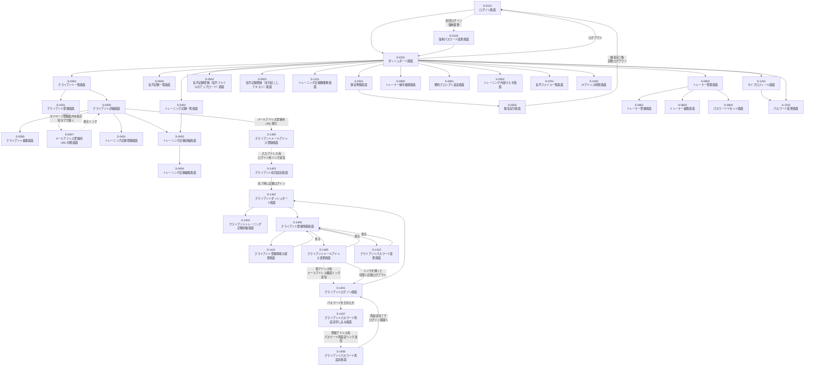

**位置づけ**: 仕様文書（画面設計書）
**対象読者**: 開発者
**上位文書**: requirements.md（7. 画面一覧）
**詳細**: 詳細は doc-index.md を参照

---

# 画面設計書: トレーニング記録管理システム

## 1. 画面遷移図


```mermaid
graph TD
    %% 認証（ログイン）
    S0101[S-0101<br>ログイン画面] --> S0201[S-0201<br>ダッシュボード画面]
    S0101 -.->|初回ログイン<br>強制変更| S0102[S-0102<br>強制パスワード変更画面]
    S0102 --> S0201

    %% クライアント登録・一覧・詳細・編集
    S0201 --> S0304[S-0304<br>クライアント一覧画面]
    S0304 --> S0301[S-0301<br>クライアント登録画面]
    S0304 --> S0305[S-0305<br>クライアント詳細画面]
    S0305 --> S0306[S-0306<br>クライアント編集画面]
    S0305 -->|マイページ登録案内を表示<br>別タブで開く| S0307[S-0307<br>メールアドレス登録用 URL 印刷画面]
    S0307 -.->|戻るリンク| S0305

    %% トレーニング記録登録・詳細・編集
    S0305 --> S0401[S-0401<br>トレーニング記録登録画面]
    S0305 --> S0403[S-0403<br>トレーニング記録詳細画面]
    S0403 --> S0404[S-0404<br>トレーニング記録編集画面]

    %% トレーニング記録一覧
    S0201 --> S0402[S-0402<br>トレーニング記録一覧画面]
    S0402 --> S0403

    %% 音声記録一覧・登録
    S0201 --> S0505[S-0505<br>音声記録一覧画面]
    S0201 --> S0501[S-0501<br>録音準備画面]
    S0501 --> S0502[S-0502<br>録音実行画面]
    S0502 -->|録音完了後<br>自動ログアウト| S0101
    S0201 --> S0504[S-0504<br>音声記録登録（音声ファイルのアップロード）画面]
    S0201 --> S0503[S-0503<br>音声記録登録（文字起こしテキスト）画面]

    %% トレーニング記録数推移画面
    S0201 --> S1101[S-1101<br>トレーニング記録数推移画面]

    %% 【管理者】トレーナー一覧・登録・編集
    S0201 --> S0802[S-0802<br>トレーナー管理画面]
    S0802 --> S0801[S-0801<br>トレーナー登録画面]
    S0802 --> S0803[S-0803<br>トレーナー編集画面]
    S0802 --> S0804[S-0804<br>パスワードリセット画面]
    S0201 --> S0805[S-0805<br>トレーナー操作履歴画面]

    %% 【管理者】要約プロンプト
    S0201 --> S0601[S-0601<br>要約プロンプト設定画面]

    %% 【管理者】マスタ管理
    S0201 --> S0902[S-0902<br>トレーニング内容マスタ画面]

    %% 【システム管理者】音声ファイル一覧
    S0201 --> S0701[S-0701<br>音声ファイル一覧画面]

    %% 【システム管理者】IPアドレス制限
    S0201 --> S1002[S-1002<br>IPアドレス制限画面]

    %% マイプロフィール
    S0201 --> S1201[S-1201<br>マイプロフィール画面]
    S1201 --> S1202[S-1202<br>パスワード変更画面]
    S0201 --> S1202
    S0201 -->|ログアウト| S0101

    %% クライアント閲覧機能（クライアント側）
    S0305 -->|メールアドレス登録用 URL 発行| S1405[S-1405<br>クライアントメールアドレス登録画面]
    S1405 -.->|入力アドレス宛<br>ログイン用リンク送信| S1403[S-1403<br>クライアント初回設定画面]
    S1403 -->|完了時に自動ログイン| S1402[S-1402<br>クライアントダッシュボード画面]
    S1401[S-1401<br>クライアントログイン画面] --> S1402
    S1402 --> S1404[S-1404<br>クライアントトレーニング記録詳細画面]
    S1402 --> S1406[S-1406<br>クライアント登録情報画面]
    S1406 --> S1411[S-1411<br>クライアント登録情報の変更画面]
    S1406 --> S1409[S-1409<br>クライアントメールアドレス変更画面]
    S1406 --> S1410[S-1410<br>クライアントパスワード変更画面]
    S1411 -->|戻る| S1406
    S1409 -.->|新アドレス宛<br>メールアドレス確認リンク送信| S1401
    S1409 -->|リンクを開くと<br>切替＋自動ログアウト| S1401
    S1409 -->|戻る| S1406
    S1410 -->|戻る| S1406
    S1401 -->|パスワードを忘れた方| S1407[S-1407<br>クライアントパスワード再設定申し込み画面]
    S1407 -.->|登録アドレス宛<br>パスワード再設定リンク送信| S1408[S-1408<br>クライアントパスワード再設定画面]
    S1408 -->|再設定完了で<br>ログイン画面へ| S1401
```

---

## 2. 全画面共通

### 2-1. ヘッダー

#### 2-1-1. ナビゲーションメニュー

##### 親メニュー

| 表示順 | 項目 | 遷移先 | アクセス権限 | 備考 |
|------|------|------|---------|---------|
| 1 | システム名 | S-0201 | 一般、管理者、システム管理者 | |
| 2 | クライアント | — | 一般、管理者 | |
| 3 | トレーニング記録 | S-0402 | 一般、管理者 | |
| 4 | メディア | — | 一般、管理者 | |
| 5 | 音声記録 | — | 一般、管理者 | |
| 6 | レポート | — | 一般、管理者 | |
| 7 | 【管理者】 | — | 管理者、システム管理者 | |
| 8 | 【システム管理者】 | — | システム管理者 | |
| 9 | ユーザーメニュー | — | 一般、管理者、システム管理者 | トレーナー名・権限バッジを表示 |

##### サブメニュー：クライアント

| 表示順 | 項目 | 遷移先 | アクセス権限 | 備考 |
|------|------|---------|---------|---------|
| 2-1 | クライアント一覧 | S-0304 | 一般、管理者 | |
| 2-2 | クライアント登録 | S-0301 | 一般、管理者 | |

##### サブメニュー：メディア

| 表示順 | 項目 | 遷移先 | アクセス権限 | 備考 |
|------|------|---------|---------|---------|
| 4-1 | メディア一覧 | S-1302 | 一般、管理者 | |

##### サブメニュー：音声記録

| 表示順 | 項目 | 遷移先 | アクセス権限 | 備考 |
|------|------|---------|---------|---------|
| 5-1 | 音声記録一覧 | S-0505 | 一般、管理者 | |
| — | （区切り） | — | — | |
| — | 音声記録登録（ヘッダー） | — | — | |
| 5-2 | 録音 | S-0501 | 一般、管理者 | |
| 5-3 | 音声ファイル | S-0504 | 一般、管理者 | |
| 5-4 | 文字起こしテキスト | S-0503 | 一般、管理者 | |

##### サブメニュー：レポート

| 表示順 | 項目 | 遷移先 | アクセス権限 | 備考 |
|------|------|---------|---------|---------|
| 6-1 | トレーニング記録数推移 | S-1101 | 一般、管理者 | |

##### サブメニュー：【管理者】

| 表示順 | 項目 | 遷移先 | アクセス権限 | 備考 |
|------|------|---------|---------|---------|
| 7-1 | トレーナー管理 | S-0802 | 管理者、システム管理者 | |
| 7-2 | トレーナー操作履歴 | S-0805 | 管理者 | |
| — | （区切り） | — | — | |
| 7-3 | 要約プロンプト | S-0601 | 管理者 | |
| — | （区切り） | — | — | |
| — | マスタ管理（ヘッダー） | — | — | |
| 7-4 | トレーニング内容 | S-0902 | 管理者 | |

##### サブメニュー：【システム管理者】

| 表示順 | 項目 | 遷移先 | アクセス権限 | 備考 |
|------|------|---------|---------|---------|
| 8-1 | 音声ファイル一覧 | S-0701 | システム管理者 | |
| — | （区切り） | — | — | |
| 8-2 | IPアドレス制限 | S-1002 | システム管理者 | |

##### サブメニュー：ユーザーメニュー

| 表示順 | 項目 | 遷移先 | アクセス権限 | 備考 |
|------|------|---------|---------|---------|
| 9-1 | マイプロフィール | S-1201 | 一般、管理者、システム管理者 | |
| 9-2 | パスワード変更 | S-1202 | 一般、管理者、システム管理者 | |
| 9-3 | ログアウト | S-0101 | 一般、管理者、システム管理者 | |

#### 2-1-2. 表示挙動

トレーナー側のナビゲーションバーは、スクロール時も画面上端に留まる（Bootstrap の `sticky-top`）。一覧・詳細画面は縦に長く、他画面へ移動するために毎回先頭まで戻る操作を省くため。

クライアント側のナビゲーションバーは通常フローのまま（スクロールすると画面外へ流れる）。画面数が少ないため。ナビには**「登録情報」（S-1406 クライアント登録情報画面へ）と「ログアウト」**を配置する（回遊要素は最小限。詳細は `docs/client-portal-design-plan.md` §4-0）。スマートフォンでは折りたたみメニューの中に、「登録情報」と「ログアウト」を並べて置く。

---

### 2-2. フッター

フッターは実装していない。

---

### 2-3. ブラウザタイトル

ブラウザタブに表示される `<title>` は「**画面名 - サフィックス**」形式で統一する。

#### 供給元

| 側 | 対象レイアウト | サフィックス |
|---|---|---|
| トレーナー側 | `layouts/app`・`layouts/guest`・`layouts/error` | `config('app.trainer_portal_name')`（既定値「トレーニング記録管理システム」） |
| クライアント側 | `layouts/client`・`layouts/client-public` | `config('app.client_portal_name')`（既定値「トレーニング記録」。クライアント側プロダクト名の詳細は `docs/client-portal-design-plan.md` §9-1 を参照） |

#### 記述規約

- **画面名は各 Blade の `@section('title', ...)` で機能名のみを渡す**（例: `@section('title', 'クライアント一覧')`）。
- **サフィックスはレイアウト側で `<title>` タグ内に後付けする**。`@section('title', ...)` 側でサフィックスを連結してはならない（連結すると規約から外れた画面ごとに手当てが発生する）。
- `@section('title')` が未指定の画面は、レイアウトの `@hasSection('title')` 分岐によりサフィックスのみを表示する（先頭に「 - 」が付かないこと）。

#### 例外

1. **`recording-v2/session.blade.php`** はレイアウトを継承せず `<title>録音実行</title>` を直書きしている。音声記録機能に属する画面のため、本規約の適用対象外。
2. **ダッシュボード**（トレーナー側 `dashboard.blade.php` / クライアント側 `client/dashboard.blade.php`）は `@section('title', ...)` を渡さず、サフィックスのみを `<title>` に表示する。各ポータルの入口にあたる画面のため、画面名を重ねない。

---

### 2-4. 未入力値の表示

値が未入力・未設定の項目は、表示形式に応じて次のように扱う。

**セル形式（ラベル上・値下）**

- 何も表示しない（ラベルのみ残す）
- セルは最小高さを持つため、値の有無で行高は変わらない
- 対象: `x-detail-cell` を使う箇所（トレーナー側の 3 列グリッド）、およびお客様側の縦一列表示（S-1406 など。`client-portal-design-plan.md` §2-3 参照）、そのほか同形式で直接記述した箇所

**テーブル形式（`<td>`）**

- 「—」（em dash）を表示する
- 空にすると行高が不安定になるため
- 対象: 一覧画面のテーブル、詳細画面の項目テーブル

**本文・自由記述**

- 行ごと非表示にする
- 対象: トレーニング記録タイムラインの記録本文など

---

### 2-5. バッジ

バッジ（`.badge`）は、サイズで重要度を、配色で意味を表す。

**サイズ**

| 種別 | 指定 | 用途 |
|------|------|------|
| 強調バッジ | `fs-6` を付ける | 対応の要否を示す状態表示。見落とすと業務に支障が出るもの |
| 標準バッジ | 指定なし（Bootstrap 既定） | 分類・種別のラベル。読めればよく、目立つ必要がないもの |

**配色**

| 配色 | 意味 | 例 |
|------|------|-----|
| `bg-success` | 正常・完了 | 利用中、未使用（有効なURL） |
| `bg-warning text-dark` | 要対応・注意 | 初回設定待ち、メールアドレス登録待ち |
| `bg-secondary` | 未着手・無効 | メールアドレスなし、使用済み |
| `bg-danger` | 異常・期限切れ | 期限切れ |
| `bg-light text-dark border` | 分類ラベル（意味を持たない） | トレーニング内容 |

**クライアント状態バッジの 4 状態対応**（S-0304・S-0305 で使用）

| バッジ文言 | 配色 | 添え書き（該当時） |
|------|------|------|
| 利用中 | `bg-success` | — |
| 初回設定待ち | `bg-warning text-dark` | 有効期限切れなら「（期限切れ）」を添え、配色を `bg-danger` に切り替える |
| 登録待ち | `bg-warning text-dark` | 有効期限切れなら「（期限切れ）」を添え、配色を `bg-danger` に切り替える |
| なし | `bg-secondary` | — |

**太さ**

Bootstrap 既定（`font-weight: 700`）を使い、個別に変更しない。

※ 本規約は新設・改修する画面から順次適用する。既存バッジの棚卸しは別途行う。

※ クライアントポータル（S-1401〜S-1405）の配色は `docs/client-portal-design-plan.md` §2 のトークンに従い、本表の適用外とする。

---

## 3. 画面詳細

**記載範囲**:
- 本章では、本システムが提供する全画面を列挙する。
- 全画面とは、要件定義書（docs/requirements.md）の7章「画面一覧」で挙げられている画面を指す。
- 各画面のデザイン・インターフェイス・遷移の把握を目的とする。

**参照ルール**:
- 各画面の概要・提供機能・アクセス権限は、要件定義書（docs/requirements.md）の7章「画面一覧」で管理している。本書では同じ画面IDを使用しているため、画面IDで突き合わせて参照すること。

**画面 ID の欠番**:
- **S-0302** — もとから欠番
- **S-0303** — 段階 1 の事前入力 URL 廃止で欠番化（他文書からの参照ずれを防ぐため番号は繰り上げない）
- 画面 ID を新設する場合は既存の欠番を埋めず、末尾に採番する（例：クライアント側は S-1408 が最後、次の空き番号は S-1409）

**記載する項目**: 各画面について、以下の項目を記載する。
- **ワイヤーフレーム**（必須）: 画面の構成要素と配置を示すテキストベースの図。罫線で囲み、ナビゲーションバー・主要な入力欄・ボタン・テーブルなどを記載する。
- **画面項目**（必須）: 画面上で表示・入力する項目の一覧。「項目名」「種類」「必須」「説明」の4列で記載する。テーブル形式の項目は別途列定義表を「列」「種類」「必須」「説明」の4列で記載する。
- **バリデーション**（必須）: 入力チェックとエラーメッセージ。「項目」「チェック内容」「説明」の3列で記載する。チェック不要な場合は「なし」と記載する。
- **状態一覧**（必須）: 画面の表示モードや状態を切り替える場合の各状態の説明。状態の切り替えがない場合は「なし」と記載する。
- **操作フロー**: ワイヤーフレームと画面項目だけでは伝わりにくい画面内の挙動を、ユーザーの操作順に記述する。業務フローは記載しない（業務フローは要件定義書で扱う）。
- **備考**: 業務的・運用的に重要な特記事項がある場合のみ記載。

**必須欄の記号**: 「画面項目」「バリデーション」表の「必須」列では、以下の記号を用いる。

| 記号 | 意味 |
|---|---|
| ● | 必須 |
| ▲ | 条件付き必須（説明欄で条件を「※」付きで明示する） |
| 空欄 | 任意 |

**画面項目の種類**: 各画面の「画面項目」表で使用する「種類」列の値は、以下のいずれかを用いる。

| 種類 | 説明 |
|---|---|
| 表示のみ | 値を表示する（編集不可） |
| テキスト | 1行のテキストを入力する |
| テキストエリア | 複数行のテキストを入力する |
| 数値 | 数値を入力する |
| 日付 | 日付を入力する |
| 時刻 | 時刻を入力する |
| 電話番号 | 電話番号を入力する（数字とハイフン） |
| メールアドレス | メールアドレスを入力する |
| パスワード | パスワードを入力する（入力値はマスク表示） |
| プルダウン | 選択肢から1つを選択する |
| はい／いいえ | フラグのオン／オフを切り替える |
| ファイル選択 | ファイルを選択する |
| ボタン | 操作を実行する |
| リンク | 別画面へ遷移する（テキスト形式） |
| カード | 情報を1単位にまとめて表示する（クリックで遷移する場合あり） |
| テーブル | 複数行のデータを一覧表示する |
| 動的リスト | 行を追加・削除できる入力リスト |
| 画像 | 画像を表示する |

**パスワードの強度**: 
- 8文字以上
- 大文字・小文字・数字・記号をそれぞれ1文字以上含む
- よくあるパスワード（password 等）を禁止


### 3-1. 認証

#### S-0101 ログイン画面

##### ワイヤーフレーム

```
┌─────────────────────────────────────┐
│                                     │
│    トレーニング記録管理システム        │
│                                     │
│   ┌─────────────────────────────┐   │
│   │  ログインID                  │   │
│   └─────────────────────────────┘   │
│   ┌─────────────────────────────┐   │
│   │  パスワード                  │   │
│   └─────────────────────────────┘   │
│                                     │
│             [ログイン]               │
│                                     │
└─────────────────────────────────────┘
```

##### 画面項目

| 項目名 | 種類 | 必須 | 説明 |
|--------|------|------|------|
| ログインID | テキスト | ● | ログインするためのID |
| パスワード | パスワード | ● | パスワード。入力値はマスク表示 |
| ログイン | ボタン |  | 入力情報でログインを実行する |

##### バリデーションチェック

| 項目 | チェック内容 | 説明 |
|------|-------------|-----------------|
| — | 認証失敗 | 「ログインIDまたはパスワードが正しくありません」 |
| — | アカウントロック | 「アカウントがロックされています。管理者に連絡してください」 |
| — | アカウント無効 | 「アカウントが無効化されています。管理者に連絡してください」 |

##### 状態一覧

なし

---

#### S-0102 強制パスワード変更画面

##### ワイヤーフレーム

```
┌─────────────────────────────────────────┐
│ [ナビゲーションバー]                     │
├─────────────────────────────────────────┤
│                                         │
│  パスワード変更        [更新]  │
│                                         │
│  初回ログインのため、パスワードを          │
│  変更してください。                      │
│                                         │
│  新しいパスワード：                      │
│  [                                    ] │
│  新しいパスワード（確認）：               │
│  [                                    ] │
│                                         │
└─────────────────────────────────────────┘
```

##### 画面項目

| 項目名 | 種類 | 必須 | 説明 |
|--------|------|------|------|
| 更新 | ボタン |  | パスワードを変更 |
| 新しいパスワード | パスワード | ● | |
| 新しいパスワード（確認） | パスワード | ● | 確認用に新しいパスワードを再入力 |

##### バリデーションチェック

| 項目 | チェック内容 | 説明 |
|------|-------------|-----------------|
| 新しいパスワード（確認） | 一致チェック | 「新しいパスワード（確認）が一致しません」 |

##### 状態一覧

なし

---

#### S-0103 セッション期限切れエラーページ

##### ワイヤーフレーム

```
┌──────────────────────────────────────────────┐
│                                              │
│  ┌────────────────────────────────────────┐  │
│  │ セッションの有効期限が切れました          │  |
│  ├────────────────────────────────────────┤  │
│  │ 419 Page Expired                       │  │
│  │                                        │  │
│  │ しばらく操作がなかったため、セッション    │  │
│  │ の有効期限が切れました。                 │  │
│  │ 再度ログインしてください。               │  │
│  │                                        │  │
│  └────────────────────────────────────────┘  │
│                                              │
└──────────────────────────────────────────────┘
```

##### 画面項目

なし

##### バリデーションチェック

なし

##### 状態一覧

なし

##### 備考

- 独立したURLは持たず、419エラー時に Laravel が `resources/views/errors/419.blade.php` を自動表示する（ルーティング設定不要）
- 共通ナビ（トレーナー用/クライアント用ヘッダー）を持たない中立レイアウト（`layouts.error`）を使用する。ログイン中ユーザーに依存する表示を含まないため、トレーナー・クライアントいずれの認証状態でも同一表示となる

---

#### S-0104 アクセス禁止エラーページ

##### ワイヤーフレーム

```
┌──────────────────────────────────────────────┐
│                                              │
│  ┌────────────────────────────────────────┐  │
│  │ アクセス拒否                            │  |
│  ├────────────────────────────────────────┤  │
│  │ 403 Forbidden                          │  │
│  │                                        │  │
│  │ {$exception->getMessage() ?:           │  │
│  │  「このページへのアクセスは許可されて     │  │
│  │   いません。」}                         │  │
│  │                                        │  │
│  └────────────────────────────────────────┘  │
│                                              │
└──────────────────────────────────────────────┘
```

##### 画面項目

なし

##### バリデーションチェック

なし

##### 状態一覧

なし

##### 備考

- 独立したURLは持たず、403ステータス時に Laravel が `resources/views/errors/403.blade.php` を自動表示する
- 主な発生源は IP制限ミドルウェア（`CheckIpRestriction`）、管理者専用ルート（`AdminMiddleware`）、コントローラ内の `abort(403, ...)` 呼び出し
- 共通ナビ（トレーナー用/クライアント用ヘッダー）を持たない中立レイアウト（`layouts.error`）を使用する。ログイン中ユーザーに依存する表示を含まないため、トレーナー・クライアントいずれの認証状態でも同一表示となる

---

### 3-2. ダッシュボード

#### S-0201 ダッシュボード画面

##### ワイヤーフレーム

```
┌────────────────────────────────────────────────────────────────────────────────────────────┐
│ [ナビゲーションバー]                                                                         │
├────────────────────────────────────────────────────────────────────────────────────────────┤
│                                                                                            │
│  ようこそ、佐藤さん。（権限: 管理者）                                                         │
│                                                                                            │
│  ■ 主担当クライアント一覧                                                            全N件     │
│  ┌───────┬──────────┬──────────────┬──────────┬──────────┐  │
│  │内部ID │ 名前      │ 最終記録日    │ 担当1  │ 担当2  │  │
│  ├───────┼──────────┼──────────────┼──────────┼──────────┤  │
│  │26001  │ 山田太郎  │ 2026年1月15日│ 佐藤     │ 田中    │  │
│  │26007  │ 鈴木花子  │ 2026年2月10日│ 佐藤     │ —       │  │
│  └───────┴──────────┴──────────────┴──────────┴──────────┘  │
│                                                                                              │
└──────────────────────────────────────────────────────────────────────────────────────────────┘
```

##### 画面項目

| 項目名 | 種類 | 必須 | 説明 |
|--------|------|------|------|
| ウェルカムメッセージ | 表示のみ |  | 「ようこそ、○○さん。（権限: [権限名]）」形式 |
| 主担当クライアント一覧 | テーブル |  | ログインしているトレーナーが主担当のクライアントを表示。最終記録日が新しい順（降順）。最大10件表示。見出し右に「全N件」を表示し、10件超の場合は「すべて表示」リンク（クライアント一覧画面（S-0304）へ遷移）を表示。データなし時は「主担当のクライアントはありません」と表示 |

**主担当クライアント一覧（テーブル）**

| 列 | 種類 | 説明 |
|------|------|------|
| 内部ID | リンク | クライアント詳細画面（S-0305）に遷移 |
| 名前 | テキスト | クライアントの姓名を表示 |
| 最終記録日 | リンク | 最終トレーニングの日付。最終トレーニングのトレーニング記録詳細画面（S-0403）に遷移 |
| 担当1 | テキスト | 最終トレーニングの「担当1」。トレーニング記録がない場合は「—」と表示 |
| 担当2 | テキスト | 最終トレーニングの「担当2」。トレーニング記録がない場合は「—」と表示 |

##### バリデーションチェック

なし

##### 状態一覧

なし

---

### 3-3. クライアント管理

#### S-0301 クライアント登録画面

##### ワイヤーフレーム

```
┌──────────────────────────────────────────────┐
│ [ナビゲーションバー]                          │
├──────────────────────────────────────────────┤
│                                              │
│  クライアント登録         [キャンセル] [登録]  │
│                                              │
│  ┌─ 基本情報 ──────────────────────────────┐ │
│  │ 初回日：[    ] / 主担当                  │ │
│  │ 姓/ 名/ せい/ めい                       │ │
│  └──────────────────────────────────────── ┘ │
│                                              │
│  ┌─ 連絡先 ────────────────────────────────┐ │
│  │ 郵便番号 [住所検索]                       │ │
│  │ 都道府県 / 市区町村 / 町名・番地 / 建物名  │ │
│  │ 電話1～2                                  │ │
│  └──────────────────────────────────────── ┘ │
│                                              │
│  [キャンセル]  [登録]                        │
│                                              │
└──────────────────────────────────────────────┘
```

##### 画面項目

| 項目名 | 種類 | 必須 | 説明 |
|--------|------|------|------|
| キャンセル | ボタン |  | クライアント一覧画面（S-0304）に戻る |
| 登録 | ボタン |  | クライアント情報を登録し、クライアント詳細画面（S-0305）へ遷移 |

###### セクション1: 基本情報

| 項目名 | 種類 | 必須 | 説明 |
|--------|------|------|------|
| 初回日 | 日付 | ● | デフォルト値なし（空欄）。過去日を入力することが多く、既定値の修正漏れによる誤登録を防ぐため |
| 主担当 | プルダウン |  | 表示順のトレーナー一覧から選択（システム管理者は対象外） |
| 姓 | テキスト | ● | |
| 名 | テキスト |  | |
| せい | テキスト |  | |
| めい | テキスト |  | |

###### セクション2: 連絡先

| 項目名 | 種類 | 必須 | 説明 |
|--------|------|------|------|
| 郵便番号 | テキスト |  | |
| 住所検索 | ボタン |  | 郵便番号から都道府県・市区町村・町名を自動入力 |
| 都道府県 | プルダウン |  | 47都道府県 |
| 市区町村 | テキスト |  | |
| 町名・番地 | テキスト |  | |
| 建物名・部屋番号 | テキスト |  | |
| 電話番号 | 電話番号 |  | |
| 電話番号（予備） | 電話番号 |  | |

- メールアドレスはクライアント自身がメールアドレス登録用 URL から登録する。トレーナー登録画面には入力項目として置かない

##### バリデーションチェック

| 項目 | チェック内容 | 説明 |
|------|-------------|-----------------|
| せい | ひらがなチェック | 「せいはひらがなで入力してください」 |
| めい | ひらがなチェック | 「めいはひらがなで入力してください」 |
| 電話番号 | 数字とハイフンのみ | 「電話番号の形式が正しくありません」 |
| 電話番号（予備） | 数字とハイフンのみ | 「電話番号（予備）の形式が正しくありません」 |
| 郵便番号 | 7桁（ハイフンあり/なし両対応） | 「郵便番号の形式が正しくありません」 |

##### 備考

内部IDは登録時に自動採番されるため、入力欄はない。

##### 状態一覧

なし

---

#### S-0304 クライアント一覧画面

##### ワイヤーフレーム

```
┌─────────────────────────────────────────────────┐
│ [ナビゲーションバー]                             │
├─────────────────────────────────────────────────┤
│                                                 │
│  クライアント一覧                                │
│                                                 │
│  内部ID：[          ]                           │
│  名前：[          ] ※部分一致                  │
│  最終記録日：[    ] ～ [    ]                   │
│  主担当：[すべて ▼]                             │
│                                                 │
│  [検索]  [クリア]                                │
│                                                 │
│  25件                              [新規登録]  │
│  ┌──┬────┬────┬────────────────┬────┬──────┐ │
│  │ID│名前│かな│ メールアドレス │主担当│最終記録日│ │
│  ├──┼────┼────┼────────────────┼────┼──────┤ │
│  │1│山田太郎│やまだ│    [利用中]    │佐藤│2026/3/10│ │
│  │2│鈴木花子│すずき│ [初回設定待ち] │田中│2026/2/15│ │
│  │3│田村一郎│たむら│     [なし]     │佐藤│—       │ │
│  │...│    │    │                │    │        │ │
│  └──┴────┴────┴────────────────┴────┴──────┘ │
│                                                 │
│  [< 前へ]  1 2 3  [次へ >]                      │
│                                                 │
└─────────────────────────────────────────────────┘
```

##### 画面項目

###### 検索条件部

| 項目名 | 種類 | 必須 | 説明 |
|--------|------|------|------|
| 内部ID | テキスト |  | 内部IDの部分一致で検索 |
| 名前 | テキスト |  | 姓名・かなの部分一致で検索 |
| 最終記録日（開始） | 日付 |  | 期間指定の開始日。最終日が未指定の場合は指定日以降のクライアントを表示 |
| 最終記録日（終了） | 日付 |  | 期間指定の終了日。開始日が未指定の場合は指定日以前のクライアントを表示 |
| 主担当 | プルダウン |  | すべて／トレーナー一覧から選択 |
| 検索 | ボタン |  | 検索条件で検索を実行 |
| クリア | ボタン |  | 検索条件をリセットし、結果もクリア |

###### 検索結果部

| 項目名 | 種類 | 必須 | 説明 |
|--------|------|------|------|
| 新規登録 | ボタン |  | クライアント登録画面（S-0301）へ遷移 |
| 件数表示 | 表示のみ |  | 「N件」形式 |
| クライアント一覧 | テーブル |  | 行クリックでクライアント詳細画面（S-0305）へ遷移。1ページ20件表示で、件数が20件を超える場合はページネーション（前へ／ページ番号／次へ）を表示 |

**クライアント一覧（テーブル）**

列は左から順に、内部ID / 名前 / かな / メールアドレス / 主担当 / 最終記録日 の 6 列で構成する。

| 列 | 種類 | 説明 |
|------|------|------|
| 内部ID | 表示のみ | 数値順でソート可能 |
| 名前 | 表示のみ | 「姓・名」を表示。五十音順でソート可能 |
| かな | 表示のみ | 「せい・めい」を表示。五十音順でソート可能 |
| メールアドレス | 表示のみ | クライアントの状態を表す 4 状態バッジ（なし／登録待ち／初回設定待ち／利用中）だけを表示し、**メールアドレスの値そのものは出さない**（列名で対象が分かり、バッジで状態が分かるため）。判定はメールアドレス・パスワード・メールアドレス登録用トークンの有無から導出し、有効期限が切れている場合は「（期限切れ）」を添える。判定の順序は S-0305 の状態一覧を参照。**カラムを持たないため並び替え・絞り込みの対象にしない**（絞り込みの追加は次回のレビュー後に検討） |
| 主担当 | 表示のみ |  |
| 最終記録日 | 表示のみ | 直近のトレーニング記録の日付 |

##### バリデーションチェック

| 項目 | チェック内容 | 説明 |
|------|-------------|-----------------|
| 最終記録日（開始）、最終記録日（終了） | 開始日 ≦ 終了日チェック | 「開始日は終了日以前の日付を指定してください」 |

##### 状態一覧

なし

---

#### S-0305 クライアント詳細画面

##### ワイヤーフレーム

```
┌──────────────────────────────────────────────────────────────────┐
│ [ナビゲーションバー]                                              │
├──────────────────────────────────────────────────────────────────┤
│                                                                  │
│ ┌─ ヘッダーサマリー ─────────────────────────────────────────┐  │
│ │   [« クライアント一覧へ戻る]  <状態別ボタン>  [編集] [削除]              │
│ │      ↑ 状態別ボタンは基本 1 つ、登録待ち（期限内）だけ表示＋取消の 2 つ並ぶ    │
│ │                                                              │  │
│ │ 山田 太郎（やまだ たろう）                  内部ID  0001    │  │
│ │ ──────────────────────────────────────────────────────────── │  │
│ │  初回日       │  主担当    │  メールアドレス                  │  │
│ │  2026/01/20   │  佐藤      │  taro@example.com  [利用中]      │  │
│ └──────────────────────────────────────────────────────────────┘  │
│                                                                  │
│ ┌──────────────────────────────────┬────────────────────────┐  │
│ │ トレーニング記録（12件）         │ （予備カード：将来拡張用）│  │
│ │                       [新規登録] │                          │  │
│ │ ┌─ スクロール領域 max-height 60vh ┐│                          │  │
│ │ │                                 ││                          │  │
│ │ │ ● 2026/03/10 14:00  [就労TR]  ││                          │  │
│ │ │ │   担当: 佐藤・田中             ││                          │  │
│ │ │ │   本日はストレッチ後、就労…    ││                          │  │
│ │ │ │                                ││                          │  │
│ │ │ ● 2026/02/15 10:30  [生活TR]  ││                          │  │
│ │ │ │   担当: 田中                    ││                          │  │
│ │ │ │   家事動作の確認を実施…        ││                          │  │
│ │ │ │                                ││                          │  │
│ │ │ ● 2026/01/20 09:00  [心理TR]  ││                          │  │
│ │ │     担当: 佐藤                    ││                          │  │
│ │ │     初回面談。生育歴の…            ││                          │  │
│ │ └────────────────────────────────┘│                          │  │
│ └──────────────────────────────────┴────────────────────────┘  │
│                                                                  │
│ ┌─ 連絡先 ────────────────────────────────────────────────┐    │
│ │  郵便番号        │  住所            │                    │    │
│ │  123-4567        │  東京都新宿区…    │                    │    │
│ │                  │                  │                    │    │
│ │  電話番号        │  電話番号（予備）│                    │    │
│ │  090-0000-0000   │  03-0000-0000    │                    │    │
│ └──────────────────────────────────────────────────────────┘    │
│                                                                  │
│                       最終更新: 2026/03/10 14:30 佐藤            │
│                                                                  │
└──────────────────────────────────────────────────────────────────┘
```

**レイアウト方針**
- ヘッダーサマリー・2カラム本体・連絡先カード・最終更新の 4 ブロックで構成する
- 2カラム本体は Bootstrap グリッドで左 `col-lg-8`（トレーニング記録）／右 `col-lg-4`（予備カード）に分ける。`lg` 未満では縦積みとする
- 最終記録日は表示しない
- **状態別のボタンは 1 段目に基本 1 つだけ表示する**。ただし**「メールアドレス登録待ち（期限内）」のときだけ「マイページ登録案内を表示」と「マイページ登録案内を取消」が並んで 2 つ表示される**（表示と取消は性質の違う操作 — 渡す／やめる — で、どちらも必要なため）。「クライアント一覧に戻る」「編集」「削除」は状態にかかわらず常に表示する。状態と表示ボタンの対応は本節「1 段目 操作ボタン群」参照。**期限切れは未発行と同じ扱い**にし、期限切れの URL 情報を画面に出さない
- 「マイページ登録案内を発行」ボタンは**押すと発行してこの詳細画面に戻り、完了メッセージを表示する**（モーダルは開かない）。発行後、ボタンは「マイページ登録案内を表示」に入れ替わる（状態が「登録待ち（期限内）」になるため）。URL 文字列・QR コード・有効期限などの提示は **S-0307 印刷ページ**に任せ、詳細画面と印刷ページで同じ情報を二重に持たない。渡す紙面や画面は、続けて「マイページ登録案内を表示」を押して**別タブで開く**（発行後の自動遷移は行わない — 過去に同タブ遷移・自動別タブの 2 案を試したが不採用の経緯あり。requirements.md 6-3-6 備考を参照）
- 「メールアドレスを削除」ボタンは**利用中のときだけ表示**する（頻度が低く影響が大きい操作のため、確認モーダルを挟む）
- 状態バッジは**3段目のメールアドレスの値の右**に配置する（値とバッジを横に並べる）。4 状態（メールアドレスなし／メールアドレス登録待ち／初回設定待ち／利用中）を表示し、有効期限が切れている場合は「（期限切れ）」を添える。配色は §2-5 のバッジ規約に従う。**メールアドレスの位置に置く理由**：バッジが示しているのはメールアドレスとパスワードの登録状況であり、氏名とは関係がないため、対象項目の近くに置いて示唆を明確にする。メールアドレスが未登録のときは値がなく、バッジだけが同じ位置に表示される（値の欠落を状態表示で補完する）

##### 画面項目

| 項目名 | 種類 | 必須 | 説明 |
|--------|------|------|------|
| ←クライアント一覧へ戻る | ボタン |  | クライアント一覧画面（S-0304）へ遷移 |
| マイページ登録案内を発行 | ボタン |  | **状態が「メールアドレスなし」または「メールアドレス登録待ち（期限切れ）」のときのみ表示**。押下でその場で発行し、この詳細画面に戻って完了メッセージを表示する（モーダルは開かない）。発行し直しの用途では表示しない（期限切れは未発行と同じ扱い） |
| マイページ登録案内を表示 | ボタン |  | **状態が「メールアドレス登録待ち（期限内）」のときのみ表示**。押下で S-0307 メールアドレス登録用 URL 印刷画面を**別タブで開く**。URL 文字列・QR コード・有効期限・手順は開いた先で確認する。**このボタン名にした理由**：押す目的が「お客様に渡すものを出す」ことであり、開いた先の見出し「マイページ登録のご案内」と一致させるため（QR コードだけを見せて渡すこともあるので、「印刷」という言葉は実態から外れる） |
| マイページ登録案内を取消 | ボタン |  | **状態が「メールアドレス登録待ち（期限内）」のときのみ表示**。「マイページ登録案内を表示」と並べて表示する。押下時、確認モーダル（S-0305-M03）を開き「発行済みのマイページ登録案内が使えなくなります。すでにお渡しした案内からは登録できなくなります。」を提示。承諾で対象クライアントの未使用の `client_email_registration_tokens` を物理削除し、発行前の状態（メールアドレスなし）に戻す。**クライアント情報とトレーニング記録には触らない**（6-3-7 参照） |
| メールアドレスを削除 | ボタン |  | 状態が「利用中」のときのみ表示。押下時、確認画面（「このお客様はログインできなくなります。クライアント情報とトレーニング記録は残ります」）を経て、メールアドレスとパスワードを消し、送信済みのメールアドレス登録用 URL・ログイン用リンクも無効化する（6-3-8 参照） |
| 編集 | ボタン |  | クライアント編集画面（S-0306）へ遷移 |
| 削除 | ボタン |  | クライアント情報を削除。管理者のみ表示。確認ダイアログ付き |
| 状態バッジ | 表示のみ |  | 4 状態（なし／登録待ち／初回設定待ち／利用中）を**3段目のメールアドレスの値の右**に表示。有効期限切れは「（期限切れ）」を添える。判定順序は本画面「状態一覧」を参照 |
| 最終更新 | 表示のみ |  | クライアント情報の最終更新日時・最終更新トレーナー。画面右下に小さく表示 |

###### セクション1: ヘッダーサマリー

以下の 3 段構成で 1 つのカード内に収める。

- 1段目: 操作ボタン群（右寄せ）
- 2段目: 氏名・内部ID
- 3段目: 属性 3 列（`border-top` で区切る）

**1段目（操作ボタン群）**

`[« クライアント一覧へ戻る]  <状態別ボタン>  [編集] [削除]` の順で、カード上部に右寄せで配置する。**状態別ボタンは基本 1 つだけ**（クライアントの状態に応じて次表のいずれかが出るか、初回設定待ちでは何も出ない）。ただし**「メールアドレス登録待ち（期限内）」のときだけ「マイページ登録案内を表示」と「マイページ登録案内を取消」の 2 つが並ぶ**（表示と取消は性質の違う操作 — 渡す／やめる — で、どちらも必要なため）。

**状態と状態別ボタンの対応**

| 状態 | 表示するボタン |
|------|------|
| メールアドレスなし | マイページ登録案内を発行 |
| メールアドレス登録待ち（期限内） | マイページ登録案内を表示 ＋ マイページ登録案内を取消 |
| メールアドレス登録待ち（期限切れ） | マイページ登録案内を発行 |
| 初回設定待ち | なし |
| 利用中 | メールアドレスを削除 |

**期限切れは未発行と同じ扱い**にする（トレーナー側から見て「新規に発行する必要がある」状況で変わらないため）。期限切れの URL 情報は画面に出さない。

**ボタンの説明**

| 項目名 | 種類 | 説明 |
|--------|------|------|
| マイページ登録案内を発行 | ボタン | 状態が「メールアドレスなし」または「メールアドレス登録待ち（期限切れ）」のとき表示。押下でその場で発行し、**この詳細画面に戻って完了メッセージを表示する**（モーダルは開かない）。発行後は状態が「登録待ち（期限内）」に変わり、ボタンが「マイページ登録案内を表示」に入れ替わる。URL 文字列・QR コード・有効期限は印刷ページ（S-0307）に集約する。発行後の自動遷移は行わない（過去に同タブ遷移・自動別タブの 2 案を試したが不採用の経緯あり — requirements.md 6-3-6 備考参照） |
| マイページ登録案内を表示 | ボタン | 状態が「メールアドレス登録待ち（期限内）」のとき表示。押下で **S-0307 メールアドレス登録用 URL 印刷画面**を**別タブで開く**。QR・URL・手順・有効期限を確認できる。**このボタン名にした理由**：押す目的が「お客様に渡すものを出す」ことであり、開いた先の見出し「マイページ登録のご案内」と一致させるため。**期限内の再発行の機能は用意しない**（URL がまだ使えるので同じ URL を渡し直せば足りるため） |
| マイページ登録案内を取消 | ボタン | **状態が「メールアドレス登録待ち（期限内）」のときだけ表示**。「マイページ登録案内を表示」と並べて配置する。押下時、確認モーダル（S-0305-M03）を開き「発行済みのマイページ登録案内が使えなくなります。すでにお渡しした案内からは登録できなくなります。」を提示。承諾で対象クライアントの未使用の `client_email_registration_tokens` を物理削除し、発行前の状態（メールアドレスなし）に戻す。ボタンの見た目は取り消しであることが伝わる `btn btn-outline-danger`（メールアドレスを削除と同じ見せ方）。**期限切れのときは表示しない**（もう使えない案内を取り消す意味がないため。6-3-7 参照） |
| メールアドレスを削除 | ボタン | **状態が「利用中」のときだけ表示**。押下時、確認モーダル（S-0305-M02）を開き「このお客様はログインできなくなります。クライアント情報とトレーニング記録は残ります」を提示。承諾で clients.email と clients.password を null にし、有効な `client_email_registration_tokens` と `client_login_link_tokens`（未使用分）を物理削除する（6-3-8 参照） |

**2段目（氏名行）**

| 項目名 | 種類 | 説明 |
|--------|------|------|
| 氏名 | 表示のみ | 「姓 名」を大きめの見出しとして表示。ふりがなを続けて薄いグレーの括弧書きで併記（例：「山田 太郎（やまだ たろう）」）。ふりがなが未登録の場合は括弧ごと省略 |
| 内部ID | 表示のみ | 氏名の右に「内部ID」ラベル（小さいグレー文字）と値を等幅フォントで表示 |

**3段目（属性の列。Bootstrap グリッドで `col-md-4` の 3 列。`md` 未満では縦積み）**

| 項目名 | 種類 | 説明 |
|--------|------|------|
| 初回日 | 表示のみ | `Y/m/d` 形式 |
| 主担当 | 表示のみ | 主担当トレーナー名 |
| メールアドレス | 表示のみ | クライアント閲覧機能のログイン ID を兼ねる。クライアント自身がメールアドレス登録用 URL から登録するため、トレーナー画面では表示のみ（入力・書き換え不可）。**値の右に状態バッジを横に並べて表示**する（値が未登録のときはバッジだけが表示される）。状態バッジの文言・配色は下の「状態バッジ」行を参照 |
| 状態バッジ | 表示のみ | 3段目のメールアドレスの値の右に、**Bootstrap の標準サイズのバッジ**（`fs-6` は付けない）で並べて表示。文言は 4 種のいずれか（なし／登録待ち／初回設定待ち／利用中）。有効期限が切れている場合は「（期限切れ）」を添え、配色を `bg-danger` にする。配色対応は §2-5 を参照。**メールアドレスの隣に置く理由**：バッジが示しているのはメールアドレスとパスワードの登録状況であり、氏名とは関係がないため、対象項目の近くに置く。**バッジ文言を短くする理由**：バッジは 3 段目のラベル「メールアドレス」の内側に位置するため、文言に「メールアドレス」を重ねると冗長になる。列名・ラベルで対象が分かるので、バッジは状態部分だけで足りる。**標準サイズにする理由**：メールアドレスの値が主役で、バッジは状態を添える役割のため、値より小さめの標準サイズに合わせる（`fs-6` は氏名の見出しと並んだ旧位置での大きさで、値と並ぶ 3 段目では大きすぎた） |

###### セクション2: トレーニング記録（タイムライン）

左カラム（`col-lg-8`）に配置する。カードヘッダーはスクロール領域の外に固定し、「トレーニング記録（N件）」の見出しと `[新規登録]` ボタンを常に表示する。

| 項目名 | 種類 | 必須 | 説明 |
|--------|------|------|------|
| 新規登録 | ボタン |  | トレーニング記録登録画面（S-0401）へ遷移。クライアントが自動選択済み |
| トレーニング記録タイムライン | タイムライン |  | 「日付」「時刻」が新しい順（降順）で並べる。カード内のスクロール領域は `max-height: 60vh`、収まらない場合のみ縦スクロール。データなし時は「トレーニング記録はありません」と表示 |

**タイムラインブロック（1件あたり）**

各ブロックは縦線上の点マーカー付きで配置し、ブロック全体がクリック可能。押下でトレーニング記録詳細画面（S-0403）へ遷移する。

| 行 | 項目 | 説明 |
|----|------|------|
| 1 | 日付 + 時刻 + トレーニング内容バッジ | 例：「2026/03/10 14:00  [就労トレーニング]」。日付が今日より未来の場合は日付を青色（`text-primary`）で表示し、予約・予定のトレーニングと視覚的に区別する。時刻が未登録の場合は日付のみ |
| 2 | 担当 | 「担当1・担当2」を中黒（`・`）で連結して表示（例：「担当: 佐藤・田中」）。担当1・担当2の両方が空の場合はこの行ごと非表示 |
| 3 | トレーニング記録本文 | `record_content` を表示。改行は `white-space: pre-wrap` で保持。空欄の場合は行ごと非表示 |

メディア件数・所感（impression）はタイムラインには表示しない。

**タイムラインの配色・寸法**

| 要素 | 仕様 |
|------|------|
| 縦線 | 色 `#dee2e6`、幅 2px。ブロック群の左側に垂直に走る |
| 点マーカー | 直径 10px、塗りは Bootstrap のプライマリ配色（`--bs-primary`）、縦線上に配置 |
| ブロック枠 | 各ブロックのカード枠線色 `#dee2e6`。マウスホバー時は薄い背景色（`#f8f9fa`）でクリック可能を示唆 |
| ブロック間隔 | 上下に 1rem 程度の余白を確保 |

###### セクション3: 予備カード

右カラム（`col-lg-4`）に配置する。現時点で表示する項目は無く、カード枠のみを用意する（将来の拡張、たとえば犬エンティティなどに使用する想定）。カードヘッダーおよびカード本文の初期テキストは実装時に決定する。

###### セクション4: 連絡先

カード形式で常時展開表示する。アコーディオンによる折りたたみ機能および「入力あり／入力なし」バッジは設けない。連絡先セクションは独立コンポーネント化しない。

**表示形式**

各項目は「ラベル上（小さいグレー文字）・値下」のセルとし、Bootstrap グリッド `col-6 col-md-4`（モバイル 2 列 / `md` 以上で 3 列）で並べる。値が空でも行高が変わらないよう、値部には最小高さを持たせる。ヘッダーサマリー3段目の属性表示と同じ見た目にする。

**項目の並び（`md` 以上・3 列 × 2 行）**

| 1 列目 | 2 列目 | 3 列目 |
|--------|--------|--------|
| 郵便番号 | 住所 | （空き） |
| 電話番号 | 電話番号（予備） | （空き） |

**画面項目**

| 項目名 | 種類 | 必須 | 説明 |
|--------|------|------|------|
| 郵便番号 | 表示のみ |  | ハイフン付きで表示（例：「123-4567」） |
| 住所 | 表示のみ |  | 「都道府県」「市区町村」「町名・番地」を区切りなしで連結し、「建物名・部屋番号」がある場合は半角スペースで区切って続ける（例：「東京都新宿区西新宿1-2-3 ○○ビル301」）。一部のみ登録の場合は登録されている項目のみを連結し、余分な区切り文字が残らないようにする |
| 電話番号 | 表示のみ |  |  |
| 電話番号（予備） | 表示のみ |  |  |

メールアドレスは本セクションでは扱わない。ヘッダーサマリーの 3 段目に置く（クライアント自身が登録する項目で、トレーナーが見るのは「登録済みかどうか」を確かめる位置付けが強いため）。

##### モーダル

###### S-0305-M02 メールアドレス削除確認モーダル

「メールアドレスを削除」ボタンから開く。**状態が「利用中」のときのみ開ける**。

| 項目名 | 種類 | 説明 |
|--------|------|------|
| 説明文 | 表示のみ | 「このお客様はログインできなくなります。クライアント情報とトレーニング記録は残ります」 |
| 削除する | ボタン | 押下で `DELETE /clients/{client}/email` を呼ぶ。押下後は S-0305 に戻し完了メッセージを表示 |
| キャンセル | ボタン | モーダルを閉じる |

###### S-0305-M03 マイページ登録案内取消確認モーダル

「マイページ登録案内を取消」ボタンから開く。**状態が「メールアドレス登録待ち（期限内）」のときのみ開ける**。**見せ方は S-0305-M02 に合わせる**（説明文・実行ボタン `btn btn-danger`・キャンセルボタンの構成）。

| 項目名 | 種類 | 説明 |
|--------|------|------|
| 説明文 | 表示のみ | 「発行済みのマイページ登録案内が使えなくなります。すでにお渡しした案内からは登録できなくなります。」 |
| 取り消す | ボタン | 押下で `DELETE /clients/{client}/email-registration-tokens` を呼ぶ。押下後は S-0305 に戻し完了メッセージ「マイページ登録案内を取り消しました。」を表示 |
| キャンセル | ボタン | モーダルを閉じる |

##### 状態一覧

状態は、メールアドレス・パスワード・**メールアドレス登録用トークン**（`client_email_registration_tokens`）の有無から導出する。カラムを持たないため、次の**判定順序**を上から順に評価し、最初に一致した状態を採用する（同時に複数当てはまるケースがあるため順序が必要）。

**判定順序**

1. `clients.password` が非 NULL → **利用中**
2. `clients.email` が非 NULL（`password` は NULL） → **初回設定待ち**（有効なメールアドレス登録用 URL が同時に存在しても、こちらを優先）
3. `clients.email` が NULL かつ、対象クライアントの `client_email_registration_tokens` に `is_used = false` の行がある → **メールアドレス登録待ち**（`expires_at` は問わない。期限切れの未使用トークンだけを持つ場合もこの状態）
4. 上記いずれにも当てはまらない → **メールアドレスなし**

**期限切れの添え書き**は、状態が「初回設定待ち」または「メールアドレス登録待ち」のとき、**対応するメールアドレス登録用トークン（`client_email_registration_tokens`）の最新 1 件の `expires_at` が `now()` を過ぎているか**で判定する。ログイン用リンク（`client_login_link_tokens`）の `expires_at` は参照しない（発行し直し直後はログイン用リンクが未生成のため、判定基準にできない。設計方針上、ログイン用リンクは登録用トークンの期限を引き継ぐだけの存在）。

- 対象クライアントに対応するメールアドレス登録用トークンが 1 件も存在しない場合（直接データを操作した等の想定外ケース）は、**期限切れとして扱う**

**判定のクエリ例**（Eloquent）：

有効・期限切れの区別を明示するために、`client_email_registration_tokens` を **「有効（未使用かつ期限内）」** と **「未使用トークンの最新期限」** の 2 軸で先読みする。行ごとに個別クエリを発行しない（N+1 を避ける）。

```php
// 一覧・詳細で共通に使う想定。1 クエリで状態導出に必要な 2 値を持たせる
$clients = Client::query()
    ->addSelect([
        // 「有効な（未使用・期限内の）メールアドレス登録用トークンの有無」= 1 or 0
        'has_active_email_reg_token' => ClientEmailRegistrationToken::selectRaw('1')
            ->whereColumn('client_id', 'clients.id')
            ->where('is_used', false)
            ->where('expires_at', '>', now())
            ->limit(1),
        // 「最新の未使用トークンの期限」= 期限切れかどうかの判定に使う
        'latest_email_reg_expires_at' => ClientEmailRegistrationToken::select('expires_at')
            ->whereColumn('client_id', 'clients.id')
            ->where('is_used', false)
            ->orderByDesc('id')
            ->limit(1),
    ])
    ->get();

// ステータス導出（アクセサ or Enum ヘルパで表現）
foreach ($clients as $c) {
    if ($c->password !== null) {
        $status = 'in_use';                    // 利用中
    } elseif ($c->email !== null) {
        $status = 'awaiting_setup';            // 初回設定待ち
    } elseif ($c->latest_email_reg_expires_at !== null) {
        $status = 'awaiting_email';            // メールアドレス登録待ち
    } else {
        $status = 'no_email';                  // メールアドレスなし
    }

    // 期限切れの添え書き（有効なトークンが 1 件もない場合に付ける）
    $isExpired = in_array($status, ['awaiting_setup', 'awaiting_email'], true)
        && ! $c->has_active_email_reg_token;
}
```

**状態一覧**

| 状態 | 判定 | バッジ文言 | 配色 | 操作ボタンの出方 |
|------|------|------|------|------|
| 利用中 | `password` が非 NULL | 利用中 | `bg-success` | 「メールアドレスを削除」 |
| 初回設定待ち（期限内） | `email` あり、`password` NULL、対応するメールアドレス登録用トークンの `expires_at` が `now()` 以降 | 初回設定待ち | `bg-warning text-dark` | なし（トレーナーがすることはない） |
| 初回設定待ち（期限切れ） | `email` あり、`password` NULL、対応するメールアドレス登録用トークンの `expires_at` が `now()` を過ぎている（またはトークンが存在しない） | 初回設定待ち（期限切れ） | `bg-danger` | なし（トレーナーがすることはない） |
| メールアドレス登録待ち（期限内） | `email` NULL、`is_used=false` かつ `expires_at > now()` のメールアドレス登録用トークンあり | 登録待ち | `bg-warning text-dark` | 「マイページ登録案内を表示」＋「マイページ登録案内を取消」（**この状態だけ 2 つ並ぶ**。URL がまだ使えるので発行し直しは不要で、代わりに渡す／取り消すの操作を用意する） |
| メールアドレス登録待ち（期限切れ） | `email` NULL、`is_used=false` のメールアドレス登録用トークンはあるが有効期限内のものはない | 登録待ち（期限切れ） | `bg-danger` | 「マイページ登録案内を発行」（**期限切れは未発行と同じ扱い**。押下でその場で新規発行する。取消は出さない — もう使えない案内を取り消す意味がないため） |
| メールアドレスなし | `email` NULL、`is_used=false` のメールアドレス登録用トークンが 1 件もない | なし | `bg-secondary` | 「マイページ登録案内を発行」 |

**備考**：
- **状態別ボタンは基本 1 つだけ**。ただし**「メールアドレス登録待ち（期限内）」のときだけ「マイページ登録案内を表示」と「マイページ登録案内を取消」の 2 つが並ぶ**（表示と取消は性質の違う操作 — 渡す／やめる — で、どちらも必要なため）。「クライアント一覧に戻る」「編集」「削除」は状態にかかわらず常に表示する
- **期限内に発行し直す機能は用意しない**：URL がまだ使えるので、もう一度渡せば足りるため（詳細は 6-3-6 の備考）
- **期限切れの URL は詳細画面に表示しない**：期限切れの URL はもう使えず、トレーナーが確認する意味がないため、未発行と同じ扱いにする
- 「メールアドレスを削除」ボタンは**利用中のときだけ**表示する。他の状態では clients.email や clients.password の一部が既に NULL のため、削除操作の効果が不明確になり、意図せぬデータ破損を招くおそれがある
- **期限判定の唯一の参照元は `client_email_registration_tokens.expires_at`**。ログイン用リンク（`client_login_link_tokens`）の `expires_at` は本判定では使わない（発行し直し直後はログイン用リンクが未生成であり、判定の基準にできないため）。ログイン用リンク側の `expires_at` は登録用トークンの `expires_at` を引き継ぐだけの派生値であり、単一の真の値は登録用トークン側にある

---

#### S-0306 クライアント編集画面

##### ワイヤーフレーム

```
┌──────────────────────────────────────────────┐
│ [ナビゲーションバー]                          │
├──────────────────────────────────────────────┤
│                                              │
│  クライアント編集         [キャンセル] [更新]  │
│                                              │
│  ┌─ 基本情報 ──────────────────────────────┐ │
│  │ 内部ID：[1         ]                    │ │
│  │ 初回日：[2026/01/20] / 主担当            │ │
│  │ 姓/ 名/ せい/ めい                       │ │
│  └──────────────────────────────────────── ┘ │
│                                              │
│  ┌─ 連絡先 ────────────────────────────────┐ │
│  │ 郵便番号 [住所検索]                       │ │
│  │ 都道府県 / 市区町村 / 町名・番地 / 建物名  │ │
│  │ 電話1～2 / メールアドレス                 │ │
│  └──────────────────────────────────────── ┘ │
│                                              │
│  [キャンセル]  [更新]                        │
│                                              │
└──────────────────────────────────────────────┘
```

##### 画面項目

| 項目名 | 種類 | 必須 | 説明 |
|--------|------|------|------|
| キャンセル | ボタン |  | クライアント詳細画面（S-0305）に戻る |
| 更新 | ボタン |  | クライアント情報を更新し、クライアント詳細画面（S-0305）へ遷移 |

###### セクション1: 基本情報

| 項目名 | 種類 | 必須 | 説明 |
|--------|------|------|------|
| 内部ID | 数値 | ● |  |
| 初回日 | 日付 | ● | 登録済みの値を表示 |
| 主担当 | プルダウン |  | 表示順のトレーナー一覧から選択（システム管理者は対象外） |
| 姓 | テキスト | ● |  |
| 名 | テキスト |  |  |
| せい | テキスト |  |  |
| めい | テキスト |  |  |

###### セクション2: 連絡先

| 項目名 | 種類 | 必須 | 説明 |
|--------|------|------|------|
| 郵便番号 | テキスト |  |  |
| 住所検索 | ボタン |  | 郵便番号から都道府県・市区町村・町名を自動入力 |
| 都道府県 | プルダウン |  | 47都道府県 |
| 市区町村 | テキスト |  |  |
| 町名・番地 | テキスト |  |  |
| 建物名・部屋番号 | テキスト |  |  |
| 電話番号 | 電話番号 |  |  |
| 電話番号（予備） | 電話番号 |  |  |
| メールアドレス | 表示のみ |  | クライアント自身がメールアドレス登録用 URL から登録するため表示のみ（トレーナーは入力・書き換え不可）。未登録の場合は空欄 |

##### バリデーションチェック

| 項目 | チェック内容 | 説明 |
|------|-------------|-----------------|
| 内部ID | 重複チェック | 「この内部IDは既に使用されています」 |
| せい | ひらがなチェック | 「せいはひらがなで入力してください」 |
| めい | ひらがなチェック | 「めいはひらがなで入力してください」 |
| 電話番号 | 数字とハイフンのみ | 「電話番号の形式が正しくありません」 |
| 電話番号（予備） | 数字とハイフンのみ | 「電話番号（予備）の形式が正しくありません」 |
| 郵便番号 | 7桁（ハイフンあり/なし両対応） | 「郵便番号の形式が正しくありません」 |

##### 状態一覧

なし

---

#### S-0307 メールアドレス登録用 URL 印刷画面

##### 概要

発行済みのマイページ登録案内（QR コード・URL・手順・有効期限を載せた紙面／画面）を、ブラウザの印刷機能で紙に出したり、面談中に画面や QR コードでそのままお客様に見せたりするための専用ページ。**入口は 1 つ**で、S-0305 詳細画面の「**マイページ登録案内を表示**」ボタン（状態が「メールアドレス登録待ち（期限内）」のときに表示）を押すと、**別タブで**開く（発行直後の自動遷移は行わない — 経緯は requirements.md 6-3-6 備考を参照）。**画面名は「メールアドレス登録用 URL 印刷画面」のまま維持する**（設計書上の画面名として。お客様に見せる見出しは「マイページ登録のご案内」）。

ナビゲーションバー等の印刷不要な要素は表示せず、レイアウトは 1 枚に収まる縦フローとする。**お客様の氏名は載せない**（紙を紛失したときに氏名と URL が同時に漏れることを避けるため）。

##### ワイヤーフレーム

```
┌──────────────────────────────────────────────────────┐
│                                                      │
│  « クライアント詳細に戻る    ← 画面表示のみ／印刷では非表示│
│                                                      │
│       マイページ登録のご案内                          │
│                                                      │
│       ┌──────────────────┐                            │
│       │                  │                            │
│       │   ▓▓▓▓▓▓▓▓▓▓     │   ← QR コード              │
│       │   ▓▓  ▓▓  ▓▓     │                            │
│       │   ▓▓▓▓▓▓▓▓▓▓     │                            │
│       │                  │                            │
│       └──────────────────┘                            │
│                                                      │
│  上の QR コードを読み取るか、下の URL を                │
│  ブラウザに入力してください。                          │
│                                                      │
│  https://client.example.com/client-portal/           │
│    email-registration/xxxxxxxxxxxxxxxxxxxxxxxxxxxxxx │
│                                                      │
│  ─────────────────────────────                        │
│                                                      │
│  ご登録の手順                                          │
│    1. 上の QR コードを読み取ります                    │
│    2. 開いたページでメールアドレスを入力します        │
│    3. 届いたメールのリンクを開いて、パスワードを      │
│       設定します                                      │
│                                                      │
│  ─────────────────────────────                        │
│                                                      │
│           有効期限                                     │
│         2026年3月13日まで                              │
│                                                      │
│                                                      │
│   ○○ドッグトレーニングスクール（訓練所名）           │
│                                                      │
└──────────────────────────────────────────────────────┘
```

##### 画面項目

| 項目名 | 種類 | 必須 | 説明 |
|--------|------|------|------|
| クライアント詳細に戻る | リンク |  | ページ上部に配置。押下で S-0305 クライアント詳細画面へ戻る。**画面表示のみで、印刷時は出力しない**（お客様に渡す紙にトレーナー向けの導線は不要）。本画面は詳細画面のボタンから別タブで開くため、通常はタブを閉じれば済むが、**URL を直接開いたとき**（ブックマーク・共有 URL 等）や、**有効な URL がないときの案内画面から戻る導線**として残す。有効な URL なしケースでは、この上部リンクだけで戻れるようにし、専用の CTA は置かない（両状態で見せ方を揃える） |
| 見出し | 表示のみ |  | 「マイページ登録のご案内」（画面上の見出し。設計書上の画面名は「メールアドレス登録用 URL 印刷画面」のまま） |
| QR コード | 表示のみ |  | メールアドレス登録用 URL を QR コード化した画像。ビルドに含める JS ライブラリで生成する（外部 CDN は使わない） |
| URL 文字列 | 表示のみ |  | メールアドレス登録用 URL を等幅フォントで折り返して表示。QR を読み取れない場合の手入力用 |
| ご登録の手順 | 表示のみ |  | 3 ステップ：「QR コードを読み取る」→「メールアドレスを入力」→「届いたメールのリンクを開いてパスワードを設定」 |
| 有効期限 | 表示のみ |  | 日付部分を大きめのフォントで表示（例：「2026年3月13日まで」）。時刻は表示しない |
| 訓練所名 | 表示のみ |  | 設定値から取得（`config('app.client_portal_company')` 等の設定値。詳細は architecture.md）。**未設定なら出力しない**（フッターの空行が出ないようにレイアウトを組む） |

**表示しないもの**

- ナビゲーションバー・フッター（`layouts.app` を使わず、印刷専用の最小レイアウトを用意する）
- **お客様の氏名**（決定事項 #3）
- 印刷用ボタン（ブラウザの印刷機能を使う前提。ページ上部に小さく「ブラウザの印刷（Ctrl+P / ⌘P）で紙に出せます」の案内を出してよい。任意）

##### バリデーションチェック

なし

##### 状態一覧

| 状態 | 条件 | 表示 |
|------|------|------|
| 有効な URL あり | 対象クライアントに有効なメールアドレス登録用 URL（未使用・期限内）がある | 通常のワイヤーフレームで表示 |
| 有効な URL なし | 発行がまだ、または期限切れ・使用済み | エラーメッセージ「発行済みのマイページ登録案内がありません。クライアント詳細画面から発行してください」を表示し、S-0305 へのリンクを添える（**有効な URL ありのときにページ上部に置く「クライアント詳細に戻る」リンクと見せ方を揃える**）。QR・URL・有効期限は出さない |

##### 備考

- **印刷専用のレイアウトを新規に用意する**（例：`layouts.print` として `layouts.app` とは別に置く。ナビゲーションバーもフッターも最初から出力しない）。既存レイアウトを CSS の `@media print` で隠す方式は取らない。理由は 2 点：
  - 隠す方式より確実（ロゴやサブナビの取りこぼしを避けられる）
  - 通常表示と印刷で見た目が変わらないため、トレーナーが画面で確認したものがそのまま紙に出る
- ページの余白・改ページ・用紙サイズ（A4 想定）など、**印刷でしか効かない指定**は必要に応じて `@media print` の `@page` ルール等で調整してよい。要素の表示・非表示を切り替える目的で `@media print` を使うことは原則しない（表示・非表示はレイアウト側で完結させる）。**例外**：「クライアント詳細に戻る」リンクは画面には出して紙には出さないというトレーナー専用の要件があり、代替手段がないため `@media print` で非表示にする（Bootstrap の `d-print-none` ユーティリティが該当）。この一点のみ例外として認め、他の目的での `@media print` による表示切替は引き続き行わない
- URL 文字列は QR が読み取れないときの手入力を想定し、ハイフンや `/` の直前で自然に折り返せるよう、等幅フォント＋ `word-break: break-all` を適用する
- **有効期限は日付のみ**を大きく表示する。時刻（`H:i`）はここには載せない（紙で読むとき「23:59 まで有効？ 24:00 まで？」の混乱を避けるため、日付だけの粒度に統一する）

---

### 3-4. トレーニング記録管理

#### S-0401 トレーニング記録登録画面

##### ワイヤーフレーム

```
┌──────────────────────────────────────────────┐
│ [ナビゲーションバー]                          │
├──────────────────────────────────────────────┤
│                                              │
│  トレーニング記録登録             [キャンセル] [登録]  │
│                                              │
│  ┌─ 基本情報 ──────────────────────────────┐ │
│  │ クライアント：[山田太郎]                 │ │
│  │ 日付：[2026/03/12]                    │ │
│  │ 時刻：[14:00]                       │ │
│  │ トレーニング内容：[就労トレーニング ▼]                  │ │
│  │ 詳細：[主旨                ]│ │
│  │ 担当1：[佐藤 ▼]                        │ │
│  │ 担当2：[なし ▼]                         │ │
│  └──────────────────────────────────────── ┘ │
│                                              │
│  ┌─ メディア ──────────────────────────────┐ │
│  │            [新規登録して追加]  [追加]  │ │
│  │  ┌───────┐ ┌───────┐ ┌───────┐         │ │
│  │  │     ×│ │     ×│ │     ×│         │ │
│  │  │       │ │       │ │       │         │ │
│  │  └───────┘ └───────┘ └───────┘         │ │
│  │  ← ドラッグで並べ替え                   │ │
│  └──────────────────────────────────────── ┘ │
│                                              │
│  ┌─ トレーニング記録（事実を客観的に記録）───────────┐ │
│  │                 [音声記録の要約から入力]  │ │
│  │ ┌──────────────────────────────────┐    │ │
│  │ │履歴書の職歴欄の書き方を一緒に...│    │ │
│  │ └──────────────────────────────────┘    │ │
│  └──────────────────────────────────────── ┘ │
│                                              │
│  ┌─ 所感（クライアント非開示） ──┐ │
│  │ ┌──────────────────────────────────┐    │ │
│  │ │就労意欲が高まっている。次回は...│    │ │
│  │ └──────────────────────────────────┘    │ │
│  └──────────────────────────────────────── ┘ │
│                                              │
│                          [キャンセル] [登録]  │
│                                              │
└──────────────────────────────────────────────┘
```

##### 画面項目

| 項目名 | 種類 | 必須 | 説明 |
|--------|------|------|------|
| キャンセル | ボタン |  | 遷移元の画面に戻る |
| 登録 | ボタン |  | トレーニング記録を登録し、トレーニング記録詳細画面（S-0403）へ遷移 |

###### セクション1: 基本情報

| 項目名 | 種類 | 必須 | 説明 |
|--------|------|------|------|
| クライアント | 表示のみ | ● | |
| 日付 | 日付 | ● | デフォルトは本日。過去・未来日付とも入力可（予約や将来のトレーニング予定の登録に対応） |
| 時刻 | 時刻 |  | |
| トレーニング内容 | プルダウン |  | トレーニング内容マスタから選択 |
| 詳細 | テキスト |  | トレーニング内容の詳細。トレーニングの主旨を1行で要約 |
| 担当1 | プルダウン | ● | トレーナー一覧から選択。デフォルトはログイン中のトレーナー |
| 担当2 | プルダウン |  | トレーナー一覧から選択 |

###### セクション2: メディア

| 項目名 | 種類 | 必須 | 説明 |
|--------|------|------|------|
| 新規登録して追加 | ボタン |  | メディア登録モーダル（S-1302-M02）を開く。ファイルをアップロードして登録し、登録されたメディアをこの記録に仮状態で紐づける |
| 追加 | ボタン |  | メディア追加モーダル（S-0401-M02）を開く |
| メディア一覧 | グリッド |  | この記録に紐づくメディアのサムネイルを表示順（昇順）で表示。各サムネイル右上の×で紐づけを解除。ドラッグ＆ドロップで並べ替え可能。動画のサムネイルには中央に再生アイコン（▶）をオーバーレイ表示し、写真と視覚的に区別する（サムネイル未生成時はプレースホルダのテキストで区別し、▶は表示しない）。1枚も紐づいていない場合は空表示 |

メディアの新規登録して追加・追加・解除・並べ替えは画面上の仮状態とし、「登録」で他項目とまとめて保存する（「キャンセル」で破棄）。なお、「新規登録して追加」でアップロードしたメディアはライブラリに登録済みとなるため、「キャンセル」した場合も記録への紐づけのみが未確定となり、メディア自体はライブラリに残る。

###### セクション3: トレーニング記録

| 項目名 | 種類 | 必須 | 説明 |
|--------|------|------|------|
| 音声記録の要約から入力 | ボタン |  | 音声記録の要約から入力モーダル（S-0401-M01）を開く |
| トレーニング記録 | テキストエリア |  | トレーニング内容の事実を客観的に記録 |

###### セクション4: 所感

| 項目名 | 種類 | 必須 | 説明 |
|--------|------|------|------|
| 所感 | テキストエリア |  | トレーナー間で共有する情報（クライアント非開示） |

##### バリデーションチェック

| 項目 | チェック内容 | 説明 |
|------|-------------|-----------------|
| 担当2 | 重複不可チェック | 「担当2は担当1と異なるトレーナーを選択してください。」 |

##### モーダル

###### S-0401-M01 音声記録の要約から入力モーダル

| 項目名 | 種類 | 必須 | 説明 |
|------|------|------|------|
| 表示名で検索 | テキスト |  | 入力された文字列が表示名に含まれる要約に絞り込む |
| 要約一覧 | カード |  |  |

**要約一覧（カード）**

| 項目名 | 種類 | 説明 |
|------|------|------|
| 表示名 | 表示のみ |  |
| 日時 | 表示のみ |  |
| 要約 | 表示のみ |  |
| この要約を追加 | ボタン | 要約全文をトレーニング記録欄に追加 |

###### S-0401-M02 メディア追加モーダル

| 項目名 | 種類 | 必須 | 説明 |
|------|------|------|------|
| 登録者 | プルダウン |  | 選択肢: 全員 + 登録者一覧（システム管理者を除く）。デフォルトはログイン中のトレーナー |
| メディア一覧 | グリッド |  | 登録済みメディアのサムネイルを複数選択（チェック）できる。この記録に紐づけ済みのメディアは表示しない。動画のサムネイルには中央に再生アイコン（▶）をオーバーレイ表示し、写真と視覚的に区別する（サムネイル未生成時はプレースホルダのテキストで区別し、▶は表示しない）。件数が最大表示件数（24件）を超える場合はページネーションを表示。追加できるメディアがない場合は「追加できるメディアがありません」を表示 |
| 追加 | ボタン |  | 選択したメディアを記録に紐づけ（仮状態）、モーダルを閉じる |
| キャンセル | ボタン |  | 選択を破棄してモーダルを閉じる |

##### 状態一覧

なし

---

#### S-0402 トレーニング記録一覧画面

##### ワイヤーフレーム

```
┌───────────────────────────────────────────────────────────┐
│ [ナビゲーションバー]                                       │
├───────────────────────────────────────────────────────────┤
│                                                           │
│  トレーニング記録一覧                                              │
│                                                           │
│  内部ID：[      ]   名前：[            ] ※姓名・かなで部分一致│
│  日付：[    ] ～ [    ]   担当1、担当2：[すべて ▼]         │
│  キーワード：[                    ]                       │
│  ※トレーニング記録・所感内を全文検索                              │
│                                                           │
│  [検索]  [クリア]                                         │
│                                                           │
│  15件                                            │
│  ┌──┬──────┬────┬─────┬─────┬──────┬────┐│
│  │内部ID│名前      │日付│担当1│担当2│トレーニング内容│メディア││
│  ├──┼──────┼────┼─────┼─────┼──────┼────┤│
│  │1 │山田太郎│3/10│佐藤  │田中  │就労トレーニング│3││
│  │2 │鈴木花子│3/8 │田中  │     │生活トレーニング│—││
│  └──┴──────┴────┴─────┴─────┴──────┴────┘│
│                                                           │
│  [< 前へ]  1 2  [次へ >]                                  │
│                                                           │
└───────────────────────────────────────────────────────────┘
```

##### 画面項目

###### 検索条件部

| 項目名 | 種類 | 必須 | 説明 |
|--------|------|------|------|
| 内部ID | テキスト |  | 内部IDの部分一致で検索 |
| 名前 | テキスト |  | 姓名・かなの部分一致で検索 |
| 日付（開始） | 日付 |  | 期間指定の開始日。終了日が未指定の場合は指定日以降のトレーニング記録を表示 |
| 日付（終了） | 日付 |  | 期間指定の終了日。開始日が未指定の場合は指定日以前のトレーニング記録を表示 |
| 担当1、担当2 | プルダウン |  | すべて／トレーナー一覧。「担当1」または「担当2」で絞り込み |
| キーワード | テキスト |  | トレーニング記録・所感内の全文検索（部分一致） |
| 検索 | ボタン |  | 検索条件で検索を実行 |
| クリア | ボタン |  | 検索条件をリセットし、結果もクリア |

###### 検索結果部

| 項目名 | 種類 | 必須 | 説明 |
|--------|------|------|------|
| 件数表示 | テキスト |  | 「N件」形式 |
| トレーニング記録一覧 | テーブル |  | デフォルトで「日付」降順。行クリックでトレーニング記録詳細画面（S-0403）へ遷移。1ページ20件表示で、件数が20件を超える場合はページネーション（前へ／ページ番号／次へ）を表示 |

**トレーニング記録一覧（テーブル）**

| 列 | 種類 | 説明 |
|------|------|------|
| 内部ID | 表示のみ | 数値順でソート可能 |
| 名前 | 表示のみ | 「姓・名」を表示。五十音順でソート可能 |
| 日付 | 表示のみ | 日付順でソート可能 |
| 担当1 | 表示のみ |  |
| 担当2 | 表示のみ |  |
| トレーニング内容 | 表示のみ |  |
| メディア | 表示のみ | 紐づくメディア（写真・動画）の件数。数値のみ表示。0件は「—」 |

##### バリデーションチェック

| 項目 | チェック内容 | 説明 |
|------|-------------|-----------------|
| 日付（開始）、日付（終了） | 開始日 ≦ 終了日チェック | 「開始日は終了日以前の日付を指定してください」 |

##### 状態一覧

なし

---

#### S-0403 トレーニング記録詳細画面

##### ワイヤーフレーム

```
┌──────────────────────────────────────────────────────────────────┐
│ [ナビゲーションバー]                                              │
├──────────────────────────────────────────────────────────────────┤
│                                                                  │
│ ┌─ ヘッダーサマリー ─────────────────────────────────────────┐  │
│ │ トレーニング記録詳細   [« トレーニング記録一覧へ戻る] [編集] [削除] │  │
│ │                                                              │  │
│ │ 2026/03/12 14:00   山田 太郎   内部ID  0001                  │  │
│ │ ──────────────────────────────────────────────────────────── │  │
│ │  トレーニング内容           │  詳細                    │  担当           │  │
│ │  就労トレーニング           │  履歴書の書き方について  │  佐藤・田中     │  │
│ └──────────────────────────────────────────────────────────────┘  │
│                                                                  │
│  ┌─ メディア（7件） ─────────────────────────────────────────┐    │
│  │  ┌─────┐ ┌─────┐ ┌─────┐ ┌─────┐ ┌─────┐ ┌─────┐ … →   │    │
│  │  │     │ │     │ │     │ │     │ │     │ │     │        │    │
│  │  └─────┘ └─────┘ └─────┘ └─────┘ └─────┘ └─────┘        │    │
│  │  ◀───────────────── 横スクロール ─────────────────▶       │    │
│  └──────────────────────────────────────────────────────────┘    │
│                                                                  │
│  ┌─ トレーニング記録（事実を客観的に記録） ────────────────┐    │
│  │ 履歴書の職歴欄の書き方を一緒に検討。                    │    │
│  │                                                          │    │
│  └──────────────────────────────────────────────────────────┘    │
│                                                                  │
│  ┌─ 所感（クライアント非開示） ──────────┐    │
│  │ 就労意欲が高まっている。                                │    │
│  └──────────────────────────────────────────────────────────┘    │
│                                                                  │
│                       最終更新: 2026/03/12 14:30 佐藤            │
│                                                                  │
└──────────────────────────────────────────────────────────────────┘
```

**レイアウト方針**
- ヘッダーサマリー・メディアカード・トレーニング記録カード・所感カード・最終更新の 5 ブロックで構成する
- 従来の「基本情報」カードは廃止し、その項目をヘッダーサマリーの 2 段目・3 段目へ移す
- 担当1・担当2は「担当」1 項目に統合する
- 各カードの折りたたみ（`collapse`）は廃止し、常時展開表示とする

##### 画面項目

| 項目名 | 種類 | 必須 | 説明 |
|--------|------|------|------|
| 画面タイトル | 表示のみ |  | 「トレーニング記録詳細」。1段目の左に、他画面の画面タイトルと同じ見出し（h2 相当）で表示する。同じヘッダー構造を持つクライアント詳細画面（S-0305）との識別を助けるために置く。S-0305 側にはタイトルを置かない（両画面にあるより、片方だけ異なる方が判別しやすいため） |
| ←トレーニング記録一覧へ戻る | ボタン |  | トレーニング記録一覧画面（S-0402）へ遷移 |
| 編集 | ボタン |  | トレーニング記録編集画面（S-0404）へ遷移 |
| 削除 | ボタン |  | トレーニング記録を削除。管理者のみ表示。確認ダイアログ付き |
| 最終更新 | 表示のみ |  | トレーニング記録の最終更新日時・最終更新トレーナー。画面右下に小さく表示 |

###### セクション1: ヘッダーサマリー

以下の 3 段構成で 1 つのカード内に収める。

- 1段目: 画面タイトル（左）＋ 操作ボタン群（右）
- 2段目: 日付・時刻・クライアント名・内部ID
- 3段目: 属性 3 列（`border-top` で区切る）

**1段目（画面タイトル + 操作ボタン群）**

カード上部の 1 段目は、左端に画面タイトル「トレーニング記録詳細」を他画面と同じ見出しで表示し、右端に `[« トレーニング記録一覧へ戻る] [編集] [削除]` の順でボタン群を並べる（ボタンの並び順は従来どおり）。同じヘッダー構造を持つクライアント詳細画面（S-0305）との識別を助けるために画面タイトルを置く。S-0305 側にはタイトルを置かない（両画面に同じ体裁の見出しがあるより、片方だけ異なる方が判別しやすいため）。

**2段目（日付行）**

| 項目名 | 種類 | 説明 |
|--------|------|------|
| 日付 | 表示のみ | `Y/m/d` 形式。大きめの見出しとして表示 |
| 時刻 | 表示のみ | `H:i` 形式。日付の右に続けて表示。未登録の場合は表示しない |
| クライアント | リンク | 氏名を表示し、クライアント詳細画面（S-0305）へ遷移。本画面からクライアント詳細への導線はこのリンクのみ |
| 内部ID | 表示のみ | クライアント名の右に「内部ID」ラベル（小さいグレー文字）と値を等幅フォントで表示 |

**3段目（属性 3 列。Bootstrap グリッドで `col-md-3` × 3。`md` 未満では縦積み）**

| 項目名 | 種類 | 説明 |
|--------|------|------|
| トレーニング内容 | 表示のみ | トレーニング内容マスタの名称 |
| 詳細 | 表示のみ | トレーニング内容の詳細 |
| 担当 | 表示のみ | 担当1・担当2を中黒（`・`）で連結して表示。担当2が未登録なら担当1のみ |

###### セクション2: メディア

| 項目名 | 種類 | 必須 | 説明 |
|--------|------|------|------|
| メディア一覧 | グリッド |  | この記録に紐づくメディアのサムネイルを表示順（昇順）で表示。カードヘッダーには「メディア（N件）」形式で件数を表示する（0件のときも「（0件）」と表示する。横スクロールのため全体件数が一目で分からないことへの対処）。サムネイルをクリックすると拡大表示・再生できる。動画のサムネイルには中央に再生アイコン（▶）をオーバーレイ表示し、写真と視覚的に区別する（サムネイル未生成時はプレースホルダのテキストで区別し、▶は表示しない）。サムネイル下の表示名は、表示名（title）が未設定の場合は元ファイル名を半角括弧で囲んで表示し（例: `(IMG_0001.MOV)`）、正式に表示名が設定されているメディアと区別する（マウスホバー時のツールチップには括弧を付けない。フォールバック仕様そのものは D-0200 のとおり）。1枚も紐づいていない場合は空表示。サムネイルは1行に横並びで配置し、折り返さない。カード幅は固定（160px）で、件数が増えてもセクションの高さは変わらない。1行に収まらない場合は横スクロールする（スクロールバーを表示） |

###### セクション3: トレーニング記録

| 項目名 | 種類 | 必須 | 説明 |
|--------|------|------|------|
| トレーニング記録 | 表示のみ |  |  |

###### セクション4: 所感

| 項目名 | 種類 | 必須 | 説明 |
|--------|------|------|------|
| 所感 | 表示のみ |  |  |

##### バリデーションチェック

なし

##### 状態一覧

なし

---

#### S-0404 トレーニング記録編集画面

##### ワイヤーフレーム

```
┌──────────────────────────────────────────────┐
│ [ナビゲーションバー]                          │
├──────────────────────────────────────────────┤
│                                              │
│  トレーニング記録編集           [キャンセル] [更新]    │
│                                              │
│  ┌─ 基本情報 ──────────────────────────────┐ │
│  │ クライアント：[山田太郎]                 │ │
│  │ 日付：[2026/03/12]                    │ │
│  │ 時刻：[14:00]                       │ │
│  │ トレーニング内容：[就労トレーニング ▼]                  │ │
│  │ 詳細：[主旨                ]│ │
│  │ 担当1：[佐藤 ▼]                         │ │
│  │ 担当2：[なし ▼]                         │ │
│  └──────────────────────────────────────── ┘ │
│                                              │
│  ┌─ メディア ──────────────────────────────┐ │
│  │            [新規登録して追加]  [追加]  │ │
│  │  ┌───────┐ ┌───────┐ ┌───────┐         │ │
│  │  │     ×│ │     ×│ │     ×│         │ │
│  │  │       │ │       │ │       │         │ │
│  │  └───────┘ └───────┘ └───────┘         │ │
│  │  ← ドラッグで並べ替え                   │ │
│  └──────────────────────────────────────── ┘ │
│                                              │
│  ┌─ トレーニング記録（事実を客観的に記録）───────────┐ │
│  │                 [音声記録の要約から入力]  │ │
│  │ ┌──────────────────────────────────┐    │ │
│  │ │履歴書の職歴欄の書き方を一緒に...│    │ │
│  │ └──────────────────────────────────┘    │ │
│  └──────────────────────────────────────── ┘ │
│                                              │
│  ┌─ 所感（クライアント非開示） ──┐ │
│  │ ┌──────────────────────────────────┐    │ │
│  │ │就労意欲が高まっている。次回は...│    │ │
│  │ └──────────────────────────────────┘    │ │
│  └──────────────────────────────────────── ┘ │
│                                              │
│  [キャンセル]  [更新]                        │
│                                              │
└──────────────────────────────────────────────┘
```

##### 画面項目

| 項目名 | 種類 | 必須 | 説明 |
|--------|------|------|------|
| キャンセル | ボタン |  | トレーニング記録詳細画面（S-0403）に戻る |
| 更新 | ボタン |  | トレーニング記録を更新し、トレーニング記録詳細画面（S-0403）へ遷移 |

###### セクション1: 基本情報

| 項目名 | 種類 | 必須 | 説明 |
|--------|------|------|------|
| クライアント | 表示のみ | ● | |
| 日付 | 日付 | ● | デフォルトは本日。過去・未来日付とも入力可（予約や将来のトレーニング予定の登録に対応） |
| 時刻 | 時刻 |  |  |
| トレーニング内容 | プルダウン |  | トレーニング内容マスタから選択 |
| 詳細 | テキスト |  | トレーニング内容の詳細。トレーニングの主旨を1行で要約 |
| 担当1 | プルダウン | ● | トレーナー一覧から選択。デフォルトはログイン中のトレーナー |
| 担当2 | プルダウン |  | トレーナー一覧から選択 |

###### セクション2: メディア

| 項目名 | 種類 | 必須 | 説明 |
|--------|------|------|------|
| 新規登録して追加 | ボタン |  | メディア登録モーダル（S-1302-M02）を開く。ファイルをアップロードして登録し、登録されたメディアをこの記録に仮状態で紐づける |
| 追加 | ボタン |  | メディア追加モーダル（S-0404-M01）を開く |
| メディア一覧 | グリッド |  | この記録に紐づくメディアのサムネイルを表示順（昇順）で表示。各サムネイル右上の×で紐づけを解除。ドラッグ＆ドロップで並べ替え可能。動画のサムネイルには中央に再生アイコン（▶）をオーバーレイ表示し、写真と視覚的に区別する（サムネイル未生成時はプレースホルダのテキストで区別し、▶は表示しない）。1枚も紐づいていない場合は空表示 |

メディアの新規登録して追加・追加・解除・並べ替えは画面上の仮状態とし、「更新」で他項目とまとめて保存する（「キャンセル」で破棄）。なお、「新規登録して追加」でアップロードしたメディアはライブラリに登録済みとなるため、「キャンセル」した場合も記録への紐づけのみが未確定となり、メディア自体はライブラリに残る。

###### セクション3: トレーニング記録

| 項目名 | 種類 | 必須 | 説明 |
|--------|------|------|------|
| 音声記録の要約から入力 | ボタン |  | 音声記録の要約から入力モーダル（S-0401-M01）を開く |
| トレーニング記録 | テキストエリア |  | トレーニング内容の事実を客観的に記録 |

###### セクション4: 所感

| 項目名 | 種類 | 必須 | 説明 |
|--------|------|------|------|
| 所感 | テキストエリア |  | トレーナー間で共有する情報（クライアント非開示） |

##### モーダル

###### S-0404-M01 メディア追加モーダル

| 項目名 | 種類 | 必須 | 説明 |
|------|------|------|------|
| 登録者 | プルダウン |  | 選択肢: 全員 + 登録者一覧（システム管理者を除く）。デフォルトはログイン中のトレーナー |
| メディア一覧 | グリッド |  | 登録済みメディアのサムネイルを複数選択（チェック）できる。この記録に紐づけ済みのメディアは表示しない。動画のサムネイルには中央に再生アイコン（▶）をオーバーレイ表示し、写真と視覚的に区別する（サムネイル未生成時はプレースホルダのテキストで区別し、▶は表示しない）。件数が最大表示件数（24件）を超える場合はページネーションを表示。追加できるメディアがない場合は「追加できるメディアがありません」を表示 |
| 追加 | ボタン |  | 選択したメディアを記録に紐づけ（仮状態）、モーダルを閉じる |
| キャンセル | ボタン |  | 選択を破棄してモーダルを閉じる |

##### バリデーションチェック

| 項目 | チェック内容 | 説明 |
|------|-------------|-----------------|
| 担当2 | 重複不可チェック | 「担当2は担当1と異なるトレーナーを選択してください。」 |

##### 状態一覧

なし

---

### 3-5. 音声記録管理

#### S-0501 録音準備画面

##### ワイヤーフレーム

```
┌──────────────────────────────────────────────┐
│ [ナビゲーションバー]                          │
├──────────────────────────────────────────────┤
│                                              │
│  録音準備                                    │
│                                              │
│  クライアント                                │
│  ┌──────────────────────────────────── ▼ ┐  │
│  │ クライアントを検索                      │  │
│  └──────────────────────────────────────┘  │
│                                              │
│  ┌────────────────────────────────────────┐  │
│  │ 注意: 録音実行へ進むと、録音が完了してログアウトするまで他の画面に移動できなくなります。  │  │
│  └────────────────────────────────────────┘  │
│  ┌──────────────────────────────────────┐  │
│  │             録音実行へ進む             │  │
│  └──────────────────────────────────────┘  │
│                                              │
└──────────────────────────────────────────────┘
```

##### 画面項目

| 項目名 | 種類 | 必須 | 説明 |
|--------|------|------|------|
| クライアント | プルダウン |  | クライアント一覧から選択 |
| 録音実行へ進む | ボタン |  | 録音実行画面（S-0502）へ遷移（録音は開始されない） |

##### バリデーションチェック

なし

##### 状態一覧

なし

---

#### S-0502 録音実行画面

##### ワイヤーフレーム

**録音開始前**:

```
┌──────────────────────────────────────────────┐
│                                              │
│           録音は開始されていません             │
│                                              │
│                00:00:00                      │
│                                              │
│   ░░░░░░░░░░░░░░░░░░░░░░░░░░░░░            │
│       （音声レベルメーター・マイク反応中）    │
│                                              │
│                 [開始]                       │
│                                              │
│ ※ トレーナー以外は操作しないでください     │
│                                              │
└──────────────────────────────────────────────┘
```

**録音中**:

```
┌──────────────────────────────────────────────┐
│                                              │
│                 録音中                        │
│                                              │
│                00:05:23                      │
│                                              │
│   ████████████████░░░░░░░░░░░░░             │
│           （音声レベルメーター）              │
│                                              │
│        [一時停止]    [停止]                  │
│                                              │
│ ※ トレーナー以外は操作しないでください     │
│                                              │
└──────────────────────────────────────────────┘
```

##### 画面項目

| 項目名 | 種類 | 必須 | 説明 |
|--------|------|------|------|
| 録音状態 | 表示のみ |  | 録音開始前:「録音は開始されていません」、録音中:「録音中」、一時停止中:「一時停止中」 |
| 録音経過時間 | 表示のみ |  | HH:MM:SS形式 |
| 音声レベルメーター | 表示のみ |  | 1本の横長バー。録音開始前からマイク入力に反応。音量に応じて伸縮 |
| 開始 | ボタン |  | 録音開始前のみ表示。クリック後、録音中へ遷移 |
| 一時停止 | ボタン |  | 録音中のみ表示。クリック後、一時停止中へ遷移 |
| 再開 | ボタン |  | 一時停止中のみ表示。クリック後、録音中へ遷移 |
| 停止 | ボタン |  | 録音中・一時停止中に表示。クリック後、音声記録を登録し、トレーニング記録を作成するかを確認。トレーニング記録を作成する場合はトレーニング記録作成モーダル（S-0502-M01）を開く |

##### モーダル

###### S-0502-M01 トレーニング記録作成モーダル

| 項目名 | 種類 | 必須 | 説明 |
|------|------|------|------|
| クライアント | 表示のみ |  |  |
| 日付 | 表示のみ |  |  |
| 時刻 | 表示のみ |  |  |
| 担当1 | プルダウン | ● | トレーナー一覧から選択。デフォルトはログイン中のトレーナー |
| 担当2 | プルダウン |  | トレーナー一覧から選択 |
| 作成する | ボタン |  | 入力内容と音声ファイルからトレーニング記録を自動生成 |
| キャンセル | ボタン |  | モーダルを閉じる |

##### バリデーションチェック

なし

##### 状態一覧

| 状態 | 説明 | 表示内容 |
|------|------|---------|
| 録音開始前 | 録音開始前 | 「まだ録音は開始されていません。「開始」ボタンを押してください」 |
| 録音中 | 開始ボタンクリック後、録音中 | 「録音中」 |
| 一時停止中 | 録音が一時停止中 | 「一時停止中」 |

##### 操作フロー

1. 録音開始前: 「開始」をクリックすると、録音中になる
2. 録音中:
   - 「停止」をクリックすると、録音停止処理 → 録音完了の確認ダイアログを表示
   - 「一時停止」／「再開」で録音の一時停止と再開が可能
3. 録音停止処理:
   - 音声記録を登録
4. 録音完了の確認ダイアログ:
   - 「OK」をクリックすると、トレーニング記録作成の確認ダイアログへ
5. トレーニング記録作成の確認ダイアログ:
   - 「はい」: トレーニング記録作成モーダル（S-0502-M01）を表示
   - 「いいえ」: 音声記録のみ保存され、ログアウト
6. トレーニング記録作成モーダル（S-0502-M01）:
   - 必要項目を入力
   - 「作成」: トレーニング記録作成中になる
   - 「キャンセル」: 音声記録のみ保存され、ログアウト
7. トレーニング記録作成:
   - 文字起こしを実行し、音声記録に設定
   - 要約を実行し、音声記録に設定
   - トレーニング記録を登録し、要約をトレーニング記録に設定
   - 処理完了後、ログアウト
8. ログアウト: 処理中表示を出してログアウト処理を実行

##### 備考

**セキュリティ設計**:
- クライアント名を表示しない（画面録画・覗き見による情報漏洩防止）
- 録音中・録音停止後の処理完了までは、他の画面への遷移を完全にブロック
- 録音中に画面を離脱しようとした場合は警告を表示
- 録音完了・トレーニング記録作成完了後は強制ログアウト

> **iPad Safari の制約（保留事項／bugs.md No.101）**: PC 版 Chrome／Edge では戻る操作の防止が動作しているが、iPad Safari では仕様上、JavaScript からの戻る操作の完全な無効化が技術的に困難。録音中に戻られた場合の録音データ消失は現状防げない。将来的には「定期的な中間データ送信」など、戻られても消えにくい仕組みでの対策を検討する。

**録音形式**:
ブラウザの MediaRecorder API を使用して録音する。デバイス（OS/ブラウザ）により記録される音声ファイル形式が異なる場合がある。

---

#### S-0503 音声記録登録（文字起こしテキスト）画面

##### ワイヤーフレーム

```
┌─────────────────────────────────────────────────┐
│ [ナビゲーションバー]                              │
├─────────────────────────────────────────────────┤
│                                                 │
│   音声記録登録（文字起こしテキスト）     [キャンセル]  [登録]  │
│                                                 │
│  クライアント                                    │
│  ┌──────────────────────────────────────── ▼ ┐  │
│  │ クライアントを検索                          │  │
│  └──────────────────────────────────────────┘  │
│                                                 │
│  表示名                                         │
│  ┌─────────────────────────────────────────┐   │
│  │ YYYYMMDD_HHMM（例：「20260411_1430」）   │   │
│  └─────────────────────────────────────────┘   │
│                                                 │
│  文字起こしテキスト                              │
│  ┌─────────────────────────────────────────┐   │
│  │                                         │   │
│  │  （テキストエリア）                      │   │
│  │  外部で文字起こしした内容を              │   │
│  │  貼り付けてください                      │   │
│  │                                         │   │
│  │                                         │   │
│  └─────────────────────────────────────────┘   │
│                                                 │
└─────────────────────────────────────────────────┘
```

##### 画面項目

| 項目名 | 種類 | 必須 | 説明 |
|--------|------|------|------|
| 登録 | ボタン |  | クリック後、音声記録を作成し、音声記録一覧画面（S-0505）に遷移 |
| キャンセル | ボタン |  | 音声記録一覧画面（S-0505）に戻る |
| クライアント | プルダウン |  | クライアント一覧から選択 |
| 表示名 | テキスト | ● | デフォルト値は現在の日時から「YYYYMMDD_HHMM」形式 |
| 文字起こしテキスト | テキストエリア | ● | 外部で文字起こししたテキストを貼り付け |

##### バリデーションチェック

なし

##### 状態一覧

なし

---

#### S-0504 音声記録登録（音声ファイルのアップロード）画面

##### ワイヤーフレーム

```
┌─────────────────────────────────────────────────┐
│ [ナビゲーションバー]                              │
├─────────────────────────────────────────────────┤
│                                                 │
│   音声記録登録（音声ファイルのアップロード）     [キャンセル]  [登録]  │
│                                                 │
│  クライアント                                    │
│  ┌──────────────────────────────────────── ▼ ┐  │
│  │ クライアントを検索                          │  │
│  └──────────────────────────────────────────┘  │
│                                                 │
│  音声ファイル                                    │
│  ┌─────────────────────────────────────────┐   │
│  │ ファイルを選択 |                          │   │
│  └─────────────────────────────────────────┘   │
│  対応形式: MP3, M4A, WAV, MP4, WebM（最大500MB）  │
│                                                 │
└─────────────────────────────────────────────────┘
```

##### 画面項目

| 項目名 | 種類 | 必須 | 説明 |
|--------|------|------|------|
| 登録 | ボタン |  | クリック後、音声記録を作成し、音声記録一覧画面（S-0505）に遷移 |
| キャンセル | ボタン |  | 音声記録一覧画面（S-0505）に戻る |
| クライアント | プルダウン |  | クライアント一覧から選択 |
| 音声ファイル | ファイル選択 | ● | |

##### バリデーションチェック

なし

##### 状態一覧

なし

---

#### S-0505 音声記録一覧画面

##### ワイヤーフレーム

```
┌───────────────────────────────────────────────────────────────┐
│ [ナビゲーションバー]                                           │
├───────────────────────────────────────────────────────────────┤
│                                                               │
│  音声記録一覧                                                  │
│                                                               │
│  登録者: [▼ 全員]                                              │
│                                                               │
│  ┌────────────────────────────────────────────────────────┐  │
│  │ 日時  クライアント  表示名    登録者    再生  再生時間          状態    │  │
│  ├────────────────────────────────────────────────────────┤  │
│  │ 5/16  1 小泉さちよ 20260516_1801_staff1 佐藤  ▶  3:20  [文字起こし]        文字起こし待ち  │  │
│  │ 5/16  100 中森秋絵  20260516_1733_staff2 鈴木  ▶  5:10              [要約] 要約待ち  │  │
│  │ 5/15  23 松田五郎  20260515_1430_staff1 佐藤  ▶  2:45  [文字起こし] [要約] 要約完了  │  │
│  └────────────────────────────────────────────────────────┘  │
│                                            ← 5件/ページ →     │
│                                                               │
│  音声記録編集      [更新] [音声ファイルのみ削除] [音声記録を削除]  │
│  ┌──────────┬──────────┐                                     │
│  │ 文字起こし│   要約   │  ← タブ切り替え                       │
│  └──────────┴──────────┘                                     │
│  表示名                                                      │
│  ┌───────────────────────────────────────────────────────┐  │
│  │ YYYYMMDD_HHMM（例：「20260411_1430」）   │                 │
│  └─────────────────────────────────────────┘             │
│  ┌───────────────────────────────────────────────────────┐   │
│  │                                                       │   │
│  │  （編集可能テキストエリア）                            │   │
│  │                                                       │   │
│  └───────────────────────────────────────────────────────┘   │
│                                                               │
└───────────────────────────────────────────────────────────────┘
```

##### 画面項目

| 項目名 | 種類 | 必須 | 説明 |
|--------|------|------|------|
| 登録者 | プルダウン |  | 選択肢: 全員+ 登録者一覧（システム管理者を除く）。デフォルトは、ログイン中のトレーナー |
| 音声記録一覧 | テーブル |  | 行クリックで音声記録編集を展開。件数が最大表示件数を超える場合はページネーション（前へ／ページ番号／次へ）を表示 |

**音声記録一覧（テーブル）**

| 列 | 種類 | 説明 |
|------|------|------|
| 日時 | 表示のみ |  |
| 表示名 | 表示のみ |  |
| 登録者 | 表示のみ |  |
| 再生 | 音声プレイヤー |  |
| 再生時間 | 表示のみ |  |
| 文字起こし | ボタン | 音声ファイルが存在する場合のみ表示 |
| 要約 | ボタン | 文字起こしテキストが存在する場合のみ表示 |
| 状態 | 表示のみ | 文字起こし待ち／文字起こし中／要約待ち／要約中／要約完了／エラー |

###### 音声記録編集

行クリックで展開する編集エリア。

| 項目名 | 種類 | 必須 | 説明 |
|--------|------|------|------|
| 更新 | ボタン |  | 編集した文字起こし・要約テキストを保存 |
| 音声ファイルのみ削除 | ボタン |  | 音声記録の音声ファイルのみ削除（文字起こし・要約は保持）。音声ファイルが存在する場合のみ表示 |
| 音声記録を削除 | ボタン |  | 音声記録（音声ファイル・文字起こし・要約を含む）を削除 |
| 表示名 | テキスト |  |  |
| 文字起こし | テキストエリア |  | 文字起こしテキストを直接編集可 |
| 要約 | テキストエリア |  | 要約テキストを直接編集可 |

##### バリデーションチェック

なし

##### 状態一覧

なし

---

### 3-6. 要約

#### S-0601 要約プロンプト画面

##### ワイヤーフレーム

```
┌─────────────────────────────────────────────────┐
│ [ナビゲーションバー]                              │
├─────────────────────────────────────────────────┤
│                                                 │
│  要約プロンプト                           [更新]  │
│                                                 │
│  ┌───────────────────────────────────────────┐  │
│  │以下はカウンセリングセッションの文字          │  │
│  │起こしです。                                │  │
│  │以下の項目について要約してください：          │  │
│  │- クライアントの主訴                        │  │
│  │- 話された内容の要点                        │  │
│  │- 心理的な変化や気づき                      │  │
│  │- 次回への引き継ぎ事項                      │  │
│  └──────────────────────────────────────────┘  │
│                                                 │
└─────────────────────────────────────────────────┘
```

##### 画面項目

| 項目名 | 種類 | 必須 | 説明 |
|--------|------|------|------|
| 更新 | ボタン |  | |
| プロンプト本文 | テキストエリア | ● | 要約時に使用するプロンプト |

##### 状態一覧

なし

---

### 3-7. 音声ファイル容量管理

#### S-0701 音声ファイル一覧画面

##### ワイヤーフレーム

```
┌─────────────────────────────────────────────────┐
│ [ナビゲーションバー]                              │
├─────────────────────────────────────────────────┤
│                                                 │
│  音声ファイル一覧                                 │
│                                                 │
│  ┌────────────────┐ ┌────────────────┐          │
│  │ 総ファイル数    │ │ 総容量          │          │
│  │       42        │ │     1.2 GB      │          │
│  └────────────────┘ └────────────────┘          │
│                                                 │
│  ┌───────────────────────────────────────┐     │
│  │ 日時          表示名          登録者    │     │
│  │               ファイル名      使用容量  │     │
│  ├───────────────────────────────────────┤     │
│  │ 2026-04-20 15:30  20260420_1530_25001 │     │
│  │                   山田             │     │
│  │                   20260420_1530.webm  │     │
│  │                   12.3 MB             │     │
│  │ ...                                    │     │
│  └──────────────────────────────────────┘     │
│                              ← 10件/ページ →     │
│                                                 │
└─────────────────────────────────────────────────┘
```

##### 画面項目

| 項目名 | 種類 | 必須 | 説明 |
|--------|------|------|------|
| 総ファイル数 | 表示のみ |  |  |
| 総容量 | 表示のみ |  |  |
| 音声ファイル一覧 | テーブル |  | 日時降順（新しい順）で表示。音声ファイルが存在する音声記録のみ表示。1ページ10件表示で、件数が10件を超える場合はページネーション（前へ／ページ番号／次へ）を表示 |

**音声ファイル一覧（テーブル）**

| 列 | 種類 | 説明 |
|------|------|------|
| 日時 | テキスト |  |
| 表示名 | テキスト |  |
| 登録者 | テキスト |  |
| ファイル名 | テキスト |  |
| 使用容量 | テキスト |  |

##### 状態一覧

なし

---


### 3-8. トレーナー管理

#### S-0801 トレーナー登録画面

##### ワイヤーフレーム

```
┌─────────────────────────────────────────┐
│ [ナビゲーションバー]                    │
├─────────────────────────────────────────┤
│  トレーナー登録     [登録] [キャンセル]  │
│                                         │
│  ログインID：                            │
│  [                                    ] │
│  名前：                                  │
│  [                                    ] │
│  初期パスワード：                        │
│  [                                    ] │
│  初期パスワード（確認）：                 │
│  [                                    ] │
│  権限：                                 |
|  [▼ 一般]                               │
│                                         │
└─────────────────────────────────────────┘
```

##### 画面項目

| 項目名 | 種類 | 必須 | 説明 |
|--------|------|------|------|
| ログインID | テキスト | ● | 半角英数字とアンダースコア（_）のみ |
| 名前 | テキスト | ● |  |
| 初期パスワード | パスワード | ● | |
| 初期パスワード（確認） | パスワード | ● |  |
| 権限 | プルダウン | ● | 一般／管理者 |
| 登録 | ボタン |  |  |
| キャンセル | ボタン |  |  |

##### バリデーションチェック

| 項目 | チェック内容 | 説明 |
|------|-------------|-----------------|
| ログインID | 重複チェック | 「このログインIDは既に使用されています」 |
| パスワード | 一致チェック（パスワード（確認）と同一） | 「パスワード（確認）が一致しません」 |

##### 状態一覧

なし

---

#### S-0802 トレーナー管理画面

##### ワイヤーフレーム

```
┌──────────────────────────────────────────────────────────────────────┐
│ [ナビゲーションバー]                                                  │
├──────────────────────────────────────────────────────────────────────┤
│                                                                      │
│  トレーナー管理                                           [新規登録]  │
│                                                                      │
│ ┌──────────┬────────┬────────────────┬──────┬──────────┬────┬────────────────────────────────────────┐ │
│ │表示順     │ログインID│名前           │権限  │最終ログイン│登録日│操作                                  │ │
│ ├──────────┼────────┼────────────────┼──────┼──────────┼────┼────────────────────────────────────────┤ │
│ │ 1 [↑][↓] │sato    │佐藤一郎[自分]   │[管理者]│3/14 9:00 │3/1 │[編集][PWリセット][無効化][削除]  │ │
│ │ 2 [↑][↓] │tanaka  │田中花子         │[一般] │3/13 15:00│3/1 │[編集][PWリセット][無効化][削除]  │ │
│ │ 3 [↑][↓] │yamamoto│山本次郎[ロック]│[一般] │未ログイン │3/5 │[編集][PWリセット][ロック解除][無効化][削除]│ │
│ └──────────┴────────┴────────────────┴──────┴──────────┴────┴────────────────────────────────────────┘ │
│                                                                      │
└──────────────────────────────────────────────────────────────────────┘
```

##### 画面項目

| 項目名 | 種類 | 必須 | 説明 |
|--------|------|------|------|
| 新規登録 | ボタン |  | トレーナー新規登録画面（S-0801）へ遷移 |
| トレーナー一覧 | テーブル |  | 表示順の昇順で並べ替え。システム管理者は非表示 |

**トレーナー一覧（テーブル）**

| 列 | 種類 | 説明 |
|------|------|------|
| 表示順 | 表示のみ | 1から連番 |
| ↑ | ボタン | 表示順を1つ上に移動。すべての行に常に表示。一番上の行は無効化（disabled） |
| ↓ | ボタン | 表示順を1つ下に移動。すべての行に常に表示。一番下の行は無効化（disabled） |
| ログインID | 表示のみ |  |
| 名前 | 表示のみ | 名前の右にバッジ表示：自分自身の場合は「自分」、ロック状態の場合は「ロック」、無効化されている場合は「無効」 |
| 権限 | 表示のみ | バッジ表示：「一般」「管理者」 |
| 最終ログイン | 表示のみ |  |
| 登録日 | 表示のみ |  |
| 編集 | ボタン | トレーナー編集画面（S-0803）へ遷移。自分自身には非表示 |
| PWリセット | ボタン | パスワードリセット画面（S-0804）へ遷移。自分自身には非表示 |
| ロック解除 | ボタン | アカウントのロックを解除。ロック状態のアカウントにのみ表示 |
| 無効化／有効化 | ボタン | アカウントの有効／無効を切り替え。主担当があるトレーナーでも無効化可能。自分自身には非表示 |
| 削除 | ボタン | 削除確認ダイアログを表示。自分自身には非表示 |

##### バリデーションチェック

| 項目 | チェック内容 | 説明 |
|------|-------------|-----------------|
| 権限 | 唯一の管理者の権限変更チェック | 「管理者は最低1名必要です。権限を変更できません。」 |
| 無効化 | 唯一の管理者無効化チェック | 「管理者は最低1名必要です。無効化できません。」 |
| 削除 | 唯一の管理者削除チェック | 「管理者は最低1名必要です。削除できません。」 |
| 削除 | 主担当クライアント使用中チェック | 「〇〇 は ○○ 件のクライアントの主担当トレーナーです。先に主担当を変更してから削除してください。」 |
| 削除 | トレーニング記録担当者チェック | 「〇〇 はトレーニング記録の担当者です。削除できません。」 |

##### 状態一覧

なし

---

#### S-0803 トレーナー編集画面

##### ワイヤーフレーム

```
┌─────────────────────────────────────────┐
│ [ナビゲーションバー]                    │
├─────────────────────────────────────────┤
│  トレーナー編集     [更新] [キャンセル]  │
│                                         │
│  ログインID：                            │
│  [ sato                               ] │
│  名前：                                  │
│  [ 佐藤一郎                           ] │
│  権限：                                 |
|  [▼ 一般]                               │
│                                         │
└─────────────────────────────────────────┘
```

##### 画面項目

| 項目名 | 種類 | 必須 | 説明 |
|--------|------|------|------|
| 更新 | ボタン |  |  |
| キャンセル | ボタン |  |  |
| ログインID | 表示のみ |  |  |
| 名前 | テキスト | ● |  |
| 権限 | プルダウン | ● | 一般／管理者 |

##### バリデーションチェック

なし

##### 状態一覧

なし

---

#### S-0804 パスワードリセット画面

##### ワイヤーフレーム

```
┌─────────────────────────────────────────┐
│ [ナビゲーションバー]                    │
├─────────────────────────────────────────┤
│  パスワードリセット     [更新] [キャンセル]  │
│                                         │
│  ログインID：                            │
│  [ sato                               ] │
│  名前：                                  │
│  [ 佐藤一郎                           ] │
│  新しいパスワード：                      │
│  [                                    ] │
│  新しいパスワード（確認）：               │
│  [                                    ] │
│                                         │
└─────────────────────────────────────────┘
```

##### 画面項目

| 項目名 | 種類 | 必須 | 説明 |
|--------|------|------|------|
| 更新 | ボタン |  |  |
| キャンセル | ボタン |  |  |
| ログインID | 表示のみ |  |  |
| 名前 | 表示のみ |  |  |
| 新しいパスワード | パスワード | ● | |
| 新しいパスワード（確認） | パスワード | ● | |

##### バリデーションチェック

| 項目 | チェック内容 | 説明 |
|------|-------------|-----------------|
| パスワード | 一致チェック（パスワード（確認）と同一） | 「パスワード（確認）が一致しません」 |

##### 状態一覧

なし

---

#### S-0805 トレーナー操作履歴画面

##### ワイヤーフレーム

```
┌─────────────────────────────────────────┐
│ [ナビゲーションバー]                     │
├─────────────────────────────────────────┤
│ トレーナー操作履歴                      │
│                                         │
│ ┌─────────────────────────────────────┐ │
│ │ トレーナー: [すべて    ▼]          │ │
│ │ 操作:   [すべて    ▼]                │ │
│ │ 開始日: [____]  終了日: [____]       │ │
│ │ [検索] [クリア]                      │ │
│ └─────────────────────────────────────┘ │
│                                         │
│ ┌─────────────────────────────────────┐ │
│ │ 日時 │ トレーナー │ 操作 │ 対象│ IP │ │
│ ├──────┼─────────────┼─────┼─────┼────┤ │
│ │ ...  │ ...         │ ... │ ... │... │ │
│ └─────────────────────────────────────┘ │
│ [ページネーション]                       │
└─────────────────────────────────────────┘
```

##### 表示項目

###### 検索条件部

| 項目名 | 種類 | 必須 | 説明 |
|--------|------|------|------|
| トレーナー | プルダウン |  | すべて／トレーナー一覧 |
| 操作 | プルダウン |  | すべて／ログイン／ログアウト／クライアント詳細／クライアント編集／クライアント登録／クライアント削除／トレーニング記録詳細／トレーニング記録編集／トレーニング記録登録／トレーニング記録削除 |
| 開始日 | 日付 |  |  |
| 終了日 | 日付 |  |  |
| 検索 | ボタン |  | 検索条件で検索を実行 |
| クリア | ボタン |  | 検索条件をリセットし、結果もクリア |

###### 検索結果部

| 項目名 | 種類 | 必須 | 説明 |
|--------|------|------|------|
| 操作履歴一覧 | テーブル |  | 1ページ50件表示で、件数が50件を超える場合はページネーション（前へ／ページ番号／次へ）を表示 |

**操作履歴一覧（テーブル）**

| 列 | 種類 | 説明 |
|------|------|------|
| 日時 | 表示のみ | 操作の日時 |
| トレーナー | 表示のみ | 操作したトレーナー名（削除済みの場合は「—」） |
| 操作 | 表示のみ | 操作の種類 |
| 対象 | 表示のみ | 対象タイプと対象ID（例：「クライアント #1」）。対象がない場合は「—」 |
| IPアドレス | 表示のみ | 操作元のIPアドレス |

##### バリデーションチェック

| 項目 | チェック内容 | 説明 |
|------|-------------|-----------------|
| 最終記録日（開始）、最終記録日（終了） | 開始日 ≦ 終了日チェック | 「開始日は終了日以前の日付を指定してください」 |

##### 状態一覧

なし

---

### 3-9. マスタ管理

#### S-0902 トレーニング内容マスタ画面

##### ワイヤーフレーム

```
┌─────────────────────────────────────────┐
│ [ナビゲーションバー]                     │
├─────────────────────────────────────────┤
│                                         │
│  トレーニング内容マスタ                          │
│                                         │
│  新規追加                               │
│  [                     ] [追加]         │
│                                         │
│  1. [↑] [↓] 就労トレーニング   [編集] [削除]     │
│  2. [↑] [↓] 生活トレーニング   [編集] [削除]     │
│  3. [↑] [↓] 心理トレーニング   [編集] [削除]     │
│                                         │
└─────────────────────────────────────────┘
```

##### 画面項目

| 項目名 | 種類 | 必須 | 説明 |
|--------|------|------|------|
| トレーニング内容名 | テキスト |  | 新規追加するトレーニング内容名 |
| 追加 | ボタン |  |  |
| トレーニング内容一覧 | テーブル |  | 表示順の昇順で並べ替え |

**トレーニング内容一覧（テーブル）**

| 列 | 種類 | 説明 |
|------|------|------|
| 表示順 | 表示のみ | 1から連番 |
| ↑ | ボタン | 表示順を1つ上に移動。すべての行に常に表示。一番上の行は無効化（disabled） |
| ↓ | ボタン | 表示順を1つ下に移動。すべての行に常に表示。一番下の行は無効化（disabled） |
| トレーニング内容名 | 表示のみ |  |
| 編集 | ボタン | トレーニング内容名テキストが入力フィールドに切り替わり、「保存」「取消」ボタンが表示 |
| 削除 | ボタン | 削除確認ダイアログを表示 |

##### バリデーションチェック

| 項目 | チェック内容 | 説明 |
|------|-------------|-----------------|
| 削除 | 使用中チェック | このトレーニング内容はトレーニング記録で使用されているため削除できません。 |

##### 状態一覧

なし

---

### 3-10. セキュリティ設定

#### S-1002 IPアドレス制限画面

##### ワイヤーフレーム

```
┌─────────────────────────────────────────┐
│ [ナビゲーションバー]                     │
├─────────────────────────────────────────┤
│                                         │
│  IPアドレス制限                  [更新]  │
│                                         │
│  □ IPアドレス制限を有効にする             │
│                                         │
│  許可するIPアドレス： 現在のIPアドレス：xxx.xxx.xxx.xxx  │
│  [192.168.1.100   ][○○オフィス ][削除]   │
│  [192.168.1.0/24  ][本社      ][削除]   │
│  [IPアドレスを追加]                      │
│                                         │
└─────────────────────────────────────────┘
```

##### 画面項目

| 項目名 | 種類 | 必須 | 説明 |
|------|------|------|------|
| IPアドレス制限を有効にする | はい／いいえ | ● | IPアドレス制限を有効／無効にする。OFFにしてもIPアドレスの動的リストは保持 |
| IPアドレス | 動的リスト | ● |  |
| IPアドレスを追加 | ボタン |  | IPアドレスを追加 |
| 現在のIPアドレス | 表示のみ |  | 例：「150.249.245.183」 |
| 更新 | ボタン |  | IPアドレス制限設定を保存 |

**IPアドレス（動的リスト）**

| 列 | 種類 | 必須 | 説明 |
|------|------|------|------|
| IPアドレス | テキスト | ● |  |
| 備考 | テキスト |  |  |
| 削除 | ボタン |  | この行を削除 |

##### バリデーションチェック

| 項目 | チェック内容 | 説明 |
|------|-------------|-----------------|
| IPアドレス | IPアドレス形式チェック | 「行N: 「xxx」は無効なIPアドレス形式です。」 |
| IPアドレス | IPアドレス重複チェック | 「行N: 「xxx」が重複しています。」 |

##### 状態一覧

なし

---

### 3-11. レポート

#### S-1101 トレーニング記録数推移画面

##### ワイヤーフレーム

```
┌─────────────────────────────────────────────────────────────────┐
│ [ナビゲーションバー]                                              │
├─────────────────────────────────────────────────────────────────┤
│ トレーニング記録数推移                                                   │
│                                                                 │
│ ┌────────────────────────────────────────────────────────┐      │
│ │ トレーナー: [すべて       ▼]    表示: (●) 年度  ( ) 年  │      │
│ └────────────────────────────────────────────────────────┘      │
│                                                                 │
│ ■ 年度別推移                                                     │
│ ┌──────┬────────────────────┬────────────────┐                   │
│ │ 年度 │ のべトレーニング記録数 │ クライアント実人数 │                   │
│ ├──────┼────────────────────┼────────────────┤                   │
│ │ 2025 │                120 │             45 │                   │
│ │ 2024 │                 98 │             38 │                   │
│ └──────┴────────────────────┴────────────────┘                   │
│                                                                 │
│ ■ 月別推移  年度選択: [2025年度 ▼]                                │
│ ┌──────────┬────────────────────┬────────────────┐               │
│ │    月    │ のべトレーニング記録数 │ クライアント実人数 │               │
│ ├──────────┼────────────────────┼────────────────┤               │
│ │2025年 4月│                 12 │              8 │               │
│ │2025年 5月│                 10 │              7 │               │
│ │   ...    │                ... │            ... │               │
│ │2026年 3月│                  0 │              0 │               │
│ └──────────┴────────────────────┴────────────────┘               │
│                                                                 │
└─────────────────────────────────────────────────────────────────┘
```

##### 画面項目

###### フィルター・表示切替

| 項目名 | 種類 | 必須 | 説明 |
|--------|------|------|------|
| トレーナー | プルダウン |  | すべて／トレーナー一覧。権限が「一般」の場合、非表示 |
| 表示 |  |  | 年／年度 |

###### セクション1: 年度別推移／年別推移

| 項目名 | 種類 | 必須 | 説明 |
|--------|------|------|------|
| 年（度）別集計一覧 | テーブル |  | データがある期間のみ表示。降順（最新の年度／年が先頭） |

**年（度）別集計一覧（テーブル）**

| 列 | 種類 | 説明 |
|------|------|------|
| のべトレーニング記録数 | 表示のみ |  |
| クライアント実人数 | 表示のみ |  |

###### セクション2: 月別推移

| 項目名 | 種類 | 必須 | 説明 |
|--------|------|------|------|
| 年選択 | プルダウン |  |  |
| 月別集計一覧 | テーブル |  | 昇順（年度モード: 4月→3月、年モード: 1月→12月） |

**月別集計一覧（テーブル）**

| 列 | 種類 | 説明 |
|------|------|------|
| のべトレーニング件数 | 表示のみ |  |
| クライアント実人数 | 表示のみ |  |

##### バリデーションチェック

なし

##### 状態一覧

なし

##### 備考

- 自身の権限が「一般」の場合、自身のトレーニング記録数のみを表示する
- 自身の権限が「管理者」の場合、トレーナー選択プルダウン（「すべて」または個別トレーナー）で表示対象を切り替えられる

---

### 3-12. マイプロフィール

#### S-1201 マイプロフィール画面

##### ワイヤーフレーム

```
┌──────────────────────────────────────────────┐
│ [ナビゲーションバー]                           │
├──────────────────────────────────────────────┤
│                                              │
│  マイプロフィール                      [更新]  │
│                                              │
│  ログインID：                                 |
|  [sato                         ]              │
│  名前：                                       |
|  [佐藤一郎                      ]             │
│  権限：                                       |
|  [管理者     ]                                │
│                                              │
│  [パスワード変更]                             │
│                                              │
└──────────────────────────────────────────────┘
```

##### 画面項目

| 項目名 | 種類 | 必須 | 説明 |
|--------|------|------|------|
| 更新 | ボタン |  | プロフィールを更新 |
| ログインID | 表示のみ |  | 変更不可 |
| 名前 | テキスト | ● | トレーナーの名前 |
| 権限 | 表示のみ |  | 一般／管理者／システム管理者。変更不可 |
| パスワード変更 | リンク |  | パスワード変更画面（S-1202）へ遷移 |

##### バリデーションチェック

なし

##### 状態一覧

なし

#### S-1202 パスワード変更画面

##### ワイヤーフレーム

```
┌─────────────────────────────────────────┐
│ [ナビゲーションバー]                    │
├─────────────────────────────────────────┤
│  パスワード変更      [更新] [キャンセル]  │
│                                         │
│  現在のパスワード：                       │
│  [                                    ] │
│  新しいパスワード：                       │
│  [                                    ] │
│  新しいパスワード（確認）：                │
│  [                                    ] │
│                                         │
└─────────────────────────────────────────┘
```

##### 画面項目

| 項目名 | 種類 | 必須 | 説明 |
|--------|------|------|------|
| 更新 | ボタン |  |  |
| キャンセル | ボタン |  | マイプロフィール画面（S-1201）へ遷移 |
| 現在のパスワード | パスワード | ● | |
| 新しいパスワード | パスワード | ● | |
| 新しいパスワード（確認） | パスワード | ● | |

##### バリデーションチェック

| 項目 | チェック内容 | 説明 |
|------|-------------|-----------------|
| 現在のパスワード | データベース照合 | 「現在のパスワードが正しくありません。」 |
| 新しいパスワード（確認） | 一致チェック（新しいパスワードと同値） | 「新しいパスワードと一致しません。」 |

##### 状態一覧

なし

---

### 3-13. メディア管理

#### S-1302 メディア一覧画面

##### ワイヤーフレーム

```
┌───────────────────────────────────────────────────────────────┐
│ [ナビゲーションバー]                                                 │
├───────────────────────────────────────────────────────────────┤
│                                                               │
│  メディア一覧                                                    │
│                                                               │
│  登録者: [▼ 全員]                                  [新規登録]    │
│  ┌───────┐ ┌───────┐ ┌───────┐ ┌───────┐ ┌───────┐ ┌───────┐  │
│  │       │ │       │ │       │ │       │ │       │ │       │  │
│  │       │ │       │ │       │ │       │ │       │ │       │  │
│  └───────┘ └───────┘ └───────┘ └───────┘ └───────┘ └───────┘  │
│   登録日時    登録日時   登録日時   登録日時    登録日時   登録日時   │
│   表示名1     表示名2    表示名3    表示名4    表示名5    表示名6   │
│                                                               │
│  ┌───────┐ ┌───────┐ ┌───────┐ ┌───────┐ ┌───────┐ ┌───────┐  │
│  │       │ │       │ │       │ │       │ │       │ │       │  │
│  │       │ │       │ │       │ │       │ │       │ │       │  │
│  └───────┘ └───────┘ └───────┘ └───────┘ └───────┘ └───────┘  │
│   登録日時    登録日時   登録日時   登録日時    登録日時   登録日時   │
│   表示名7     表示名8    表示名9    表示名10   表示名11   表示名12  │
│                                                               │
└───────────────────────────────────────────────────────────────┘
```

##### 画面項目

| 項目名 | 種類 | 必須 | 説明 |
|--------|------|------|------|
| 新規登録 | ボタン |  | クリックでメディア登録モーダル（S-1302-M02）を開く |
| 登録者 | プルダウン |  | 選択肢: 全員+ 登録者一覧（システム管理者を除く）。デフォルトは、ログイン中のトレーナー |
| メディア一覧 | グリッド |  | サムネイルクリックでメディア詳細モーダルを表示。動画のサムネイルには中央に再生アイコン（▶）をオーバーレイ表示し、写真と視覚的に区別する（サムネイル未生成時はプレースホルダのテキストで区別し、▶は表示しない）。件数が最大表示件数を超える場合はページネーション（前へ／ページ番号／次へ）を表示 |

**メディア一覧（グリッド）**

| 列 | 種類 | 説明 |
|------|------|------|
| サムネイル | 表示のみ |  |
| 表示名 | 表示のみ | 表示名（title）が未設定の場合は元ファイル名を半角括弧で囲んで表示し（例: `(IMG_0001.MOV)`）、正式に表示名が設定されているメディアと区別する。マウスホバー時のツールチップには括弧を付けない（フォールバック仕様そのものは D-0200 のとおり） |

##### モーダル

###### S-1302-M01 メディア詳細モーダル

| 項目名 | 種類 | 必須 | 説明 |
|------|------|------|------|
| 更新 | ボタン |  | 表示名の変更を保存 |
| 削除 | ボタン |  | このメディアを削除。確認の上でレコードとファイルを削除 |
| キャンセル | ボタン |  | モーダルを閉じる |
| 画像 | 表示のみ |  |  |
| 再生 | ボタン |  |  |
| 登録日時 | 表示のみ |  |  |
| 種別 | 表示のみ |  |  |
| 表示名 | テキスト |  |  |
| 元ファイル名 | 表示のみ |  |  |
| 登録者 | 表示のみ |  |  |

###### S-1302-M02 メディア登録モーダル

メディア一覧画面（S-1302）の「新規登録」ボタンから開く、ファイルをアップロードして
メディアを登録するモーダル。再利用可能な部品として実装し、将来は他画面からも利用できるようにする。

####### ワイヤーフレーム

```
┌─ メディア登録 ──────────────────────[×]─┐
│                                         │
│  ── アップロード中の表示 ──────────       │
│  1/3 個目: xxx.jpg をアップロード中…      │
│  画面を閉じないでください                  │
│  ┌─────────────────────────────┐        │
│  │ ████████░░░░░░░░  52%          │        │
│  └─────────────────────────────┘        │
│                                         │
│  ファイル                                │
│  ┌─────────────────────────────┐        │
│  │ ファイルを選択                 │        │
│  └─────────────────────────────┘        │
│  対応形式:                               │
│  写真 jpeg, png, heic（最大20MB）          │
│  動画 mp4, mov（最大1GB）                  │
│                                         │
│                      [閉じる]  [登録]     │
└─────────────────────────────────────────┘
```

####### 画面項目

| 項目名 | 種類 | 必須 | 説明 |
|--------|------|------|------|
| 登録 | ボタン |  | クリック後、選択したファイルをアップロードし、メディアを作成する。アップロード中は無効化 |
| 閉じる | ボタン |  | モーダルを閉じる。アップロード中は無効化（閉じられない） |
| ファイル | ファイル選択 | ● | 複数ファイル選択可能 |
| 進捗バー | プログレスバー |  | アップロード中のみ表示。アップロードの進捗率（%）と「N/M 個目」を表示 |

####### バリデーションチェック

| 項目 | チェック内容 |
|------|------------|
| ファイル形式 | 写真 jpeg / png / heic、動画 mp4 / mov のみ許可。ファイル選択時に確認し、不適合なら登録不可 |
| ファイルサイズ | 写真は最大20MB、動画は最大1GB。ファイル選択時に確認し、超過なら登録不可 |

####### 状態一覧

| 状態 | 説明 |
|------|------|
| 入力中 | ファイルを選択できる。登録ボタン押下可能。この状態ではモーダルを閉じられる |
| アップロード中 | 登録ボタン押下後。フォームを入力不可にし、進捗バーと「画面を閉じないでください」を表示。登録・閉じるボタンを無効化し、背景クリック・Esc でも閉じられない |
| 完了 | アップロードとメディア作成が成功。モーダルを閉じ、メディア一覧を更新（新しいメディアが表示される） |
| エラー | アップロード失敗、または形式・サイズ超過。入力中に戻し、エラーメッセージ（結果サマリ）を表示 |

####### 備考

- 処理中（アップロード中）はモーダルを閉じられないようにする（中途半端なレコード・ファイルの発生を防ぐ）。
- このモーダルは再利用可能な部品として実装する。完了時に登録されたメディアの情報を呼び出し元へ渡し、
  呼び出し元が完了後の挙動（一覧の更新など）を行う。

##### バリデーションチェック

なし

##### 状態一覧

なし

---

### 3-14. クライアント閲覧

#### S-1401 クライアントログイン画面

##### ワイヤーフレーム

```
┌─────────────────────────────────────┐
│ トレーニング記録閲覧                  │  ← ヘッダー帯（terracotta。§4-0 参照）
├─────────────────────────────────────┤
│                                     │
│   ┌─────────────────────────────┐   │
│   │  メールアドレス              │   │
│   └─────────────────────────────┘   │
│   ┌─────────────────────────────┐   │
│   │  パスワード                  │   │
│   └─────────────────────────────┘   │
│                                     │
│             [ログイン]               │
│                                     │
│     パスワードを忘れた方              │  ← S-1407 へのリンク
│                                     │
│     初めてご利用の方は                │  ← 従来からのヘルプ文
│     担当トレーナーから               │
│     受け取った URL からお進み         │
│     ください                         │
│                                     │
└─────────────────────────────────────┘
```

##### 画面項目

| 項目名 | 種類 | 必須 | 説明 |
|--------|------|------|------|
| メールアドレス | メール | ● | ログインするためのメールアドレス |
| パスワード | パスワード | ● | パスワード。入力値はマスク表示 |
| ログイン | ボタン |  | 入力情報でログインを実行する |
| パスワードを忘れた方 | リンク |  | クライアントパスワード再設定申し込み画面（S-1407）へ遷移する |

##### バリデーションチェック

| 項目 | チェック内容 | 説明 |
|------|-------------|-----------------|
| — | 認証失敗 | 「メールアドレスまたはパスワードが正しくありません」 |

##### 状態一覧

| 状態 | 条件 | 表示 |
|------|------|------|
| 通常 | 直近に画面遷移をもたらす操作がない | 上記ワイヤーフレームのみを表示 |
| メールアドレス変更完了通知あり | メールアドレス確認リンクを開いた直後に本画面へ遷移してきた（フラッシュメッセージ） | ワイヤーフレーム上部に「メールアドレスを変更しました。新しいメールアドレスでログインしてください」を表示する |
| パスワード再設定完了通知あり | パスワード再設定画面（S-1408）で再設定を完了した直後に本画面へ遷移してきた（フラッシュメッセージ） | ワイヤーフレーム上部に「パスワードを再設定しました。新しいパスワードでログインしてください」を表示する |

##### 備考

- ログインカード上部にロゴ画像（`public/images/client-portal-logo.png`）を表示する。正式ロゴ未定のため仮画像を使用し、確定後に同名ファイルで差し替える
- 本画面は**初回設定を終えたお客様が 2 回目以降にログインする画面**の位置づけ。初めてご利用のお客様はメールアドレス登録用 URL（S-1405）から始まる
- ログインカード下部にヘルプ文「初めてご利用の方は、担当トレーナーから受け取った URL からお進みください」を配置する
- **カード下の 2 つの案内（「パスワードを忘れた方」と「初めてご利用の方は……」）の並び順**：まず「パスワードを忘れた方」のリンク（お客様の直近の困りごとに応える。既にお客様であることが前提の導線）を先に置く。続いて空行を挟み「初めてご利用の方は……」のヘルプ文（初めて訪れた方向けの案内）を後に置く。理由は、本画面が「初回設定を終えたお客様が 2 回目以降に来る画面」の位置づけで、パスワードを忘れた方が最も多く必要とする導線であるため。並び順の詳細は `docs/client-portal-design-plan.md` §4-3 に従う
- **メールアドレス変更完了時**：メールアドレス確認リンクを開いた場合、クライアントの状態（ログイン中／未ログイン）にかかわらず、切替後は自動的にログアウトして本画面へ遷移する。動作を統一する（新しいアドレスでログインできることをその場で確かめられるようにするため。決定事項 #9）
- **パスワード再設定完了時**：パスワード再設定画面（S-1408）でパスワードを設定した直後に本画面へ遷移し、フラッシュメッセージを表示する。設定完了時点でお客様にログインさせない（新しいパスワードで実際にログインできることをその場で確かめてもらう。詳細は 6-15-12 の備考）

---

#### S-1402 クライアントダッシュボード画面

##### ワイヤーフレーム

```
┌─────────────────────────────────────────────┐
│ トレーニング記録閲覧   〇〇さん [登録情報] [ログアウト] │
├─────────────────────────────────────────────┤
│                                             │
│  〇〇さん、ようこそ                          │
│                                             │
│  ─────── メディア ───────                    │
│  ┌────┐ ┌────┐ ┌────┐                       │
│  │[画]│ │[画]│ │[動]│  ← サムネイル         │
│  │3/10│ │3/10│ │2/15│  ← 下に日付           │
│  └────┘ └────┘ └────┘                       │
│  （クリックで拡大/再生）                     │
│                                             │
│  ─────── トレーニング記録 ───────            │
│  ┌───────────────────────────────────────┐  │
│  │日付│担当1│担当2│トレーニング内容│メディア│← ヘッダー固定
│  │3/10 │佐藤  │田中  │基本トレーニング  │3││
│  │2/15 │田中  │     │生活トレーニング  │—│↕ スクロール
│  │...（5件以上で縦スクロール表示）          ││
│  └───────────────────────────────────────┘  │
│                                             │
└─────────────────────────────────────────────┘
```

##### 画面項目

| 項目名 | 種類 | 必須 | 説明 |
|--------|------|------|------|
| 登録情報 | ボタン |  | クライアント登録情報画面（S-1406、確認画面）へ遷移する |
| ログアウト | ボタン |  | ログアウトを実行する |
| メディアギャラリー | グリッド |  | 本人の全トレーニング記録に紐づくメディア（写真・動画）のサムネイルを、記録日付の新しい順で一覧表示。各サムネイルの下に紐づくトレーニング記録の日付を表示（同じメディアが複数記録に紐づく場合は記録ごとに複数回出現）。サムネイルをクリックすると写真は拡大表示、動画は再生。すべて表示しきれない場合は縦スクロール表示。データなし時は「メディアはありません」と表示 |
| トレーニング記録一覧 | テーブル |  | 「日付」が新しい順（降順）。すべて表示しきれない場合は縦スクロール表示。行クリックでクライアントトレーニング記録詳細画面（S-1404）へ遷移。データなし時は「トレーニング記録はありません」と表示 |

**メディアギャラリー（グリッド）**

| 要素 | 種類 | 説明 |
|------|------|------|
| サムネイル | 画像 | クリックで写真は拡大表示、動画は再生。動画のサムネイルには中央に再生アイコン（▶）をオーバーレイ表示し、写真と視覚的に区別する。サムネイル未生成時は「写真」「動画」プレースホルダを表示（プレースホルダは▶を表示しない） |
| 日付 | 表示のみ | サムネイル下に「Y/m/d」形式で表示。そのメディアが紐づくトレーニング記録の日付 |

**トレーニング記録一覧（テーブル）**

| 列 | 種類 | 説明 |
|------|------|------|
| 日付 | 表示のみ |  |
| 担当1 | 表示のみ |  |
| 担当2 | 表示のみ |  |
| トレーニング内容 | 表示のみ |  |
| メディア | 表示のみ | 紐づくメディア（写真・動画）の件数。数値のみ表示。0件は「—」 |

##### バリデーションチェック

なし

##### 状態一覧

なし

---

#### S-1403 クライアント初回設定画面

##### 概要

クライアントが受け取ったログイン用リンクから開き、パスワードと基本情報を 1 画面で設定する。リンクを開いた時点でクライアントは認証済み（自動ログイン）となる。完了後はダッシュボードへ遷移する。

##### ワイヤーフレーム

```
┌────────────────────────────────────────────┐
│ トレーニング記録閲覧                          │  ← ヘッダー帯（§4-0）
├────────────────────────────────────────────┤
│                                            │
│  初回設定                                    │  ← 見出しはカードの外
│                                            │     （S-1411 と同じ位置）
│  ┌──────────────────────────────────────┐  │
│  │  メールアドレス                        │  │  ← 表示のみの行
│  │  yamada@example.com                  │  │     S-1411「お名前」と同じ形
│  │                                      │  │  （読む部分と書く部分の
│  │  パスワード [                    ]    │  │    切り替わり。線は引かない）
│  │  ※ 8 文字以上で、大文字・小文字・      │  │
│  │    数字・記号をそれぞれ 1 つ以上入れる │  │
│  │  パスワード（確認） [                ]│  │
│  │ ──────────────────────────────────── │  │  ← 区切り線②（パスワード／氏名の境目）
│  │  姓 [        ] / 名 [        ]       │  │  ← 姓・名は横二列
│  │  せい [        ] / めい [        ]   │  │     （縦一列標準への
│  │                                      │  │       意図的な例外）
│  │ ──────────────────────────────────── │  │  ← 区切り線③（氏名／連絡先の境目）
│  │  電話番号 [                    ]     │  │
│  │  電話番号（予備） [                ] │  │  （連絡先の下には線を引かない
│  │                                      │  │    ＝カード枠が外周を担当）
│  │                                      │  │
│  │  郵便番号 [        ] [検索]           │  │
│  │  都道府県 [▼] / 市区町村 [        ]  │  │
│  │  町名・番地 [                    ]    │  │
│  │  建物名・部屋番号 [                ] │  │
│  │                                      │  │
│  │  送信することにより、お客様は          │  │  ← 設定値がある時だけ
│  │  [プライバシーポリシー]に従って…      │  │     （6-15-13 参照）
│  │                                      │  │
│  │             [ 設定して進む ]          │  │
│  └──────────────────────────────────────┘  │
│                                            │
└────────────────────────────────────────────┘
```

##### 画面項目

| 項目名 | 種類 | 必須 | 説明 |
|--------|------|------|------|
| メールアドレス | 表示のみ |  | カード先頭にラベル＋値の行として表示（入力不可）。マークアップは S-1411 の「お名前」の表示行に倣う（`text-muted small` のラベルの下に値を置く形） |
| パスワード | パスワード | ● | 設定するパスワード。入力値はマスク表示 |
| パスワード（確認） | パスワード | ● | 確認のため同じパスワードを再入力する。入力値はマスク表示 |
| 姓 | テキスト | ● | トレーナーが登録した値を初期表示。確認・修正可 |
| 名 | テキスト |  | トレーナーが登録した値を初期表示。確認・修正可 |
| せい | テキスト |  | トレーナーが登録した値を初期表示。確認・修正可 |
| めい | テキスト |  | トレーナーが登録した値を初期表示。確認・修正可 |
| 電話番号 | 電話番号 | ● |  |
| 電話番号（予備） | 電話番号 |  |  |
| 郵便番号 | テキスト | ● |  |
| 住所検索 | ボタン |  | 郵便番号から都道府県・市区町村・町名を自動入力（トレーナー側と同じ仕組みを流用） |
| 都道府県 | プルダウン | ● | 47都道府県 |
| 市区町村 | テキスト | ● |  |
| 町名・番地 | テキスト | ● |  |
| 建物名・部屋番号 | テキスト |  |  |
| プライバシーポリシー同意文 | 表示のみ |  | 送信ボタンの手前に「送信することにより、お客様は[プライバシーポリシー]に従って個人データを取り扱うことに同意したものとします。」を表示。リンクは別タブで開く。**設定値 `config('app.client_portal_privacy_url')` が空のときはブロックごと出力しない**（6-15-13 参照）。文字は本文より小さく色を落とした控えめな見た目（`.c-consent-note`） |
| 設定して進む | ボタン |  | 入力内容で初回設定を完了し、ダッシュボード（S-1402）へ遷移。ダッシュボードの完了メッセージを表示 |

##### バリデーションチェック

| 項目 | チェック内容 | 説明 |
|------|-------------|-----------------|
| パスワード | 必須・強度 | 8文字以上で、大文字・小文字・数字・記号をそれぞれ1文字以上含む |
| パスワード（確認） | 一致 | パスワードと一致すること |
| 姓 | 必須 | 「姓は必須です」 |
| せい | ひらがなチェック | 「せいはひらがなで入力してください」 |
| めい | ひらがなチェック | 「めいはひらがなで入力してください」 |
| 電話番号 | 必須・数字とハイフンのみ | 「電話番号を入力してください」／「電話番号の形式が正しくありません」 |
| 電話番号（予備） | 数字とハイフンのみ | 「電話番号（予備）の形式が正しくありません」 |
| 郵便番号 | 必須・7桁（ハイフンあり/なし両対応）| 「郵便番号を入力してください」／「郵便番号の形式が正しくありません」 |
| 都道府県 | 必須 | 「都道府県を選択してください」 |
| 市区町村 | 必須 | 「市区町村を入力してください」 |
| 町名・番地 | 必須 | 「町名・番地を入力してください」 |

##### 状態一覧

| 状態 | 条件 | 表示 |
|------|------|------|
| フォーム表示 | 有効なログイン用リンク（未使用・有効期限内） | 初回設定フォームを表示。クライアントは自動ログインされた状態 |
| プライバシー同意文あり | 上記に加え、`config('app.client_portal_privacy_url')` が設定されている | 送信ボタンの手前に同意文とリンクを表示 |
| プライバシー同意文なし | 設定値が空 | 同意文のブロックを出力しない（現在の画面と一切変わらない） |
| エラー（無効） | ログイン用リンクのトークンが存在しない | エラーメッセージを表示し、フォームは表示しない |
| エラー（期限切れ） | ログイン用リンクが有効期限を超過（=対応するメールアドレス登録用 URL の発行から 3 日を超過） | 「有効期限が切れています」を表示。次にできることを案内 |
| エラー（使用済み） | ログイン用リンクがすでに使用済み（初回設定完了後） | 「すでに使用されています。ログイン画面からログインしてください」を表示 |

##### 備考

- **ログイン用リンクを開いただけでは使用済み（is_used=true）にはしない**。使用済みマークは「設定して進む」を押した時点（初回設定を送信した時点）のみ
- **二重開封時の挙動**：複数の端末やタブでリンクを開いた場合、GET は使用済みにしないため両方でフォームを表示できる。先に「設定して進む」を押した端末が成功しトークンが使用済みになり、後から送信した端末はエラー（使用済み）状態を表示する
- **有効期限の取り扱い**：ログイン用リンクの `expires_at` は、対応するメールアドレス登録用 URL の `expires_at` をそのまま引き継ぐ（お客様がメールアドレスを登録した時点から数え直さない）。したがって「メールアドレス登録用 URL の発行から 3 日」が初回設定完了までの全体の期限となる
- **画面構成は S-1406 / S-1411 と揃える**（`layouts.client-public` を extends する pre-auth 画面である点は据置、内部の構造だけを揃える）：
  - **見出し「初回設定」はカードの外（上）**に置く。S-1406「登録情報」、S-1411「登録情報の変更」と同じ位置。ページ内の情報階層を他画面と対応させる
  - **セクション見出し（旧「── パスワード ──」「── お名前 ──」「── ご連絡先 ──」）は置かない**。理由：横線付きの装飾（`.eyebrow` に `── ── 装飾`）は**お客様側の他のどの画面にも出てこない形**で、残すとここだけ浮く。お客様側の確認・表示画面は縦一列を標準としており（`client-portal-design-plan.md` §2-3）、入力フォームもその考え方に沿って項目を素直に並べる。項目数が多いので後から「区切りがあった方が読みやすい」と考えて復活させたくなるが、余白（`.mb-2` / `.mb-3`）で自然に区切られるため装飾は不要
  - **説明文（旧「〇〇のパスワードとご連絡先を設定します」）は置かない**。代わりに**カード先頭に「メールアドレス」の表示のみの行**を置く（S-1411 の「お名前」表示行と同じマークアップ）。理由：（1）S-1406 でもメールアドレスは表示項目の先頭にあるので位置が対応する、（2）初回設定はログイン ID を確認する場面でもあり、文の中に埋め込まれているより行として立っている方が目に入る、（3）説明文をやめることで「ご連絡先」という語がこの画面から消える
- **姓・名、せい・めいは横二列のまま維持**（`.row.g-2` + `.col-sm-6` の 2 列グリッド）。理由：**姓名は対で入力するもので横に並ぶのが自然**。スマートフォンでも項目 2 つなら収まる。**縦一列の標準（`client-portal-design-plan.md` §2-3）に対する意図的な例外**であり、後から縦に直さないこと
- **パスワード要件の補足文**（`.form-text` の「8 文字以上で…」）は入力欄直下に残す。位置・マークアップは S-1410 の同じ補足文と揃っている
- **表示のみの行は S-1411 の「お名前」と同じマークアップに倣う**：`<div class="mb-3">` の中に `<div class="text-muted small">ラベル</div>` と値の `<div>` を並べる形。同じ役割の要素が二画面で違う書き方になるのを避けるため
- **カード内に 2 本の区切り線を引く**（**入力欄のまとまりの境目に引く**、が定義）：
  1. パスワード（確認）の下（パスワード／氏名の境目）
  2. めいの下（氏名／連絡先の境目）
- **メールアドレスの表示行の下には線を引かない**（今回削除）。理由：ここは「まとまりの切り替わり」というより**「読む部分と書く部分の切り替わり」**であり、メールアドレスの行は他と見た目が違う（小さいラベルと枠のない値）ので線がなくても区切られて見える。線の役割が薄い
- **パスワードの下・氏名の下に線を引く理由**：入力欄と入力欄の境目で、**見た目が同じ要素（`.form-control`）が続くため、線がないと切れ目が分からない**
- **連絡先まとまりの下（最終まとまり）には線を引かない**。理由：**カードの枠が外周を担当しているため、カード内側の下端に線を引くと役割が重複する**（S-1406 で決めた考え方と同じ）
- **S-1406 の罫線との役割の違い**（**混同しないこと**）：
  - **S-1406 の罫線**：項目と項目の間を区切る（**一項目ごとに一本**）。確認画面は 1 行 = 1 項目で、項目単位が意味を持つ
  - **S-1403 の区切り線**：入力欄のまとまりとまとまりの間を区切る（**複数の入力欄をひとまとめにして境目に一本**）。入力フォームは項目数が多く、内容の性格でまとまりを作る方が読みやすい
  - 役割が違うので、**S-1403 に項目ごとの線を引いたり、S-1406 の線をまとまり単位にまとめたりしない**
- **経緯**（同じ検討を繰り返さないために残す）：
  1. 元は各まとまり見出し `── パスワード ──` などの装飾でまとまりを示していたが、装飾がお客様側の他画面にない形で浮くため、装飾を外して項目を素直に並べた
  2. その結果、まとまりの境目が分かりにくくなったので、いったん**「4 つのまとまりを等しく区切る」として 3 本の線**を引いた（メール／パスワード／氏名の 3 箇所の下）
  3. 実物を見ると、メールアドレス下の線は「まとまりの切り替わり」ではなく「読む部分と書く部分の切り替わり」で、行の見た目が違うので線がなくても区切られて見えた。線の役割が薄い
  4. そこで**定義を「入力欄のまとまりの境目に引く」に変更**し、メールアドレス（入力欄ではない）は対象外にして、**線を 2 本にした**
- **実装方法**：まとまり最後の**入力欄**要素に Bootstrap の `pb-3 border-bottom` を追加（`mb-3` は元々の下余白として維持）。S-1406 は各項目に `py-3 border-bottom` を付ける形だが、S-1403 は入力欄が既に上下方向の内部空間を持つため、下側の `pb-3` だけを追加する非対称形にした。SCSS 変更なし

---

#### S-1404 クライアントトレーニング記録詳細画面

##### ワイヤーフレーム

```
┌──────────────────────────────────────────────┐
│ トレーニング記録閲覧   〇〇さん [登録情報] [ログアウト] │
├──────────────────────────────────────────────┤
│                                              │
│  トレーニング記録詳細                [« 戻る] │
│                                              │
│  ┌─ 基本情報 ──────────────────────────────┐ │
│  │ クライアント：山田太郎  日付：3/12     │ │
│  │ 時刻：14:00                          │ │
│  │ トレーニング内容：基本トレーニング                        │ │
│  │ トレーニング内容（詳細）：〜                     │ │
│  │ 担当1：佐藤    担当2：田中           │ │
│  └──────────────────────────────────────── ┘ │
│                                              │
│  ┌─ メディア ──────────────────────────────┐ │
│  │  ┌───────┐ ┌───────┐ ┌───────┐         │ │
│  │  │       │ │       │ │       │         │ │
│  │  │       │ │       │ │       │         │ │
│  │  └───────┘ └───────┘ └───────┘         │ │
│  └──────────────────────────────────────── ┘ │
│                                              │
│  ┌─ トレーニング記録 ──────────────────────────────┐ │
│  │ 〜                                        │ │
│  └──────────────────────────────────────── ┘ │
│                                              │
└──────────────────────────────────────────────┘
```

##### 画面項目

| 項目名 | 種類 | 必須 | 説明 |
|--------|------|------|------|
| « 戻る | リンク |  | タイトル行の右端に配置。クライアントダッシュボード画面（S-1402）へ遷移 |

###### セクション1: 基本情報

| 項目名 | 種類 | 必須 | 説明 |
|--------|------|------|------|
| クライアント | 表示のみ |  |  |
| 日付 | 表示のみ |  |  |
| 時刻 | 表示のみ |  |  |
| トレーニング内容 | 表示のみ |  |  |
| トレーニング内容（詳細） | 表示のみ |  |  |
| 担当1 | 表示のみ |  |  |
| 担当2 | 表示のみ |  |  |

###### セクション2: メディア

| 項目名 | 種類 | 必須 | 説明 |
|--------|------|------|------|
| メディア一覧 | グリッド |  | この記録に紐づくメディアのサムネイルを表示順（昇順）で表示。サムネイルを選ぶと、写真は拡大表示、動画は再生できる。動画のサムネイルには中央に再生アイコン（▶）をオーバーレイ表示し、写真と視覚的に区別する（サムネイル未生成時はプレースホルダのテキストで区別し、▶は表示しない）。1枚も紐づいていない場合は空表示 |

###### セクション3: トレーニング記録

| 項目名 | 種類 | 必須 | 説明 |
|--------|------|------|------|
| トレーニング記録 | 表示のみ |  |  |

##### バリデーションチェック

なし

##### 状態一覧

なし

---

#### S-1405 クライアントメールアドレス登録画面

##### 概要

クライアントが、トレーナーから受け取ったメールアドレス登録用 URL から自分のメールアドレスを登録する画面。認証不要（トークンで入場）。入力されたアドレスにログイン用リンク（S-1403 への導線）が送信される。完了画面は同画面の状態の一つとして扱う（別画面にしない）。

##### ワイヤーフレーム

**入力状態**

```
┌─────────────────────────────────────┐
│ トレーニング記録閲覧                  │  ← ヘッダー帯（§4-0）
├─────────────────────────────────────┤
│                                     │
│    マイページのご登録                 │
│                                     │
│    マイページのご登録のため、        │
│    ご自身のメールアドレスを          │
│    入力してください                  │
│                                     │
│   ┌─────────────────────────────┐   │
│   │  メールアドレス              │   │
│   └─────────────────────────────┘   │
│                                     │
│  送信することにより、お客様は       │  ← 設定値がある時だけ
│  [プライバシーポリシー]に従って     │      表示（6-15-13）
│  個人データを取り扱うことに        │
│  同意したものとします。            │
│                                     │
│           [登録して進む]              │
│                                     │
└─────────────────────────────────────┘
```

**完了状態**

```
┌─────────────────────────────────────┐
│ トレーニング記録閲覧                  │  ← ヘッダー帯（§4-0）
├─────────────────────────────────────┤
│                                     │
│    メールをお送りしました             │
│                                     │
│   yamada@example.com に              │
│   ログイン用のリンクをお送りしました │
│                                     │
│   メールが届かない場合は、          │
│   メールアドレスに誤りがある可能性  │
│   があります。お渡しした URL から、 │
│   もう一度ご登録ください。          │
│                                     │
│      [メールアドレス入力に戻る]      │
│                                     │
└─────────────────────────────────────┘
```

##### 画面項目

| 項目名 | 種類 | 必須 | 説明 |
|--------|------|------|------|
| メールアドレス | メール | ● | クライアントが自分のメールアドレスを入力する |
| プライバシーポリシー同意文 | 表示のみ |  | 「登録して進む」ボタンの手前に「送信することにより、お客様は[プライバシーポリシー]に従って個人データを取り扱うことに同意したものとします。」を表示。リンクは別タブで開く。**設定値 `config('app.client_portal_privacy_url')` が空のときはブロックごと出力しない**（6-15-13 参照）。文字は本文より小さく色を落とした控えめな見た目（`.c-consent-note`） |
| 登録して進む | ボタン |  | 入力内容で登録し、当該アドレス宛にログイン用リンクを送信して完了状態へ遷移 |
| メールアドレス入力に戻る | ボタン |  | 完了状態のカード下部に配置。押下で同じトークン URL の GET に戻り、入力状態を再描画する（`submittedEmail => null`）。別のメールアドレスを入力して再送信できる。控えめな見た目（`btn-outline-secondary`）で、案内文と併用する（案内文は手元の URL からの入り直しを、ボタンは画面上からの入り直しを提供する） |

##### バリデーションチェック

| 項目 | チェック内容 | 説明 |
|------|-------------|-----------------|
| メールアドレス | 必須・メール形式 | 「メールアドレスを入力してください」／「メールアドレスの形式が正しくありません」 |
| メールアドレス | 重複 | すでに他のクライアントで使われているアドレスの場合、「このメールアドレスは登録できません。担当トレーナーにご連絡ください」を表示して登録しない。このとき `clients.email` は更新せず、メールアドレス登録用 URL のトークンも使い切りにしない（別のアドレスで入力し直せる） |

##### 状態一覧

| 状態 | 条件 | 表示 |
|------|------|------|
| 入力 | 有効なメールアドレス登録用 URL（未使用・有効期限内） | メールアドレス入力フォームを表示。有効期限は発行から 3 日 |
| プライバシー同意文あり | 入力状態に加え、`config('app.client_portal_privacy_url')` が設定されている | 「登録して進む」の手前に同意文とリンクを表示 |
| プライバシー同意文なし | 設定値が空 | 同意文のブロックを出力しない（現在の画面と一切変わらない） |
| 完了 | メールアドレスの登録が成功しログイン用リンクを送信済み | 入力されたメールアドレスを表示し、届かない場合の案内文（「メールが届かない場合は、メールアドレスに誤りがある可能性があります。お渡しした URL から、もう一度ご登録ください。」）とカード下部の「メールアドレス入力に戻る」ボタンで、画面上と手元 URL の 2 経路で入力し直せる |
| エラー（無効） | メールアドレス登録用 URL のトークンが存在しない | エラーメッセージを表示し、フォームは表示しない |
| エラー（期限切れ） | メールアドレス登録用 URL が有効期限を超過 | 「有効期限が切れています」を表示。次にできることを案内 |
| エラー（使用済み） | 初回設定が完了しトークンが使い切りになっている | 「すでに使用されています」を表示 |

##### 備考

- 発行済みの URL は初回設定が完了するまで有効。**「登録して進む」を押すたびに前のログイン用リンクを無効化して新しいリンクを発行する**（同じアドレスの再入力・別アドレスへの入力し直しの両方に対応）
- **メールアドレス登録用 URL のトークンは本画面の操作では使い切りにしない**。使い切り化のタイミングは 6-15-5 初回設定（S-1403）の完了時のみ
- **重複アドレスが入力された場合**：バリデーションでエラーを返し、`clients.email` は更新しない。メールアドレス登録用 URL のトークンは有効なまま残り、別のアドレスで入力し直せる
- 完了状態で入力されたメールアドレスを表示するのは、打ち間違いにその場で気づけるようにするため（決定事項 #11）
- **完了状態のカード下部に「メールアドレス入力に戻る」ボタンを置く**：ボタン文言に「戻る」を含めて「入力画面へ戻る」動きが伝わる形にしている。案内文（手元 URL から入り直す方法）とボタン（画面上から入り直す手段）の 2 経路を用意することで、メールを見て気づいた人はボタンを、画面を閉じてしまった人は URL を使える
- 特定の 1 件だけを狙って無効化する UI は用意しない。トレーナー側からの無効化は「再発行」（未使用の登録用 URL とログイン用リンクをまとめて置き換え）、「マイページ登録案内の取消」（6-3-7）、または「メールアドレスの削除」（6-3-8）で行う

---

#### S-1406 クライアント登録情報画面

##### 概要

ログイン中のお客様が、自分の登録内容を**確認する**画面。氏名・住所・電話番号・メールアドレスなど、システムに登録されている自分の情報を一覧できる。あわせて、登録情報の変更（S-1411）、パスワードの変更（S-1410）、メールアドレスの変更（S-1409）への**入口**（ボタン）を置く。ダッシュボード（S-1402）のナビの「登録情報」から遷移する。

##### 画面を二階層にした理由

**旧設計では、「登録情報」をクリックするといきなり変更フォームが表示されていた**（一般的な会員登録サイトでは「確認 → 変更」の二階層になっていることが多い）。この作りだと**自分の登録内容を確認するだけの用途に応えられない**（変更画面には表示のみの項目やパスワードのマスクが混ざり、確認用には情報が読み取りにくい）。**確認画面と変更フォームを分ける**ことで、確認だけしたいときと変更したいときの両方に応える。

##### S-1406 という画面 ID を確認画面側に据えた理由

新設は「確認画面」と「変更フォーム」の二つ。**画面 ID S-1406 は確認画面側に残し、変更フォームには新番号 S-1411 を割り当てる**。理由は、**ヘッダーの「登録情報」というリンク名が指す先の画面 ID が S-1406 のまま**になり、画面名（登録情報）と画面 ID の対応関係がねじれないため。逆に、変更フォームを S-1406 に残して確認画面を新番号にすると、「登録情報」という画面名の指す先が新番号側に移り、後から設計書を読む人が「登録情報 = S-1406」の直感と食い違って混乱する。

##### ワイヤーフレーム

```
┌────────────────────────────────────────────────┐
│ トレーニング記録閲覧    〇〇さん [登録情報] [ログアウト] │
├────────────────────────────────────────────────┤
│                                                │
│  登録情報                                       │
│                                                │
│  ┌──────────────────────────────────────────┐  │
│  │  メールアドレス                              │  │← 項目と項目の間だけ
│  │  yamada@example.com                        │  │  に罫線を引く。
│  │ ────────────────────────────────────────  │  │  カードの枠が外周を
│  │  お名前                                     │  │  担当するため、カード
│  │  山田 太郎                                  │  │  内側の上端・下端に
│  │ ────────────────────────────────────────  │  │  重複して線を引かない
│  │  お名前（かな）                              │  │
│  │  やまだ たろう                               │  │
│  │ ────────────────────────────────────────  │  │
│  │  住所                                       │  │
│  │  〒123-4567 東京都渋谷区渋谷 1-2-3           │  │
│  │  マンション名 101 号                         │  │
│  │ ────────────────────────────────────────  │  │
│  │  電話番号                                    │  │
│  │  03-1234-5678                               │  │
│  │ ────────────────────────────────────────  │  │
│  │  電話番号（予備）                            │  │← 未入力でも
│  │                                            │  │  ラベルは残す
│  └──────────────────────────────────────────┘  │
│                                                │
│  [   メールアドレスを変更 ]                     │← S-1409 への入口
│  [    パスワードを変更   ]                      │← S-1410 への入口
│  [    登録情報を変更    ]                       │← S-1411 への入口
│                                                │
└────────────────────────────────────────────────┘
```

##### 画面項目

**登録内容の表示**（縦一列。ラベル上・値下、項目と項目の間だけに罫線を引く。§2-4 に従い未入力はラベルを残し値を空にする）

| 順 | 項目名 | 種類 | 説明 |
|--|--------|------|------|
| 1 | メールアドレス | 表示のみ | 「yamada@example.com」の形で表示 |
| 2 | お名前 | 表示のみ | 「姓 名」を表示 |
| 3 | お名前（かな） | 表示のみ | 「せい めい」を表示 |
| 4 | 住所 | 表示のみ | 「〒郵便番号 都道府県市区町村町名・番地」＋改行して「建物名・部屋番号」を表示。未入力の要素はスキップして詰める |
| 5 | 電話番号 | 表示のみ | 「03-1234-5678」形式 |
| 6 | 電話番号（予備） | 表示のみ | 同上 |

**入口ボタン**（画面の下部、上から順に）

| 項目名 | 種類 | 説明 |
|--------|------|------|
| メールアドレスを変更 | ボタン | 押下で S-1409 クライアントメールアドレス変更画面へ遷移 |
| パスワードを変更 | ボタン | 押下で S-1410 クライアントパスワード変更画面へ遷移 |
| 登録情報を変更 | ボタン | 押下で S-1411 クライアント登録情報の変更画面へ遷移 |

3 つとも同格の入口として扱う。**見た目は揃える**（明るいオレンジ `#EC6812` の塗り、文字は白 = `.btn-primary` を使う）。

##### 状態一覧

| 状態 | 条件 | 表示 |
|------|------|------|
| 通常 | 直近に更新操作なし | 上記ワイヤーフレームのみを表示 |
| 完了通知あり | 直前に S-1411（登録情報）／S-1410（パスワード）／S-1409（メール）で送信を成功させた（が、後述の通り送信後は同フォームに留まるため、この画面には通常表示されない） | — |

**完了メッセージについて**：変更フォーム（S-1409 / S-1410 / S-1411）は**送信後に自分自身のフォームに戻り**、そこに完了メッセージを表示する（旧設計の挙動を維持）。したがって、S-1406 の確認画面には通常、変更操作の完了メッセージは載らない。

##### 備考

- **表示レイアウトは縦一列**（ラベル上・値下、**項目と項目の間だけに罫線を引く**）。**お客様側の確認・表示画面の標準**（`docs/client-portal-design-plan.md` §2-3 参照）。理由：**お客様側の画面はスマートフォンでの閲覧を想定している**ため、横に並べると視線が横に飛んで読みにくく、縦一列で 1 項目ずつ読める形にする。カードの枠が外周を担当するので、カード内側の上端・下端にも罫線を引くと役割が重複するため、罫線は項目の区切りにだけ引く
- **`x-detail-cell` は使わず、専用のマークアップにする**。`x-detail-cell` はトレーナー側のクライアント詳細画面（S-0305）と共用で、3 列グリッドを前提にしている。トレーナー側は情報量が多く一覧性が要るので 3 列が適切、お客様側は項目が少なく確認用途なので縦一列が適切。用途が違うため実装を分ける
- **並び順の先頭にメールアドレスを置いた理由**：メールアドレスは**ログイン ID を兼ねている**ため、確認画面で最初に目に入る位置に置く。以降はお名前・かな・住所・電話番号 …… と、識別情報から連絡先へと自然な流れで並べる
- **ラベルは「メールアドレス」のままとし、「ID（メールアドレス）」等にはしない**。ログイン画面（S-1401）の入力欄のラベルが「メールアドレス」であり、変更画面（S-1409）の画面名も「メールアドレスの変更」なので、**呼び名を一つに保つ**ことでお客様が同じものだと迷わずに認識できるようにする
- **未入力の項目はラベルを残し、値を空にする**（行ごと消さない）。確認画面なので**「登録されていない」ことが分かる必要がある**。行が消えると、未登録なのか項目自体がないのかを区別できないため
- **表示項目にパスワードは含めない**。パスワードは表示しても情報量がない（実値はマスクされ、「設定済み」等を出しても新しい情報にならない）ため、確認画面では省く
- **住所の組み立て**：郵便番号・都道府県・市区町村・町名番地は 1 行にまとめる。建物名・部屋番号は次行に分ける。要素が未入力ならその要素だけスキップする（区切りの空白や記号は残さない）
- **入口ボタンの見た目**：3 つとも `.btn-primary`（明るいオレンジ `#EC6812` の塗り、白文字）で揃える。同格の入口だから優劣を付けない
- **入口ボタンの並び順は「メールアドレスを変更 → パスワードを変更 → 登録情報を変更」**（上の表示項目の並びと同順）。理由：**表示項目の並び（メールアドレスを先頭）とボタンの並びを対応させて画面全体の筋を通すため**。「登録情報を変更」が最下段になるが、ボタンは 3 つだけで全部が一目に入るため上下の位置による使いやすさの差はほとんどなく、表示項目との対応を優先した
- **ボタン文言と画面名の使い分け**：ボタン文言は動作を表す「〜を変更」、遷移先の画面名（見出し）は名詞形の「〜の変更」。日本語として「〜を変更する（動作）」と「〜の変更（対象）」が別語形になるため、それぞれの役割に合わせて使い分ける
- **画面 ID の据え方**：本画面（S-1406）は確認画面、変更フォームは新番号 S-1411。上の「S-1406 という画面 ID を確認画面側に据えた理由」を参照
- **メールアドレス確認リンクはログイン用リンクとは性質が異なる**：メールアドレスを切り替えるだけの役割で、リンクを開いた側でログイン状態にはならない。ログイン状態を問わず同じ処理（切替 → ログアウト → ログイン画面へ）を行う（詳細は S-1409 の備考）
- **画面下部に案内文（「利用をやめたい場合は担当トレーナーにご連絡ください」等）は置かない**。理由：
  - システムの利用をやめることと、トレーニングの契約を終えることは別の話
  - アカウントをいつ削除するか（契約終了時、一定期間未利用時など）は**訓練所とお客様の契約で決まる事柄**であり、システムの画面が独自に案内する範囲を越える
  - **アカウントの存続と終了はシステムが規定する事柄ではなく、訓練所とお客様の契約で決まる**、という切り分けに従う
- **氏名・かなの変更の導線を画面上に置かない**（**保留**）。お客様側では氏名・かなが変更不可のため、変更したい場合はトレーナーに連絡してもらう必要がある。画面上に「氏名の変更はトレーナーへ」といった案内を置くかどうかは、**実際に運用してみてから決める**。**現時点では意図的に置いていない**（不備ではなく保留である。詳細は `requirements.md` 6-15-9 の備考参照）

---

#### S-1409 クライアントメールアドレス変更画面

##### 概要

ログイン中のお客様が、自分のログイン用メールアドレスを変更する画面。登録情報（S-1406）からの入口で開く。フォームを一つだけ置くシンプルな構成にし、送信すると新しいアドレス宛にメールアドレス確認リンクを送信して、登録情報（S-1406）へ戻る。

##### ワイヤーフレーム

```
┌────────────────────────────────────────────────┐
│ トレーニング記録閲覧    〇〇さん [登録情報] [ログアウト] │
├────────────────────────────────────────────────┤
│                                                │
│  ← 戻る                                         │← 戻る導線
│                                                │
│  メールアドレスの変更                            │
│                                                │
│  ┌──────────────────────────────────────────┐  │
│  │                                            │  │
│  │  新しいアドレスに確認メールを送ります。      │  │← 補足説明
│  │  メールのリンクを開くと、メールアドレスが   │  │
│  │  切り替わります。                          │  │
│  │                                            │  │
│  │  新しいメールアドレス [                    ]│  │
│  │  現在のパスワード     [                    ]│  │
│  │                                            │  │
│  │                    [確認メールを送る]       │  │
│  └──────────────────────────────────────────┘  │
│                                                │
└────────────────────────────────────────────────┘
```

##### 画面項目

| 項目名 | 種類 | 必須 | 説明 |
|--------|------|------|------|
| 戻る導線 | リンク |  | 「← 戻る」を押下で S-1406 へ戻る。画面名を書かないのは、将来この画面への入口が増えても文言を直さずに済むため。矢印は `<span aria-hidden="true">←</span>` で装飾扱い、「戻る」の文字が読み上げソフトに読まれる |
| 補足説明 | 表示のみ |  | 「新しいアドレスに確認メールを送ります。メールのリンクを開くと、メールアドレスが切り替わります。」を表示（確認メール経由の 2 段階の流れをその場で説明） |
| 新しいメールアドレス | メール | ● | 変更後のメールアドレスを入力 |
| 現在のパスワード | パスワード | ● | 本人確認のため入力 |
| 確認メールを送る | ボタン |  | 新しいアドレス宛にメールアドレス確認リンクを送る（有効期限 3 日）。成功すると同画面（S-1409）自身に戻り、フォーム上部に「新しいメールアドレス宛に確認メールを送信しました…」を表示する |

##### バリデーションチェック

| 項目 | チェック内容 | 説明 |
|------|-------------|-----------------|
| 新しいメールアドレス | 必須・メール形式 | 「メールアドレスを入力してください」／「メールアドレスの形式が正しくありません」 |
| 新しいメールアドレス | 重複 | すでに他のクライアントで使われているアドレスの場合、「このメールアドレスは登録できません。担当トレーナーにご連絡ください」を表示して申し込みを止める |
| 新しいメールアドレス | 同一アドレス | 現在のアドレスと同じ場合、「現在と同じメールアドレスです」を表示する |
| 現在のパスワード | 必須・照合 | 現在のパスワードと一致しない場合、「現在のパスワードが正しくありません」を表示する |

##### 状態一覧

| 状態 | 条件 | 表示 |
|------|------|------|
| 通常 | 直前の操作なし | 上記ワイヤーフレームのみを表示 |
| バリデーションエラー | フォームの入力に不備 | フォームの上部（画面の上部）にバリデーションエラーの一覧を表示。入力値は保持したまま |

##### 備考

- **メールアドレスの変更は「申し込み → 確認リンク → 切替」の 2 段階**。本画面の送信では即座に切り替わらない。切替が完了するのは、新しいアドレスに届いたメールの「メールアドレス確認リンク」を開いた時点。切替が完了するとログアウトして S-1401 クライアントログイン画面へ遷移する（決定事項 #9）
- **メールアドレス確認リンクはログイン用リンクとは性質が異なる**：メールアドレスを切り替えるだけの役割で、リンクを開いた側でログイン状態にはならない。ログイン状態を問わず同じ処理（切替 → ログアウト → ログイン画面へ）を行う
- **同時に有効な確認リンクは 1 本のみ**（決定事項 #6）。この画面で申し込みを送るたび、それまで未使用の既存トークンは物理削除する（新しい確認リンクだけが有効）
- 送信完了後は**同画面（S-1409）自身に戻り**、フォーム上部に「新しいメールアドレス宛に確認メールを送信しました…」を表示する（共通レイアウトの `session('success')` 受け皿を使う）
- バリデーションエラーも同画面（S-1409）にとどまり、フォーム上部に表示する
- **現在のメールアドレスの表示（現在値の再掲）は置かない**。理由：
  - **直前の S-1406（登録情報）で見たばかりの情報の再掲**になる。S-1406 ではメールアドレスがログイン ID を兼ねるため表示項目の先頭に置いており、お客様はその値を見てからこの画面へ来る
  - **フォームの入力項目が「新しいメールアドレス」「現在のパスワード」の 2 つだけ**なので、上に表示のみの行があると、どれが入力欄なのかが一瞬分かりにくくなる
- **S-1411（登録情報の変更）に氏名・かなが表示のみで残っているのは意図した違い**。性格が異なる：
  - S-1409 の「現在のメールアドレス」は**変更できる項目の現在値**の再掲。同じ画面に「新しいメールアドレス」を入れる欄があるので、現在値を出さなくても用は足りる
  - S-1411 の氏名・かなは**変更できない項目**を示している。表示を消すと「この画面では氏名は変えられない」ことが伝わらなくなる
  - よって「変更フォームで現在値を出すか出さないか」を一律に揃えるべきではない。項目の性格ごとに判断する
- **送信ボタンの文言は「確認メールを送る」のまま**（S-1410 / S-1411 が「変更する」に統一されたが、本画面は揃えない）。理由：**本画面の送信は「変更を完了する」操作ではなく「確認メールを送る」操作**で動作の性格が違う。実際の切替はメールのリンクを開いた時点で起きるため、押した瞬間の動作を正しく表す文言として「確認メールを送る」を維持する

---

#### S-1410 クライアントパスワード変更画面

##### 概要

ログイン中のお客様が、自分のパスワードを変更する画面。登録情報（S-1406）からの入口で開く。フォームを一つだけ置くシンプルな構成にし、送信するとその場でパスワードを更新して同画面（S-1410）に戻る。**ログアウトしない**。

##### ワイヤーフレーム

```
┌────────────────────────────────────────────────┐
│ トレーニング記録閲覧    〇〇さん [登録情報] [ログアウト] │
├────────────────────────────────────────────────┤
│                                                │
│  ← 戻る                                         │← 戻る導線
│                                                │
│  パスワードの変更                                │
│                                                │
│  ┌──────────────────────────────────────────┐  │
│  │                                            │  │
│  │  現在のパスワード     [                    ]│  │
│  │  新しいパスワード     [                    ]│  │
│  │  ※ 8 文字以上で、大文字・小文字・数字・     │  │
│  │    記号をそれぞれ 1 つ以上入れてください。   │  │
│  │  新しいパスワード（確認） [                ]│  │
│  │                                            │  │
│  │                    [ 変更する ]              │  │
│  └──────────────────────────────────────────┘  │
│                                                │
└────────────────────────────────────────────────┘
```

##### 画面項目

| 項目名 | 種類 | 必須 | 説明 |
|--------|------|------|------|
| 戻る導線 | リンク |  | 「← 戻る」を押下で S-1406 へ戻る。画面名を書かないのは、将来この画面への入口が増えても文言を直さずに済むため。矢印は `<span aria-hidden="true">←</span>` で装飾扱い、「戻る」の文字が読み上げソフトに読まれる |
| 現在のパスワード | パスワード | ● | 本人確認のため入力 |
| 新しいパスワード | パスワード | ● | 設定するパスワード。入力値はマスク表示。強度要件を form-text で表示 |
| 新しいパスワード（確認） | パスワード | ● | 確認のため同じパスワードを再入力 |
| 変更する | ボタン |  | 変更を実行し、同画面（S-1410）自身に戻ってフォーム上部に「パスワードを変更しました」を表示する（**ログアウトしない**）。登録アドレスへ通知メールを送る |

##### バリデーションチェック

| 項目 | チェック内容 | 説明 |
|------|-------------|-----------------|
| 現在のパスワード | 必須・照合 | 現在のパスワードと一致しない場合、「現在のパスワードが正しくありません」を表示する |
| 新しいパスワード | 必須・強度 | 8 文字以上で、大文字・小文字・数字・記号をそれぞれ 1 文字以上含む（S-1403 初回設定と同じ強度要件） |
| 新しいパスワード（確認） | 一致 | 新しいパスワードと一致すること。「新しいパスワード（確認）が一致しません」 |

##### 状態一覧

| 状態 | 条件 | 表示 |
|------|------|------|
| 通常 | 直前の操作なし | 上記ワイヤーフレームのみを表示 |
| バリデーションエラー | フォームの入力に不備 | フォームの上部（画面の上部）にバリデーションエラーの一覧を表示 |

##### 備考

- **パスワードの変更はログアウトさせない**（決定事項 #12）。画面内で完結し、メールのリンクを経由しないため
- 変更成功時は登録アドレスへ通知メールを送る（本人以外による変更を検知できるように、変更時刻をメールに載せる）。メール送信失敗時は全ロールバックし、パスワードの更新も無効化する
- 送信完了後は**同画面（S-1410）自身に戻り**、フォーム上部に「パスワードを変更しました」を表示する（共通レイアウトの `session('success')` 受け皿を使う）
- バリデーションエラーも同画面（S-1410）にとどまり、フォーム上部に表示する
- パスワードマネージャー向けの `autocomplete` 属性を各欄に付ける（`current-password` / `new-password`）。フォームには非表示の `username` 欄（現在のメールアドレス）も置き、保存されたパスワードとの紐付けを補助する
- **送信ボタンの文言は「変更する」**（目的語なし。S-1411 と同じ形）。理由：**S-1406 の入口ボタンが「パスワードを変更」で同じ文言だった**ため、押す場所も意味も違うのに文言が同じという問題があった。目的語を落として「変更する」にすることで、画面名「パスワードの変更」の文脈で伝わり、入口ボタンと区別できる（S-1411 で採った判断と同じ理由）
- **ボタンと完了メッセージで語彙の形が異なる**：ボタンは「変更する」（目的語なし）、完了メッセージは「パスワードを変更しました」（目的語あり）。理由は S-1411 備考「ボタンと完了メッセージで語彙の形が異なる」と同じ

---

#### S-1411 クライアント登録情報の変更画面

##### 概要

ログイン中のお客様が、自分の連絡先（電話番号・住所）を変更する画面。登録情報（S-1406）の「登録情報を変更」ボタンから開く。旧 S-1406（登録情報設定画面）の変更フォーム部分をここへ移設した独立画面で、フォーム一つだけのシンプルな構成。

##### ワイヤーフレーム

```
┌────────────────────────────────────────────────┐
│ トレーニング記録閲覧    〇〇さん [登録情報] [ログアウト] │
├────────────────────────────────────────────────┤
│                                                │
│  ← 戻る                                         │← 戻る導線
│                                                │
│  登録情報の変更                                  │
│                                                │
│  ┌──────────────────────────────────────────┐  │
│  │ お名前  山田 太郎（やまだ たろう）  ← 表示のみ │  │
│  │                                            │  │
│  │ 電話番号 [                    ]            │  │
│  │ 電話番号（予備） [                    ]    │  │
│  │                                            │  │
│  │ 郵便番号 [        ] [住所検索]             │  │
│  │ 都道府県 [▼] / 市区町村 [    ]             │  │
│  │ 町名・番地 [                    ]          │  │
│  │ 建物名・部屋番号 [                ]        │  │
│  │                                            │  │
│  │                    [ 変更する ]             │  │← フル幅の .btn-primary
│  └──────────────────────────────────────────┘  │
│                                                │
└────────────────────────────────────────────────┘
```

##### 画面項目

| 項目名 | 種類 | 必須 | 説明 |
|--------|------|------|------|
| 戻る導線 | リンク |  | 「← 戻る」を押下で S-1406 へ戻る。画面名を書かないのは、将来この画面への入口が増えても文言を直さずに済むため。矢印は `<span aria-hidden="true">←</span>` で装飾扱い、「戻る」の文字が読み上げソフトに読まれる |
| お名前 | 表示のみ |  | 「姓 名（せい めい）」を表示。**変更できない**（変更が必要な場合は担当トレーナーに連絡） |
| 電話番号 | 電話番号 | ● |  |
| 電話番号（予備） | 電話番号 |  |  |
| 郵便番号 | テキスト | ● |  |
| 住所検索 | ボタン |  | 郵便番号から都道府県・市区町村・町名を自動入力（S-1403 初回設定と同じ仕組みを流用） |
| 都道府県 | プルダウン | ● | 47都道府県 |
| 市区町村 | テキスト | ● |  |
| 町名・番地 | テキスト | ● |  |
| 建物名・部屋番号 | テキスト |  |  |
| 変更する | ボタン |  | 入力内容で連絡先を更新し、同画面（S-1411）自身に戻ってフォーム上部に完了メッセージを表示する |

##### バリデーションチェック

（S-1403 初回設定の連絡先項目と同じ基準）

| 項目 | チェック内容 | 説明 |
|------|-------------|-----------------|
| 電話番号 | 必須・数字とハイフンのみ | 「電話番号を入力してください」／「電話番号の形式が正しくありません」 |
| 電話番号（予備） | 数字とハイフンのみ | 「電話番号（予備）の形式が正しくありません」 |
| 郵便番号 | 必須・7桁（ハイフンあり/なし両対応）| 「郵便番号を入力してください」／「郵便番号の形式が正しくありません」 |
| 都道府県 | 必須 | 「都道府県を選択してください」 |
| 市区町村 | 必須 | 「市区町村を入力してください」 |
| 町名・番地 | 必須 | 「町名・番地を入力してください」 |

##### 状態一覧

| 状態 | 条件 | 表示 |
|------|------|------|
| 通常 | 直前の操作なし | 上記ワイヤーフレームのみを表示 |
| 変更完了 | 「変更する」を実行し成功した直後 | 同画面に戻り、フォーム上部に「登録情報を変更しました」を表示（5 秒で自動的に消える） |
| バリデーションエラー | フォームの入力に不備 | フォームの上部（画面の上部）にバリデーションエラーの一覧を表示。入力値は保持したまま |

##### 備考

- **旧 S-1406（登録情報設定画面）の変更フォーム部分をここへ移設**した。バリデーション・処理内容は移設前と同じ
- **氏名は表示のみ**で、この画面からも変更できない（初回設定の項目であり、変更が必要な場合はトレーナーに依頼）
- 送信完了後は**同画面（S-1411）自身に戻り**、フォーム上部に「登録情報を変更しました」を表示する（共通レイアウトの `session('success')` 受け皿を使う）
- バリデーションエラーも同画面（S-1411）にとどまり、フォーム上部に表示する
- **メールアドレス／パスワード変更への入口ボタンは置かない**（確認画面 S-1406 側に集約したため）
- **送信ボタンの文言は「変更する」**（目的語なし）。理由：
  - **「基本情報を保存」は避ける**：「基本情報」は画面分割前（S-1406 が三つのフォームを一画面に持っていた時代）に他の 2 フォームと区別するための呼び名で、画面を分けた後は区別の必要がなくなっている。ここだけ「基本情報」が出るとお客様側の他の画面にはない呼び名が浮く
  - **「保存」を使わない**：お客様側は「変更」で語彙を統一しており、「保存」を持ち込むと言葉が一つ増える
  - **「登録情報を変更」にはしない**：S-1406 の**入口ボタンが「登録情報を変更」**なので、同じ文言にすると押す場所も意味も違うのにどちらを指すか分からなくなる。目的語を落として「変更する」にすれば、画面名が「登録情報の変更」なので**何を変更するかは文脈で伝わり**、入口ボタンと区別できる
- **ボタンと完了メッセージで語彙の形が異なる**（意図した使い分け。S-1410 も同じ形）：
  - **ボタンは「変更する」**（目的語なし）／**完了メッセージは「登録情報を変更しました」**（目的語あり）
  - **ボタンは画面名の直下にある**ため何を変更するかは文脈で伝わり、目的語を付けると S-1406 の入口ボタンと同じ文言になってしまう
  - **完了メッセージは操作の後に目に入る**ため、何が変わったのかを明示した方がお客様が安心できる
  - 一見ちぐはぐだが、置き場所と役割の違いに応じた自然な使い分けで、揃えるべきではない

---

#### メールアドレス確認リンク（S-1409 からの派生。専用画面は持たない）

メールアドレスの変更で送信されるメールアドレス確認リンクは、**独立した画面を持たない**（切替後に S-1401 へ遷移するのみのため）。ただし、リンクが無効・期限切れ・使用済みの場合は、既存の無効トークン画面（`client/setup/invalid-token.blade.php` と同じ「pre-auth の説明カード」）を使ってエラーを表示する。

| 状態 | 条件 | 表示 |
|------|------|------|
| 有効 | トークンが存在し、未使用・有効期限内 | メールアドレスを切り替え、ログアウトして S-1401 へ遷移。S-1401 に「メールアドレスを変更しました。新しいメールアドレスでログインしてください」を表示 |
| エラー（無効） | トークンが存在しない | 無効トークン画面「このURLは無効です」 |
| エラー（期限切れ） | 有効期限を超過 | 無効トークン画面「このURLは期限切れです」 |
| エラー（使用済み） | すでに切替済み | 無効トークン画面「このURLは既に使用されています」 |

有効な場合の**重複再確認**（申し込みから確認までの間に他クライアントが同じアドレスを登録した場合の扱い）：切替の直前に重複を再チェックし、重複していれば切替を止めて無効トークン画面「このメールアドレスは登録できません。担当トレーナーにご連絡ください」を表示する（トークンは使用済みにしない）。

---

#### S-1407 クライアントパスワード再設定申し込み画面

##### 概要

パスワードを忘れたお客様が、ログイン画面（S-1401）の「パスワードを忘れた方」から遷移して、メールアドレスを入力しパスワード再設定リンクを申し込む画面。送信後の表示（登録の有無を伏せた完了メッセージ）も同画面の状態として扱う（別画面にしない）。認証不要の公開画面で、レイアウトは `layouts.client-public` を使う。

##### ワイヤーフレーム

**入力状態**

```
┌─────────────────────────────────────┐
│ トレーニング記録閲覧                  │  ← ヘッダー帯（§4-0）
├─────────────────────────────────────┤
│                                     │
│    パスワードの再設定                │
│                                     │
│   ご登録のメールアドレスを           │
│   入力してください                  │
│                                     │
│   ┌─────────────────────────────┐   │
│   │  メールアドレス              │   │
│   └─────────────────────────────┘   │
│                                     │
│           [再設定のメールを送る]      │
│                                     │
│           ← ログイン画面に戻る        │
│                                     │
└─────────────────────────────────────┘
```

**送信後の完了状態**

```
┌─────────────────────────────────────┐
│ トレーニング記録閲覧                  │  ← ヘッダー帯（§4-0）
├─────────────────────────────────────┤
│                                     │
│    メールをお送りしました             │
│                                     │
│  ご登録のメールアドレスが確認できた   │
│  場合は、パスワード再設定のご案内を  │
│  お送りしました。メールをご確認      │
│  ください。                          │
│                                     │
│  メールが届かない場合は、担当         │
│  トレーナーにご連絡ください。         │
│                                     │
│           ← ログイン画面に戻る        │
│                                     │
└─────────────────────────────────────┘
```

##### 画面項目

| 項目名 | 種類 | 必須 | 説明 |
|--------|------|------|------|
| メールアドレス | メール | ● | 登録済みのメールアドレスを入力する（入力状態） |
| 再設定のメールを送る | ボタン |  | 入力内容で申し込みを実行し、送信後の完了状態を表示する |
| ログイン画面に戻る | リンク |  | クライアントログイン画面（S-1401）へ戻る |

##### バリデーションチェック

| 項目 | チェック内容 | 説明 |
|------|-------------|-----------------|
| メールアドレス | 必須・メール形式 | 「メールアドレスを入力してください」／「メールアドレスの形式が正しくありません」 |
| メールアドレス | 登録済みかどうか | **チェックしない**（登録の有無を露呈させないため）。該当しない場合も、該当する場合と同じ完了状態を返す |

##### 状態一覧

| 状態 | 条件 | 表示 |
|------|------|------|
| 入力 | 未送信 | メールアドレス入力フォームを表示 |
| 完了 | 送信が成功（登録の有無を問わず） | 「ご登録のメールアドレスが確認できた場合は、パスワード再設定のご案内をお送りしました」を表示。**登録の有無を出さない**（決定事項 #2） |
| バリデーションエラー | 入力形式エラー | エラーメッセージを添えて入力状態のまま表示 |

##### 備考

- **登録の有無を画面に出さない**（決定事項 #2 / 6-15-12 の備考）：第三者に登録の有無を露呈させないため、該当しない場合も完了状態を返す
- **利用中のお客様だけに再設定リンクを送る**（決定事項 #3）。それ以外の状態（メールアドレスなし・メールアドレス登録待ち・初回設定待ち）のお客様には送らないが、**画面の表示は同じ**にする
- **同時に有効な再設定リンクは 1 本だけ**（決定事項 #5）。申し込み直すと、それまでのリンクは無効になる。これはメールアドレス確認リンク（S-1406）と同じ考え方
- 完了状態から「ログイン画面に戻る」以外の操作は用意しない（再度送りたい場合は再度アクセスして送信する）
- 完了状態には**入力したメールアドレスを表示しない**（登録の有無を露呈させないため。メールアドレス登録画面〔S-1405〕の完了状態と扱いを分ける）

---

#### S-1408 クライアントパスワード再設定画面

##### 概要

お客様が届いたパスワード再設定リンクを開いて、新しいパスワードを設定する画面。認証不要の公開画面で、レイアウトは `layouts.client-public` を使う。設定を完了するとログイン画面（S-1401）へ遷移し、**そのままログインさせない**（決定事項 #6 / 6-15-12 の備考）。

##### ワイヤーフレーム

```
┌─────────────────────────────────────┐
│ トレーニング記録閲覧                  │  ← ヘッダー帯（§4-0）
├─────────────────────────────────────┤
│                                     │
│    パスワードの再設定                │
│                                     │
│   新しいパスワードを設定してください  │
│                                     │
│   ┌─────────────────────────────┐   │
│   │  新しいパスワード            │   │
│   └─────────────────────────────┘   │
│    8 文字以上で、大文字・小文字・    │
│    数字・記号をそれぞれ 1 つ以上     │
│    入れてください                   │
│                                     │
│   ┌─────────────────────────────┐   │
│   │  新しいパスワード（確認）    │   │
│   └─────────────────────────────┘   │
│                                     │
│           [設定する]                 │
│                                     │
└─────────────────────────────────────┘
```

##### 画面項目

| 項目名 | 種類 | 必須 | 説明 |
|--------|------|------|------|
| 新しいパスワード | パスワード | ● | 設定するパスワード。入力値はマスク表示。強度要件のヘルプ文を添える |
| 新しいパスワード（確認） | パスワード | ● | 確認のため同じパスワードを再入力する。入力値はマスク表示 |
| 設定する | ボタン |  | 新しいパスワードを保存し、クライアントログイン画面（S-1401）へ遷移する。ログイン画面には「パスワードを再設定しました。新しいパスワードでログインしてください」を表示する |

##### バリデーションチェック

| 項目 | チェック内容 | 説明 |
|------|-------------|-----------------|
| 新しいパスワード | 必須・強度 | 8 文字以上で、大文字・小文字・数字・記号をそれぞれ 1 文字以上含む（初回設定 S-1403 と同じ強度要件） |
| 新しいパスワード（確認） | 一致 | 新しいパスワードと一致すること。「パスワード（確認）が一致しません」 |

##### 状態一覧

| 状態 | 条件 | 表示 |
|------|------|------|
| フォーム表示 | 有効なパスワード再設定リンク（未使用・有効期限内） | 新しいパスワード入力フォームを表示 |
| エラー（無効） | パスワード再設定リンクのトークンが存在しない | 既存の無効トークン画面「このURLは無効です」を表示 |
| エラー（期限切れ） | パスワード再設定リンクが有効期限を超過 | 既存の無効トークン画面「このURLは期限切れです」を表示 |
| エラー（使用済み） | パスワード再設定リンクがすでに使用済み（再設定完了後） | 既存の無効トークン画面「このURLは既に使用されています」を表示 |
| バリデーションエラー | 入力形式・強度・確認一致のいずれかを満たさない | エラーメッセージを添えてフォームを再表示 |

##### 備考

- **設定完了時にログインさせない**（決定事項 #6 / 6-15-12 の備考）：新しいパスワードで実際にログインできることをその場で確かめてもらう
- **完了を通知するメールは送らない**（決定事項 #7 / 6-15-12 の備考）：再設定リンク自体が登録アドレスに届いているため、本人はすでにメールを受け取っている
- 「パスワード再設定リンク」はログイン用リンク（S-1403）・メールアドレス確認リンク（S-1406）とは性質が異なる：**新しいパスワードを設定するためのリンク**であり、ログインさせる働きは持たない・メールアドレスも変えない。無効トークンビューは既存のもの（`client/setup/invalid-token.blade.php` の「pre-auth の説明カード」）を流用する
- **ログイン中に本画面へアクセスした場合の扱い**：ログアウトさせず、ログイン状態は維持する。詳細は要件定義書 6-15-12 の備考「ログイン中に再設定リンクを開いた場合の扱い」を参照

---


## 4. 画面実装ガイドライン

### 4-1. カードの使い分け

カードは、画面項目を視覚的に「グループ」として括る場合（検索条件・フィルタ、セクションなど）に使う。「グループ」として意味を持たない場合は使わない。

---

### 4-2. ボタンの配置

画面右上（タイトル右側）に配置する。配置の結果、縦にスクロールが必要になる場合は、画面右上と右下の両方にボタンを配置する。

---

### 4-3. キャンセルボタンの有無

入力フォーム画面でキャンセルボタンを置くかどうかは、**明確な戻り先があるかどうか**で判断する。

| 画面の性質 | 例 | キャンセルボタン |
|---|---|---|
| **一覧画面から遷移し、明確な戻り先がある** | 登録、編集 | 置く |
| **システムの設定を変更する画面で、明確な戻り先がない** | 環境設定、パスワード変更 | 置かない |

---

### 4-4. ボタンの色

ボタンの色は、その操作が「**何をするものか**」によって決める。色そのものではなく、操作の意味で選ぶ。

| 操作の意味 | 例 | クラス（色） |
|---|---|---|
| **データ保存** | 登録、更新 | success（緑） |
| **遷移** | 詳細、次へ、検索 | primary（青） |
| **削除** | 削除 | danger（赤） |
| **副次操作** | キャンセル、戻る、閉じる、クリア | secondary（灰） |

#### 視覚的階層

- **塗りつぶし**: 主要なアクション、業務上頻出する操作
- **白抜き（outline）**: 補助的な操作、頻出しない操作

---

### 4-5. 入力フォームのレイアウト

登録・編集画面の入力フォームは、ラベルを左・入力欄を右に横並びにする水平レイアウトを標準とする。縦積みに比べて縦スクロールが減り、視線とマウスの移動距離が短くなる。

**ラベル**

ラベルは左に置き、幅140px固定・右寄せとする。140pxに収まらない長いラベルは個別に縮小する。

**行の構成**

各行は独立した row で囲み、行間は mb-2 とする（最終行は付けない）。

**列幅（col）**

項目の内容量に応じて col を決める。

**プルダウンの初期選択肢**

未選択状態を表す先頭の option は表示テキストを空にする。

**autocomplete**

ブラウザの誤オートフィルを防ぐため、全 input / select に autocomplete="off" を付ける。
